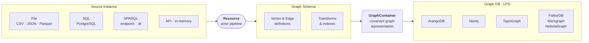

# GraFlo 

A **Graph Schema & Transformation Language (GSTL)** for Labeled Property Graphs (LPG).

GraFlo provides a declarative, database-agnostic specification for mapping heterogeneous data sources — tabular (CSV, SQL), hierarchical (JSON, XML), and RDF/SPARQL — to a unified LPG representation and ingesting it into ArangoDB, Neo4j, TigerGraph, FalkorDB, Memgraph, or NebulaGraph.

> **Package Renamed**: This package was formerly known as `graphcast`.

 
[](https://badge.fury.io/py/graflo)
[](https://pepy.tech/projects/graflo)
[](https://github.com/growgraph/graflo/blob/main/LICENSE)
[](https://github.com/growgraph/graflo/actions/workflows/pre-commit.yml)
[]( https://doi.org/10.5281/zenodo.15446131)

## Overview

GraFlo separates *what the graph looks like* from *where data comes from* and *which database stores it*.



**Source Instance** → **Resource** → **Graph Schema** → **Covariant Graph Representation** → **Graph DB**

| Stage | Role | Code |
|-------|------|------|
| **Source Instance** | A concrete data artifact — a CSV file, a PostgreSQL table, a SPARQL endpoint, a `.ttl` file. | `AbstractDataSource` subclasses (`FileDataSource`, `SQLDataSource`, `SparqlEndpointDataSource`, …) with a `DataSourceType`. |
| **Resource** | A reusable transformation pipeline — actor steps (descend, transform, vertex, edge) that map raw records to graph elements. Data sources bind to Resources by name via the `DataSourceRegistry`. | `Resource` (part of `Schema`). |
| **Graph Schema** | Declarative vertex/edge definitions, indexes, typed fields, and named transforms — defined in YAML or Python. | `Schema`, `VertexConfig`, `EdgeConfig`. |
| **Covariant Graph Representation** | A database-independent collection of vertices and edges. | `GraphContainer`. |
| **Graph DB** | The target LPG store — same API for all supported databases. | `ConnectionManager`, `DBWriter`. |

### Supported source types (`DataSourceType`)

| DataSourceType | Pattern | DataSource | Schema inference |
|---|---|---|---|
| `FILE` — CSV / JSON / JSONL / Parquet | `FilePattern` | `FileDataSource` | manual |
| `SQL` — PostgreSQL tables | `TablePattern` | `SQLDataSource` | automatic (3NF with PK/FK) |
| `SPARQL` — RDF files (`.ttl`, `.rdf`, `.n3`) | `SparqlPattern` | `RdfFileDataSource` | automatic (OWL/RDFS ontology) |
| `SPARQL` — SPARQL endpoints (Fuseki, …) | `SparqlPattern` | `SparqlEndpointDataSource` | automatic (OWL/RDFS ontology) |
| `API` — REST APIs | — | `APIDataSource` | manual |
| `IN_MEMORY` — list / DataFrame | — | `InMemoryDataSource` | manual |

### Supported targets

ArangoDB, Neo4j, TigerGraph, FalkorDB, Memgraph, NebulaGraph — same API for all.

## Features

- **Declarative LPG schema** — Define vertices, edges, indexes, weights, and transforms in YAML or Python. The `Schema` is the single source of truth, independent of source or target.
- **Database abstraction** — One schema, one API. Target ArangoDB, Neo4j, TigerGraph, FalkorDB, Memgraph, or NebulaGraph without rewriting pipelines. Database idiosyncrasies are handled by the `GraphContainer` (covariant graph representation).
- **Resource abstraction** — Each `Resource` defines a reusable actor pipeline (descend → transform → vertex → edge) that maps raw records to graph elements. Data sources bind to Resources by name via the `DataSourceRegistry`, decoupling transformation logic from data retrieval.
- **SPARQL & RDF support** — Query SPARQL endpoints (e.g. Apache Fuseki), read `.ttl`/`.rdf`/`.n3` files, and auto-infer schemas from OWL/RDFS ontologies. Install with `pip install graflo[sparql]`.
- **Schema inference** — Generate graph schemas from PostgreSQL 3NF databases (PK/FK heuristics) or from OWL/RDFS ontologies (`owl:Class` → vertices, `owl:ObjectProperty` → edges, `owl:DatatypeProperty` → vertex fields).
- **Typed fields** — Vertex fields and edge weights carry types (`INT`, `FLOAT`, `STRING`, `DATETIME`, `BOOL`) for validation and database-specific optimisation.
- **Parallel batch processing** — Configurable batch sizes and multi-core execution.

## Documentation
Full documentation is available at: [growgraph.github.io/graflo](https://growgraph.github.io/graflo)

## Installation

```bash
pip install graflo

# With RDF / SPARQL support (adds rdflib + SPARQLWrapper)
pip install graflo[sparql]
```

## Usage Examples

### Simple ingest

```python
from suthing import FileHandle

from graflo import Schema, Caster, Patterns
from graflo.db.connection.onto import ArangoConfig

schema = Schema.from_dict(FileHandle.load("schema.yaml"))

# Option 1: Load config from docker/arango/.env (recommended)
conn_conf = ArangoConfig.from_docker_env()

# Option 2: Load from environment variables
# Set: ARANGO_URI, ARANGO_USERNAME, ARANGO_PASSWORD, ARANGO_DATABASE
conn_conf = ArangoConfig.from_env()

# Option 3: Load with custom prefix (for multiple configs)
# Set: USER_ARANGO_URI, USER_ARANGO_USERNAME, USER_ARANGO_PASSWORD, USER_ARANGO_DATABASE
user_conn_conf = ArangoConfig.from_env(prefix="USER")

# Option 4: Create config directly
# conn_conf = ArangoConfig(
#     uri="http://localhost:8535",
#     username="root",
#     password="123",
#     database="mygraph",  # For ArangoDB, 'database' maps to schema/graph
# )
# Note: If 'database' (or 'schema_name' for TigerGraph) is not set,
# Caster will automatically use Schema.general.name as fallback

from graflo.util.onto import FilePattern
import pathlib

# Create Patterns with file patterns
patterns = Patterns()
patterns.add_file_pattern(
    "work",
    FilePattern(regex="\Sjson$", sub_path=pathlib.Path("./data"), resource_name="work")
)

# Or use resource_mapping for simpler initialization
# patterns = Patterns(
#     _resource_mapping={
#         "work": "./data/work.json",
#     }
# )

schema.fetch_resource()

from graflo.hq.caster import IngestionParams
from graflo.hq import GraphEngine

# Option 1: Use GraphEngine for schema definition and ingestion (recommended)
engine = GraphEngine()
ingestion_params = IngestionParams(
    recreate_schema=False,  # Set to True to drop and redefine schema (script halts if schema exists)
    # max_items=1000,  # Optional: limit number of items to process
    # batch_size=10000,  # Optional: customize batch size
)

engine.define_and_ingest(
    schema=schema,
    target_db_config=conn_conf,  # Target database config
    patterns=patterns,  # Source data patterns
    ingestion_params=ingestion_params,
    recreate_schema=False,  # Set to True to drop and redefine schema (script halts if schema exists)
)

# Option 2: Use Caster directly (schema must be defined separately)
# from graflo.hq import GraphEngine
# engine = GraphEngine()
# engine.define_schema(schema=schema, target_db_config=conn_conf, recreate_schema=False)
# 
# caster = Caster(schema)
# caster.ingest(
#     target_db_config=conn_conf,
#     patterns=patterns,
#     ingestion_params=ingestion_params,
# )
```

### PostgreSQL Schema Inference

```python
from graflo.hq import GraphEngine
from graflo.db.connection.onto import PostgresConfig, ArangoConfig
from graflo import Caster
from graflo.onto import DBType

# Connect to PostgreSQL
postgres_config = PostgresConfig.from_docker_env()  # or PostgresConfig.from_env()

# Create GraphEngine and infer schema from PostgreSQL 3NF database
# Connection is automatically managed inside infer_schema()
engine = GraphEngine(target_db_flavor=DBType.ARANGO)
schema = engine.infer_schema(
    postgres_config,
    schema_name="public",  # PostgreSQL schema name
)

# Define schema in target database (optional, can also use define_and_ingest)
target_config = ArangoConfig.from_docker_env()
engine.define_schema(
    schema=schema,
    target_db_config=target_config,
    recreate_schema=False,
)

# Use the inferred schema with Caster for ingestion
caster = Caster(schema)
# ... continue with ingestion
```

### RDF / SPARQL Ingestion

```python
from pathlib import Path
from graflo.hq import GraphEngine
from graflo.db.connection.onto import ArangoConfig

engine = GraphEngine()

# Infer schema from an OWL/RDFS ontology file
ontology = Path("ontology.ttl")
schema = engine.infer_schema_from_rdf(source=ontology)

# Create data-source patterns (reads a local .ttl file per rdf:Class)
patterns = engine.create_patterns_from_rdf(source=ontology)

# Or point at a SPARQL endpoint instead:
# from graflo.db.connection.onto import SparqlEndpointConfig
# sparql_cfg = SparqlEndpointConfig(uri="http://localhost:3030", dataset="mydata")
# patterns = engine.create_patterns_from_rdf(
#     source=ontology,
#     endpoint_url=sparql_cfg.query_endpoint,
# )

target = ArangoConfig.from_docker_env()
engine.define_and_ingest(schema=schema, target_db_config=target, patterns=patterns)
```

## Development

To install requirements

```shell
git clone git@github.com:growgraph/graflo.git && cd graflo
uv sync --dev
```

### Tests

#### Test databases

**Quick Start:** To start all test databases at once, use the convenience scripts from the [docker folder](./docker):

```shell
cd docker
./start-all.sh    # Start all services
./stop-all.sh      # Stop all services
./cleanup-all.sh   # Remove containers and volumes
```

**Individual Services:** To start individual databases, navigate to each database folder and run:

Spin up Arango from [arango docker folder](./docker/arango) by

```shell
docker-compose --env-file .env up arango
```

Neo4j from [neo4j docker folder](./docker/neo4j) by

```shell
docker-compose --env-file .env up neo4j
```

TigerGraph from [tigergraph docker folder](./docker/tigergraph) by

```shell
docker-compose --env-file .env up tigergraph
```

FalkorDB from [falkordb docker folder](./docker/falkordb) by

```shell
docker-compose --env-file .env up falkordb
```

Memgraph from [memgraph docker folder](./docker/memgraph) by

```shell
docker-compose --env-file .env up memgraph
```

NebulaGraph from [nebula docker folder](./docker/nebula) by

```shell
docker-compose --env-file .env up
```

and Apache Fuseki from [fuseki docker folder](./docker/fuseki) by

```shell
docker-compose --env-file .env up fuseki
```

To run unit tests

```shell
pytest test
```

> **Note**: Tests require external database containers (ArangoDB, Neo4j, TigerGraph, FalkorDB, Memgraph, NebulaGraph, Fuseki) to be running. CI builds intentionally skip test execution. Tests must be run locally with the required database images started (see [Test databases](#test-databases) section above). NebulaGraph tests are gated behind `pytest --run-nebula`.

## Requirements

- Python 3.11+ (Python 3.11 and 3.12 are officially supported)
- python-arango
- nebula3-python>=3.8.3 (NebulaGraph v3.x support)
- nebula5-python>=5.2.1 (NebulaGraph v5.x support)
- sqlalchemy>=2.0.0 (for PostgreSQL and SQL data sources)
- rdflib>=7.0.0 + SPARQLWrapper>=2.0.0 (optional, install with `pip install graflo[sparql]`)

## Contributing

Contributions are welcome! Please feel free to submit a Pull Request.