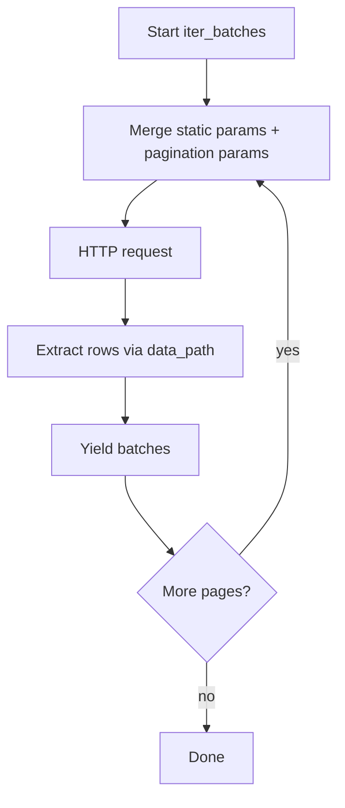

# API connector and pagination

REST API ingestion follows the same **bindings + `conn_proxy`** pattern as SQL and SPARQL:

- **`APIConnector`** (manifest) — endpoint **path**, HTTP options, static query params, and **`PaginationConfig`** (secret-free).
- **`RestApiConnConfig`** (runtime) — **`base_url`**, **`ApiAuth`**, and optional default headers, registered on a **`ConnectionProvider`** under a **`conn_proxy`** label.
- **`APIDataSource`** (runtime) — HTTP executor built by **`RegistryBuilder`**; you do not construct it directly.

See also [Creating a manifest — `bindings`](../getting_started/creating_manifest.md#bindings) and [Explicit `connector_connection` proxy wiring](../examples/example-9.md).

## Manifest shape

```yaml
bindings:
  connectors:
    - name: users_api
      path: /api/users
      method: GET
      params:
        active: true
      pagination:
        strategy: offset
        offset_param: offset
        limit_param: limit
        page_size: 100
        data_path: data
        has_more_path: has_more
  resource_connector:
    - resource: users
      connector: users_api
  connector_connection:
    - connector: users_api
      conn_proxy: api_source
```

Runtime (Python):

```python
import os

from graflo.hq.connection_provider import (
    ApiAuth,
    ApiGeneralizedConnConfig,
    InMemoryConnectionProvider,
    RestApiConnConfig,
)

provider = InMemoryConnectionProvider()
provider.register_generalized_config(
    conn_proxy="api_source",
    config=ApiGeneralizedConnConfig(
        config=RestApiConnConfig(
            base_url="https://api.example.com",
            auth=ApiAuth(auth_type="bearer", token=os.environ["API_TOKEN"]),
        )
    ),
)
provider.bind_from_bindings(bindings=bindings)
```

The resolved request URL is `base_url.rstrip("/") + "/" + path.lstrip("/")` — e.g. `https://api.example.com/api/users`.

## Authentication (`ApiAuth`)

Credentials live in **`RestApiConnConfig`**, not in the manifest.

| `auth_type` | Fields | HTTP behaviour |
| ----------- | ------ | ---------------- |
| **`bearer`** (default) | `token`, optional `header_name` (default `Authorization`), `prefix` (default `Bearer`) | Header: `{prefix} {token}` |
| **`basic`** | `username`, `password` | `requests` HTTP Basic auth |
| **`digest`** | `username`, `password` | `requests` HTTP Digest auth |
| **`api_key`** | `token`, `header_name` (e.g. `X-Api-Key`) | Header: raw token value |

For local development, **`RestApiConnConfig.from_env(env_prefix="REST_API_")`** reads `REST_API_BASE_URL`, optional `REST_API_TOKEN`, `REST_API_USERNAME`, and `REST_API_PASSWORD`.

Non-secret headers belong on **`APIConnector.headers`** or **`RestApiConnConfig.default_headers`** (connector headers override defaults).

## Pagination overview

Pagination is declared on **`APIConnector.pagination`** as a **`PaginationConfig`** object. When **`pagination`** is omitted, GraFlo performs a **single HTTP request** and yields whatever JSON records **`APIDataSource`** extracts from the response.

When pagination is set, GraFlo loops: each iteration adds strategy-specific query parameters, parses the JSON body, yields records in **`iter_batches`**, then decides whether to fetch the next page.



**`IngestionParams.batch_size`** overrides **`pagination.page_size`** when the connector defines pagination (same idea as SPARQL endpoint page size). That controls how many rows each *API page* requests, not the internal **`iter_batches`** chunk size (which still splits a page into smaller yield batches if needed).

**`iter_batches(..., limit=N)`** caps the **total number of records** read across all pages, not the number of HTTP calls.

## `PaginationConfig` fields

| Field | Default | Used by | Meaning |
| ----- | ------- | ------- | ------- |
| **`strategy`** | `"offset"` | all | `"offset"`, `"page"`, or `"cursor"` |
| **`offset_param`** | `"offset"` | offset | Query param for skip/offset |
| **`limit_param`** | `"limit"` | offset | Query param **name** for page size; value comes from **`page_size`** |
| **`page_param`** | `"page"` | page | Query param for 1-based page index |
| **`per_page_param`** | `"per_page"` | page | Query param **name** for page size; value comes from **`page_size`** |
| **`cursor_param`** | `"cursor"` | cursor | Query param for opaque cursor token |
| **`initial_offset`** | `0` | offset | First request offset |
| **`initial_page`** | `1` | page | First request page number |
| **`initial_cursor`** | `null` | cursor | Send cursor on the **first** request when the API requires it |
| **`page_size`** | `100` | all | Records requested per HTTP call (sent as the value of **`limit_param`** or **`per_page_param`**) |
| **`data_path`** | `null` (root) | all | Dot path to the array of records in the JSON response |
| **`has_more_path`** | `null` | offset, page | Dot path to a boolean “more pages” flag |
| **`cursor_path`** | `null` | cursor | Dot path to the **next** cursor in the response body |

Dot paths use `.` segments (e.g. `meta.next_cursor`). When **`data_path`** is unset, a top-level JSON **array** is used as-is; a top-level **object** is treated as a single record.

## Strategy: offset (default)

Best for APIs that accept **`offset` + `limit`** (or similarly named) query parameters.

**Request loop:**

1. Set `offset_param=initial_offset` and `limit_param=page_size` (names configurable).
2. Parse rows from **`data_path`**.
3. Stop when **`has_more_path`** is falsy, or when the extracted row list is empty if **`has_more_path`** is unset.
4. Increment offset by **`page_size`** and repeat.

**Example API response:**

```json
{
  "data": [{"id": 1}, {"id": 2}],
  "has_more": true
}
```

**Manifest:**

```yaml
pagination:
  strategy: offset
  offset_param: skip      # API uses ?skip=… instead of ?offset=…
  limit_param: take
  page_size: 50
  data_path: data
  has_more_path: has_more
  initial_offset: 0
```

Equivalent query progression: `?skip=0&take=50`, then `?skip=50&take=50`, …

## Strategy: page

Best for APIs that use **`page` + `per_page`** (or `page` + `limit`) semantics with a 1-based page index.

**Request loop:**

1. Set `page_param=initial_page` and `per_page_param=page_size`.
2. Parse rows from **`data_path`**.
3. Stop using the same **`has_more_path`** / non-empty-data rules as offset.
4. Increment page by 1.

**Example:**

```yaml
pagination:
  strategy: page
  page_param: page
  per_page_param: page_size
  page_size: 25
  data_path: results.items
  has_more_path: results.has_next_page
  initial_page: 1
```

## Strategy: cursor

Best for APIs that return an opaque **`next_cursor`** (or link token) instead of numeric offsets.

**Request loop:**

1. **First request:** omit **`cursor_param`** unless **`initial_cursor`** is set.
2. Parse rows from **`data_path`**.
3. Read the next token from **`cursor_path`** in the response.
4. Subsequent requests set **`cursor_param`** to that token.
5. Stop when **`cursor_path`** is missing or empty after a page.

**Example API response:**

```json
{
  "items": [{"id": 10}, {"id": 11}],
  "pagination": { "next_cursor": "eyJpZCI6MTF9" }
}
```

**Manifest:**

```yaml
pagination:
  strategy: cursor
  cursor_param: cursor
  page_size: 100
  data_path: items
  cursor_path: pagination.next_cursor
  initial_cursor: null   # omit on first call; set when API requires a seed token
```

If the first call must include a cursor (some APIs use `cursor=`*empty* or a fixed start token), set **`initial_cursor`** accordingly.

## Choosing `has_more_path` vs implicit continuation

| Configuration | Stop condition |
| ------------- | -------------- |
| **`has_more_path` set** | Stop when the boolean at that path is falsy |
| **`has_more_path` unset** (offset/page) | Stop when **`data_path`** resolves to an **empty** list |
| **cursor** | Stop when **`cursor_path`** is missing or empty |

Prefer an explicit **`has_more_path`** when the API returns a full final page *and* a reliable boolean (avoids an extra empty request).

## Static query parameters

Use **`APIConnector.params`** for filters that do not change between pages (tenant id, `active=true`, API version flags). Pagination params are merged on top each iteration; static params are preserved.

## HTTP options on the connector

| Field | Default | Notes |
| ----- | ------- | ----- |
| **`method`** | `GET` | Passed to `requests` |
| **`timeout`** | `null` | Seconds; `null` = no timeout |
| **`retries`** | `0` | urllib3 retry count on 5xx |
| **`retry_backoff_factor`** | `0.1` | Backoff between retries |
| **`retry_status_forcelist`** | `[500,502,503,504]` | Status codes to retry |
| **`verify`** | `true` | TLS certificate verification |

## Related

- [Data source reference — API](../reference/data_source/index.md#api-data-sources)
- [Runtime connector updates](runtime_connector_updates.md) — patch **`APIConnector`** fields via **`ConnectorUpdate`** (hash recomputes on change)
- [Quick Start — Using API Data Sources](../getting_started/quickstart.md#using-api-data-sources)

Implementation: `graflo.architecture.contract.bindings.APIConnector`, `PaginationConfig`, `graflo.data_source.api.APIDataSource`, `graflo.hq.connection_provider`.
