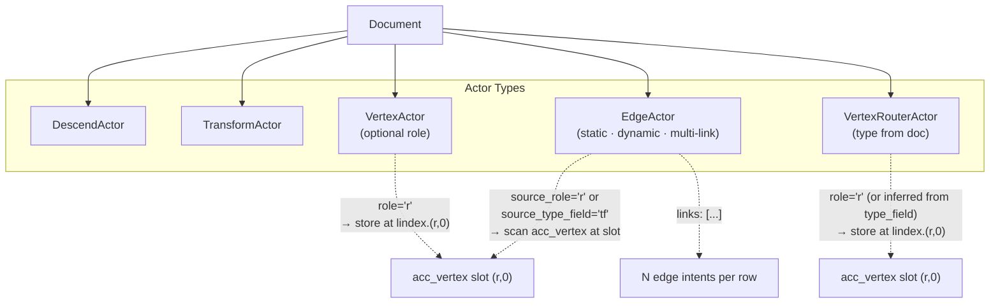
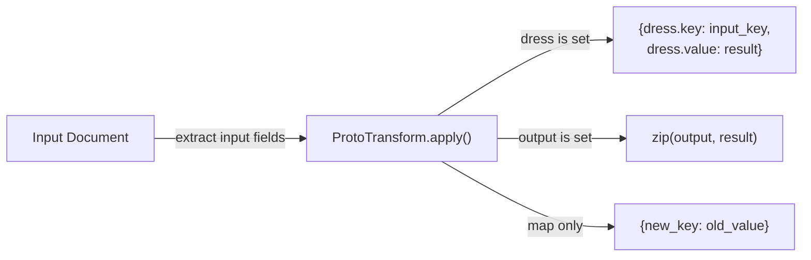

# Core components

Reference for logical schema pieces, ingestion runtime, actors, and transforms.

## Core Components

### Schema
The `Schema` is the single source of truth for the LPG structure. It encapsulates:
 
- Vertex and edge definitions with optional type information
- Identity and physical index configurations
- DB profile defaults and DB-aware projection settings
- Automatic schema inference from normalized PostgreSQL databases (3NF with PK/FK) or from OWL/RDFS ontologies
- Graph-source inference from Neo4j or ArangoDB via **`Connection.introspect_graph_schema()`** (see [Graph export and migration](../operations/graph_export_migration.md))

### GraFloOutput, GraphContainer, and file backend

**`GraphContainer`** holds database-agnostic vertex and edge batches during ingestion or export. Edge keys are `(source, target, relation)` tuples in Python; JSON serialization uses compact array keys via **`serialize_edge_key`**.

**`GraFloOutput`** bundles a full **`Schema`** with a **`GraphContainer`** for in-memory use (`GraphEngine.export_graph()`). For durable exports, prefer **`GraFloBackendConfig`** — a `Connection` target that writes chunked gzip JSONL under `vertices/` and `edges/` plus `schema.yaml` and `INDEX.json`. See [Graph export and migration](../operations/graph_export_migration.md).

### IngestionModel
The `IngestionModel` is the source of truth for ingestion runtime behavior. It encapsulates:

- Resource mappings and actor pipelines
- Reusable named transforms
- Runtime initialization against the core schema (`finish_init(schema.core_schema)`)

### Manifest-level sanitization

When targeting stricter engines (notably TigerGraph), identifier normalization is handled at the
manifest boundary:

- Implementation lives in **`graflo.architecture.evolution`** as **`SanitizeOp`** /
  **`apply_sanitize`** (reserved words, `DatabaseProfile` storage names, TigerGraph per-relation
  identity alignment, and coordinated ingestion rewrites).
- **`Sanitizer.sanitize_manifest(manifest)`** is the ergonomic wrapper: it builds the evolution op
  list for the configured **`DBType`** and applies it in place (same public API as before).
- **`GraphEngine.infer_manifest(...)`** runs **`Sanitizer`** on the assembled **`GraphManifest`**
  before returning, so PostgreSQL inference through the engine stays target-flavor-safe.
- **`SQLInferenceManager`** (`infer_artifacts`, **`infer_complete_schema`**, …) does **not**
  sanitize; it keeps source column names in resources so you can compose a manifest and then call
  **`Sanitizer`** once at the boundary (or rely on **`infer_manifest`** when using **`GraphEngine`**).

### Manifest/schema renaming

When you need to rename vertex types, edge relations, or ingestion resource names in bulk,
use the built-in rename APIs:

- `GraphManifest.rename_entities(vertices=..., edges=..., resources=...)`
- `Schema.rename_entities(vertices=..., edges=...)`

Each rename argument accepts either:

- a mapping (`dict[str, str]`) for explicit substitutions, or
- a callable (`Callable[[str], str]`) for programmatic transforms (prefix/suffix/camelize, etc.).

```python
from graflo.architecture.contract import GraphManifest
from graflo.util.transform import camel_to_snake

manifest = GraphManifest.from_dict(payload)
renamed = manifest.rename_entities(
    vertices={"Person": "author", "Organization": "institution"},
    edges=lambda relation: f"rel_{camel_to_snake(relation)}",
    resources=lambda name: f"src_{name}",
)
```

`GraphManifest.rename_entities(...)` updates all relevant references consistently:

- schema vertex names + edge endpoints/relations
- ingestion pipelines (`vertex`, `edge`/`create_edge`, nested `descend`, router mappings)
- resource edge selectors (`infer_edge_only` / `infer_edge_except`) and `extra_weights`
- bindings resource references (`connectors[].resource_name`, `resource_connector[].resource`)

This API is meant for deterministic contract refactors and complements (not replaces)
DB-specific sanitization.

### Vertex
A `Vertex` describes vertices and their logical identity. It supports:

- Single or compound identity fields (e.g., `["first_name", "last_name"]` instead of `"full_name"`)
- Property definitions with optional type information
  - Fields can be specified as strings (backward compatible) or typed `Field` objects
  - Untyped fields (`type: null`) remain valid for schema-agnostic backends
  - Duplicate property declarations are normalized by field name
  - Same type duplicates merge into one field
  - If one duplicate is typed and the other is untyped, the typed definition wins
  - Conflicting non-null types for the same field name are rejected
  - **LIST-typed properties cannot be identity / hash-identity sources**
- Filtering conditions
- **`blank: true`** — placeholder vertex with no natural key; identity defaults to **`id`** when omitted
- **`hash_identity_properties`** — when non-empty, SHA256 hash of these source fields produces a deterministic synthetic **`id`** (see [Vertex identity modes](../schema/vertex_identity.md))
- **`Vertex.identity_mode`** — derived runtime mode: **`natural`** (upsert on `identity`), **`hash`**, or **`blank`**

#### Supported field types

| `FieldType` | Shape | Notes |
|-------------|-------|-------|
| `INT` `UINT` `FLOAT` `DOUBLE` `BOOL` `STRING` `DATETIME` | scalar | Existing scalar types |
| `LIST` | + required `item_type` (scalar above) | Homogeneous, **one level** only — no `LIST[LIST[…]]`, no object schemas |

Declare types on each property as a mapping (`name` / `type` / optional `item_type`).
String shorthand (`properties: [id, name]`) still works and leaves types unset.

**Example — article vertex with scalar + list properties:**

```yaml
schema:
  metadata:
    name: demo
    version: "1.0.0"
  graph:
    vertex_config:
      vertices:
        - name: article
          # Identity must be a scalar (or untyped) field — never LIST
          identity: [doi]
          properties:
            - name: doi
              type: STRING
            - name: title
              type: STRING
            - name: year
              type: INT
            # Homogeneous list of strings → TigerGraph LIST<STRING>, Neo4j list, PG TEXT[]
            - name: tags
              type: LIST
              item_type: STRING
            # Homogeneous list of floats
            - name: topic_scores
              type: LIST
              item_type: FLOAT
    edge_config:
      edges:
        - source: article
          target: article
          relation: cites
          properties:
            - name: contexts
              type: LIST
              item_type: STRING
  db_profile: {}
```

Equivalent compact forms (same semantics):

```yaml
# Inline dicts in a list
properties:
  - { name: doi, type: STRING }
  - { name: tags, type: LIST, item_type: STRING }

# Untyped (schema-agnostic backends); still fine when you do not need DDL typing
properties: [doi, title, tags]
```

**Invalid (rejected at model validation):**

```yaml
# LIST without item_type
- { name: tags, type: LIST }

# Nested / non-scalar item_type
- { name: matrix, type: LIST, item_type: LIST }

# item_type on a non-LIST field
- { name: title, type: STRING, item_type: STRING }

# LIST used as identity
- name: article
  identity: [tags]
  properties:
    - { name: tags, type: LIST, item_type: STRING }
```

For mixed or nested payloads that are not a homogeneous scalar list, author an
explicit `STRING` field and store JSON yourself — that is never an automatic
fallback from `type: LIST`.

#### Backend support (LIST)

Policy: **native storage or raise** — no soft conversion to `STRING`/JSON.

| Backend | LIST as storable property | Behavior |
|---------|---------------------------|----------|
| TigerGraph | Yes — `LIST<T>` attribute | DDL emits `LIST<STRING>`, `LIST<INT>`, … |
| Neo4j / Memgraph / FalkorDB | Yes — homogeneous list of primitives | Validated at define; lists serialize as properties |
| ArangoDB | Yes — document array | Validated at define; pass through |
| Postgres | Yes — SQL arrays | Emitter uses `T[]` for typed LIST columns |
| NebulaGraph | **No** — composites are query-only | Define/DDL **raises** `UnsupportedFieldTypeError` |

#### Planned field types

Not in `FieldType` yet — do not author these in manifests:

| Type | Status | Sketch |
|------|--------|--------|
| `UUID` | PR2 | Logical scalar; TigerGraph/Nebula still store as `STRING` |
| `MAP` | follow-up | `key_type` + `value_type` (scalar); native TG/Arango; Cypher targets raise (maps are not storable node/rel properties) |
| `SET` | follow-up (low) | TigerGraph-oriented; prefer `LIST` elsewhere |

Identity defaults at schema level (`VertexConfig`):

- **`identity_from_all_properties: true`** (default) — vertices without explicit **`identity`** use all **`properties`** names as the logical key.
- **`identity_from_all_properties: false`** — each non-blank vertex must declare **`identity`** explicitly; blank vertices still default to **`id`**.

**Blank vertices:** set **`blank: true`** on the vertex entry under **`schema.graph.vertex_config.vertices`**. **`VertexConfig.blank_vertices`** is a derived list of names (not a separate YAML field). **`VertexConfig.hash_identity_vertices`** lists vertices with hash-derived identity. At runtime, **`ResourceRuntime`** keeps only vertex types referenced by that resource’s pipeline (and edge-inference selectors); blank types that are declared in the schema but not used by the resource are not injected automatically—include a **`vertex`** (or edge) step when the placeholder must be populated.

Algorithmic identity inference from record samples: **`graflo.db.identity_inference`** (`IdentityInferencer`, `apply_identity_inference_to_vertices`). See [Vertex identity modes](../schema/vertex_identity.md) and [Example 15](../../examples/example-15.md).

### Edge
An `Edge` describes edges and their logical identities. It allows:

- Optional uniqueness semantics through **`identities`** (multiple candidate keys are allowed)
- **`properties`**: relationship payload (names and optional types), same accepted forms as vertex properties (strings, `Field`, or dicts with at least `name`)
- Optional static **`relation`** label (e.g. Neo4j relationship type) when it is not derived at ingest time
- **`directed`** (default `true`): when `false`, the edge is logically undirected; `AddInverseEdgesOp` does not duplicate it. On TigerGraph, `directed: false` maps to `UNDIRECTED EDGE` DDL; bidirectional directed pairs can use `db_profile.edge_specs[*].reverse_edge` (`WITH REVERSE_EDGE`) instead of a second logical edge.

Ingestion-only controls (**`relation_field`**, **`relation_from_key`**, **`match_source`**, **`match_target`**, vertex-sourced edge payload) live on **`EdgeActor`** steps and **`EdgeDerivation`**, not on the logical `Edge` model.

### Edge properties and configuration

#### Basic logical fields
- **`source`**: Source vertex name (required)
- **`target`**: Target vertex name (required)
- **`identities`**: Logical identity keys for the edge (each key can induce uniqueness)
- **`directed`**: When `true` (default), `source`→`target` direction matters; when `false`, the edge is logically undirected
- **`properties`**: Declared relationship attributes (typed or untyped)

**Neo4j, Memgraph, FalkorDB — relationship `MERGE` keys:** Writers match source and target nodes on vertex identity, then `MERGE` the relationship. Which **relationship properties** participate in that `MERGE` (so multiple edges between the same two vertices do not collapse) is derived as follows: use the **first** `identities` key, keep only tokens that refer to relationship payload (skip `source` and `target`; the `relation` token becomes the `relation` property on the relationship where used). If that produces no fields—e.g. `identities` is empty—the writer falls back to **all** names in **`Edge.properties`**. Declare `identities` when the full property list is a superset of what should define edge uniqueness.

#### Relationship type at ingest time
- **`relation`** on the logical edge: static relationship type when applicable
- **`relation_field`** on an **edge actor** step: column/field holding dynamic relationship type values (CSV/tabular; see Example 3)
- **`relation_from_key`** on an **edge actor** step: use JSON object keys as relationship types (nested JSON; see Example 4)

#### Payload from vertices at ingest time
Vertex fields that should appear on edges are configured via **edge actor** options (e.g. **`vertex_weights`**, maps), not via a `weights` block on the logical `Edge`. DB layers may still use an internal `WeightConfig` built from `Edge.properties` for backends that need it.

#### Edge behavior control
- Edge physical variants should be modeled with `schema.db_profile.edge_specs[*].purpose` (YAML) / `db_profile.edge_specs[*].purpose` (in code).
- TigerGraph bidirectional pairs: `schema.db_profile.edge_specs[*].reverse_edge` emits `WITH REVERSE_EDGE` in GSQL (see [Directed, undirected, and bidirectional edges](#directed-undirected-and-bidirectional-edges)).
- `Edge.aux` is no longer a behavior switch.

> DB-only physical edge metadata (including `purpose`) is configured under
> **`schema.db_profile.edge_specs`**, not on `Edge`.


#### Directed, undirected, and bidirectional edges

Logical edges are **directed by default** (`directed: true`). Direction matters for ingestion semantics and for evolution ops such as [`AddInverseEdgesOp`](../schema/manifest_evolution.md#5-add-inverse-edge-relations-bidirectional-modeling).

| Modeling goal | GraFlo config | TigerGraph GSQL (when `db_flavor: tigergraph`) |
|---------------|---------------|------------------------------------------------|
| Single direction | `directed: true` (default), one logical edge | `ADD DIRECTED EDGE ...` |
| Portable forward + reverse labels | Two logical directed edges, or one forward + `AddInverseEdgesOp` | Two `ADD DIRECTED EDGE` statements |
| TG-native directed pair, one load path | One logical edge + `edge_specs[*].reverse_edge` | `ADD DIRECTED EDGE ... WITH REVERSE_EDGE="rev_name"` |
| Symmetric / direction-agnostic | `directed: false` on one logical edge | `ADD UNDIRECTED EDGE ...` |

**Undirected example:**

```yaml
edge_config:
  edges:
    - source: user
      target: user
      relation: friend_of
      directed: false
      properties: [on_date]
```

**TigerGraph reverse pair example** (do not also add a second logical edge for the reverse relation):

```yaml
edge_config:
  edges:
    - source: user
      target: user
      relation: is_following
db_profile:
  db_flavor: tigergraph
  edge_specs:
    - source: user
      target: user
      relation: is_following
      relation_name: is_following
      reverse_edge: is_followed_by
```

`reverse_edge` is TigerGraph-only physical metadata on `EdgePhysicalSpec`. It is mutually exclusive with `directed: false` on the logical edge.

#### Matching and filtering (ingestion)
- **`match_source`** / **`match_target`** / **`match`**: edge **actor** options for branch selection when building edges from hierarchical documents

#### Advanced logical configuration
- **`type`**: Edge type (DIRECT or INDIRECT)
- **`by`**: Vertex name for indirect edges
- DB-specific edge storage/type names are resolved from **`schema.db_profile`**
  through DB-aware wrappers (`EdgeConfigDBAware`), not stored on `Edge`.

#### When to use what

**`relation_field`** (Example 3):

- Set on the **`source` / `target` edge step** in the resource pipeline when relationship types live in a column (e.g. `company_a, company_b, relation, date`).

**`relation_from_key`** (Example 4):

- Set on the edge step for nested JSON where keys imply relationship types.

**`properties` on the logical edge:**

- Declare every relationship attribute you want in the schema (dates, scores, metadata).
- Typed example: `properties: [{name: date, type: DATETIME}, {name: confidence_score, type: FLOAT}]`
- String list: `properties: [date, confidence_score]`

**`match_source` / `match_target`:**

- Edge **actor** options when multiple branches feed the same vertex types; use to restrict which branches participate in an edge.

### DataSource & DataSourceRegistry
An `AbstractDataSource` subclass defines where data comes from and how it is retrieved. Each carries a `DataSourceType`. The `DataSourceRegistry` maps data sources to Resources by name.

| `DataSourceType` | Adapter | Sources |
|---|---|---|
| `FILE` | `FileDataSource` | JSON, JSONL, CSV/TSV, Parquet files |
| `SPARQL` | `RdfFileDataSource` | Turtle (`.ttl`), RDF/XML (`.rdf`), N3 (`.n3`), JSON-LD files — parsed via `rdflib` |
| `SPARQL` | `SparqlEndpointDataSource` | Remote SPARQL endpoints (e.g. Apache Fuseki) queried via `SPARQLWrapper` |
| `API` | `APIConnector` / `APIDataSource` | REST API endpoints via bindings + `conn_proxy`; [pagination strategies](../connectors/api_connector.md) |
| `SQL` | `SQLDataSource` | SQL databases via SQLAlchemy with parameterised queries |
| `IN_MEMORY` | `InMemoryDataSource` | Python objects (lists, DataFrames) already in memory |

Data sources handle retrieval only. They bind to Resources by name via the `DataSourceRegistry`, so the same `Resource` can ingest data from multiple sources without modification.

### Resource (`ResourceConfig` / `ResourceRuntime`)

Ingestion resources split into two layers:

- **`ResourceConfig`** — declarative contract in **`ingestion_model.resources`** (YAML/Python): pipeline steps, encoding, type casters, edge-inference flags, **`tolerate_transform_errors`**, and related options. Serialized in manifests; validated by **`IngestionModel`**.
- **`ResourceRuntime`** — schema-bound executor built via **`build_resource_runtime`**: filtered **`VertexConfig`**, bound transforms, and **`ActorExecutor`** for document casting.

The name **`Resource`** in manifests and docs usually means **`ResourceConfig`**. Data sources bind to resources by name, so the same pipeline applies whether data arrives from a file, API, SQL table, or SPARQL endpoint.

Resource-level controls:
- **`infer_edges`**: Global toggle for inferred edge emission during assembly (default: `true`).
- **`infer_edge_only`**: Allow-list of inferred edges (`source`, `target`, optional `relation`).
- **`infer_edge_except`**: Deny-list of inferred edges (`source`, `target`, optional `relation`).
- **`tolerate_transform_errors`** (default **`true`**): on transform failure, null declared outputs and continue the pipeline; see [Document cast errors](../ingestion/doc_errors.md).
- `infer_edge_only` and `infer_edge_except` are mutually exclusive and validated against declared schema edges.
- These controls apply to inferred edges only; explicit edge actors in the pipeline are still emitted.
- **Auto-exclusion**: When a resource pipeline contains any EdgeActor for edges of type `(source, target)`, `(source, target, None)` is automatically added to `infer_edge_except` for that resource, so inferred edges do not duplicate edges produced by explicit edge actors.

### Actor
An `Actor` describes how the current level of the document should be mapped/transformed to the property graph vertices and edges. There are five actor types:

- `DescendActor`: Navigates to the next level in the hierarchy. Supports:
  - `key`: Process a specific key in a dictionary
  - `any_key`: Process all keys in a dictionary (useful when you want to handle multiple keys dynamically)
- `TransformActor`: Applies data transformations
- `VertexActor`: Creates vertices from the current level. Key options:
  - **`role`** (optional): named accumulator slot. When set the vertex is stored at `lindex.extend((role, 0))` instead of bare `lindex`, so multiple vertices of the same type in one row (e.g. `role: self`, `role: parent`, `role: child`) occupy distinct slots and can be addressed individually by a downstream edge step.
  - **`from`** (`from_doc`): rename map `{vertex_field: doc_field}`. Only mismatched column names need listing; remaining vertex schema properties are absorbed from the doc and transform buffer automatically (passthrough). When multiple **`TransformPayload`** entries share a location, **`from_doc`** consumes only payloads whose **`named`** keys include all mapped source fields—so dressed metrics or pivot rows for other vertex types are left for their own **`vertex`** steps.
  - **`keep_fields`**: restrict passthrough to this field subset. Use on role-vertex steps to prevent shared row columns from leaking into placeholder vertices that only carry an ID.
- `EdgeActor`: Creates edges between vertices. Operates in three modes:
  - **Static mode** (`from`/`to` set on both sides): vertex types declared at config time.
  - **Dynamic / mixed mode** (at least one of `source_type_field` / `target_type_field` / `source_role` / `target_role` set): vertex types resolved at extraction time by looking up accumulator slots. `source_role` / `target_role` are ergonomic aliases for `source_type_field` / `target_type_field` — the slot lookup is identical whether the slot was populated by `vertex+role` or `vertex_router+role` (with router role inferred from `type_field` when omitted).
  - **Multi-link mode** (`links` list set): each item in `links` emits one edge intent per row. Use when one flat row encodes multiple distinct relationship types (e.g. `is_child_of` and `is_parent_of` from the same row).
- `VertexRouterActor`: Routes documents to the correct `VertexActor` based on a type field read from the document at runtime. Vertices are stored at `lindex.extend((role, 0))`; when `role` is omitted it is inferred from `type_field`. Optional router-level **`from`** provides a default `{vertex_field: doc_field}` projection; **`vertex_from_map`** overrides per resolved vertex type. Use when the vertex type varies per row; for a fixed vertex type with role-distinct slots, use `vertex+role` instead.



#### Accumulator slots: `vertex+role` vs `vertex_router`

Both mechanisms write vertices to a named sub-slot of the current `LocationIndex`. A downstream dynamic `EdgeActor` scans `acc_vertex` for data at the same slot path.

| Mechanism | When the vertex type is... | Slot name comes from... |
|---|---|---|
| `vertex: T, role: r` | **static** (known at schema design time) | `role` value |
| `vertex_router: type_field: tf` (optional `role: r`) | **dynamic** (read from a doc column at runtime) | `role` (`type_field` when `role` is omitted) |

The `EdgeActor` vocabulary matches:

| Slot populated by | Edge config field |
|---|---|
| `vertex+role` | `source_role` / `target_role` |
| `vertex_router` | `source_type_field` / `target_type_field` (or `source_role` / `target_role`) |

Both pairs are equivalent at runtime — they name the same path segment in `acc_vertex`.

#### Dynamic Edge Scenario Matrix

| Vertex types | Relation | Config pattern |
|---|---|---|
| Both static | Static | `from: server, to: database, relation: uses` |
| Both static | Dynamic from field | `from: server, to: database, relation_field: rt` |
| Both static | Dynamic from key | `from: server, to: database, relation_from_key: true` |
| Both dynamic (router) | Static | `source_role: src, target_role: tgt, relation: uses` |
| Both dynamic (router) | Dynamic from field | `source_role: src, target_role: tgt, relation_field: rt` |
| Both role-slot | Static | `source_role: self, target_role: parent, relation: is_child_of` |
| Mixed (static + dynamic) | Dynamic | `from: person, target_role: tgt, relation_field: rt` |
| Mixed (dynamic + static) | Dynamic | `source_role: src, to: institution, relation_field: rt` |
| Multiple relations from one row | Static per link | `links: [{source_role: self, target_role: parent, relation: is_child_of}, ...]` |

`source_type_field` / `target_type_field` (or `source_role` / `target_role`) must equal the accumulator slot segment of the upstream `VertexRouterActor` — `role` (inferred from `type_field` when omitted). For a static `vertex` step, `source_role` / `target_role` must equal that step’s `role`.

#### Type Safety Controls

When dynamic edge types are used, a row may encounter a `(source_type, target_type)` pair not pre-declared in the schema `edge_config`. By default (`strict_edge_types: false`) this pair is registered at runtime. For strictly-typed databases that require DDL before writes, set:

```yaml
edge:
  source_type_field: S
  target_type_field: T
  strict_edge_types: true   # skip rows whose resolved pair is not pre-declared
```

### Location-scoped observations, transforms, and routers

Ingestion pipelines walk **nested JSON** (or list-shaped branches). At each step, actors receive:

- A **`LocationIndex`** — a path into the document (which list index, which object key, and so on).
- An **observation slice** — usually a `dict` that is the current fragment of the document for that path (for example the element produced by a `DescendActor` iteration). Tabular sources are the special case where the top-level slice is one flat object per record.

**Transform output** is not written back onto that slice automatically. `TransformActor` appends a `TransformPayload` to `ExtractionContext.transform_buffer[location]` for the **same** `LocationIndex` it was invoked with. Later actors at that location can consume those named fields.

**`VertexActor` with `role`** stores the vertex at `lindex.extend((role, 0))` using the configured `role` string as the slot segment. Extraction reads from an effective observation built from the current doc slice plus same-location transform buffer values (transform values override raw doc values on conflicts). Field greediness is controlled explicitly via `extraction_scope`: `full` (default) keeps passthrough behavior for remaining schema properties, while `mapped_only` extracts only fields explicitly mapped in `from`. In `full`, `keep_fields` restricts passthrough to a subset and helps prevent unrelated row columns from leaking into placeholder role vertices that only need an ID. A downstream edge step references the slot via `source_role` / `target_role`.

`VertexRep` carries only the extracted vertex document. Row-level merged observation state used for edge relation/weight derivation lives in `ExtractionContext.obs_buffer` and is looked up by `LocationIndex` (with parent lookup for nested scopes).

**`VertexRouterActor`** builds an **effective observation** by merging the current dict slice with all `TransformPayload` entries at that `LocationIndex`. Routing fields (`type_field`, optional `from` / `vertex_from_map`, optional `keep_fields`, optional `extraction_scope`) are read from this merged view — the same dict is passed to the lazily created `VertexActor` (no separate rename/slice layer). The vertex is accumulated at `lindex.extend((role, 0))`, where `role` is inferred from `type_field` when omitted. A downstream dynamic `EdgeActor` finds it by setting `source_role` / `target_role` (or `source_type_field` / `target_type_field`) to that same slot segment.

**Dynamic `EdgeActor`** (slot mode) also merges the doc with the transform buffer before reading `relation_field`; this ensures that values produced by upstream transforms (e.g. canonicalized relation names) are available at edge construction time.

**Multi-link `EdgeActor`** (when `links` is set) delegates to one sub-actor per link. Each sub-actor performs a full single-intent edge resolution; the results accumulate into the same `ExtractionContext`. The `links` field is mutually exclusive with all top-level source/target fields on the same step.

**Scoping:** `transform_buffer` is keyed only by the exact `LocationIndex`. A transform at a parent path does **not** appear in the buffer for a child path, and vice versa. That keeps parent/child branches separate.

**Descend behavior:** When `DescendActor` expands a collection, inner actors see **`sub_doc`** (one child value) per iteration — not the full parent object — unless you denormalize parent fields onto each child or structure the pipeline so the router runs at a level where the slice already contains what you need.

**Future discussion (not implemented):** Opt-in inheritance of specific fields from a parent `LocationIndex` (or a parent observation stack) could simplify parent–child edges without duplicating data on every child; that would be an explicit configuration surface to avoid breaking the default isolation above.

### Transform

A `Transform` defines data transforms, from renaming and type-casting to
arbitrary Python functions. The transform system is built on two layers:

For a dedicated guide covering all transform use cases and configuration
options (inline/local usage, reusable `use` references, multi-field
strategies, and key transforms), see [Transforms](../ingestion/transforms.md).

- **ProtoTransform** — the raw function wrapper. It holds `module`, `foo`
  (function name), and `params`. Its `apply()` method invokes the function
  without caring about where the inputs come from or how the outputs are
  packaged.
- **Transform** — wraps a ProtoTransform with input extraction, output
  formatting, field mapping, and optional *dressing*.

#### Output modes

A Transform can produce output in three ways:

1. **Direct output** (`output`) — the function returns one or more values that
   map 1:1 to output field names:

    ```yaml
    - foo: parse_date_ibes
      module: graflo.util.transform
      input: [ANNDATS, ANNTIMS]
      output: [datetime_announce]
    ```

    The function takes two arguments and returns a single string; the string
    is placed into the `datetime_announce` field.

2. **Field mapping** (`map`) — pure renaming with no function:

    ```yaml
    - map:
        Date: t_obs
    ```

3. **Dressed output** (`dress`) — the function returns a single scalar, and
   the result is packaged together with the input field name into a dict.
   This is useful for pivoting wide columns into key/value rows:

    ```yaml
    - foo: round_str
      module: graflo.util.transform
      params:
        ndigits: 3
      input:
      - Open
      dress:
        key: name
        value: value
    ```

    Given a document `{Open: "6.430062..."}`, this produces
    `{name: "Open", value: 6.43}`. The `dress` dict has two roles:

    - `key` — the output field that receives the **input field name** (here `"Open"`)
    - `value` — the output field that receives the **function result** (here `6.43`)

    You can also use `dress` as a shorthand without a callable when you only
    want to pivot one field into key/value form:

    ```yaml
    - transform:
        call:
          input: [vol]
          dress:
            key: type
            value: value
    ```

    Given `{vol: 0.123}`, this produces `{type: "vol", value: 0.123}`.

    This cleanly separates *what function to apply* (ProtoTransform) from
    *how to present the result* (dressing).

#### Key transforms

Transforms can also target **document keys** (not values) using
`transform.call.target: keys`. Key mode uses implicit per-key execution and a
selector under `call.keys`:

- `mode: all` — apply to all keys
- `mode: include` — apply only to listed keys
- `mode: exclude` — apply to all keys except listed keys

Example: normalize all keys to snake case:

```yaml
- transform:
    call:
      module: graflo.util.transform
      foo: camel_to_snake
      target: keys
      keys:
        mode: all
```

Example: strip `raw_` only from selected keys:

```yaml
- transform:
    call:
      module: graflo.util.transform
      foo: remove_prefix
      params: {prefix: "raw_"}
      target: keys
      keys:
        mode: include
        names: [raw_id, raw_label]
```

#### Grouped value transforms

For repeated tuple-style value calls, use explicit `input_groups` in
`transform.call`:

```yaml
- transform:
    call:
      module: my_pkg.transforms
      foo: join_name
      input_groups:
        - [fname_parent, lname_parent]
        - [fname_child, lname_child]
      output: [parent_name, child_name]
```

This executes one function call per group with deterministic output mapping.



#### Schema-level transforms

Transforms are declared as a **list** under `ingestion_model.transforms` and
referenced from resource steps via `transform.call.use`. This keeps ordering
explicit and allows reuse across multiple pipelines:

```yaml
transforms:
  - name: keep_suffix_id
    foo: split_keep_part
    module: graflo.util.transform
    params: { sep: "/", keep: -1 }
    input: [id]
    output: [_key]

resources:
- name: works
  apply:
  - transform:
      call:
        use: keep_suffix_id      # references the transform above
        input: [doi]             # override input for this usage
  - vertex: work
```

Transform steps are executed in the order they appear in `apply`.
