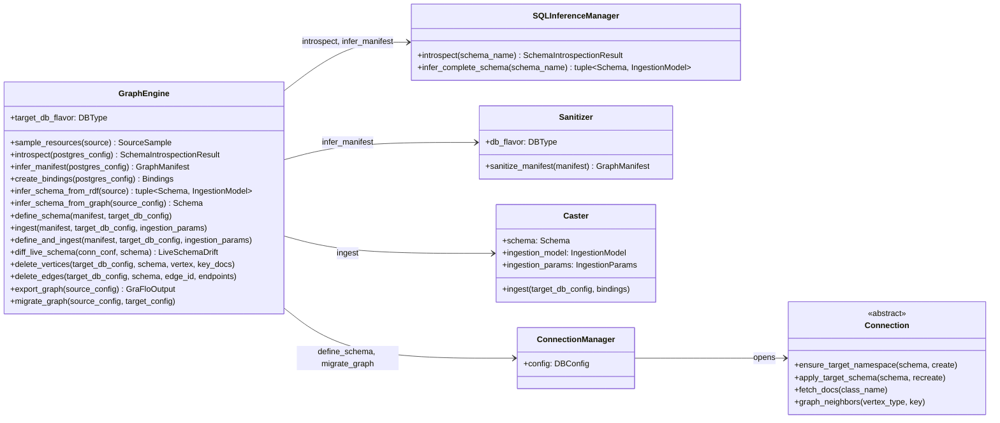
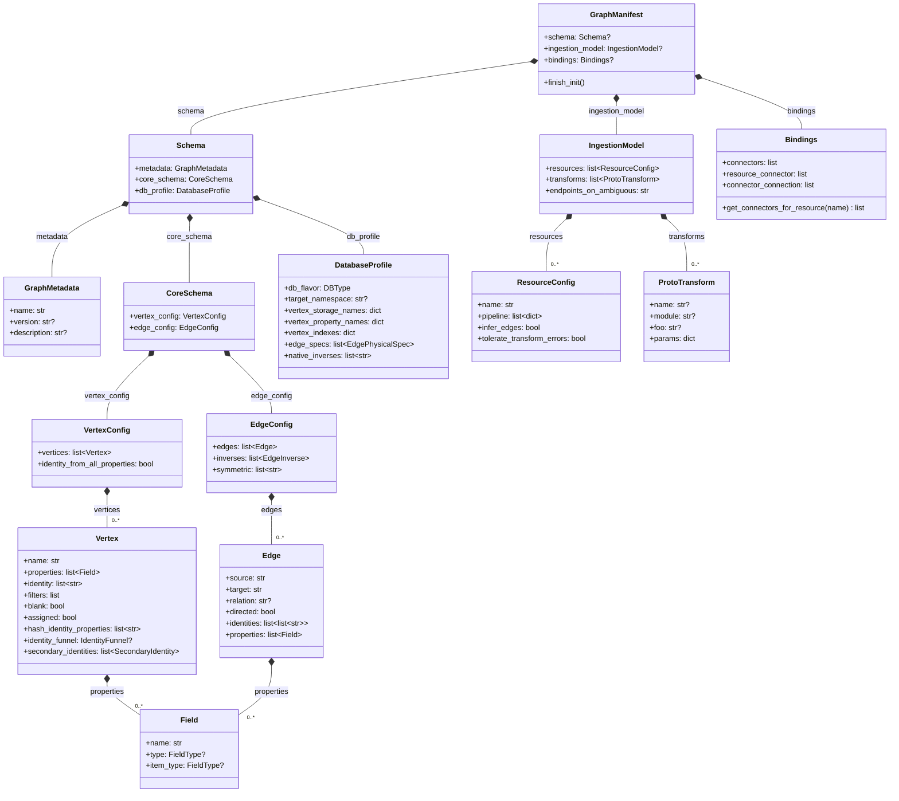
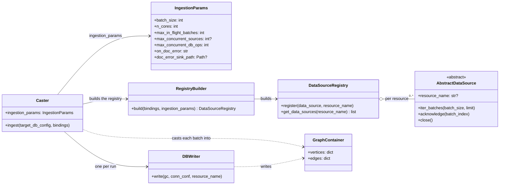

# Architecture diagrams

When you drive GraFlo from Python, you meet a handful of objects: the engine
you call, the models behind the three blocks of a manifest, and the classes
that run an ingest. These diagrams show how they relate and which one owns
what. You do not need them to write a manifest; for that, see
[core components](core_components.md).

## GraphEngine and what it delegates to

`GraphEngine` is the object you call. Look at its methods: some write a
manifest or a schema for you (`infer_manifest` from PostgreSQL,
`infer_schema_from_rdf` from an ontology, `infer_schema_from_graph` from a
graph database), `define_schema` creates the schema in the target, `ingest`
and `define_and_ingest` load data, `delete_vertices` and `delete_edges`
remove data by identity, `export_graph` reads a whole graph back out, and
`migrate_graph` moves one to another database. For each call it creates the
objects its arrows point to.

`SQLInferenceManager` infers a schema and resources from a SQL database but
does not adjust names for the target. `GraphEngine.infer_manifest` does, through
`Sanitizer`; when you build a manifest from `SQLInferenceManager` output
yourself, call `Sanitizer(db_flavor=...).sanitize_manifest(manifest)` once at
the end. `ConnectionManager` is a context manager: `with
ConnectionManager(connection_config=config) as conn:` opens the `Connection`
of the backend that `config` describes, one subclass per database.

## The manifest models

One `GraphManifest` holds up to three blocks. Look at the split: `Schema`
holds the graph (vertex and edge types) and the database profile;
`IngestionModel` holds resources and named transforms; `Bindings` holds
connectors and their wiring to resources. A resource's `pipeline` is kept as
the list of step mappings you wrote; the steps are checked against the schema
when the manifest is initialized with `finish_init()`.

Two names differ between YAML and Python. `Schema.core_schema` is written
`graph` in YAML, and the manifest's `schema` key is the attribute
`GraphManifest.graph_schema` in Python.

## The ingestion runtime

`Caster` runs an ingest. Look at the flow from left to right: it builds a
`DataSourceRegistry` from the bindings, reads each data source in batches,
casts every batch into a `GraphContainer`, and hands the container to a
`DBWriter`, which writes vertices and then edges through a connection to the
target. `IngestionParams` holds the settings of one run: batch size,
parallelism and error handling. Its fields are explained on
[parallelism](../ingestion/parallelism.md) and
[document cast errors](../ingestion/doc_errors.md).

`AbstractDataSource` has one subclass per kind of source: `FileDataSource`,
`SQLDataSource`, `RdfFileDataSource`, `SparqlEndpointDataSource`,
`APIDataSource`, `KafkaDataSource`, and `InMemoryDataSource` for Python
objects. Each is registered under the name of the resource it feeds, so a
resource does not know what kind of source it reads. The ingest calls
`acknowledge` for each batch once it is written and `close` when the source is
done; `KafkaDataSource` commits its offsets there, and the other sources do
nothing.

## What to read next

- [Core components](core_components.md): the keys behind the manifest models.
- [Concepts overview](../index.md): the path a record takes, in words.
- [Importing and layering](../../guides/importing.md): which modules to import
  from.
