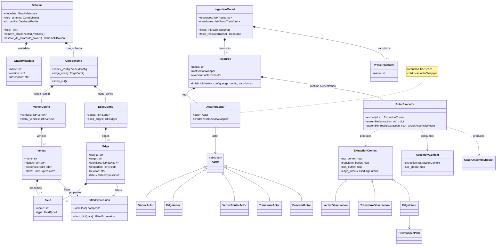
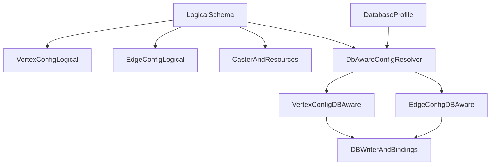
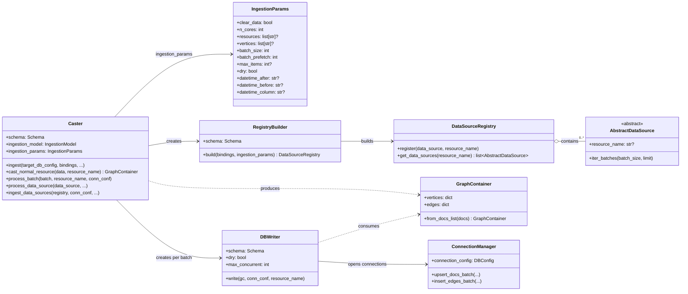

# Architecture diagrams

Class-level Mermaid views of orchestration (`GraphEngine`), logical schema vs ingestion (`Schema`, `IngestionModel`), the `Caster` pipeline, and how DataSources relate to Resources.

## Class Diagrams

### GraphEngine orchestration

`GraphEngine` is the top-level orchestrator that coordinates schema inference,
connector creation, schema definition, and data ingestion. The diagram below shows
how it delegates to specialised components.

```mermaid
classDiagram
    direction TB

    class GraphEngine {
        +target_db_flavor: DBType
        +resource_mapper: ResourceMapper
        +introspect(postgres_config) SchemaIntrospectionResult
        +infer_manifest(postgres_config) GraphManifest
        +create_bindings(postgres_config, ...) Bindings
        +infer_schema_from_rdf(source) tuple~Schema, IngestionModel~
        +create_bindings_from_rdf(source) Bindings
        +define_schema(manifest, target_db_config)
        +define_and_ingest(manifest, target_db_config, ...)
        +ingest(manifest, target_db_config, ...)
    }

    class SQLInferenceManager {
        +conn: PostgresConnection
        +target_db_flavor: DBType
        +introspect(schema_name) SchemaIntrospectionResult
        +infer_artifacts(schema_name) SQLInferenceArtifacts
        +infer_complete_schema(schema_name) tuple~Schema, IngestionModel~
    }

    class Sanitizer {
        +db_flavor: DBType
        +sanitize_manifest(manifest) GraphManifest
    }

    class ResourceMapper {
        +create_bindings_from_postgres(conn, ...) Bindings
    }

    class Caster {
        +schema: Schema
        +ingestion_model: IngestionModel
        +ingestion_params: IngestionParams
        +ingest(target_db_config, bindings, ...)
    }

    class ConnectionManager {
        +connection_config: DBConfig
        +init_db(schema, recreate_schema)
        +clear_data(schema)
    }

    class Schema {
        «see Schema diagram»
    }

    class GraphManifest {
        +schema: Schema?
        +ingestion_model: IngestionModel?
        +bindings: Bindings?
        +finish_init()
    }

    class Bindings {
        +connectors: list~ResourceConnector~
        +resource_connector: list~ResourceConnectorBinding~
        +connector_connection: list~ConnectorConnectionBinding~
        +get_connectors_for_resource(name) list
        +get_conn_proxy_for_connector(connector) str?
        +bind_connector_to_conn_proxy(connector, conn_proxy)
    }

    class DBConfig {
        <<abstract>>
        +uri: str
        +effective_schema: str?
        +connection_type: DBType
    }

    GraphEngine --> SQLInferenceManager : creates for introspect / infer_artifacts
    GraphEngine --> ResourceMapper : resource_mapper
    GraphEngine --> Sanitizer : infer_manifest() applies target flavor
    GraphEngine --> Caster : creates for ingest
    GraphEngine --> ConnectionManager : creates for define_schema
    GraphEngine ..> GraphManifest : produces / consumes
    GraphEngine ..> Bindings : produces / consumes
    GraphEngine ..> DBConfig : target_db_config
```

`SQLInferenceManager` performs introspection and schema/resource inference only (no **`Sanitizer`**). Use **`GraphEngine.infer_manifest`** or call **`Sanitizer.sanitize_manifest`** on a composed **`GraphManifest`** when you need target-DB normalization.

### Schema architecture

`Schema` and `IngestionModel` split logical graph structure from ingestion
runtime pipelines. The diagram below shows their constituent parts and
relationships.

Runtime detail: resource processing now uses an explicit two-phase flow
(`ExtractionContext` -> `AssemblyContext`). Extraction records typed artifacts
(`VertexObservation`, `TransformObservation`, `EdgeIntent`), and assembly turns
those artifacts into graph entities. Orchestration is owned by
`ActorExecutor`, while `ActorWrapper` remains focused on actor tree behavior.

#### Logical schema vs DB-aware projection

GraFlo now keeps logical graph modeling separate from DB materialization:

- `Vertex`, `Edge`, `VertexConfig`, and `EdgeConfig` are logical and backend-agnostic.
- DB-specific naming/defaults/index projection is resolved through
  `VertexConfigDBAware` and `EdgeConfigDBAware`.
- The resolver entrypoint is `Schema.resolve_db_aware(...)`, used by DB write/connector stages.

### Caster ingestion pipeline

`Caster` is the ingestion workhorse. It builds a `DataSourceRegistry` via
`RegistryBuilder`, casts each batch of source data into a `GraphContainer`,
and hands that container to `DBWriter` which pushes vertices and edges to the
target database through `ConnectionManager`.

### DataSources vs Resources

These are the two key abstractions that decouple *data retrieval* from *graph transformation*:

- **DataSources** (`AbstractDataSource` subclasses) — handle *where* and *how* data is read. Each carries a `DataSourceType` (`FILE`, `SQL`, `SPARQL`, `API`, `IN_MEMORY`). Many DataSources can bind to the same Resource by name via the `DataSourceRegistry`.

- **Resources** (`Resource`) — handle *what* the data becomes in the LPG. Each Resource is a reusable actor pipeline (descend → transform → vertex → edge) that maps raw records to graph elements. Because DataSources bind to Resources by name, the same transformation logic applies regardless of whether data arrives from a file, an API, or a SPARQL endpoint.
  - Optional **`drop_trivial_input_fields`** (default `false` on the model): when `true`, each record is preprocessed by dropping **top-level** keys whose value is `null` or the empty string `""` before actors run. This trims sparse wide rows (many unused columns) without extra transforms; nested dicts and lists are not walked.
