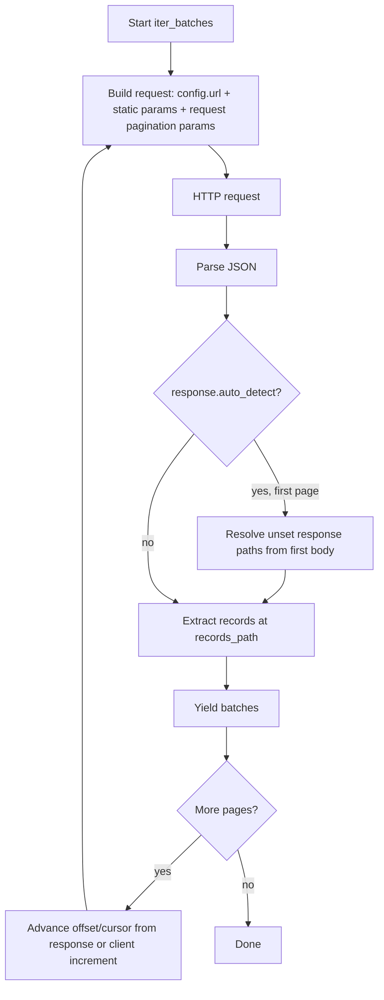

# API connector and pagination

REST API ingestion follows the same **bindings + `conn_proxy`** pattern as SQL and SPARQL:

- **`APIConnector`** (manifest) — endpoint **path**, HTTP options, static query params, and **`PaginationConfig`** (secret-free).
- **`RestApiConnConfig`** (runtime) — **`base_url`**, **`ApiAuth`**, and optional default headers, registered on a **`ConnectionProvider`** under a **`conn_proxy`** label.
- **`APIDataSource`** (runtime) — HTTP executor built by **`RegistryBuilder`**; you do not construct it directly.

See also [Creating a manifest — `bindings`](../../getting_started/creating_manifest.md#bindings) and [Explicit `connector_connection` proxy wiring](../../examples/example-9.md).

## Manifest shape

```yaml
bindings:
  connectors:
    - name: users_api
      path: /api/users
      method: GET
      params:
        active: true
      pagination:
        request:
          strategy: offset
          offset_param: offset
          limit_param: limit
          page_size: 100
        response:
          records_path: data
          has_more_path: has_more
  resource_connector:
    - resource: users
      connector: users_api
  connector_connection:
    - connector: users_api
      conn_proxy: api_source
```

Runtime (Python) — **from environment variables** (recommended for local dev and CI):

```python
from graflo.hq.connection_provider import InMemoryConnectionProvider

provider = InMemoryConnectionProvider()
provider.register_all_api_configs_from_env(bindings=bindings)
```

With `conn_proxy: api_source`, set:

```bash
export API_SOURCE_BASE_URL=https://api.example.com
export API_SOURCE_AUTH_TYPE=bearer
export API_SOURCE_TOKEN=your-token
```

Each `conn_proxy` label maps to an env prefix: uppercase, `-` → `_`, trailing `_`
(e.g. `user_service` → `USER_SERVICE_BASE_URL`).

For multi-proxy manifests, `register_all_api_configs_from_env` registers every API
`conn_proxy` automatically. Override a prefix when needed:

```python
provider.register_all_api_configs_from_env(
    bindings=bindings,
    env_prefix_map={"user_service": "USERS_API_"},
)
```

Register a single proxy explicitly:

```python
provider.register_api_config_from_env(conn_proxy="api_source")
```

Runtime (Python) — **manual registration**:

```python
from graflo.hq.connection_provider import (
    ApiAuth,
    ApiGeneralizedConnConfig,
    InMemoryConnectionProvider,
    RestApiConnConfig,
)

provider = InMemoryConnectionProvider()
provider.register_generalized_config(
    conn_proxy="api_source",
    config=ApiGeneralizedConnConfig(
        config=RestApiConnConfig(
            base_url="https://api.example.com",
            auth=ApiAuth(auth_type="bearer", token="..."),
        )
    ),
)
provider.bind_from_bindings(bindings=bindings)
```

The resolved request URL is `base_url.rstrip("/") + "/" + path.lstrip("/")` — e.g. `https://api.example.com/api/users`.

## Authentication (`ApiAuth`)

Credentials live in **`RestApiConnConfig`**, not in the manifest.

| `auth_type` | Fields | HTTP behaviour |
| ----------- | ------ | ---------------- |
| **`bearer`** (default) | `token`, optional `header_name` (default `Authorization`), `prefix` (default `Bearer`) | Header: `{prefix} {token}` |
| **`basic`** | `username`, `password` | `requests` HTTP Basic auth |
| **`digest`** | `username`, `password` | `requests` HTTP Digest auth |
| **`api_key`** | `token`, `header_name` (e.g. `X-Api-Key`) | Header: raw token value |

### Environment variables (`RestApiConnConfig.from_env`)

Call **`RestApiConnConfig.from_env(env_prefix)`** or use the provider helpers above.
`env_prefix` is required (no default). Supported variables:

| Env var (with prefix) | Required | Meaning |
| --------------------- | -------- | ------- |
| `BASE_URL` | yes | API base URL |
| `AUTH_TYPE` | no (default `bearer`) | `bearer`, `basic`, `digest`, or `api_key` |
| `TOKEN` | when using bearer/api_key | Token or API key value |
| `USERNAME` / `PASSWORD` | when using basic/digest | Credentials |
| `HEADER_NAME` | no | Header for bearer/api_key (default `Authorization`) |
| `PREFIX` | no | Bearer prefix (default `Bearer`) |

`AUTH_TYPE` defaults to **`bearer`** when unset. Set `TOKEN`, `USERNAME`, or `PASSWORD` as needed for the chosen type.

Non-secret headers belong on **`APIConnector.headers`** or **`RestApiConnConfig.default_headers`** (connector headers override defaults).

## Pagination overview

Pagination is declared on **`APIConnector.pagination`** as a **`PaginationConfig`** object. When **`pagination`** is omitted, GraFlo performs a **single HTTP request** and yields whatever JSON records **`APIDataSource`** extracts from the response.

When pagination is set, GraFlo loops: each iteration builds the request URL from **`base_url + path`**, merges static and pagination query parameters, parses the JSON body using **`pagination.response`**, yields records in **`iter_batches`**, then decides whether to fetch the next page.



**`IngestionParams.batch_size`** overrides **`pagination.request.page_size`** when the connector defines pagination (same idea as SPARQL endpoint page size). That controls how many rows each *API page* requests, not the internal **`iter_batches`** chunk size (which still splits a page into smaller yield batches if needed).

**`iter_batches(..., limit=N)`** caps the **total number of records** read across all pages, not the number of HTTP calls.

## `PaginationConfig` structure

`PaginationConfig` has two parts:

- **`request`** — how to **build** paginated HTTP requests (`PaginationRequestConfig`)
- **`response`** — how to **parse** JSON response envelopes (`ApiResponseStructure`)

Next-page URLs are always constructed from the connector's **`base_url`** and **`path`**. The response may supply the next offset value or cursor token, but GraFlo does not follow response link fields such as **`next`** by default.

### `PaginationRequestConfig` (`pagination.request`)

| Field | Default | Used by | Meaning |
| ----- | ------- | ------- | ------- |
| **`strategy`** | `"offset"` | all | `"offset"`, `"page"`, or `"cursor"` |
| **`offset_param`** | `"offset"` | offset | Query param for skip/offset |
| **`limit_param`** | `"limit"` | offset | Query param **name** for page size; value comes from **`page_size`** |
| **`page_param`** | `"page"` | page | Query param for 1-based page index |
| **`per_page_param`** | `"per_page"` | page | Query param **name** for page size; value comes from **`page_size`** |
| **`cursor_param`** | `"cursor"` | cursor | Query param for opaque cursor token |
| **`initial_offset`** | `0` | offset | First request offset |
| **`initial_page`** | `1` | page | First request page number |
| **`initial_cursor`** | `null` | cursor | Send cursor on the **first** request when the API requires it |
| **`page_size`** | `100` | all | Records requested per HTTP call |

### `ApiResponseStructure` (`pagination.response`)

| Field | Default | Meaning |
| ----- | ------- | ------- |
| **`records_path`** | `null` | Dot path to the record list (e.g. `results`, `0.results` for `[{"results": [...]}]`). Required for object envelopes unless **`auto_detect`** is enabled. |
| **`total_count_path`** | `null` | Total items across all pages (e.g. `count`) |
| **`offset_path`** | `null` | Echoed page start index (e.g. `offset`) |
| **`next_offset_path`** | `null` | Server-provided next offset for the following request (e.g. `next_offset`) |
| **`has_more_path`** | `null` | Boolean “more pages exist” flag (e.g. `has_more`) |
| **`cursor_path`** | `null` | Next opaque cursor token |
| **`batch_metadata_paths`** | `{}` | Map row annotation keys to response dot paths (e.g. `_batch_id: result_id`) |
| **`auto_detect`** | `false` | Infer **unset** response paths from the first response body |

Dot paths use `.` segments. Each segment is either a **dict key** or a **numeric list index** (e.g. `meta.next_cursor`, `0.results`). See [Dot paths and response shapes](#dot-paths-and-response-shapes) for top-level arrays and array-wrapped envelopes.

When **`pagination`** is omitted, a top-level JSON **array of record objects** is accepted as-is. A top-level **object** without **`records_path`** (and without **`auto_detect`**) raises an error.

### Dot paths and response shapes

GraFlo parses the JSON response body and walks dot paths with `get_at_path`: dict segments use key lookup; numeric segments index into lists (`0` → first element).

Three common shapes:

| Shape | Example | Configuration |
| ----- | ------- | ------------- |
| **Object envelope** | `{"results": [{"id": 1}], "count": 100}` | `records_path: results` (or **`auto_detect: true`**) |
| **Array of records** | `[{"id": 1}, {"id": 2}]` | Omit **`pagination`**, or leave **`records_path`** unset — each array element is a row |
| **Array-wrapped envelope** | `[{"results": [{"id": 1}], "count": 100}]` | Prefix every path with the envelope index, e.g. `records_path: 0.results` |

#### Array-wrapped envelope

Some APIs return pagination metadata inside a **single-element array** instead of a plain object:

```json
[
  {
    "results": [{"id": 1}, {"id": 2}],
    "count": 12345,
    "offset": 0,
    "next_offset": 100
  }
]
```

Set explicit paths with a leading `0.` segment (index into the wrapper array):

```yaml
pagination:
  request:
    strategy: offset
    page_size: 100
  response:
    records_path: 0.results
    total_count_path: 0.count
    offset_path: 0.offset
    next_offset_path: 0.next_offset
```

Nested paths combine freely: `0.meta.next_cursor` reaches `next_cursor` inside `body[0]["meta"]`.

**`auto_detect` does not apply** to array-wrapped envelopes. Detection runs only when the parsed body is a **top-level object**; a list body skips heuristics entirely. Configure `0.*` paths manually.

**Pagination metadata on list bodies:** record extraction via `0.*` paths works, but stop/advance helpers (`has_more_path`, `next_offset_path`, `cursor_path`, `batch_metadata_paths`) currently require a top-level **object** body. With an array-wrapped envelope, pagination falls back to “keep going while the extracted record list is non-empty” and offset advances by **`page_size`** rather than a server-provided **`next_offset`**. Prefer a plain object envelope from the API when possible; otherwise verify paging behaviour against your endpoint.

### Stop conditions (evaluated in order)

| Priority | Configuration | Stop when |
| -------- | --------------- | --------- |
| 1 | **`has_more_path`** set | Boolean at path is falsy |
| 2 | **`next_offset_path`** set | Value is absent or null after current page |
| 3 | **`total_count_path`** + **`offset_path`** set | `offset + len(records) >= count` |
| 4 | **`cursor_path`** set (cursor strategy) | Value is absent or empty |
| 5 | Fallback | Extracted records list is empty |

### Advance rules (URL always `base_url + path`)

| Strategy | Advance rule |
| -------- | ------------- |
| **offset** | If **`next_offset_path`** is set and present in response → use that value for **`offset_param`**. Else → `offset += page_size`. |
| **page** | `page += 1` |
| **cursor** | Set **`cursor_param`** from value at **`cursor_path`** |

### First-response heuristics (`auto_detect: true`)

When **`response.auto_detect`** is `true`, GraFlo inspects the **first** response body and fills any **unset** response paths. Detected paths are logged at INFO. Auto-detection applies only to **top-level object** envelopes — not to [array-wrapped envelopes](#array-wrapped-envelope) (`[{...}]`).

| Field | Candidate keys (priority order) |
| ----- | ------------------------------- |
| **`records_path`** | `results`, `data`, `items`, `records`, `entries`, `rows`; or sole top-level list-of-dicts key |
| **`next_offset_path`** | `next_offset`, `nextOffset` |
| **`total_count_path`** | `count`, `total`, `total_count` |
| **`offset_path`** | `offset`, `skip` |
| **`has_more_path`** | `has_more`, `hasMore` |
| **`cursor_path`** | `next_cursor`, `cursor`, `next_page_token` |

Link fields such as **`next`** are **not** inferred or followed.

## Strategy: offset (default)

Best for APIs that accept **`offset` + `limit`** (or similarly named) query parameters.

**Request loop:**

1. Set `offset_param=initial_offset` and `limit_param=page_size` (names configurable).
2. Parse rows from **`response.records_path`**.
3. Stop using the [stop conditions](#stop-conditions-evaluated-in-order) above.
4. Advance offset from **`response.next_offset_path`** when configured, else increment by **`page_size`**.

**Example API response:**

```json
{
  "data": [{"id": 1}, {"id": 2}],
  "has_more": true
}
```

**Manifest:**

```yaml
pagination:
  request:
    strategy: offset
    offset_param: skip      # API uses ?skip=… instead of ?offset=…
    limit_param: take
    page_size: 50
    initial_offset: 0
  response:
    records_path: data
    has_more_path: has_more
```

Equivalent query progression: `?skip=0&take=50`, then `?skip=50&take=50`, …

### Envelope with server-provided next offset

```json
{
  "count": 12345,
  "offset": 0,
  "results": [{"id": 1}, {"id": 2}],
  "next_offset": 100,
  "result_id": "batch-abc"
}
```

```yaml
pagination:
  request:
    strategy: offset
    offset_param: offset
    limit_param: limit
    page_size: 100
  response:
    records_path: results
    total_count_path: count
    offset_path: offset
    next_offset_path: next_offset
    batch_metadata_paths:
      _batch_id: result_id
```

Request URLs stay `base_url + path`; only query params change (`offset=0`, then `offset=100`, …). Response fields such as **`next`** (URL links) are ignored.

## Strategy: page

Best for APIs that use **`page` + `per_page`** (or `page` + `limit`) semantics with a 1-based page index.

**Request loop:**

1. Set `page_param=initial_page` and `per_page_param=page_size`.
2. Parse rows from **`response.records_path`**.
3. Stop using the [stop conditions](#stop-conditions-evaluated-in-order).
4. Increment page by 1.

**Example:**

```yaml
pagination:
  request:
    strategy: page
    page_param: page
    per_page_param: page_size
    page_size: 25
    initial_page: 1
  response:
    records_path: results.items
    has_more_path: results.has_next_page
```

## Strategy: cursor

Best for APIs that return an opaque **`next_cursor`** (or link token) instead of numeric offsets.

**Request loop:**

1. **First request:** omit **`cursor_param`** unless **`initial_cursor`** is set.
2. Parse rows from **`response.records_path`**.
3. Read the next token from **`response.cursor_path`**.
4. Subsequent requests set **`cursor_param`** to that token.
5. Stop when **`cursor_path`** is missing or empty after a page.

**Example API response:**

```json
{
  "items": [{"id": 10}, {"id": 11}],
  "pagination": { "next_cursor": "eyJpZCI6MTF9" }
}
```

**Manifest:**

```yaml
pagination:
  request:
    strategy: cursor
    cursor_param: cursor
    page_size: 100
    initial_cursor: null
  response:
    records_path: items
    cursor_path: pagination.next_cursor
```

If the first call must include a cursor (some APIs use `cursor=`*empty* or a fixed start token), set **`initial_cursor`** accordingly.

## Static query parameters

Use **`APIConnector.params`** for filters that do not change between pages (tenant id, `active=true`, API version flags). Pagination params are merged on top each iteration; static params are preserved.

## Static row annotations

Use **`row_annotations`** on **`APIConnector`** (declared on the shared **`ResourceConnector`** base) to stamp constant fields onto every fetched row. Annotations are merged as **defaults**: if the API response already contains a key, the response value wins. Prefer `_`-prefixed keys (e.g. `_src_type`) to avoid colliding with payload fields.

Typical use: polymorphic edge queries where the HTTP response has uniform `source` / `target` columns but no vertex-type discriminator. Stamp types at the connector, then route with **`vertex_router`** in the resource pipeline:

```yaml
bindings:
  connector_templates:
    - name: edge_query_base
      path: /api/query
      resource_name: polymorphic_edges
      conn_proxy: api_source
      pagination:
        request:
          strategy: offset
          page_size: 100

  conn_proxy: api_source   # optional default for connectors without connector_connection

  connectors:
    - name: edge_typeA_typeB
      base: edge_query_base
      params:
        query: 'search TypeA where ... show key as source, explode #RelationC:TypeB.key as target'
      row_annotations:
        _src_type: TypeA
        _tgt_type: TypeB
        _rel: RelationC
```

```yaml
resources:
  - name: polymorphic_edges
    pipeline:
      - type: vertex_router
        type_field: _src_type
        role: src
        from: {id: source}
      - type: vertex_router
        type_field: _tgt_type
        role: tgt
        from: {id: target}
      - type: edge
        source_role: src
        target_role: tgt
        relation_field: _rel
```

`row_annotations` is only implemented for API connectors today; other connector types reject non-empty values.

## Connector templates

Declare reusable defaults under **`bindings.connector_templates`** and reference them from connectors with **`base: <template_name>`**. Expansion happens when **`Bindings`** is loaded:

- Dict fields (`params`, `row_annotations`, `headers`) are **deep-merged** (connector keys win).
- Scalars and blocks such as **`pagination`** are **replaced** when the connector entry provides them.
- Template **`conn_proxy`** auto-appends **`connector_connection`** for named connectors (explicit entries win).
- Template **`resource_name`** is inherited unless overridden on the connector.
- Top-level **`conn_proxy`** on **`bindings`** applies to any connector without an explicit **`connector_connection`** mapping.

## HTTP options on the connector

| Field | Default | Notes |
| ----- | ------- | ----- |
| **`method`** | `GET` | Passed to `requests` |
| **`timeout`** | `null` | Seconds; `null` = no timeout |
| **`retries`** | `0` | urllib3 retry count on 5xx |
| **`retry_backoff_factor`** | `0.1` | Backoff between retries |
| **`retry_status_forcelist`** | `[500,502,503,504]` | Status codes to retry |
| **`verify`** | `true` | TLS certificate verification |

## Related

- [Example 14 — API env wiring](../../examples/example-14.md)
- [Data source reference — API](../../reference/data_source/index.md#api-data-sources)
- [Runtime connector updates](runtime_updates.md) — patch **`APIConnector`** fields via **`ConnectorUpdate`** (hash recomputes on change)
- [Quick Start — Using API Data Sources](../../getting_started/quickstart.md#using-api-data-sources)

Implementation: `graflo.architecture.contract.bindings.APIConnector`, `PaginationConfig`, `graflo.data_source.api.APIDataSource`, `graflo.hq.connection_provider`.
