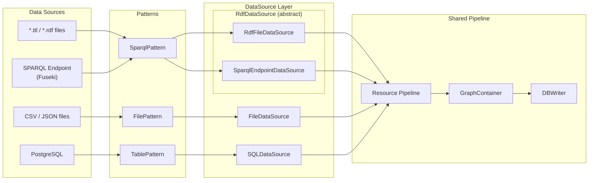
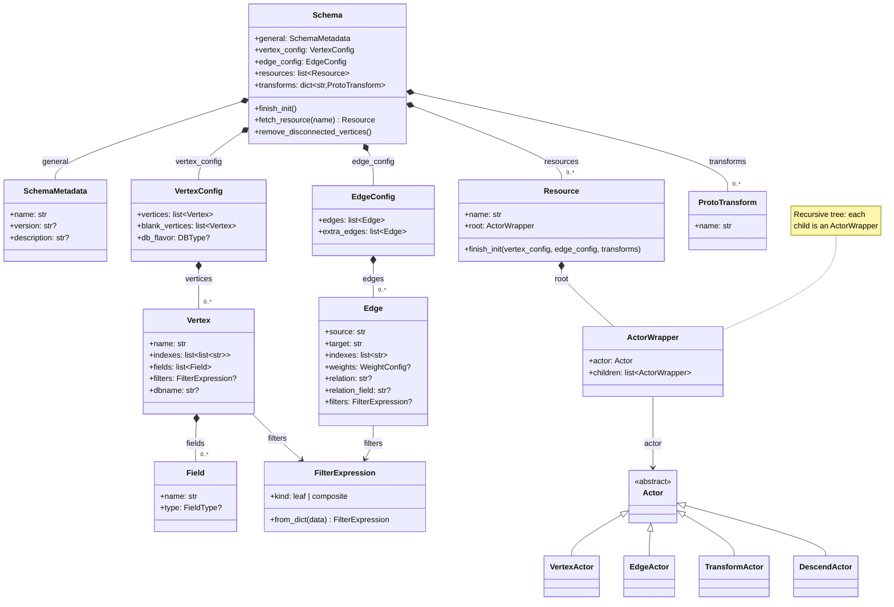

# Concepts

Here we introduce the main concepts of graflo, a framework for transforming data into property graphs.

## System Overview

graflo transforms data sources into property graphs through a pipeline of components:

1. **Data Sources** → **Resources** → **Actors** → **Vertices/Edges** → **Graph Database**

Each component plays a specific role in this transformation process.

### Data flow: Pattern → DataSource → Resource → GraphContainer → Target DB

The diagram below shows how different data sources (files, SQL tables, RDF/SPARQL)
flow through the unified ingestion pipeline.

- **Patterns** describe *where* data comes from (file paths, SQL tables, SPARQL endpoints).
- **DataSources** handle *how* to read data in batches from each source type.
- **Resources** define *what* to extract from each document (vertices, edges, transforms).
- **GraphContainer** collects the resulting vertices and edges.
- **DBWriter** pushes the graph data into the target database (ArangoDB, Neo4j, TigerGraph, FalkorDB, Memgraph, NebulaGraph).

## Class Diagrams

### GraphEngine orchestration

`GraphEngine` is the top-level orchestrator that coordinates schema inference,
pattern creation, schema definition, and data ingestion. The diagram below shows
how it delegates to specialised components.

### Schema architecture

`Schema` is the central configuration object that defines how data is
transformed into a property graph. The diagram below shows its constituent
parts and their relationships.

### Caster ingestion pipeline

`Caster` is the ingestion workhorse. It builds a `DataSourceRegistry` via
`RegistryBuilder`, casts each batch of source data into a `GraphContainer`,
and hands that container to `DBWriter` which pushes vertices and edges to the
target database through `ConnectionManager`.

### Data Sources vs Resources

It's important to understand the distinction between **Data Sources** and **Resources**:

- **Data Sources**: Define *where* data comes from (files, APIs, databases, in-memory objects)
  - Examples: JSON file, REST API endpoint, SQL database, Python list
  - Many data sources can map to the same resource
  - Handled by the `DataSource` abstraction layer

- **Resources**: Define *how* data is transformed into a graph (semantic mapping)
  - Part of the Schema configuration
  - Defines the transformation pipeline using Actors
  - Maps data structures to vertices and edges

## Core Components

### Schema
The `Schema` is the central configuration that defines how data sources are transformed into a property graph. It encapsulates:
 
- Vertex and edge definitions with optional type information
- Resource mappings
- Data transformations
- Index configurations
- Automatic schema inference from normalized PostgreSQL databases (3NF with PK/FK) or from OWL/RDFS ontologies

### Vertex
A `Vertex` describes vertices and their database indexes. It supports:
 
- Single or compound indexes (e.g., `["first_name", "last_name"]` instead of `"full_name"`)
- Property definitions with optional type information
  - Fields can be specified as strings (backward compatible) or typed `Field` objects
  - Supported types: `INT`, `FLOAT`, `BOOL`, `STRING`, `DATETIME`
  - Type information enables better validation and database-specific optimizations
- Filtering conditions
- Optional blank vertex configuration

### Edge
An `Edge` describes edges and their database indexes. It allows:
 
- Definition at any level of a hierarchical document
- Reliance on vertex principal index
- Weight configuration using `direct` parameter (with optional type information)
- Uniqueness constraints with respect to `source`, `target`, and `weight` fields

### Edge Attributes and Configuration

Edges in graflo support a rich set of attributes that enable flexible relationship modeling:

#### Basic Attributes
- **`source`**: Source vertex name (required)
- **`target`**: Target vertex name (required)
- **`indexes`**: List of database indexes for the edge
- **`weights`**: Optional weight configuration for edge properties

#### Relationship Type Configuration 
- **`relation`**: Explicit relationship name (primarily for Neo4j)
- **`relation_field`**: Field name containing relationship type values (for CSV/tabular data)
- **`relation_from_key`**: Use JSON key names as relationship types (for nested JSON data)

#### Weight Configuration
- **`weights.vertices`**: List of weight configurations from vertex properties
- **`weights.direct`**: List of direct field mappings as edge properties
  - Can be specified as strings (backward compatible), `Field` objects with types, or dicts
  - Supports typed fields: `Field(name="date", type="DATETIME")` or `{"name": "date", "type": "DATETIME"}`
  - Type information enables better validation and database-specific optimizations
- **`weights.source_fields`**: Fields from source vertex to use as weights (deprecated)
- **`weights.target_fields`**: Fields from target vertex to use as weights (deprecated)

#### Edge Behavior Control
- **`aux`**: Whether this is an auxiliary edge (created in database, but not considered by graflo)
- **`purpose`**: Additional identifier for utility edges between same vertex types

#### Matching and Filtering
- **`match_source`**: Select source items from a specific branch of json
- **`match_target`**: Select target items from a specific branch of json
- **`match`**: General matching field for edge creation

#### Advanced Configuration
- **`type`**: Edge type (DIRECT or INDIRECT)
- **`by`**: Vertex name for indirect edges
- **`graph_name`**: Custom graph name (auto-generated if not specified)
- **`database_name`**: Database-specific edge identifier (auto-generated if not specified)
  - For ArangoDB, this corresponds to the edge collection name
  - For TigerGraph, used as fallback identifier when relation is not specified
  - For Neo4j, unused (relation is used instead)

#### When to Use Different Attributes

**`relation_field`** (Example 3):
 
- Use with CSV/tabular data
- When relationship types are stored in a dedicated column
- For data like: `company_a, company_b, relation, date`

**`relation_from_key`** (Example 4):
 
- Use with nested JSON data
- When relationship types are implicit in the data structure
- For data like: `{"dependencies": {"depends": [...], "conflicts": [...]}}`

**`weights.direct`**:
 
- Use when you want to add properties directly to edges
- For temporal data (dates), quantitative values, or metadata
- Can specify types for better validation: `weights: {direct: [{"name": "date", "type": "DATETIME"}, {"name": "confidence_score", "type": "FLOAT"}]}`
- Backward compatible with strings: `weights: {direct: ["date", "confidence_score"]}`

**`match_source`/`match_target`**:
 
- For scenarios where we have multiple leaves of json containing the same vertex class
- Example: Creating edges between specific subsets of vertices

### Data Source
A `DataSource` defines where data comes from and how it's retrieved. graflo supports multiple data source types:

- **File Data Sources**: JSON, JSONL, CSV/TSV files
- **RDF File Data Sources**: Turtle (`.ttl`), RDF/XML (`.rdf`), N3 (`.n3`), JSON-LD files -- parsed via `rdflib`, triples grouped by subject into flat dictionaries
- **SPARQL Data Sources**: Remote SPARQL endpoints (e.g. Apache Fuseki) queried via `SPARQLWrapper` with pagination
- **API Data Sources**: REST API endpoints with pagination, authentication, and retry logic
- **SQL Data Sources**: SQL databases via SQLAlchemy with parameterized queries
- **In-Memory Data Sources**: Python objects (lists, DataFrames) already in memory

Data sources are separate from Resources -- they handle data retrieval, while Resources handle data transformation. Many data sources can map to the same Resource, allowing data to be ingested from multiple sources.

### Resource
A `Resource` is a set of mappings and transformations that define how data becomes a graph, defined as a hierarchical structure of `Actors`. Resources are part of the Schema and define:
 
- How data structures map to vertices and edges
- What transformations to apply
- The actor pipeline for processing documents

Resources work with data from any DataSource type - the same Resource can process data from files, APIs, SQL databases, or in-memory objects.

### Actor
An `Actor` describes how the current level of the document should be mapped/transformed to the property graph vertices and edges. There are four types that act on the provided document in this order:
 
- `DescendActor`: Navigates to the next level in the hierarchy. Supports:
  - `key`: Process a specific key in a dictionary
  - `any_key`: Process all keys in a dictionary (useful when you want to handle multiple keys dynamically)
- `TransformActor`: Applies data transformations
- `VertexActor`: Creates vertices from the current level
- `EdgeActor`: Creates edges between vertices

### Transform
A `Transform` defines data transforms, from renaming and type-casting to arbitrary transforms defined as Python functions. Transforms can be:
 
- Provided in the `transforms` section of `Schema`
- Referenced by their `name`
- Applied to both vertices and edges

## Key Features

### Schema Features
- **Flexible Indexing**: Support for compound indexes on vertices and edges
- **Typed Fields**: Optional type information for vertex fields and edge weights (INT, FLOAT, STRING, DATETIME, BOOL)
- **Hierarchical Edge Definition**: Define edges at any level of nested documents
- **Weighted Edges**: Configure edge weights from document fields or vertex properties with optional type information
- **Blank Vertices**: Create intermediate vertices for complex relationships
- **Actor Pipeline**: Process documents through a sequence of specialized actors
- **Smart Navigation**: Automatic handling of both single documents and lists
- **Edge Constraints**: Ensure edge uniqueness based on source, target, and weight
- **Reusable Transforms**: Define and reference transformations by name
- **Vertex Filtering**: Filter vertices based on custom conditions
- **PostgreSQL Schema Inference**: Infer schemas from normalized PostgreSQL databases (3NF) with PK/FK constraints
- **RDF / OWL Schema Inference**: Infer schemas from OWL/RDFS ontologies -- `owl:Class` becomes vertices, `owl:ObjectProperty` becomes edges, `owl:DatatypeProperty` becomes vertex fields

### Performance Optimization
- **Batch Processing**: Process large datasets in configurable batches (`batch_size` parameter of `Caster`)
- **Parallel Execution**: Utilize multiple cores for faster processing (`n_cores` parameter of `Caster`)
- **Efficient Resource Handling**: Optimized processing of both table and tree-like data
- **Smart Caching**: Minimize redundant operations

## Best Practices
1. Use compound indexes for frequently queried vertex properties
2. Leverage blank vertices for complex relationship modeling
3. Define transforms at the schema level for reusability
4. Configure appropriate batch sizes based on your data volume
5. Enable parallel processing for large datasets
6. Choose the right relationship attribute based on your data format:
   - `relation_field` - extract relation from document field
   - `relation_from_key` - extract relation from the key above
   - `relation` for explicit relationship names
7. Use edge weights to capture temporal or quantitative relationship properties
   - Specify types for weight fields when using databases that require type information (e.g., TigerGraph)
   - Use typed `Field` objects or dicts with `type` key for better validation
8. Leverage key matching (`match_source`, `match_target`) for complex matching scenarios
9. Use PostgreSQL schema inference for automatic schema generation from normalized databases (3NF) with proper PK/FK constraints
10. Use RDF/OWL schema inference (`infer_schema_from_rdf`) when ingesting data from SPARQL endpoints or `.ttl` files with a well-defined ontology
11. Specify field types for better validation and database-specific optimizations, especially when targeting TigerGraph

