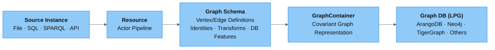
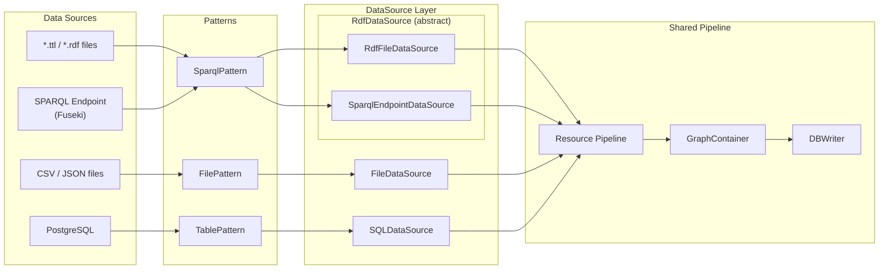
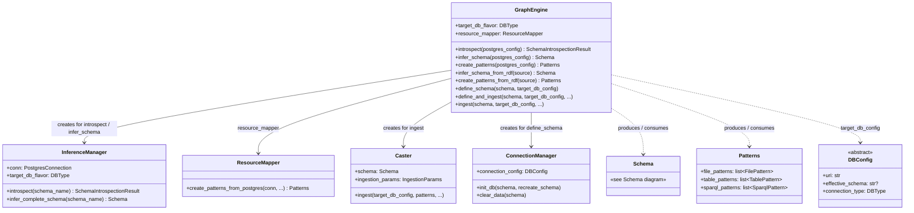
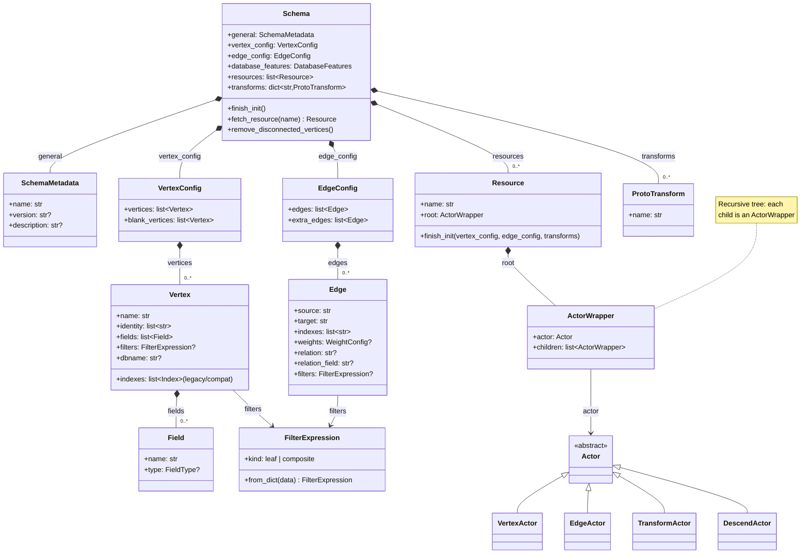
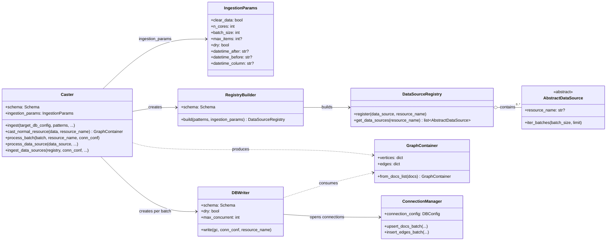
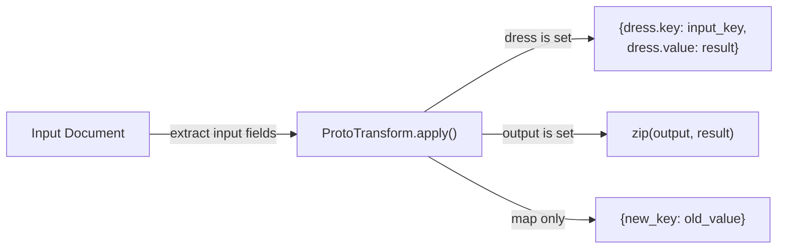

# Concepts

GraFlo is a Graph Schema & Transformation Language (GSTL) for Labeled Property Graphs (LPG). It separates graph schema definition from data-source binding and database targeting, enabling a single declarative specification to drive ingestion across heterogeneous sources and databases.

## System Overview

The GraFlo pipeline transforms data through five stages:




- **Source Instance** — a concrete data artifact (a file, a table, a SPARQL endpoint), wrapped by an `AbstractDataSource` with a `DataSourceType` (`FILE`, `SQL`, `SPARQL`, `API`, `IN_MEMORY`).
- **Resource** — a reusable transformation pipeline (actor steps: descend, transform, vertex, edge) that maps raw records to graph elements. Data sources bind to Resources by name via the `DataSourceRegistry`.
- **Graph Schema** — the declarative specification (`Schema`): vertex/edge definitions, logical identities, typed fields, DB features, transforms, and the Resources themselves.
- **Covariant Graph Representation** — a `GraphContainer` of vertices and edges, independent of any target database.
- **Graph DB** — the target LPG store (ArangoDB, Neo4j, TigerGraph, FalkorDB, Memgraph, NebulaGraph).

### Data flow detail

The diagram below shows how different source instances (files, SQL tables, RDF/SPARQL)
flow through the `DataSourceRegistry` into the shared `Resource` pipeline.



- **Patterns** (`FilePattern`, `TablePattern`, `SparqlPattern`) describe *where* data comes from (file paths, SQL tables, SPARQL endpoints).
- **DataSources** (`AbstractDataSource` subclasses) handle *how* to read data in batches. Each carries a `DataSourceType` and is registered in the `DataSourceRegistry`.
- **Resources** define *what* to extract — each `Resource` is a reusable actor pipeline (descend → transform → vertex → edge) that maps raw records to graph elements.
- **GraphContainer** (covariant graph representation) collects the resulting vertices and edges in a database-independent format.
- **DBWriter** pushes the graph data into the target LPG store (ArangoDB, Neo4j, TigerGraph, FalkorDB, Memgraph, NebulaGraph).

## Class Diagrams

### GraphEngine orchestration

`GraphEngine` is the top-level orchestrator that coordinates schema inference,
pattern creation, schema definition, and data ingestion. The diagram below shows
how it delegates to specialised components.



### Schema architecture

`Schema` is the central configuration object that defines how data is
transformed into a property graph. The diagram below shows its constituent
parts and their relationships.



### Caster ingestion pipeline

`Caster` is the ingestion workhorse. It builds a `DataSourceRegistry` via
`RegistryBuilder`, casts each batch of source data into a `GraphContainer`,
and hands that container to `DBWriter` which pushes vertices and edges to the
target database through `ConnectionManager`.



### DataSources vs Resources

These are the two key abstractions that decouple *data retrieval* from *graph transformation*:

- **DataSources** (`AbstractDataSource` subclasses) — handle *where* and *how* data is read. Each carries a `DataSourceType` (`FILE`, `SQL`, `SPARQL`, `API`, `IN_MEMORY`). Many DataSources can bind to the same Resource by name via the `DataSourceRegistry`.

- **Resources** (`Resource`) — handle *what* the data becomes in the LPG. Each Resource is a reusable actor pipeline (descend → transform → vertex → edge) that maps raw records to graph elements. Because DataSources bind to Resources by name, the same transformation logic applies regardless of whether data arrives from a file, an API, or a SPARQL endpoint.

## Core Components

### Schema
The `Schema` is the single source of truth for the LPG structure. It encapsulates:
 
- Vertex and edge definitions with optional type information
- Resource mappings
- Data transformations
- Index configurations
- Automatic schema inference from normalized PostgreSQL databases (3NF with PK/FK) or from OWL/RDFS ontologies

### Vertex
A `Vertex` describes vertices and their database indexes. It supports:
 
- Single or compound indexes (e.g., `["first_name", "last_name"]` instead of `"full_name"`)
- Property definitions with optional type information
  - Fields can be specified as strings (backward compatible) or typed `Field` objects
  - Supported types: `INT`, `FLOAT`, `BOOL`, `STRING`, `DATETIME`
  - Type information enables better validation and database-specific optimizations
- Filtering conditions
- Optional blank vertex configuration

### Edge
An `Edge` describes edges and their database indexes. It allows:
 
- Definition at any level of a hierarchical document
- Reliance on vertex principal index
- Weight configuration using `direct` parameter (with optional type information)
- Uniqueness constraints with respect to `source`, `target`, and `weight` fields

### Edge Attributes and Configuration

Edges in graflo support a rich set of attributes that enable flexible relationship modeling:

#### Basic Attributes
- **`source`**: Source vertex name (required)
- **`target`**: Target vertex name (required)
- **`indexes`**: List of database indexes for the edge
- **`weights`**: Optional weight configuration for edge properties

#### Relationship Type Configuration 
- **`relation`**: Explicit relationship name (primarily for Neo4j)
- **`relation_field`**: Field name containing relationship type values (for CSV/tabular data)
- **`relation_from_key`**: Use JSON key names as relationship types (for nested JSON data)

#### Weight Configuration
- **`weights.vertices`**: List of weight configurations from vertex properties
- **`weights.direct`**: List of direct field mappings as edge properties
  - Can be specified as strings (backward compatible), `Field` objects with types, or dicts
  - Supports typed fields: `Field(name="date", type="DATETIME")` or `{"name": "date", "type": "DATETIME"}`
  - Type information enables better validation and database-specific optimizations
- **`weights.source_fields`**: Fields from source vertex to use as weights (deprecated)
- **`weights.target_fields`**: Fields from target vertex to use as weights (deprecated)

#### Edge Behavior Control
- **`aux`**: Whether this is an auxiliary edge (created in database, but not considered by graflo)
- **`purpose`**: Additional identifier for utility edges between same vertex types

#### Matching and Filtering
- **`match_source`**: Select source items from a specific branch of json
- **`match_target`**: Select target items from a specific branch of json
- **`match`**: General matching field for edge creation

#### Advanced Configuration
- **`type`**: Edge type (DIRECT or INDIRECT)
- **`by`**: Vertex name for indirect edges
- **`graph_name`**: Custom graph name (auto-generated if not specified)
- **`database_name`**: Database-specific edge identifier (auto-generated if not specified)
  - For ArangoDB, this corresponds to the edge collection name
  - For TigerGraph, used as fallback identifier when relation is not specified
  - For Neo4j, unused (relation is used instead)

#### When to Use Different Attributes

**`relation_field`** (Example 3):
 
- Use with CSV/tabular data
- When relationship types are stored in a dedicated column
- For data like: `company_a, company_b, relation, date`

**`relation_from_key`** (Example 4):
 
- Use with nested JSON data
- When relationship types are implicit in the data structure
- For data like: `{"dependencies": {"depends": [...], "conflicts": [...]}}`

**`weights.direct`**:
 
- Use when you want to add properties directly to edges
- For temporal data (dates), quantitative values, or metadata
- Can specify types for better validation: `weights: {direct: [{"name": "date", "type": "DATETIME"}, {"name": "confidence_score", "type": "FLOAT"}]}`
- Backward compatible with strings: `weights: {direct: ["date", "confidence_score"]}`

**`match_source`/`match_target`**:
 
- For scenarios where we have multiple leaves of json containing the same vertex class
- Example: Creating edges between specific subsets of vertices

### DataSource & DataSourceRegistry
An `AbstractDataSource` subclass defines where data comes from and how it is retrieved. Each carries a `DataSourceType`. The `DataSourceRegistry` maps data sources to Resources by name.

| `DataSourceType` | Adapter | Sources |
|---|---|---|
| `FILE` | `FileDataSource` | JSON, JSONL, CSV/TSV, Parquet files |
| `SPARQL` | `RdfFileDataSource` | Turtle (`.ttl`), RDF/XML (`.rdf`), N3 (`.n3`), JSON-LD files — parsed via `rdflib` |
| `SPARQL` | `SparqlEndpointDataSource` | Remote SPARQL endpoints (e.g. Apache Fuseki) queried via `SPARQLWrapper` |
| `API` | `APIDataSource` | REST API endpoints with pagination, authentication, and retry logic |
| `SQL` | `SQLDataSource` | SQL databases via SQLAlchemy with parameterised queries |
| `IN_MEMORY` | `InMemoryDataSource` | Python objects (lists, DataFrames) already in memory |

Data sources handle retrieval only. They bind to Resources by name via the `DataSourceRegistry`, so the same `Resource` can ingest data from multiple sources without modification.

### Resource
A `Resource` is the central abstraction that bridges data sources and the graph schema. Each Resource defines a reusable actor pipeline (descend → transform → vertex → edge) that maps raw records to graph elements:

- How data structures map to vertices and edges
- What transformations to apply
- The actor pipeline for processing documents

Because DataSources bind to Resources by name, the same transformation logic applies regardless of whether data arrives from a file, an API, a SQL table, or a SPARQL endpoint.

### Actor
An `Actor` describes how the current level of the document should be mapped/transformed to the property graph vertices and edges. There are four types that act on the provided document in this order:
 
- `DescendActor`: Navigates to the next level in the hierarchy. Supports:
  - `key`: Process a specific key in a dictionary
  - `any_key`: Process all keys in a dictionary (useful when you want to handle multiple keys dynamically)
- `TransformActor`: Applies data transformations
- `VertexActor`: Creates vertices from the current level
- `EdgeActor`: Creates edges between vertices

### Transform

A `Transform` defines data transforms, from renaming and type-casting to
arbitrary Python functions. The transform system is built on two layers:

- **ProtoTransform** — the raw function wrapper. It holds `module`, `foo`
  (function name), and `params`. Its `apply()` method invokes the function
  without caring about where the inputs come from or how the outputs are
  packaged.
- **Transform** — wraps a ProtoTransform with input extraction, output
  formatting, field mapping, and optional *dressing*.

#### Output modes

A Transform can produce output in three ways:

1. **Direct output** (`output`) — the function returns one or more values that
   map 1:1 to output field names:

    ```yaml
    - foo: parse_date_ibes
      module: graflo.util.transform
      input: [ANNDATS, ANNTIMS]
      output: [datetime_announce]
    ```

    The function takes two arguments and returns a single string; the string
    is placed into the `datetime_announce` field.

2. **Field mapping** (`map`) — pure renaming with no function:

    ```yaml
    - map:
        Date: t_obs
    ```

3. **Dressed output** (`dress`) — the function returns a single scalar, and
   the result is packaged together with the input field name into a dict.
   This is useful for pivoting wide columns into key/value rows:

    ```yaml
    - foo: round_str
      module: graflo.util.transform
      params:
        ndigits: 3
      input:
      - Open
      dress:
        key: name
        value: value
    ```

    Given a document `{Open: "6.430062..."}`, this produces
    `{name: "Open", value: 6.43}`. The `dress` dict has two roles:

    - `key` — the output field that receives the **input field name** (here `"Open"`)
    - `value` — the output field that receives the **function result** (here `6.43`)

    This cleanly separates *what function to apply* (ProtoTransform) from
    *how to present the result* (dressing).



#### Schema-level transforms

Transforms can be defined at the schema level and referenced by name in
resources, allowing reuse across multiple pipelines:

```yaml
transforms:
  keep_suffix_id:
    foo: split_keep_part
    module: graflo.util.transform
    params: { sep: "/", keep: -1 }
    input: [id]
    output: [_key]

resources:
- resource_name: works
  apply:
  - name: keep_suffix_id   # references the transform above
    input: [doi]            # override input for this usage
  - vertex: work
```

## Key Features

### Schema & Abstraction
- **Declarative LPG schema** — `Schema` defines vertices, edges, indexes, weights, and transforms in YAML or Python; the single source of truth for the graph structure.
- **Database abstraction** — one schema, one API; database idiosyncrasies are handled by the `GraphContainer` (covariant graph representation).
- **Resource abstraction** — each `Resource` is a reusable actor pipeline that maps raw records to graph elements, decoupled from data retrieval.
- **DataSourceRegistry** — pluggable `AbstractDataSource` adapters (`FILE`, `SQL`, `API`, `SPARQL`, `IN_MEMORY`) bound to Resources by name.

### Schema Features
- **Flexible Indexing** — compound indexes on vertices and edges.
- **Typed Fields** — optional type information for vertex fields and edge weights (INT, FLOAT, STRING, DATETIME, BOOL).
- **Hierarchical Edge Definition** — define edges at any level of nested documents.
- **Weighted Edges** — configure edge weights from document fields or vertex properties with optional type information.
- **Blank Vertices** — create intermediate vertices for complex relationships.
- **Actor Pipeline** — process documents through a sequence of specialised actors (descend, transform, vertex, edge).
- **Reusable Transforms** — define and reference transformations by name across Resources.
- **Vertex Filtering** — filter vertices based on custom conditions.
- **PostgreSQL Schema Inference** — infer schemas from normalised PostgreSQL databases (3NF) with PK/FK constraints.
- **RDF / OWL Schema Inference** — infer schemas from OWL/RDFS ontologies: `owl:Class` → vertices, `owl:ObjectProperty` → edges, `owl:DatatypeProperty` → vertex fields.

### Performance Optimization
- **Batch Processing**: Process large datasets in configurable batches (`batch_size` parameter of `Caster`)
- **Parallel Execution**: Utilize multiple cores for faster processing (`n_cores` parameter of `Caster`)
- **Efficient Resource Handling**: Optimized processing of both table and tree-like data
- **Smart Caching**: Minimize redundant operations

## Best Practices
1. Use compound indexes for frequently queried vertex properties
2. Leverage blank vertices for complex relationship modeling
3. Define transforms at the schema level for reusability
4. Configure appropriate batch sizes based on your data volume
5. Enable parallel processing for large datasets
6. Choose the right relationship attribute based on your data format:
   - `relation_field` - extract relation from document field
   - `relation_from_key` - extract relation from the key above
   - `relation` for explicit relationship names
7. Use edge weights to capture temporal or quantitative relationship properties
   - Specify types for weight fields when using databases that require type information (e.g., TigerGraph)
   - Use typed `Field` objects or dicts with `type` key for better validation
8. Leverage key matching (`match_source`, `match_target`) for complex matching scenarios
9. Use PostgreSQL schema inference for automatic schema generation from normalized databases (3NF) with proper PK/FK constraints
10. Use RDF/OWL schema inference (`infer_schema_from_rdf`) when ingesting data from SPARQL endpoints or `.ttl` files with a well-defined ontology
11. Specify field types for better validation and database-specific optimizations, especially when targeting TigerGraph

