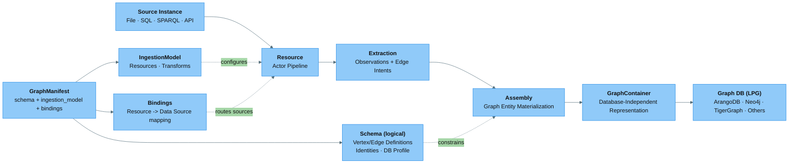
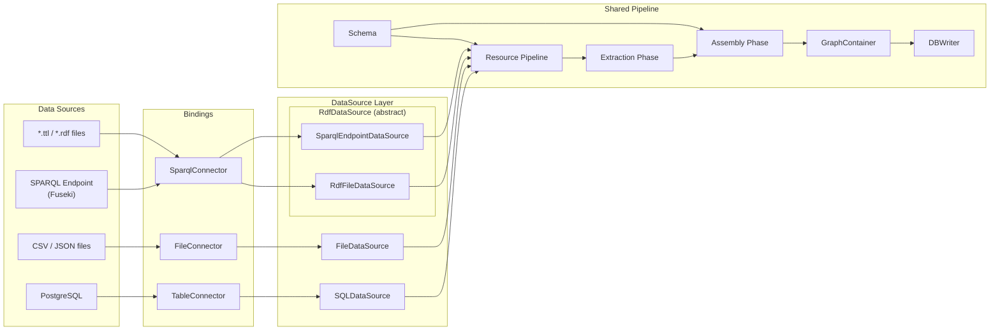
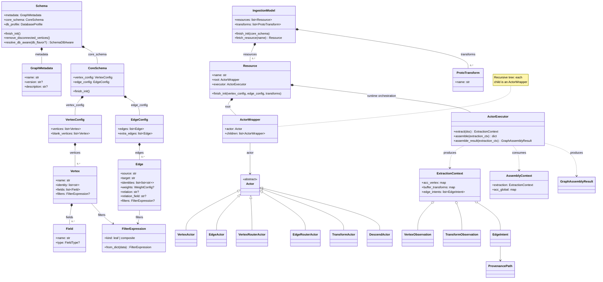
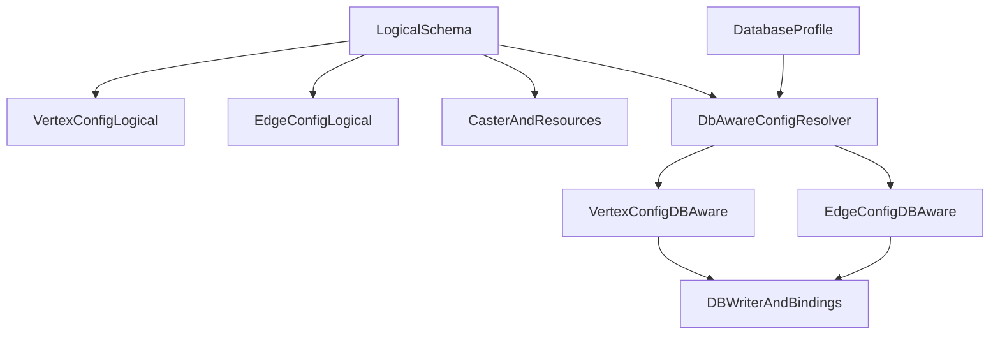
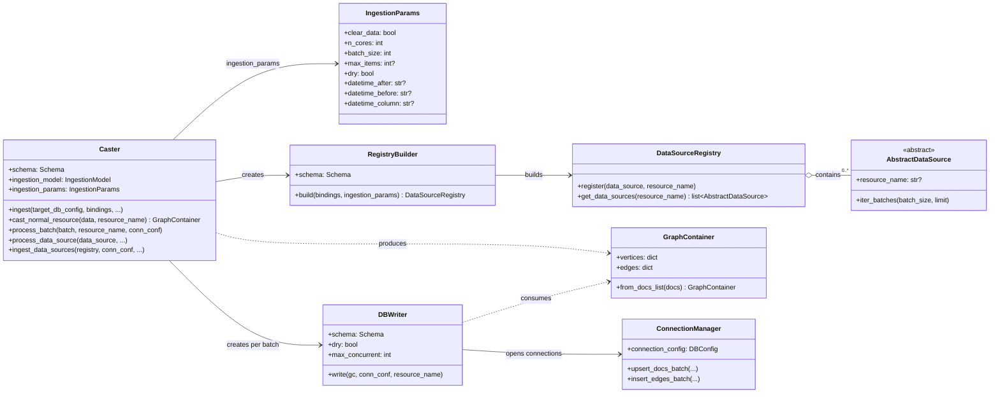
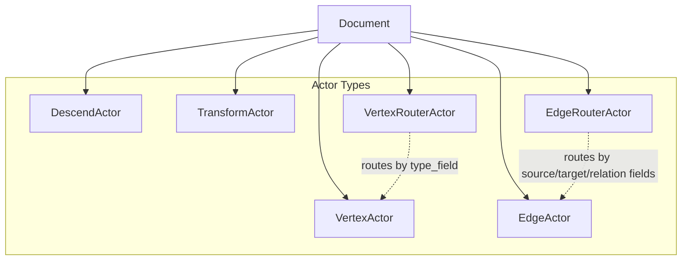
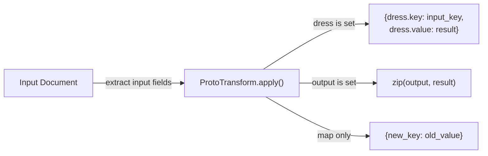

# Concepts

GraFlo is a Graph Schema Transformation Language (GSTL) for Labeled Property Graphs (LPG). As a domain-specific language (DSL), it separates graph schema definition from data-source binding and database targeting, enabling a single declarative specification to drive ingestion across heterogeneous sources and databases while keeping transformation logic portable across vendors.

## System Overview

The GraFlo pipeline transforms data through six stages with a manifest contract boundary:


```mermaid
%%{ init: { 
  "theme": "base",
  "themeVariables": {
    "primaryColor": "#90CAF9",
    "primaryTextColor": "#111111",
    "primaryBorderColor": "#1E88E5",
    "lineColor": "#546E7A",
    "secondaryColor": "#A5D6A7",
    "tertiaryColor": "#CE93D8"
  }
} }%%

flowchart LR
    MF["<b>GraphManifest</b><br/>schema + ingestion_model + bindings"]
    SI["<b>Source Instance</b><br/>File · SQL · SPARQL · API"]
    R["<b>Resource</b><br/>Actor Pipeline"]
    EX["<b>Extraction</b><br/>Observations + Edge Intents"]
    AS["<b>Assembly</b><br/>Graph Entity Materialization"]
    GS["<b>Schema (logical)</b><br/>Vertex/Edge Definitions<br/>Identities · DB Profile"]
    IM["<b>IngestionModel</b><br/>Resources · Transforms"]
    BD["<b>Bindings</b><br/>Resource -> Data Source mapping"]
    GC["<b>GraphContainer</b><br/>Database-Independent Representation"]
    DB["<b>Graph DB (LPG)</b><br/>ArangoDB · Neo4j · TigerGraph · Others"]

    MF --> GS
    MF --> IM
    MF --> BD
    SI --> R --> EX --> AS --> GC --> DB
    IM -. configures .-> R
    GS -. constrains .-> AS
    BD -. routes sources .-> R
```


- **Source Instance** — a concrete data artifact (a file, a table, a SPARQL endpoint), wrapped by an `AbstractDataSource` with a `DataSourceType` (`FILE`, `SQL`, `SPARQL`, `API`, `IN_MEMORY`).
- **Resource** — a reusable transformation pipeline (actor steps: descend, transform, vertex, edge) that maps raw records to graph elements. Data sources bind to Resources by name via the `DataSourceRegistry`.
- **GraphManifest** — the canonical top-level contract that composes `schema`, `ingestion_model`, and `bindings`.
- **Schema** — the declarative logical graph model (`Schema`): vertex/edge definitions, identities, typed fields, and DB profile.
- **IngestionModel** — reusable resources and transforms used to map records into graph entities.
- **Bindings** — resource-to-source mapping (`FileConnector`, `TableConnector`, `SparqlConnector`).
- **Database-Independent Graph Representation** — a `GraphContainer` of vertices and edges, independent of any target database.
- **Graph DB** — the target LPG store (ArangoDB, Neo4j, TigerGraph, FalkorDB, Memgraph, NebulaGraph).

### Data flow detail

The diagram below shows how different source instances (files, SQL tables, RDF/SPARQL)
flow through the `DataSourceRegistry` into the shared `Resource` pipeline.


```mermaid
flowchart LR
    subgraph sources [Data Sources]
        TTL["*.ttl / *.rdf files"]
        Fuseki["SPARQL Endpoint<br/>(Fuseki)"]
        Files["CSV / JSON files"]
        PG["PostgreSQL"]
    end
    subgraph bindings [Bindings]
        FP[FileConnector]
        TP[TableConnector]
        SP[SparqlConnector]
    end
    subgraph datasources [DataSource Layer]
        subgraph rdfFamily ["RdfDataSource (abstract)"]
            RdfDS[RdfFileDataSource]
            SparqlDS[SparqlEndpointDataSource]
        end
        FileDS[FileDataSource]
        SQLDS[SQLDataSource]
    end
    subgraph pipeline [Shared Pipeline]
        Sch[Schema]
        Res[Resource Pipeline]
        Ex[Extraction Phase]
        Asm[Assembly Phase]
        GC[GraphContainer]
        DBW[DBWriter]
    end

    TTL --> SP --> RdfDS --> Res
    Fuseki --> SP --> SparqlDS --> Res
    Files --> FP --> FileDS --> Res
    PG --> TP --> SQLDS --> Res
    Sch --> Res
    Sch --> Asm
    Res --> Ex --> Asm --> GC --> DBW
```

- **Bindings** (`FileConnector`, `TableConnector`, `SparqlConnector`) describe *where* data comes from (file paths, SQL tables, SPARQL endpoints).
- **DataSources** (`AbstractDataSource` subclasses) handle *how* to read data in batches. Each carries a `DataSourceType` and is registered in the `DataSourceRegistry`.
- **Resources** define *what* to extract — each `Resource` is a reusable actor pipeline (descend → transform → vertex → edge) that maps raw records to graph elements.
- **GraphContainer** (covariant graph representation) collects the resulting vertices and edges in a database-independent format.
- **DBWriter** pushes the graph data into the target LPG store (ArangoDB, Neo4j, TigerGraph, FalkorDB, Memgraph, NebulaGraph).

### Minimal canonical config contract

GraFlo serializes configuration models in a minimal canonical form by default:

- fields equal to defaults are omitted;
- `None` values are omitted;
- aliases and normalized DSL shapes are used.

This is intentional for lightweight manifests and LLM-oriented workflows.
The guaranteed invariant is semantic/idempotent canonical round-trip
(`parse -> minimal dump -> parse`), not authored-style text preservation.

## Class Diagrams

### GraphEngine orchestration

`GraphEngine` is the top-level orchestrator that coordinates schema inference,
connector creation, schema definition, and data ingestion. The diagram below shows
how it delegates to specialised components.


```mermaid
classDiagram
    direction TB

    class GraphEngine {
        +target_db_flavor: DBType
        +resource_mapper: ResourceMapper
        +introspect(postgres_config) SchemaIntrospectionResult
        +infer_schema(postgres_config) GraphManifest
        +create_bindings(postgres_config, ...) Bindings
        +infer_schema_from_rdf(source) tuple~Schema, IngestionModel~
        +create_bindings_from_rdf(source) Bindings
        +define_schema(manifest, target_db_config)
        +define_and_ingest(manifest, target_db_config, ...)
        +ingest(manifest, target_db_config, ...)
    }

    class InferenceManager {
        +conn: PostgresConnection
        +target_db_flavor: DBType
        +introspect(schema_name) SchemaIntrospectionResult
        +infer_complete_schema(schema_name) tuple~Schema, IngestionModel~
    }

    class ResourceMapper {
        +create_bindings_from_postgres(conn, ...) Bindings
    }

    class Caster {
        +schema: Schema
        +ingestion_model: IngestionModel
        +ingestion_params: IngestionParams
        +ingest(target_db_config, bindings, ...)
    }

    class ConnectionManager {
        +connection_config: DBConfig
        +init_db(schema, recreate_schema)
        +clear_data(schema)
    }

    class Schema {
        «see Schema diagram»
    }

    class GraphManifest {
        +schema: Schema?
        +ingestion_model: IngestionModel?
        +bindings: Bindings?
        +finish_init()
    }

    class Bindings {
        +file_connectors: list~FileConnector~
        +table_connectors: list~TableConnector~
        +sparql_connectors: list~SparqlConnector~
    }

    class DBConfig {
        <<abstract>>
        +uri: str
        +effective_schema: str?
        +connection_type: DBType
    }

    GraphEngine --> InferenceManager : creates for introspect / infer_schema
    GraphEngine --> ResourceMapper : resource_mapper
    GraphEngine --> Caster : creates for ingest
    GraphEngine --> ConnectionManager : creates for define_schema
    GraphEngine ..> GraphManifest : produces / consumes
    GraphEngine ..> Bindings : produces / consumes
    GraphEngine ..> DBConfig : target_db_config
```

### Schema architecture

`Schema` and `IngestionModel` split logical graph structure from ingestion
runtime pipelines. The diagram below shows their constituent parts and
relationships.


```mermaid
classDiagram
    direction TB

    class Schema {
        +metadata: GraphMetadata
        +core_schema: CoreSchema
        +db_profile: DatabaseProfile
        +finish_init()
        +remove_disconnected_vertices()
        +resolve_db_aware(db_flavor?) SchemaDBAware
    }

    class CoreSchema {
        +vertex_config: VertexConfig
        +edge_config: EdgeConfig
        +finish_init()
    }

    class IngestionModel {
        +resources: list~Resource~
        +transforms: list~ProtoTransform~
        +finish_init(core_schema)
        +fetch_resource(name) Resource
    }

    class GraphMetadata {
        +name: str
        +version: str?
        +description: str?
    }

    class VertexConfig {
        +vertices: list~Vertex~
        +blank_vertices: list~Vertex~
    }

    class Vertex {
        +name: str
        +identity: list~str~
        +fields: list~Field~
        +filters: FilterExpression?
    }

    class Field {
        +name: str
        +type: FieldType?
    }

    class EdgeConfig {
        +edges: list~Edge~
        +extra_edges: list~Edge~
    }

    class Edge {
        +source: str
        +target: str
        +identities: list~list~str~~
        +weights: WeightConfig?
        +relation: str?
        +relation_field: str?
        +filters: FilterExpression?
    }

    class Resource {
        +name: str
        +root: ActorWrapper
        +executor: ActorExecutor
        +finish_init(vertex_config, edge_config, transforms)
    }

    class ActorWrapper {
        +actor: Actor
        +children: list~ActorWrapper~
    }
    note for ActorWrapper "Recursive tree: each<br />child is an ActorWrapper"

    class ActorExecutor {
        +extract(doc) ExtractionContext
        +assemble(extraction_ctx) dict
        +assemble_result(extraction_ctx) GraphAssemblyResult
    }

    class Actor {
        <<abstract>>
    }
    class VertexActor
    class EdgeActor
    class VertexRouterActor
    class EdgeRouterActor
    class TransformActor
    class DescendActor

    class ProtoTransform {
        +name: str
    }

    class ExtractionContext {
        +acc_vertex: map
        +buffer_transforms: map
        +edge_intents: list~EdgeIntent~
    }

    class AssemblyContext {
        +extraction: ExtractionContext
        +acc_global: map
    }

    class VertexObservation
    class TransformObservation
    class EdgeIntent
    class ProvenancePath
    class GraphAssemblyResult

    class FilterExpression {
        +kind: leaf | composite
        +from_dict(data) FilterExpression
    }

    Schema *-- GraphMetadata : metadata
    Schema *-- CoreSchema : core_schema
    CoreSchema *-- VertexConfig : vertex_config
    CoreSchema *-- EdgeConfig : edge_config
    IngestionModel *-- "0..*" Resource : resources
    IngestionModel *-- "0..*" ProtoTransform : transforms

    VertexConfig *-- "0..*" Vertex : vertices
    Vertex *-- "0..*" Field : fields
    Vertex --> FilterExpression : filters

    EdgeConfig *-- "0..*" Edge : edges
    Edge --> FilterExpression : filters

    Resource *-- ActorWrapper : root
    Resource *-- ActorExecutor : runtime orchestration
    ActorWrapper --> Actor : actor
    ActorExecutor ..> ExtractionContext : produces
    ActorExecutor ..> AssemblyContext : consumes
    ExtractionContext o-- VertexObservation
    ExtractionContext o-- TransformObservation
    ExtractionContext o-- EdgeIntent
    EdgeIntent --> ProvenancePath
    ActorExecutor ..> GraphAssemblyResult : produces

    Actor <|-- VertexActor
    Actor <|-- EdgeActor
    Actor <|-- VertexRouterActor
    Actor <|-- EdgeRouterActor
    Actor <|-- TransformActor
    Actor <|-- DescendActor
```

Runtime detail: resource processing now uses an explicit two-phase flow
(`ExtractionContext` -> `AssemblyContext`). Extraction records typed artifacts
(`VertexObservation`, `TransformObservation`, `EdgeIntent`), and assembly turns
those artifacts into graph entities. Orchestration is owned by
`ActorExecutor`, while `ActorWrapper` remains focused on actor tree behavior.

#### Logical schema vs DB-aware projection

GraFlo now keeps logical graph modeling separate from DB materialization:

- `Vertex`, `Edge`, `VertexConfig`, and `EdgeConfig` are logical and backend-agnostic.
- DB-specific naming/defaults/index projection is resolved through
  `VertexConfigDBAware` and `EdgeConfigDBAware`.
- The resolver entrypoint is `Schema.resolve_db_aware(...)`, used by DB write/connector stages.


```mermaid
flowchart TD
  schema[LogicalSchema]
  vcfg[VertexConfigLogical]
  ecfg[EdgeConfigLogical]
  dbfeat[DatabaseProfile]
  resolver[DbAwareConfigResolver]
  vdb[VertexConfigDBAware]
  edb[EdgeConfigDBAware]
  caster[CasterAndResources]
  dbwriter[DBWriterAndBindings]

  schema --> vcfg
  schema --> ecfg
  schema --> caster
  schema --> resolver
  dbfeat --> resolver
  resolver --> vdb
  resolver --> edb
  vdb --> dbwriter
  edb --> dbwriter
```

### Caster ingestion pipeline

`Caster` is the ingestion workhorse. It builds a `DataSourceRegistry` via
`RegistryBuilder`, casts each batch of source data into a `GraphContainer`,
and hands that container to `DBWriter` which pushes vertices and edges to the
target database through `ConnectionManager`.


```mermaid
classDiagram
    direction LR

    class Caster {
        +schema: Schema
        +ingestion_model: IngestionModel
        +ingestion_params: IngestionParams
        +ingest(target_db_config, bindings, ...)
        +cast_normal_resource(data, resource_name) GraphContainer
        +process_batch(batch, resource_name, conn_conf)
        +process_data_source(data_source, ...)
        +ingest_data_sources(registry, conn_conf, ...)
    }

    class IngestionParams {
        +clear_data: bool
        +n_cores: int
        +batch_size: int
        +max_items: int?
        +dry: bool
        +datetime_after: str?
        +datetime_before: str?
        +datetime_column: str?
    }

    class RegistryBuilder {
        +schema: Schema
        +build(bindings, ingestion_params) DataSourceRegistry
    }

    class DataSourceRegistry {
        +register(data_source, resource_name)
        +get_data_sources(resource_name) list~AbstractDataSource~
    }

    class DBWriter {
        +schema: Schema
        +dry: bool
        +max_concurrent: int
        +write(gc, conn_conf, resource_name)
    }

    class GraphContainer {
        +vertices: dict
        +edges: dict
        +from_docs_list(docs) GraphContainer
    }

    class ConnectionManager {
        +connection_config: DBConfig
        +upsert_docs_batch(...)
        +insert_edges_batch(...)
    }

    class AbstractDataSource {
        <<abstract>>
        +resource_name: str?
        +iter_batches(batch_size, limit)
    }

    Caster --> IngestionParams : ingestion_params
    Caster --> RegistryBuilder : creates
    RegistryBuilder --> DataSourceRegistry : builds
    Caster --> DBWriter : creates per batch
    Caster ..> GraphContainer : produces
    DBWriter ..> GraphContainer : consumes
    DBWriter --> ConnectionManager : opens connections
    DataSourceRegistry o-- "0..*" AbstractDataSource : contains
```

### DataSources vs Resources

These are the two key abstractions that decouple *data retrieval* from *graph transformation*:

- **DataSources** (`AbstractDataSource` subclasses) — handle *where* and *how* data is read. Each carries a `DataSourceType` (`FILE`, `SQL`, `SPARQL`, `API`, `IN_MEMORY`). Many DataSources can bind to the same Resource by name via the `DataSourceRegistry`.

- **Resources** (`Resource`) — handle *what* the data becomes in the LPG. Each Resource is a reusable actor pipeline (descend → transform → vertex → edge) that maps raw records to graph elements. Because DataSources bind to Resources by name, the same transformation logic applies regardless of whether data arrives from a file, an API, or a SPARQL endpoint.

## Core Components

### Schema
The `Schema` is the single source of truth for the LPG structure. It encapsulates:
 
- Vertex and edge definitions with optional type information
- Identity and physical index configurations
- DB profile defaults and DB-aware projection settings
- Automatic schema inference from normalized PostgreSQL databases (3NF with PK/FK) or from OWL/RDFS ontologies

### IngestionModel
The `IngestionModel` is the source of truth for ingestion runtime behavior. It encapsulates:

- Resource mappings and actor pipelines
- Reusable named transforms
- Runtime initialization against the core schema (`finish_init(schema.core_schema)`)

### Vertex
A `Vertex` describes vertices and their logical identity. It supports:

- Single or compound identity fields (e.g., `["first_name", "last_name"]` instead of `"full_name"`)
- Property definitions with optional type information
  - Fields can be specified as strings (backward compatible) or typed `Field` objects
  - Supported types: `INT`, `FLOAT`, `BOOL`, `STRING`, `DATETIME`
  - Type information enables better validation and database-specific optimizations
- Filtering conditions
- Optional blank vertex configuration

### Edge
An `Edge` describes edges and their logical identities. It allows:
 
- Definition at any level of a hierarchical document
- Reliance on vertex principal index
- Weight configuration using `direct` parameter (with optional type information)
- Optional uniqueness semantics through `identities` (multiple candidate keys are allowed)

### Edge Attributes and Configuration

Edges in graflo support a rich set of attributes that enable flexible relationship modeling:

#### Basic Attributes
- **`source`**: Source vertex name (required)
- **`target`**: Target vertex name (required)
- **`identities`**: Logical identity keys for the edge (each key can induce uniqueness)
- **`weights`**: Optional weight configuration for edge properties

#### Relationship Type Configuration 
- **`relation`**: Explicit relationship name (primarily for Neo4j)
- **`relation_field`**: Field name containing relationship type values (for CSV/tabular data)
- **`relation_from_key`**: Use JSON key names as relationship types (for nested JSON data)

#### Weight Configuration
- **`weights.vertices`**: List of weight configurations from vertex properties
- **`weights.direct`**: List of direct field mappings as edge properties
  - Can be specified as strings (backward compatible), `Field` objects with types, or dicts
  - Supports typed fields: `Field(name="date", type="DATETIME")` or `{"name": "date", "type": "DATETIME"}`
  - Type information enables better validation and database-specific optimizations
- **`weights.source_fields`**: Fields from source vertex to use as weights (deprecated)
- **`weights.target_fields`**: Fields from target vertex to use as weights (deprecated)

#### Edge Behavior Control
- Edge physical variants should be modeled with `database_features.edge_specs[*].purpose`.
- `Edge.aux` is no longer a behavior switch.

> DB-only physical edge metadata (including `purpose`) is configured under
> `database_features.edge_specs`, not on `Edge`.

#### Matching and Filtering
- **`match_source`**: Select source items from a specific branch of json
- **`match_target`**: Select target items from a specific branch of json
- **`match`**: General matching field for edge creation

#### Advanced Configuration
- **`type`**: Edge type (DIRECT or INDIRECT)
- **`by`**: Vertex name for indirect edges
- DB-specific edge storage/type names are resolved from `database_features`
  through DB-aware wrappers (`EdgeConfigDBAware`), not stored on `Edge`.

#### When to Use Different Attributes

**`relation_field`** (Example 3):
 
- Use with CSV/tabular data
- When relationship types are stored in a dedicated column
- For data like: `company_a, company_b, relation, date`

**`relation_from_key`** (Example 4):
 
- Use with nested JSON data
- When relationship types are implicit in the data structure
- For data like: `{"dependencies": {"depends": [...], "conflicts": [...]}}`

**`weights.direct`**:
 
- Use when you want to add properties directly to edges
- For temporal data (dates), quantitative values, or metadata
- Can specify types for better validation: `weights: {direct: [{"name": "date", "type": "DATETIME"}, {"name": "confidence_score", "type": "FLOAT"}]}`
- Backward compatible with strings: `weights: {direct: ["date", "confidence_score"]}`

**`match_source`/`match_target`**:
 
- For scenarios where we have multiple leaves of json containing the same vertex class
- Example: Creating edges between specific subsets of vertices

### DataSource & DataSourceRegistry
An `AbstractDataSource` subclass defines where data comes from and how it is retrieved. Each carries a `DataSourceType`. The `DataSourceRegistry` maps data sources to Resources by name.

| `DataSourceType` | Adapter | Sources |
|---|---|---|
| `FILE` | `FileDataSource` | JSON, JSONL, CSV/TSV, Parquet files |
| `SPARQL` | `RdfFileDataSource` | Turtle (`.ttl`), RDF/XML (`.rdf`), N3 (`.n3`), JSON-LD files — parsed via `rdflib` |
| `SPARQL` | `SparqlEndpointDataSource` | Remote SPARQL endpoints (e.g. Apache Fuseki) queried via `SPARQLWrapper` |
| `API` | `APIDataSource` | REST API endpoints with pagination, authentication, and retry logic |
| `SQL` | `SQLDataSource` | SQL databases via SQLAlchemy with parameterised queries |
| `IN_MEMORY` | `InMemoryDataSource` | Python objects (lists, DataFrames) already in memory |

Data sources handle retrieval only. They bind to Resources by name via the `DataSourceRegistry`, so the same `Resource` can ingest data from multiple sources without modification.

### Resource
A `Resource` is the central abstraction that bridges data sources and the graph schema. Each Resource defines a reusable actor pipeline (descend → transform → vertex → edge) that maps raw records to graph elements:

- How data structures map to vertices and edges
- What transformations to apply
- The actor pipeline for processing documents

Because DataSources bind to Resources by name, the same transformation logic applies regardless of whether data arrives from a file, an API, a SQL table, or a SPARQL endpoint.

Resource-level edge inference controls:
- **`infer_edges`**: Global toggle for inferred edge emission during assembly (default: `true`).
- **`infer_edge_only`**: Allow-list of inferred edges (`source`, `target`, optional `relation`).
- **`infer_edge_except`**: Deny-list of inferred edges (`source`, `target`, optional `relation`).
- `infer_edge_only` and `infer_edge_except` are mutually exclusive and validated against declared schema edges.
- These controls apply to inferred edges only; explicit edge actors in the pipeline are still emitted.
- **Auto-exclusion**: When a resource pipeline contains any EdgeActor for edges of type `(source, target)`, `(source, target, None)` is automatically added to `infer_edge_except` for that resource, so inferred edges do not duplicate edges produced by explicit edge actors.

### Actor
An `Actor` describes how the current level of the document should be mapped/transformed to the property graph vertices and edges. There are six actor types:
 
- `DescendActor`: Navigates to the next level in the hierarchy. Supports:
  - `key`: Process a specific key in a dictionary
  - `any_key`: Process all keys in a dictionary (useful when you want to handle multiple keys dynamically)
- `TransformActor`: Applies data transformations
- `VertexActor`: Creates vertices from the current level
- `EdgeActor`: Creates edges between vertices
- `VertexRouterActor`: Routes documents to the correct `VertexActor` based on a type field in the document (dynamic vertex-type routing)
- `EdgeRouterActor`: Routes documents to dynamically created edges based on source/target type fields and optional relation field


```mermaid
flowchart TB
    subgraph actors [Actor Types]
        D[DescendActor]
        T[TransformActor]
        V[VertexActor]
        E[EdgeActor]
        VR[VertexRouterActor]
        ER[EdgeRouterActor]
    end
    Doc[Document] --> D
    Doc --> T
    Doc --> V
    Doc --> E
    Doc --> VR
    Doc --> ER
    VR -.->|routes by type_field| V
    ER -.->|routes by source/target/relation fields| E
```

### Transform

A `Transform` defines data transforms, from renaming and type-casting to
arbitrary Python functions. The transform system is built on two layers:

For a dedicated guide covering all transform use cases and configuration
options (inline/local usage, reusable `use` references, multi-field
strategies, and key transforms), see [Transforms](transforms.md).

- **ProtoTransform** — the raw function wrapper. It holds `module`, `foo`
  (function name), and `params`. Its `apply()` method invokes the function
  without caring about where the inputs come from or how the outputs are
  packaged.
- **Transform** — wraps a ProtoTransform with input extraction, output
  formatting, field mapping, and optional *dressing*.

#### Output modes

A Transform can produce output in three ways:

1. **Direct output** (`output`) — the function returns one or more values that
   map 1:1 to output field names:

    ```yaml
    - foo: parse_date_ibes
      module: graflo.util.transform
      input: [ANNDATS, ANNTIMS]
      output: [datetime_announce]
    ```

    The function takes two arguments and returns a single string; the string
    is placed into the `datetime_announce` field.

2. **Field mapping** (`map`) — pure renaming with no function:

    ```yaml
    - map:
        Date: t_obs
    ```

3. **Dressed output** (`dress`) — the function returns a single scalar, and
   the result is packaged together with the input field name into a dict.
   This is useful for pivoting wide columns into key/value rows:

    ```yaml
    - foo: round_str
      module: graflo.util.transform
      params:
        ndigits: 3
      input:
      - Open
      dress:
        key: name
        value: value
    ```

    Given a document `{Open: "6.430062..."}`, this produces
    `{name: "Open", value: 6.43}`. The `dress` dict has two roles:

    - `key` — the output field that receives the **input field name** (here `"Open"`)
    - `value` — the output field that receives the **function result** (here `6.43`)

    This cleanly separates *what function to apply* (ProtoTransform) from
    *how to present the result* (dressing).

#### Key transforms

Transforms can also target **document keys** (not values) using
`transform.call.target: keys`. Key mode uses implicit per-key execution and a
selector under `call.keys`:

- `mode: all` — apply to all keys
- `mode: include` — apply only to listed keys
- `mode: exclude` — apply to all keys except listed keys

Example: normalize all keys to snake case:

```yaml
- transform:
    call:
      module: graflo.util.transform
      foo: camel_to_snake
      target: keys
      keys:
        mode: all
```

Example: strip `raw_` only from selected keys:

```yaml
- transform:
    call:
      module: graflo.util.transform
      foo: remove_prefix
      params: {prefix: "raw_"}
      target: keys
      keys:
        mode: include
        names: [raw_id, raw_label]
```

#### Grouped value transforms

For repeated tuple-style value calls, use explicit `input_groups` in
`transform.call`:

```yaml
- transform:
    call:
      module: my_pkg.transforms
      foo: join_name
      input_groups:
        - [fname_parent, lname_parent]
        - [fname_child, lname_child]
      output: [parent_name, child_name]
```

This executes one function call per group with deterministic output mapping.


```mermaid
flowchart LR
    Doc["Input Document"] -->|"extract input fields"| Proto["ProtoTransform.apply()"]
    Proto -->|"dress is set"| Dressed["{dress.key: input_key,<br/>dress.value: result}"]
    Proto -->|"output is set"| Direct["zip(output, result)"]
    Proto -->|"map only"| Mapped["{new_key: old_value}"]
```

#### Schema-level transforms

Transforms are declared as a **list** under `ingestion_model.transforms` and
referenced from resource steps via `transform.call.use`. This keeps ordering
explicit and allows reuse across multiple pipelines:

```yaml
transforms:
  - name: keep_suffix_id
    foo: split_keep_part
    module: graflo.util.transform
    params: { sep: "/", keep: -1 }
    input: [id]
    output: [_key]

resources:
- name: works
  apply:
  - transform:
      call:
        use: keep_suffix_id      # references the transform above
        input: [doi]             # override input for this usage
  - vertex: work
```

Transform steps are executed in the order they appear in `apply`.

## Key Features

### Schema & Abstraction
- **Declarative LPG schema** — `Schema` defines vertices, edges, identity rules, and weights in YAML or Python; the single source of truth for graph structure. Transforms/resources are defined in `IngestionModel`.
- **Database abstraction** — one logical schema, multiple backends; DB-specific behavior is applied in DB-aware projection/writer stages (`Schema.resolve_db_aware(...)`, `VertexConfigDBAware`, `EdgeConfigDBAware`).
- **Resource abstraction** — each `Resource` is a reusable actor pipeline that maps raw records to graph elements, decoupled from data retrieval.
- **DataSourceRegistry** — pluggable `AbstractDataSource` adapters (`FILE`, `SQL`, `API`, `SPARQL`, `IN_MEMORY`) bound to Resources by name.

### Schema Features
- **Flexible Identity + Indexing** — logical identity plus DB-specific secondary indexes.
- **Typed Fields** — optional type information for vertex fields and edge weights (INT, FLOAT, STRING, DATETIME, BOOL).
- **Hierarchical Edge Definition** — define edges at any level of nested documents.
- **Weighted Edges** — configure edge weights from document fields or vertex properties with optional type information.
- **Blank Vertices** — create intermediate vertices for complex relationships.
- **Actor Pipeline** — process documents through a sequence of specialised actors (descend, transform, vertex, edge).
- **Reusable Transforms** — define and reference transformations by name across Resources.
- **Vertex Filtering** — filter vertices based on custom conditions.
- **PostgreSQL Schema Inference** — infer schemas from normalised PostgreSQL databases (3NF) with PK/FK constraints.
- **RDF / OWL Schema Inference** — infer schemas from OWL/RDFS ontologies: `owl:Class` → vertices, `owl:ObjectProperty` → edges, `owl:DatatypeProperty` → vertex fields.
- **SelectSpec** — declarative view specification for advanced filtering and projection of SQL data before feeding into Resources. Use `TableConnector.view` with `SelectSpec` (full SQL-like `select` or `type_lookup` shorthand for symmetric edge lookups with `source_type` / `target_type` columns) to control exactly what data is queried. Per-side `source_table` / `target_table` / `source_identity` / `target_identity` / `source_type_column` / `target_type_column` cover different lookup tables or join keys. When one endpoint’s type is static in `EdgeRouterActorConfig` only, use `kind="select"` for the view. Use `kind="select"` whenever the shorthand is not expressive enough.

### Schema Migration (v1)
- **Read-only planning first** — use `migrate_schema plan --from-schema-path ... --to-schema-path ...` to generate a deterministic operation plan before any writes.
- **Risk-gated execution** — v1 executes only low-risk additive operations by default and blocks high-risk/destructive operations.
- **Backend scope** — execution adapters are currently focused on ArangoDB and Neo4j; other backends are plan-first until adapter coverage is added.
- **History and idempotency** — applied revisions are tracked in a migration manifest (`.graflo/migrations.json`) with revision + schema hash checks.
- **Operational commands** — `plan`, `apply`, `status`, and `history` are exposed through the `migrate_schema` CLI entrypoint.

#### Comparing Two Schemas

When you compare schemas, treat it like comparing two building blueprints:

- `--from-schema-path` is the **current building** blueprint.
- `--to-schema-path` is the **target building** blueprint.
- `migrate_schema plan` is the **architectural diff report** that tells you what must be added, changed, or removed to get from current to target.

Another useful analogy is `git diff`, but for graph structure:

- Additive changes (new vertex type, new edge, new field, new index) are similar to adding code in a backward-compatible way.
- Destructive changes (removing fields/types, identity shifts) are similar to breaking API changes: they often require explicit migration steps, data sweeps, or rollouts.

Practical comparison checklist:

1. Run `plan` first and review operations grouped by risk.
2. Confirm identity changes explicitly (identity shifts are high-impact).
3. Validate whether each blocked operation needs a manual script, staged rollout, or explicit high-risk approval.
4. Use `apply --dry-run` before any real apply.

Example:

```bash
uv run migrate_schema plan \
  --from-schema-path schema_v1.yaml \
  --to-schema-path schema_v2.yaml \
  --output-format json
```

How to read the output:

- `operations`: runnable operations under current risk policy (v1 defaults to low-risk subset).
- `blocked_operations`: operations intentionally withheld for safety.
- `warnings`: policy and compatibility notes you should resolve before execution.

#### Migration Command Examples

```bash
# Plan changes between two schema versions
uv run migrate_schema plan \
  --from-schema-path schema_v1.yaml \
  --to-schema-path schema_v2.yaml

# Dry-run apply to inspect backend actions
uv run migrate_schema apply \
  --from-schema-path schema_v1.yaml \
  --to-schema-path schema_v2.yaml \
  --db-config-path db.yaml \
  --revision 0001_additive_updates \
  --dry-run

# Persist migration history after real execution
uv run migrate_schema apply \
  --from-schema-path schema_v1.yaml \
  --to-schema-path schema_v2.yaml \
  --db-config-path db.yaml \
  --revision 0001_additive_updates \
  --no-dry-run

# Inspect migration state
uv run migrate_schema status
uv run migrate_schema history
```

#### Why This Helps

Schema comparison gives you a predictable transition path between versions. Instead of discovering incompatibilities during ingestion, you see structural deltas in advance, gate risky steps, and execute a controlled rollout.

### Performance Optimization
- **Batch Processing**: Process large datasets in configurable batches (`batch_size` parameter of `Caster`)
- **Parallel Execution**: Utilize multiple cores for faster processing (`n_cores` parameter of `Caster`)
- **Efficient Resource Handling**: Optimized processing of both table and tree-like data
- **Smart Caching**: Minimize redundant operations

## Best Practices
1. Use compound identity fields for natural keys, and `database_features` indexes for query performance
2. Leverage blank vertices for complex relationship modeling
3. Define transforms at the schema level for reusability
4. Configure appropriate batch sizes based on your data volume
5. Enable parallel processing for large datasets
6. Choose the right relationship attribute based on your data format:
   - `relation_field` - extract relation from document field
   - `relation_from_key` - extract relation from the key above
   - `relation` for explicit relationship names
7. Use edge weights to capture temporal or quantitative relationship properties
   - Specify types for weight fields when using databases that require type information (e.g., TigerGraph)
   - Use typed `Field` objects or dicts with `type` key for better validation
8. Leverage key matching (`match_source`, `match_target`) for complex matching scenarios
9. Use PostgreSQL schema inference for automatic schema generation from normalized databases (3NF) with proper PK/FK constraints
10. Use RDF/OWL schema inference (`infer_schema_from_rdf`) when ingesting data from SPARQL endpoints or `.ttl` files with a well-defined ontology
11. Specify field types for better validation and database-specific optimizations, especially when targeting TigerGraph

