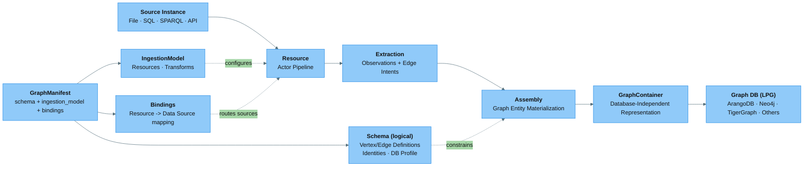
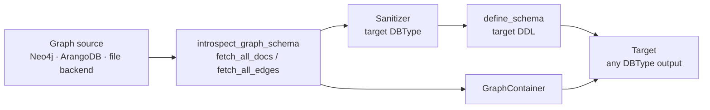
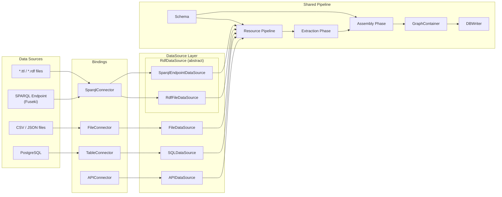

# Concepts

GraFlo is a Graph Schema Transformation Language (GSTL) for Labeled Property Graphs (LPG). As a domain-specific language (DSL), it separates graph schema definition from data-source binding and database targeting, enabling a single declarative specification to drive ingestion across heterogeneous sources and databases while keeping transformation logic portable across vendors.

## System overview

GraFlo supports two complementary paths into a graph database:

1. **Manifest ingestion** — define a `GraphManifest`, bind tabular/RDF/API sources, cast through actor pipelines.
2. **Graph migration** — introspect an existing graph DB (or file backend) and load into any supported target with `GraphEngine.migrate_graph()` — no manifest required.

### Manifest ingestion pipeline

The manifest path transforms data through six stages with a manifest contract boundary:

```mermaid
%%{ init: { 
  "theme": "base",
  "themeVariables": {
    "primaryColor": "#90CAF9",
    "primaryTextColor": "#111111",
    "primaryBorderColor": "#1E88E5",
    "lineColor": "#546E7A",
    "secondaryColor": "#A5D6A7",
    "tertiaryColor": "#CE93D8"
  }
} }%%

flowchart LR
    MF["<b>GraphManifest</b><br/>schema + ingestion_model + bindings"]
    SI["<b>Source Instance</b><br/>File · SQL · SPARQL · API"]
    R["<b>Resource</b><br/>Actor Pipeline"]
    EX["<b>Extraction</b><br/>Observations + Edge Intents"]
    AS["<b>Assembly</b><br/>Graph Entity Materialization"]
    GS["<b>Schema (logical)</b><br/>Vertex/Edge Definitions<br/>Identities · DB Profile"]
    IM["<b>IngestionModel</b><br/>Resources · Transforms"]
    BD["<b>Bindings</b><br/>Resource -> Data Source mapping"]
    GC["<b>GraphContainer</b><br/>Database-Independent Representation"]
    DB["<b>Graph DB (LPG)</b><br/>ArangoDB · Neo4j · TigerGraph · Others"]

    MF --> GS
    MF --> IM
    MF --> BD
    SI --> R --> EX --> AS --> GC --> DB
    IM -. configures .-> R
    GS -. constrains .-> AS
    BD -. routes sources .-> R
```

### Graph migration pipeline

Live graph databases are first-class **sources**. GraFlo introspects schema and data, sanitizes for the target flavor, and writes in one pass:

```mermaid
flowchart LR
    GS["Graph source<br/>Neo4j · ArangoDB · file backend"]
    INT["introspect_graph_schema<br/>fetch_all_docs / fetch_all_edges"]
    SAN["Sanitizer<br/>target DBType"]
    DDL["define_schema<br/>target DDL"]
    GC["GraphContainer"]
    TGT["Target<br/>any DBType output"]

    GS --> INT --> GC
    INT --> SAN --> DDL --> TGT
    GC --> TGT
```

Entry points: **`GraphEngine.migrate_graph()`** (schema + data), **`infer_schema_from_graph()`** (schema only), **`export_graph()`** (in-memory `GraFloOutput`). See [Graph export and migration](operations/graph_export_migration.md) and the [Graph DB migration guide](../guides/graph_db_migration.md).

- **Source Instance** — a concrete data artifact (a file, a table, a SPARQL endpoint), wrapped by an `AbstractDataSource` with a `DataSourceType` (`FILE`, `SQL`, `SPARQL`, `API`, `IN_MEMORY`).
- **Resource** — a reusable transformation pipeline (actor steps: descend, transform, vertex, edge) that maps raw records to graph elements. Data sources bind to Resources by name via the `DataSourceRegistry`.
- **GraphManifest** — the canonical top-level contract that composes `schema`, `ingestion_model`, and `bindings`. High-level **contract evolution** (remove/merge vertex types and keep ingestion aligned) is described in [Manifest evolution](schema/manifest_evolution.md).
- **Schema** — the declarative logical graph model (`Schema`): vertex/edge definitions, identities, typed **`properties`**, and DB profile.
- **IngestionModel** — reusable resources and transforms used to map records into graph entities.
- **Bindings** — named `FileConnector` / `TableConnector` / `SparqlConnector` / **`APIConnector`** list plus `resource_connector` (many rows per resource allowed: resource→0..n connectors) and optional `connector_connection` (connector **name** or **hash**→`conn_proxy` for runtime `ConnectionProvider` resolution without secrets in the manifest). **`APIConnector`** carries REST path, HTTP options, and **`PaginationConfig`** (offset, page, or cursor strategies); see [API connector and pagination](connectors/api_connector.md). **Connector patches** (narrow a SQL **`time_filter`** window, add **`filters`**, …) are **not** part of the stored manifest: load `Bindings`, then apply **`Bindings.apply_connector_update`** / **`replace_connector`** from external config or code before **`GraphEngine`** or registry build; see [Runtime connector updates](connectors/runtime_updates.md) (**`ColumnTimeFilter`** and patch YAML). Optional **`staging_proxy`** maps logical staging profile names to `conn_proxy` keys for **TigerGraph bulk S3 upload** (credentials via `S3GeneralizedConnConfig`, not in YAML). Staging is separate from ingestion connectors; see [Object storage (S3 staging)](operations/object_storage.md). Each connector exposes a **bound source modality** (`BoundSourceKind`: file, SQL table, SPARQL, **API**) for dispatch, distinct from the abstract ingestion **Resource**. See [TigerGraph bulk load](../guides/tigergraph_bulk_load.md).
- **Database-Independent Graph Representation** — a `GraphContainer` of vertices and edges, independent of any target database.
- **Graph DB** — the target LPG store (ArangoDB, Neo4j, TigerGraph, FalkorDB, Memgraph, NebulaGraph).

### Data flow detail

The diagram below shows how different source instances (files, SQL tables, RDF/SPARQL)
flow through the `DataSourceRegistry` into the shared `Resource` pipeline.

```mermaid
flowchart LR
    subgraph sources [Data Sources]
        TTL["*.ttl / *.rdf files"]
        Fuseki["SPARQL Endpoint<br/>(Fuseki)"]
        Files["CSV / JSON files"]
        PG["PostgreSQL"]
    end
    subgraph bindings [Bindings]
        FP[FileConnector]
        TP[TableConnector]
        SP[SparqlConnector]
        AP[APIConnector]
    end
    subgraph datasources [DataSource Layer]
        subgraph rdfFamily ["RdfDataSource (abstract)"]
            RdfDS[RdfFileDataSource]
            SparqlDS[SparqlEndpointDataSource]
        end
        FileDS[FileDataSource]
        SQLDS[SQLDataSource]
        ApiDS[APIDataSource]
    end
    subgraph pipeline [Shared Pipeline]
        Sch[Schema]
        Res[Resource Pipeline]
        Ex[Extraction Phase]
        Asm[Assembly Phase]
        GC[GraphContainer]
        DBW[DBWriter]
    end

    TTL --> SP --> RdfDS --> Res
    Fuseki --> SP --> SparqlDS --> Res
    Files --> FP --> FileDS --> Res
    PG --> TP --> SQLDS --> Res
    AP --> ApiDS --> Res
    Sch --> Res
    Sch --> Asm
    Res --> Ex --> Asm --> GC --> DBW
```

- **Bindings** (`FileConnector`, `TableConnector`, `SparqlConnector`, **`APIConnector`**) describe *where* data comes from (file paths, SQL tables, SPARQL endpoints, REST API paths). Multiple connectors may attach to the same ingestion resource name; optional **`connector_connection`** entries assign each SQL/SPARQL/**API** connector a **`conn_proxy`** by **connector `name` or `hash`** (not by resource name). The `ConnectionProvider` turns that label into real connection config at runtime so manifests stay credential-free. REST pagination is configured on **`APIConnector.pagination`** — see [API connector and pagination](connectors/api_connector.md).
- **DataSources** (`AbstractDataSource` subclasses) handle *how* to read data in batches. Each carries a `DataSourceType` and is registered in the `DataSourceRegistry`.
- **Resources** define *what* to extract — each **`ResourceConfig`** (manifest `ingestion_model.resources`) is a reusable actor pipeline (descend → transform → vertex → edge) executed at cast time by **`ResourceRuntime`**. Optional **`drop_trivial_input_fields`: `true`** removes top-level keys whose value is `null` or `""` **before** actors run (shallow only; `0` and `false` stay). Optional **`fail_fast`: `true`** makes transform steps fail when required input keys are missing; default **`false`** allows partial rename and skips functional transform steps with missing inputs. Optional **`tolerate_transform_errors`: `true`** (default) continues the pipeline when a transform step fails at runtime. **TigerGraph** physical defaults for missing attributes belong in **`schema.db_profile.default_property_values`** (GSQL `DEFAULT` at DDL time), not in the covariant `GraphContainer` assembly path.
- **GraphContainer** (covariant graph representation) collects the resulting vertices and edges in a database-independent format.
- **DBWriter** pushes the graph data into the target LPG store (ArangoDB, Neo4j, TigerGraph, FalkorDB, Memgraph, NebulaGraph).
- **Document cast errors** — when a single source document fails inside a resource, **`IngestionParams.on_doc_error`** chooses skip vs fail-the-batch; optional **gzip JSONL** persistence uses **`doc_error_sink_path`** (CLI **`ingest --doc-error-sink`**). Per-resource **`tolerate_transform_errors`** (default **`true`**) lets a single transform step fail without aborting the rest of the pipeline for that document. Details: [Document cast errors and doc error sink](ingestion/doc_errors.md).

### Minimal canonical config contract

GraFlo serializes configuration models in a minimal canonical form by default:

- fields equal to defaults are omitted;
- `None` values are omitted;
- aliases and normalized DSL shapes are used.

This is intentional for lightweight manifests and LLM-oriented workflows.
The guaranteed invariant is semantic/idempotent canonical round-trip
(`parse -> minimal dump -> parse`), not authored-style text preservation.

## Runtime path

1. **Source instance** — Batches from a `DataSourceType` adapter (`FileDataSource`, `SQLDataSource`, `SparqlEndpointDataSource`, `APIDataSource`, …).
2. **Resource (actors)** — Maps records to graph elements against the logical schema (validated during `IngestionModel.finish_init` / pipeline execution).
3. **`GraphContainer`** — Intermediate, database-agnostic vertex/edge batches.
4. **DB-aware projection** — `Schema.resolve_db_aware()` plus `VertexConfigDBAware` / `EdgeConfigDBAware` for the active `DBType`.
5. **Graph DB** — `DBWriter` + `ConnectionManager` and the backend-specific `Connection` implementation.

| Piece | Role | Code |
|-------|------|------|
| **Logical graph schema** | Manifest `schema`: vertex/edge definitions, identities, typed **properties**, DB profile. Constrains pipeline output and projection; not a separate queue between steps. | `Schema`, `VertexConfig`, `EdgeConfig` (under `core_schema`). |
| **Source instance** | Concrete input: file, SQL table, SPARQL endpoint, API payload, in-memory rows. | `AbstractDataSource` + `DataSourceType`. |
| **Resource** | Ordered actors; resources are looked up by name when sources are registered. | `ResourceConfig` in `IngestionModel`; `ResourceRuntime` at cast time. |
| **Covariant graph** (`GraphContainer`) | Batches of vertices/edges before load. | `GraphContainer`. |
| **DB-aware projection** | Physical names, defaults, indexes for the target. | `Schema.resolve_db_aware()`, `VertexConfigDBAware`, `EdgeConfigDBAware`. |
| **Graph DB** | Target LPG; each `DBType` has its own connector, orchestrated the same way. | `ConnectionManager`, `DBWriter`, per-backend `Connection`. |

## Supported sources and targets

GraFlo distinguishes **manifest sources** (files, SQL, RDF, APIs — require a `GraphManifest`) from **graph sources** (existing LPGs — use `migrate_graph()` directly).

### Manifest sources (`DataSourceType`)

| DataSourceType | Adapter | DataSource | Schema inference |
|---|---|---|---|
| `FILE` — CSV / JSON / JSONL / Parquet | `FileConnector` | `FileDataSource` | manual |
| `SQL` — relational tables | `TableConnector` | `SQLDataSource` | automatic for PostgreSQL-style 3NF (PK/FK heuristics) |
| `SPARQL` — RDF files (`.ttl`, `.rdf`, `.n3`) | `SparqlConnector` | `RdfFileDataSource` | automatic (OWL/RDFS ontology) |
| `SPARQL` — SPARQL endpoints | `SparqlConnector` | `SparqlEndpointDataSource` | automatic (OWL/RDFS ontology) |
| `API` — REST APIs | `APIConnector` | `APIDataSource` | manual |
| `IN_MEMORY` — list / DataFrame | — | `InMemoryDataSource` | manual |

Typical flow: PostgreSQL (or CSV/RDF/API) → manifest → any graph target. See [Example 5](../examples/example-5.md) for SQL inference.

### Graph sources (introspection / export)

| Backend | Introspection API | Notes |
|---|---|---|
| **Neo4j** | `Connection.introspect_graph_schema()` | `supports_graph_export = True` |
| **ArangoDB** | same | `supports_graph_export = True` |
| **GraFlo file backend** | reads `schema.yaml` + gzip JSONL chunks | also a migration **target** |

List in code: `ConnectionManager.graph_export_flavors()`.

Typical flow: Neo4j → ArangoDB (or TigerGraph, PostgreSQL, …) via **`GraphEngine.migrate_graph()`** — no manifest. See [Graph DB migration guide](../guides/graph_db_migration.md).

TigerGraph, FalkorDB, Memgraph, and NebulaGraph are supported **targets** for manifest ingestion and `migrate_graph()` but not yet live graph **sources** (use a file backend as intermediate storage).

### Migration and ingestion targets (`DBType` output)

All supported output backends accept manifest-driven **`ingest()`** and graph-source **`migrate_graph()`**:

| Target | Native LPG | Notes |
|---|---|---|
| ArangoDB, Neo4j, TigerGraph, FalkorDB, Memgraph, NebulaGraph | yes | DB-aware projection via `Sanitizer` |
| **PostgreSQL** | relational graph | vertex tables + junction edge tables |
| **GraFlo file backend** | on-disk chunks | source and target; see [Example 13](../examples/example-13.md) |

Full reference: [Graph export and migration](operations/graph_export_migration.md).

## Core concepts

### Labeled property graphs

GraFlo targets the LPG model:

- **Vertices** — nodes with typed **properties** and logical **identity** keys for upserts. Identity fallback from all properties is opt-in via `VertexConfig.identity_from_all_properties` (disabled by default). See [Vertex identity modes](schema/vertex_identity.md).
- **Edges** — relationships between vertices (`directed: true` by default); relationship attributes are declared as **`properties`** on the logical edge. TigerGraph can project undirected edges or pair directed edges via **`db_profile.edge_specs[*].reverse_edge`**.

### Schema and ingestion

The `Schema` is the single source of truth for **graph structure** (not for ingestion transforms). **Secondary indexes** and physical naming live under **`schema.db_profile`** — see [Backend indexes](schema/backend_indexes.md). Resources and transforms are part of `IngestionModel`, not `Schema`.

`GraphEngine` orchestrates schema/manifest inference, schema definition, connector creation, and data ingestion. For PostgreSQL workflows, `infer_manifest(...)` returns a full manifest contract and runs target-`DBType` **`Sanitizer`** before returning.

## Topic index

### Architecture

| Page | Description |
|------|-------------|
| [Diagrams](architecture/diagrams.md) | Class-level Mermaid views of `GraphEngine`, `Schema` / `IngestionModel`, `Caster` |
| [Core components](architecture/core_components.md) | Schema, ingestion, edges, DataSources, resources, actors, transforms |
| [Capabilities](architecture/capabilities.md) | Product feature overview |

### Schema and manifest

| Page | Description |
|------|-------------|
| [Vertex identity](schema/vertex_identity.md) | Natural, hash, and blank identity modes |
| [Backend indexes](schema/backend_indexes.md) | DB-specific secondary index behavior |
| [Manifest evolution](schema/manifest_evolution.md) | Contract evolution ops (`RemoveVertexOp`, `AddInverseEdgesOp`, …) |
| [GraFlo ontology](schema/ontology.md) | Manifest ↔ RDF meta-model |

### Ingestion

| Page | Description |
|------|-------------|
| [Transforms](ingestion/transforms.md) | Named transforms and pipeline steps |
| [Document cast errors](ingestion/doc_errors.md) | Per-document error policy and doc error sink |

### Connectors

| Page | Description |
|------|-------------|
| [Table views and SelectSpec](connectors/table_views.md) | SQL `filters`, `view.where`, logical operators |
| [API connector](connectors/api_connector.md) | REST pagination, auth via `conn_proxy` |
| [Runtime connector updates](connectors/runtime_updates.md) | Patches, `time_filter`, pushdown `filters` |

### Operations

| Page | Description |
|------|-------------|
| [Graph export and migration](operations/graph_export_migration.md) | Graph sources, `migrate_graph`, file backend, graph→PostgreSQL |
| [Object storage](operations/object_storage.md) | S3 staging for TigerGraph bulk load |
| [Migration and practices](operations/migration_and_practices.md) | `migrate_schema` CLI, performance, best practices |

## More capabilities

- **GraFlo ontology (manifest RDF)** — OWL vocabulary at `https://ontology.growgraph.dev/graflo`, plus `manifest-to-rdf` / `rdf-to-manifest` CLI. See [GraFlo ontology](schema/ontology.md).
- **SPARQL and RDF** — Endpoints and RDF files; optional OWL/RDFS domain schema inference.
- **Schema inference** — From PostgreSQL 3NF or OWL/RDFS. See [Example 5](../examples/example-5.md).
- **Graph export and migration** — See [Graph export and migration](operations/graph_export_migration.md) and [Example 13](../examples/example-13.md).
- **Schema migrations** — Plan and apply guarded schema deltas via `migrate_schema`. See [Migration and practices](operations/migration_and_practices.md#schema-migration).
- **Typed properties**, **batching and concurrency**, **ingestion scope filters**, **SelectSpec**, and **blank vertices** — see [Capabilities](architecture/capabilities.md).
