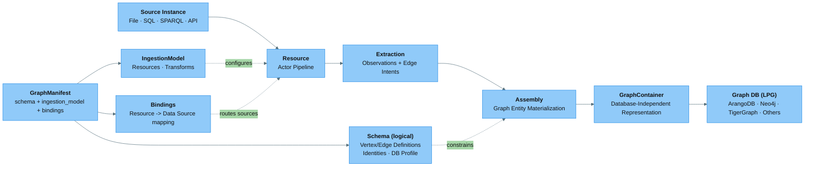
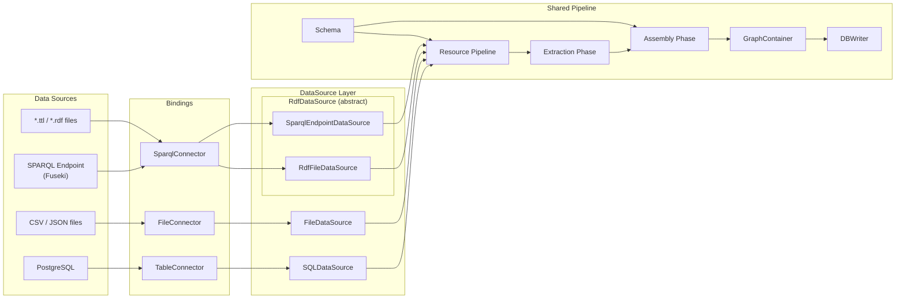

# Concepts

GraFlo is a Graph Schema Transformation Language (GSTL) for Labeled Property Graphs (LPG). As a domain-specific language (DSL), it separates graph schema definition from data-source binding and database targeting, enabling a single declarative specification to drive ingestion across heterogeneous sources and databases while keeping transformation logic portable across vendors.

## System Overview

The GraFlo pipeline transforms data through six stages with a manifest contract boundary:

```mermaid
%%{ init: { 
  "theme": "base",
  "themeVariables": {
    "primaryColor": "#90CAF9",
    "primaryTextColor": "#111111",
    "primaryBorderColor": "#1E88E5",
    "lineColor": "#546E7A",
    "secondaryColor": "#A5D6A7",
    "tertiaryColor": "#CE93D8"
  }
} }%%

flowchart LR
    MF["<b>GraphManifest</b><br/>schema + ingestion_model + bindings"]
    SI["<b>Source Instance</b><br/>File · SQL · SPARQL · API"]
    R["<b>Resource</b><br/>Actor Pipeline"]
    EX["<b>Extraction</b><br/>Observations + Edge Intents"]
    AS["<b>Assembly</b><br/>Graph Entity Materialization"]
    GS["<b>Schema (logical)</b><br/>Vertex/Edge Definitions<br/>Identities · DB Profile"]
    IM["<b>IngestionModel</b><br/>Resources · Transforms"]
    BD["<b>Bindings</b><br/>Resource -> Data Source mapping"]
    GC["<b>GraphContainer</b><br/>Database-Independent Representation"]
    DB["<b>Graph DB (LPG)</b><br/>ArangoDB · Neo4j · TigerGraph · Others"]

    MF --> GS
    MF --> IM
    MF --> BD
    SI --> R --> EX --> AS --> GC --> DB
    IM -. configures .-> R
    GS -. constrains .-> AS
    BD -. routes sources .-> R
```

- **Source Instance** — a concrete data artifact (a file, a table, a SPARQL endpoint), wrapped by an `AbstractDataSource` with a `DataSourceType` (`FILE`, `SQL`, `SPARQL`, `API`, `IN_MEMORY`).
- **Resource** — a reusable transformation pipeline (actor steps: descend, transform, vertex, edge) that maps raw records to graph elements. Data sources bind to Resources by name via the `DataSourceRegistry`.
- **GraphManifest** — the canonical top-level contract that composes `schema`, `ingestion_model`, and `bindings`. High-level **contract evolution** (remove/merge vertex types and keep ingestion aligned) is described in [Manifest evolution](manifest_evolution.md).
- **Schema** — the declarative logical graph model (`Schema`): vertex/edge definitions, identities, typed **`properties`**, and DB profile.
- **IngestionModel** — reusable resources and transforms used to map records into graph entities.
- **Bindings** — named `FileConnector` / `TableConnector` / `SparqlConnector` list plus `resource_connector` (many rows per resource allowed: resource→0..n connectors) and optional `connector_connection` (connector **name** or **hash**→`conn_proxy` for runtime `ConnectionProvider` resolution without secrets in the manifest). **Connector patches** (narrow a SQL **`time_filter`** window, add **`filters`**, …) are **not** part of the stored manifest: load `Bindings`, then apply **`Bindings.apply_connector_update`** / **`replace_connector`** from external config or code before **`GraphEngine`** or registry build; see [Runtime connector updates](runtime_connector_updates.md) (**`ColumnTimeFilter`** and patch YAML). Optional **`staging_proxy`** maps logical staging profile names to `conn_proxy` keys for **TigerGraph bulk S3 upload** (credentials via `S3GeneralizedConnConfig`, not in YAML). Staging is separate from ingestion connectors; see [Object storage (S3 staging)](object_storage.md). Each connector exposes a **bound source modality** (`BoundSourceKind`: file, SQL table, SPARQL) for dispatch, distinct from the abstract ingestion **Resource**. See [TigerGraph bulk load](../guides/tigergraph_bulk_load.md).
- **Database-Independent Graph Representation** — a `GraphContainer` of vertices and edges, independent of any target database.
- **Graph DB** — the target LPG store (ArangoDB, Neo4j, TigerGraph, FalkorDB, Memgraph, NebulaGraph).

### Data flow detail

The diagram below shows how different source instances (files, SQL tables, RDF/SPARQL)
flow through the `DataSourceRegistry` into the shared `Resource` pipeline.

```mermaid
flowchart LR
    subgraph sources [Data Sources]
        TTL["*.ttl / *.rdf files"]
        Fuseki["SPARQL Endpoint<br/>(Fuseki)"]
        Files["CSV / JSON files"]
        PG["PostgreSQL"]
    end
    subgraph bindings [Bindings]
        FP[FileConnector]
        TP[TableConnector]
        SP[SparqlConnector]
    end
    subgraph datasources [DataSource Layer]
        subgraph rdfFamily ["RdfDataSource (abstract)"]
            RdfDS[RdfFileDataSource]
            SparqlDS[SparqlEndpointDataSource]
        end
        FileDS[FileDataSource]
        SQLDS[SQLDataSource]
    end
    subgraph pipeline [Shared Pipeline]
        Sch[Schema]
        Res[Resource Pipeline]
        Ex[Extraction Phase]
        Asm[Assembly Phase]
        GC[GraphContainer]
        DBW[DBWriter]
    end

    TTL --> SP --> RdfDS --> Res
    Fuseki --> SP --> SparqlDS --> Res
    Files --> FP --> FileDS --> Res
    PG --> TP --> SQLDS --> Res
    Sch --> Res
    Sch --> Asm
    Res --> Ex --> Asm --> GC --> DBW
```

- **Bindings** (`FileConnector`, `TableConnector`, `SparqlConnector`) describe *where* data comes from (file paths, SQL tables, SPARQL endpoints). Multiple connectors may attach to the same ingestion resource name; optional **`connector_connection`** entries assign each SQL/SPARQL connector a **`conn_proxy`** by **connector `name` or `hash`** (not by resource name). The `ConnectionProvider` turns that label into real connection config at runtime so manifests stay credential-free.
- **DataSources** (`AbstractDataSource` subclasses) handle *how* to read data in batches. Each carries a `DataSourceType` and is registered in the `DataSourceRegistry`.
- **Resources** define *what* to extract — each **`ResourceConfig`** (manifest `ingestion_model.resources`) is a reusable actor pipeline (descend → transform → vertex → edge) executed at cast time by **`ResourceRuntime`**. Optional **`drop_trivial_input_fields`: `true`** removes top-level keys whose value is `null` or `""` **before** actors run (shallow only; `0` and `false` stay). Optional **`fail_fast`: `true`** makes transform steps fail when required input keys are missing; default **`false`** allows partial rename and skips functional transform steps with missing inputs. Optional **`tolerate_transform_errors`: `true`** (default) continues the pipeline when a transform step fails at runtime. **TigerGraph** physical defaults for missing attributes belong in **`schema.db_profile.default_property_values`** (GSQL `DEFAULT` at DDL time), not in the covariant `GraphContainer` assembly path.
- **GraphContainer** (covariant graph representation) collects the resulting vertices and edges in a database-independent format.
- **DBWriter** pushes the graph data into the target LPG store (ArangoDB, Neo4j, TigerGraph, FalkorDB, Memgraph, NebulaGraph).
- **Document cast errors** — when a single source document fails inside a resource, **`IngestionParams.on_doc_error`** chooses skip vs fail-the-batch; optional **gzip JSONL** persistence uses **`doc_error_sink_path`** (CLI **`ingest --doc-error-sink`**). Per-resource **`tolerate_transform_errors`** (default **`true`**) lets a single transform step fail without aborting the rest of the pipeline for that document. Details: [Document cast errors and doc error sink](ingestion_doc_errors.md).

### Minimal canonical config contract

GraFlo serializes configuration models in a minimal canonical form by default:

- fields equal to defaults are omitted;
- `None` values are omitted;
- aliases and normalized DSL shapes are used.

This is intentional for lightweight manifests and LLM-oriented workflows.
The guaranteed invariant is semantic/idempotent canonical round-trip
(`parse -> minimal dump -> parse`), not authored-style text preservation.

## In depth

The overview above is continued in dedicated pages (formerly a single long document):

- [Architecture diagrams](architecture_diagrams.md) — class-level Mermaid views of `GraphEngine`, `Schema` / `IngestionModel`, `Caster`, and DataSources vs Resources
- [Core components](core_components.md) — schema, ingestion, edges, DataSources, resources, actors, location scoping, transforms
- [Features, migration, and practices](features_and_practices.md) — product features, `migrate_schema` CLI, performance notes, best practices

Focused topics: [Transforms](transforms.md), [Table connector views](table_connector_views.md), [Runtime connector updates](runtime_connector_updates.md) (patches, **`time_filter`** / **`ColumnTimeFilter`**), [Backend indexes](backend_indexes.md), [Ingestion doc errors](ingestion_doc_errors.md), [Object storage (S3 staging)](object_storage.md), [Manifest evolution](manifest_evolution.md).
