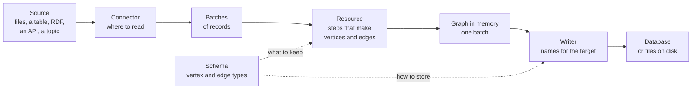

# Concepts overview

GraFlo loads records from files, SQL tables, RDF data, REST APIs and Kafka
topics into a labeled property graph. You describe the graph, and how each
kind of record maps onto it, once in a manifest written in GSTL, the Graph
Schema & Transformation Language; the same manifest then loads any of eight
targets. This page is the map of the concept pages: it follows a record from
its source to the database, lists what GraFlo reads and writes, and says which
page answers which question. Terms are defined in the
[glossary](glossary.md).

## The manifest

A manifest is one YAML file (or one `GraphManifest` object in Python) with
three blocks. Each block answers one question, and a task may leave out the
blocks it does not need.

| Block | Question it answers | Class |
|---|---|---|
| `schema` | What does the graph look like? Vertex types, their properties and identity, edge types, and the names and indexes the target database uses. | `Schema` |
| `ingestion_model` | How does one kind of record become vertices and edges? One resource per kind of record, plus reusable transforms. | `IngestionModel` |
| `bindings` | Where do the records come from? One connector per file pattern, table, endpoint or topic, wired to a resource by name. | `Bindings` |

A complete manifest for one CSV file of machines:

```yaml
schema:
  metadata:
    name: plant
  graph:
    vertex_config:
      vertices:
        - name: machine
          properties: [serial, model]
          identity: [serial]
    edge_config:
      edges: []
ingestion_model:
  resources:
    - name: machines
      pipeline:
        - vertex: machine
bindings:
  connectors:
    - regex: "^machines\\.csv$"
      sub_path: data
      resource_name: machines
```

The manifest names no database and holds no credentials. You choose the
target when you run it, and a source that needs credentials is named by a
label (`conn_proxy`) that a connection provider resolves at run time. One
manifest therefore serves every environment. The
[creating a manifest](../getting_started/creating_manifest.md) guide explains
the three blocks step by step, and
[core components](architecture/core_components.md) lists every key of the
`schema` and `ingestion_model` blocks.

## From a source to the database

A record takes the same path whatever its source and whatever the target.


```mermaid
flowchart LR
    SRC["Source<br/>files, a table, RDF,<br/>an API, a topic"]
    CON["Connector<br/>where to read"]
    BAT["Batches<br/>of records"]
    RES["Resource<br/>steps that make<br/>vertices and edges"]
    GC["Graph in memory<br/>one batch"]
    WR["Writer<br/>names for the target"]
    DB["Database<br/>or files on disk"]
    SCH["Schema<br/>vertex and edge types"]
    SRC --> CON --> BAT --> RES --> GC --> WR --> DB
    SCH -. what to keep .-> RES
    SCH -. how to store .-> WR
```

- **Source**: where the records live: a directory of files, a SQL table, an
  RDF file or SPARQL endpoint, a REST endpoint, a Kafka topic.
- **Connector**: an entry in `bindings` that says which source feeds which
  [resource](glossary.md#resource).
- **Batches**: GraFlo reads each source in batches (`batch_size`, 10,000
  records by default). Batch size, parallelism and error handling are
  [ingestion parameters](glossary.md#ingestion-parameters) of a run, not part
  of the manifest.
- **Resource**: the recipe for one kind of record. Its steps run on every
  record: a `transform` step renames or computes fields, a `vertex` step makes
  a vertex, an `edge` step connects two vertices, a `descend` step goes into a
  nested part of a JSON record, and a `vertex_router` step reads the vertex
  type from a field.
- **Graph in memory**: the vertices and edges of one batch, independent of any
  database. The class is `GraphContainer`.
- **Writer**: writes the vertices, one per identity, so records that share an
  identity become one vertex, and then the edges. Some databases refuse some names (a
  reserved word, a hyphen); the writer uses the stored names recorded in
  `schema.db_profile`, so the names in the manifest never change.
- **Database**: one of the eight targets below.
- **Schema**: a vertex step keeps only the properties its vertex type
  declares, and by default the vertices of one record are connected by the
  edges the schema declares between their types. A vertex type without an
  `identity` is identified by all of its properties
  (`identity_from_all_properties`, on by default).

## What GraFlo reads

Each row is one kind of connector in `bindings`. A connector feeds a resource
by name, so the same resource can read a file today and a table tomorrow.

| Connector | Reads | Manifest inferred from the source | Page |
|---|---|---|---|
| `FileConnector` | CSV, JSON, JSON Lines and Parquet files whose names match a regex under a directory | no | [Ingest CSV files](../examples/csv-two-resources/index.md) (1) |
| `TableConnector` | one SQL table, optionally filtered or joined into a view | yes, from primary and foreign keys | [Table filters and views](connectors/table_views.md) |
| `SparqlConnector` | the instances of one RDF class, from an RDF file (Turtle, RDF/XML, N-Triples, N3, JSON-LD and others) or a SPARQL endpoint | yes, from an OWL or RDFS ontology | [A graph from an ontology and RDF data](../examples/infer-from-rdf/index.md) (10) |
| `APIConnector` | a REST endpoint, with offset, page or cursor pagination | no | [API connector](connectors/api_connector.md) |
| `KafkaConnector` | JSON messages from one or more Kafka topics, read as a finite batch | no | [Kafka connector](connectors/kafka_connector.md) |

From Python you can also pass records that are already in memory, a list of
dicts or a DataFrame, through an in-memory data source instead of a
connector. Where the manifest can be inferred,
GraFlo writes a draft for you to edit. From a SQL database, entity tables
become vertex types, and link tables (two foreign keys) and the foreign keys of
entity tables become edges; see
[inferring a graph from a SQL database](../guides/sql_schema_inference.md).
From an ontology, each `owl:Class` becomes a vertex type, each
`owl:ObjectProperty` an edge type and each `owl:DatatypeProperty` a property;
see the [RDF example](../examples/infer-from-rdf/index.md) (10). For any source,
a sample of its records lets GraFlo propose identities; see
[sampling and profiling](schema/sampling_and_profiling.md).

## What GraFlo writes

Every target accepts a manifest ingest and can receive a whole graph moved
from another database. The file backend keeps a graph on disk as chunked,
compressed JSON Lines files plus the schema, which is useful for exports and
for moving a graph between databases.

| Target | Stores vertex and edge types as | Can be read back whole |
|---|---|---|
| ArangoDB | document and edge collections | yes |
| Neo4j | labels and relationship types | yes |
| Memgraph | labels and relationship types | no |
| FalkorDB | labels and relationship types | no |
| TigerGraph | vertex and edge types, with native undirected edges and reverse edges | no |
| NebulaGraph | tags and edge types | no |
| PostgreSQL | one table per vertex type and one table per edge type | yes |
| GraFlo file backend | chunked files on disk | yes |

A target that can be read back whole is a graph source:
`GraphEngine.export_graph()` returns its graph in memory, and
`GraphEngine.migrate_graph()` moves it into any target without a manifest.
`ConnectionManager.graph_export_flavors()` lists the graph sources in code.
GraFlo can read the schema of all eight targets. Keep a copy in the file
backend of a graph you may need to move out of a target that cannot be read
back. See [graph export and migration](operations/graph_export_migration.md).

Properties may carry a type: `INT`, `UINT`, `FLOAT`, `DOUBLE`, `BOOL`,
`STRING`, `DATETIME`, `UUID`, and `LIST` of one of those. Types are optional
on every target; TigerGraph and NebulaGraph use them when they create the
schema. See [supported field types](architecture/core_components.md#supported-field-types).

## Concept pages

The pages are grouped as in the navigation. The [glossary](glossary.md) gives
each term one short definition and links to the page that explains it.

### Architecture

| Page | Question it answers |
|---|---|
| [Diagrams](architecture/diagrams.md) | Which Python objects take part in an ingest, and which owns what? |
| [Core components](architecture/core_components.md) | Which keys do I write for vertices, edges, resources and their steps, and what does each do? |

### Schema and manifest

| Page | Question it answers |
|---|---|
| [Sampling and profiling](schema/sampling_and_profiling.md) | What does GraFlo look at in my sources before it proposes a schema or an identity? |
| [Vertex identity](schema/vertex_identity.md) | How does GraFlo decide that two records are the same vertex, and what if a record has no key? |
| [Cross-resource identity discovery](schema/cross_resource_identity.md) | How do I find which columns in two systems identify the same thing? |
| [Cards](schema/cards.md) | How do I summarize a manifest for a person or a language model at a fixed cost? |
| [Backend indexes](schema/backend_indexes.md) | Which indexes does each database get, and how do I add more? |
| [Manifest evolution](schema/manifest_evolution.md) | How do I change a manifest as a list of operations I can review, replay and undo? |
| [Merging manifests](schema/merging_manifests.md) | How do I combine two manifests that model the same things under different names? |
| [Version control](schema/versioning.md) | How do I commit, go back to and three-way merge versions of a manifest? |
| [Live schema drift](schema/live_drift.md) | How do I find what a database holds that its schema does not declare? |
| [Conformance profiles](schema/world_model_profile.md) | What must a manifest declare to pass the `world-model` profile, and how do I waive a rule? |
| [GraFlo ontology](schema/ontology.md) | How does a manifest turn into RDF and back, and which vocabulary does it use? |

### Ingestion

| Page | Question it answers |
|---|---|
| [Transforms](ingestion/transforms.md) | How do I rename, convert and reshape fields before they become vertices and edges? |
| [Parallelism](ingestion/parallelism.md) | Which setting speeds up an ingest, and when does GraFlo run serially on purpose? |
| [Document cast errors](ingestion/doc_errors.md) | What happens when one record fails, and where do I find the failures afterwards? |

### Connectors

| Page | Question it answers |
|---|---|
| [Table filters and views](connectors/table_views.md) | How do I filter or join SQL tables inside a connector? |
| [API connector](connectors/api_connector.md) | How do I read a paginated REST endpoint, and where do the credentials go? |
| [Kafka connector](connectors/kafka_connector.md) | How do I read a topic as a finite batch, and when does the read stop? |
| [Runtime connector updates](connectors/runtime_updates.md) | How do I narrow a connector to a time window or a filter at run time without editing the manifest? |

### Operations

| Page | Question it answers |
|---|---|
| [Graph export and migration](operations/graph_export_migration.md) | How do I copy a whole graph out of a database, onto disk or into another database? |
| [Object storage](operations/object_storage.md) | How do I stage files in S3 for a TigerGraph bulk load? |
| [Schema migration](operations/migration_and_practices.md) | How do I apply a changed schema to a database that already holds data? |

## What to read next

- [Creating a manifest](../getting_started/creating_manifest.md): the three
  blocks of a manifest, one level deeper than the quick start.
- [Core components](architecture/core_components.md): the reference for every
  key you write in `schema` and `ingestion_model`.
- [Ingest CSV files](../examples/csv-two-resources/index.md): the first
  example, end to end.
