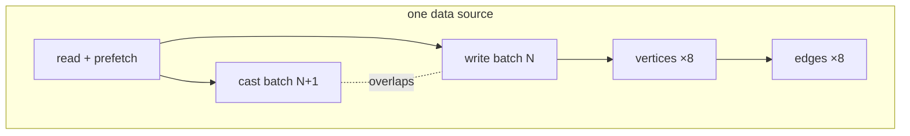

# Parallelism

How an ingest run uses your cores and your database connections, which knob to turn for which bottleneck, and when graflo deliberately runs serially.

## What runs concurrently

An ingest run overlaps work at four independent levels, each with its own **`IngestionParams`** knob. All defaults are already parallel — a plain `engine.ingest(...)` pipelines batches and fans out writes without any configuration.

| Knob | What runs concurrently | Default |
|------|------------------------|---------|
| **`max_in_flight_batches`** | Batches of one data source: casting batch N+1 overlaps writing batch N | `2` |
| **`max_concurrent_sources`** | Data sources of one **resource** (file connectors expand to one source per file, so these are independent shards of the same stream) | `min(4, sources)` |
| **`n_cores`** (+ **`cast_executor`**) | CPU-bound casting, spread over worker processes | `1` (in-process) |
| **`max_concurrent_db_ops`** | Vertex collections and edge types of one batch, written to the database concurrently | `8` |

**`batch_prefetch`** (default `2`) is a different thing: it controls how far the *reader* runs ahead of processing (bounded memory, overlapped source I/O), while `max_in_flight_batches` controls how many batches are being *cast and written* at once.

**Resources never overlap.** They run strictly in declaration order, with a barrier in between, because a later resource may depend on database state written by an earlier one — edges over another resource's vertices, secondary-identity endpoint resolution, `extra_weights` lookups. Parallelism happens *inside* a resource, never across resources.

## Which knob to turn

1. **Start with the defaults.** Cast/write overlap and write fan-out are already on; for I/O-dominated runs there is often nothing to tune.
2. **Many input files?** Sources of a resource already fan out four at a time; raise **`max_concurrent_sources`** if the files are small and numerous.
3. **Heavy per-document work** (chained transforms, deep `descend` trees)? Set **`n_cores=4..8`** and leave `cast_executor="auto"` — large batches move to worker processes automatically, measured at ~2.5–3× end-to-end on transform-heavy resources. Keep `batch_size` comfortably above `n_cores × 64`, since small batches stay in-process on purpose.
4. **Slow database?** Raise **`max_concurrent_db_ops`** — writes are I/O-bound, which is where concurrency pays most.
5. **Debugging or reproducing an issue?** `IngestionParams(max_in_flight_batches=1, n_cores=1, max_concurrent_sources=1)` gives a fully serial, deterministic run.

Only `--batch-size` and `--n-cores` are exposed on the `graflo ingest` CLI; the remaining knobs are Python-API only.

## When graflo runs serially on purpose

Some configurations make batch or document order semantically meaningful. graflo detects them and serializes that resource automatically — batches, and sources too — logging the reason at INFO. **You do not need to configure anything**; the knobs above simply have no effect for that resource.

| Configuration | Why order matters |
|---------------|-------------------|
| **`dynamic_edges`** | Casting a document may register a new edge type that changes how later documents are inferred (see below) |
| Blank vertices (`blank: true`) in the resource | Blank-edge resolution pairs source and target docs positionally within a batch |
| **`extra_weights`** on the resource | Weight enrichment reads the database between the vertex and edge writes of each batch |
| Secondary-identity edge endpoints (`match_source` / `match_target`) | Endpoints are resolved against database state, so a later batch's edges must not race an earlier batch's vertex writes |
| Native bulk load (e.g. TigerGraph) | Batches append to a single ordered bulk session |
| GraFlo file backend target | The chunked-file backend supports one writer at a time |

Within each batch, database writes (`max_concurrent_db_ops`) and batch prefetch stay concurrent even for these resources.

## `dynamic_edges`: discovery is sequential by design

With **`IngestionParams(dynamic_edges=True)`**, edges the schema does not declare are discovered *from the data* while casting. That is a feedback loop: document 500 may register an edge type that changes what document 501 infers. Running documents out of order would silently change the result, so graflo keeps the whole resource sequential — `cast_executor` and `n_cores` are effectively ignored, and batches and sources process one at a time. This is automatic; there is nothing to set and nothing to work around.

If ingest throughput matters, treat `dynamic_edges` as a **discovery pass, not a production mode**:

1. Run with `dynamic_edges=True` over a representative sample (`max_items` caps the volume).
2. Add the discovered edges to `schema.edge_config` — they are ordinary declared edges from then on.
3. Re-ingest the full dataset with `dynamic_edges=False`, which restores every level of parallelism.

!!! note "Cypher backends serialize same-collection writes internally"
    Neo4j, Memgraph, and FalkorDB upsert via `MERGE`, which is not atomic across concurrent transactions — two writers merging the same key could both create it. graflo therefore writes each collection through one connection at a time on those backends (distinct collections still write in parallel). PostgreSQL, ArangoDB, TigerGraph, and NebulaGraph accept fully concurrent writes.

See also: **[Document cast errors](doc_errors.md)** for the failure-handling knobs (`on_doc_error`, `max_doc_errors`), and the **[`IngestionParams` reference](../../reference/hq/ingestion_parameters.md)** for every field.
