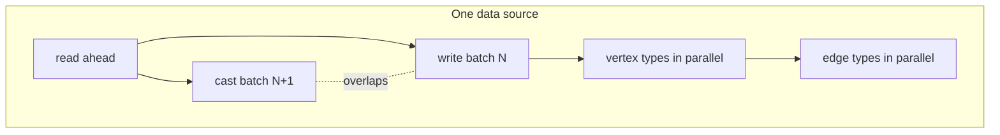

# Parallelism

An ingest overlaps reading, [casting](../glossary.md#casting) and writing out
of the box, and a few settings let it use more cores or more database
connections. This page is for anyone whose ingest is slower than they expect.
After reading it you know which setting helps with which bottleneck, and why
some resources run serially whatever you set.

## What runs at the same time

An ingest works at four levels, each with its own setting in
`IngestionParams`. The defaults already run in parallel: a plain
`engine.ingest(...)` overlaps the casting and writing of batches and writes
several vertex and edge types at once.

| Setting | What runs at the same time | Default |
|---|---|---|
| `max_in_flight_batches` | Batches of one data source: casting batch N+1 overlaps writing batch N | `2` |
| `max_concurrent_sources` | Data sources of one resource; a file connector gives one data source per file | `min(4, number of sources)` |
| `n_cores` with `cast_executor` | Casting, spread over worker processes | `1` (in the main process) |
| `max_concurrent_db_ops` | Database writes, counted over all batches in flight; a batch writes its vertex types, then its edge types | `8` |

`batch_prefetch` (default `2`) is a separate setting: it says how many batches
the reader fetches ahead of processing, which keeps source reads overlapped
while bounding memory. `max_in_flight_batches` says how many batches are cast
and written at once.

Resources never overlap. They run in the order the manifest declares them,
and each one finishes before the next starts, because a later resource may
depend on what an earlier one wrote: edges to another resource's vertices,
endpoints found by a secondary identity, `extra_weights` read from the
database. Parallelism happens inside a resource.


```mermaid
flowchart LR
    subgraph source["One data source"]
        direction LR
        R[read ahead] --> C[cast batch N+1]
        R --> W[write batch N]
        C -. overlaps .- W
        W --> V[vertex types in parallel] --> E[edge types in parallel]
    end
```

## Which setting to change

1. **Start with the defaults.** Overlap of casting and writing and parallel
   writes are on; when most of the time goes to the database or the network,
   there is often nothing to change.
2. **Many input files.** The files of one resource are read four at a time.
   Raise `max_concurrent_sources` when the files are small and numerous.
3. **Heavy work per record** (chained transforms, deep `descend` steps). Set
   `n_cores` to the number of cores to use and leave `cast_executor="auto"`:
   batches then go to worker processes. A batch smaller than
   `64 × n_cores` records stays in the main process, because sending it to
   workers costs more than it saves, so keep `batch_size` well above that.
   `n_cores` is capped at the number of CPUs of the machine.
4. **Slow database.** Raise `max_concurrent_db_ops`. Writes wait on the
   database, which is where more concurrency pays most.
5. **Reproducing a problem.**
   `IngestionParams(max_in_flight_batches=1, n_cores=1, max_concurrent_sources=1)`
   gives a fully serial run in a fixed order.

```python
from graflo.hq import IngestionParams

params = IngestionParams(
    batch_size=20_000,
    n_cores=8,
    max_concurrent_db_ops=16,
)
engine.ingest(manifest=manifest, target_db_config=conn_conf, ingestion_params=params)
```

`cast_executor` takes `auto` (the default), `inline` (always in the main
process), `process` (always in worker processes) or `thread`, which is kept
for compatibility and rarely helps. A resource with an edge step that takes an
endpoint from a role (`source_role`, `target_role`) is cast in the main
process whatever you set: such a step adds edge types while it casts, and a
worker process would keep them to itself. The `graflo ingest` command sets
`--batch-size` and `--n-cores`; the other settings are available from Python
only.

## When GraFlo runs serially on purpose

In some configurations the order of batches changes the result. GraFlo
detects them, processes that resource's batches and data sources one at a
time, and logs the reason at `INFO`. You do not need to set anything; the
settings above have no effect on that resource.

| Configuration | Why order matters |
|---|---|
| `IngestionParams(dynamic_edges=True)` | Casting a record may add an edge type that changes how later records are cast (see below) |
| Blank vertices (`blank: true`) produced by the resource | Edges to blank vertices are matched to them by position within a batch |
| `extra_weights` on the resource | Edge properties are read from the database between the vertex and edge writes of each batch |
| Edge steps with `source_match` or `target_match` | Endpoints are found in the database, so a later batch's edges must not overtake an earlier batch's vertices |
| A target with native bulk load enabled (TigerGraph) | Batches are appended to one ordered bulk load |
| The GraFlo file backend as target | The file backend accepts one writer at a time |

Within each batch, the database writes (`max_concurrent_db_ops`) and the read
ahead (`batch_prefetch`) stay concurrent even for these resources.

## `dynamic_edges` discovers edges in order

With `IngestionParams(dynamic_edges=True)`, GraFlo adds edge types that the
schema does not declare as it finds them in the data, and writes their edges.
The types are recorded in the process that casts the records, so GraFlo casts
the whole resource in the main process: `cast_executor` and `n_cores` have no
effect, and batches and data sources run one at a time. A type one record
adds is not inferred for other records; each record gets the edges its own
steps name, plus those inferred from the declared ones.

When throughput matters, use `dynamic_edges` to discover edges, not to load:

1. Run with `dynamic_edges=True` over a representative sample; `max_items`
   caps the number of records read from each data source.
2. Declare the edge types that run wrote in `schema.graph.edge_config`. From
   then on they are ordinary declared edges.
3. Load the full data with `dynamic_edges=False`, which restores every level
   of parallelism.

!!! note "Neo4j, Memgraph and FalkorDB write one collection at a time"
    These databases upsert with `MERGE`, which is not atomic across
    concurrent transactions: two writers merging the same key could both
    create it. GraFlo therefore writes each vertex type and each relation
    through one connection at a time on those databases, while different
    types still write in parallel. PostgreSQL, ArangoDB, TigerGraph and
    NebulaGraph accept fully concurrent writes.

## What to read next

- [Document cast errors](doc_errors.md): the settings for records that fail
  (`on_doc_error`, `max_doc_errors`).
- [`IngestionParams` reference](../../reference/hq/ingestion_parameters.md):
  every field of an ingest run.
- [Architecture diagrams](../architecture/diagrams.md): the classes that run
  an ingest.
