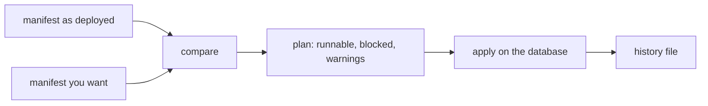

# Schema migration

Your graph is loaded and in use, and the manifest has changed: a new vertex
type, a new property, an edge that was not there before. Before you touch the
database, you want to know what the change means for the data already stored.
GraFlo compares the manifest the database was built from with the one you
want and turns the difference into a plan of operations, each with a risk
level. This page explains what is compared, what a plan contains, how risk is
reported, and how far a plan can be applied.

This page is about a database that already holds data. To combine or rewrite
manifests themselves, read [Evolving a manifest](../../guides/evolving_a_manifest.md).
To move a whole graph to another database, read
[Graph DB migration](../../guides/graph_db_migration.md).

## The idea

A migration plan compares two manifests: the one the database was built from
and the one you want. The difference becomes an ordered list of operations.
Each operation carries a risk level. Operations that only add things leave
every stored record valid, so they are runnable. Everything else is reported
and blocked, because removing a property or changing what identifies a vertex
needs a decision you make, not one the tool makes for you.



## What is compared

Both files are manifests; only their `schema` blocks are compared. The
comparison covers:

- vertex types: added or removed;
- vertex properties: added, removed, or changed type (for a list, a change of
  item type counts);
- vertex identity: the `identity` list or the way the key is computed; a
  rekey operation is added when stored keys can no longer be derived from the
  new identity;
- secondary identities of a vertex;
- edge types: added or removed; edge identities changed;
- edge properties: added, removed, or changed type;
- indexes declared in `db_profile`, for vertices and edges: added or removed.

The rest of the manifest (resources, transforms, bindings) is not compared: it
changes how data is loaded, not what the database holds.

## What a plan contains

```bash
graflo migrate-schema plan \
  --from-schema-path manifest_deployed.yaml \
  --to-schema-path manifest_next.yaml
```

Adding a `work_order` vertex type, an edge from it to `machine` and one
property of `machine` gives:

```text
Migration Plan
================
Operations: 3
Blocked: 0

Runnable operations:
- ADD_VERTEX vertex:work_order [LOW]
- ADD_EDGE edge:('work_order', 'machine', 'services') [LOW]
- ADD_VERTEX_FIELD vertex:machine:field:installed_at [LOW]
```

Changing the identity of `machine` from `serial` to `model` gives:

```text
Migration Plan
================
Operations: 0
Blocked: 2

Blocked operations:
- CHANGE_VERTEX_IDENTITY vertex:machine:identity [CRITICAL]
- REKEY_VERTEX vertex:machine:rekey [CRITICAL]

Warnings:
- High-risk operations are blocked by default. Re-run with explicit allow flag in future guarded workflow.
```

A plan has three parts:

| Part | Meaning |
|---|---|
| Runnable operations | Operations that `apply` will execute, in the order shown |
| Blocked operations | Operations withheld because of their risk level |
| Warnings | Notes to resolve before applying |

`--output-format json` adds the full comparison: every operation with its
`target`, `old_value`, `new_value`, `risk` and `reversible` flag, plus
`conflicts`, which name the identity changes and say why each needs a
decision. `--output-path` also writes the output to a file.

Operations are ordered: additions first (vertex types, edge types,
properties, indexes), then property type changes, then index removals and
secondary identity changes, then removals of properties, edge types and
vertex types, and identity changes last.

## How risk is reported

Every operation type has a fixed risk level:

| Risk | Operations | Runnable by default |
|---|---|---|
| LOW | add a vertex type, an edge type, a property, an index | yes |
| MEDIUM | remove or change an index; change a secondary identity | no |
| HIGH | remove a property, a vertex type or an edge type; change a property type | no |
| CRITICAL | change a vertex or edge identity; rekey a vertex type | no |

LOW operations leave every stored record valid. A MEDIUM operation changes
lookups but not stored keys: a secondary identity never keys a write. HIGH
operations lose or reinterpret data. CRITICAL operations change what makes
two records the same vertex, so existing records may no longer match their
own identity.

`--allow-high-risk` moves blocked operations into the runnable list. Use it
on `plan` to see the full ordered list. On `apply` it does not run them: the
backends execute additive operations only, and `apply` stops at the first
operation that is not one.

## How to apply

```bash
graflo migrate-schema apply \
  --from-schema-path manifest_deployed.yaml \
  --to-schema-path manifest_next.yaml \
  --db-config-path db.yaml \
  --revision 0002_add_work_orders
```

`apply` is a dry run by default: it checks the plan and the history and
prints what it would do, without connecting to the database. `db.yaml` is a
connection config as `DBConfig.from_dict` reads it, with a `db_type` key such
as `arango`; see [Database connections](../../guides/database_connections.md).
For the plan above the dry run prints:

```json
{
  "applied": [
    "[arango] would apply ADD_VERTEX on vertex:work_order",
    "[arango] would apply ADD_EDGE edge:('work_order', 'machine', 'services')",
    "[arango] would apply ADD_VERTEX_FIELD vertex:machine:field:installed_at"
  ],
  "blocked": [],
  "dry_run": true,
  "skipped": []
}
```

`apply` refuses in three cases, each before it opens a connection:

- the backend is not ArangoDB or Neo4j, the two backends with a migration
  executor;
- the plan has blocked operations, even one;
- the revision is already in the history with a different target schema.

`--no-dry-run` executes the plan. Each operation declares the target schema
on the database without recreating it, and both backends refuse that while
the database holds a graph: ArangoDB raises `SchemaExistsError` when the
database has any collection or graph, and Neo4j when it has any node. A real
run against a database built from the deployed manifest therefore stops at
the first operation and records nothing. For such a database, review the
change with `plan` and the dry run, then either make it in the database by
hand, or recreate the schema and ingest again with
`GraphEngine.define_and_ingest(..., recreate_schema=True)`.

### History

A successful real run records the revision, the backend, a hash of the target
schema, the operations applied (each with its target and old and new values)
and the time in `.graflo/migrations.json`,
relative to the directory you run the command from (`--store-path` changes
it). The record makes `apply` repeatable:

- the same revision on the same backend is skipped, and refused if the schema
  hash differs, so one revision id cannot mean two different changes;
- a schema hash already in the history is skipped, so applying the same
  target twice under two names does nothing the second time.

```bash
graflo migrate-schema status            # latest record; --backend arango filters
graflo migrate-schema history           # every record
```

## From Python

The command line wraps three classes from `graflo.migrate`:

```python
from graflo.migrate.diff import SchemaDiff
from graflo.migrate.io import load_schema
from graflo.migrate.planner import MigrationPlanner

diff = SchemaDiff(
    schema_old=load_schema("manifest_deployed.yaml"),
    schema_new=load_schema("manifest_next.yaml"),
)
result = diff.compare()  # operations, conflicts, warnings
plan = MigrationPlanner().build(result)  # operations, blocked_operations, warnings
print(diff.is_backward_compatible())  # True when every operation is LOW
```

`MigrationExecutor.execute_plan(...)` from `graflo.migrate.executor` applies
a plan the way the command does, with the same dry-run default and the same
history file.

## Practices

- Keep the manifest each database was built from, for example under
  [version control](../schema/versioning.md). `plan` needs it as
  `--from-schema-path`. Without it, compare the manifest you want with the
  database itself: see [Live schema drift](../schema/live_drift.md).
- Give every change its own revision id, and run `apply` with the same
  `--store-path` each time. The history file is what ties a revision id to
  one change.
- To widen an identity, add properties to the `identity` list instead of
  replacing it. The plan still reports a CRITICAL identity change, but no
  rekey: every stored key stays addressable.
- After adding a vertex type or a resource, load only the new part with
  `IngestionParams(resources=[...])` or `IngestionParams(vertices=[...])`
  instead of running the whole ingestion again. An unknown name raises
  `ValueError`.

## What to read next

- [Live schema drift](../schema/live_drift.md): compare a manifest with what a database holds.
- [Evolving a manifest](../../guides/evolving_a_manifest.md): change the manifest itself.
- [Version control](../schema/versioning.md): keep the history of a manifest.
