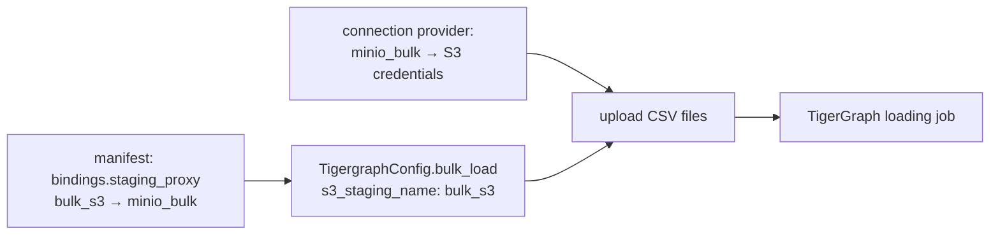

# Object storage (S3-compatible)

GraFlo uses S3-compatible object storage (MinIO, AWS S3 or any service that
speaks the S3 API) for one job: staging CSV files for a TigerGraph bulk load,
so that a TigerGraph loading job can read them from a bucket. This page is
for you if you bulk-load TigerGraph and the database cannot read files from
the machine that runs GraFlo. It explains how the bucket credentials reach
GraFlo without being written into the manifest, and what the helpers in
`graflo.object_storage` do.

## The idea

A bulk load writes one CSV file per vertex type and per edge type on the local
disk, then runs a loading job in TigerGraph. When TigerGraph runs elsewhere,
GraFlo uploads the files to a bucket first and points the loading job at the
uploaded objects.

The manifest names the bucket connection by a label only. The credentials are
registered at run time on a connection provider under that label, the same
way database and API credentials are (see
[connection proxy](../glossary.md#connection-proxy)).



## How it is declared

In the manifest, `bindings.staging_proxy` maps a staging name to a
`conn_proxy` label. Neither is a secret:

```yaml
bindings:
  staging_proxy:
    - name: bulk_s3
      conn_proxy: minio_bulk
```

At run time, register the credentials under the label and tell the
TigerGraph config which staging name to use:

```python
from graflo.connections import (
    InMemoryConnectionProvider,
    TigergraphBulkLoadConfig,
    TigergraphConfig,
)
from graflo.object_storage import MinioConfig

minio = MinioConfig.from_docker_env()

provider = InMemoryConnectionProvider()
provider.register_generalized_config(
    conn_proxy="minio_bulk",
    config=minio.to_s3_generalized_conn_config(),
)

conn_conf = TigergraphConfig.from_env()
conn_conf.bulk_load = TigergraphBulkLoadConfig(
    enabled=True,
    staging_dir="bulk_staging",
    s3_staging_name="bulk_s3",
)
```

Pass `provider` as `connection_provider` to `GraphEngine.ingest` or
`define_and_ingest`. `s3_conn_proxy="minio_bulk"` on the bulk config names the
label directly and makes the manifest entry unnecessary. The whole run is
described in the [TigerGraph bulk load](../../guides/tigergraph_bulk_load.md)
guide.

## `MinioConfig`

`MinioConfig` (also available as `S3EndpointConfig`) holds the endpoint and
credentials of an S3-compatible service. It is not a database config and is
not used with `ConnectionManager`.

| Field | Default | Meaning |
|---|---|---|
| `endpoint_url` | required | S3 API URL, such as `http://127.0.0.1:9000` |
| `access_key` | required | Access key id (the MinIO root user, or an IAM key) |
| `secret_key` | required | Secret access key |
| `bucket` | `graflo-staging` | Bucket for staged files |
| `region` | `us-east-1` | Region passed to boto3; keep the default for MinIO |
| `loader_endpoint_url` | `None` | S3 API URL as TigerGraph sees it, when that differs from `endpoint_url` |

`MinioConfig.from_docker_env()` reads the settings of the MinIO container
shipped under `docker/minio` (`MINIO_ROOT_USER`, `MINIO_ROOT_PASSWORD`,
`MINIO_API_PORT`, `MINIO_STAGING_BUCKET`, `MINIO_LOADER_ENDPOINT` and a few
alternatives). `to_s3_generalized_conn_config()` turns it into the
`S3GeneralizedConnConfig` that a connection provider stores; you can also
build an `S3GeneralizedConnConfig` directly with `bucket`, `region`,
`endpoint_url`, `aws_access_key_id`, `aws_secret_access_key` and
`loader_endpoint_url`.

`graflo.object_storage` also exports the helpers the bulk load uses:

| Helper | What it does |
|---|---|
| `ensure_staging_bucket_for_config(config)` | Creates the config's bucket if it does not exist; raises with a hint when the endpoint cannot be reached |
| `ensure_bucket_exists(client, bucket)` | The same for any boto3 client |
| `boto3_s3_client_from_minio(config)`, `boto3_s3_client_from_generalized(config)` | Build a boto3 S3 client from either config |
| `upload_staged_csvs(...)` | Uploads files under `<key prefix>/<session id>/` and returns their `s3://` URLs |

Calling `ensure_staging_bucket_for_config` before an ingest turns a MinIO that
is not running into an error at the start instead of an empty graph at the
end.

## Two endpoints

GraFlo uploads with boto3 from the machine that runs it, using
`endpoint_url`. TigerGraph reads the objects itself, through a
`CREATE DATA_SOURCE` statement that GraFlo issues with the same credentials
and with `loader_endpoint_url` when it is set, `endpoint_url` otherwise. When
TigerGraph runs in a container and MinIO on your machine, `127.0.0.1` means
different machines to the two of them: set `loader_endpoint_url` (or
`MINIO_LOADER_ENDPOINT` in the settings under `docker/minio`) to an address the
TigerGraph container can reach, such as `http://host.docker.internal:9000`.

## Limits

- Object storage is used only for TigerGraph bulk staging. GraFlo does not
  read records from a bucket: a staging name is not a
  [connector](../glossary.md#connector), and `FileConnector` reads local
  paths only.
- If the staging label has no S3 config on the connection provider, nothing
  is uploaded and the loading job is given the local file paths, without an
  error.
- If TigerGraph cannot reach the endpoint it is given, its loading job reads
  nothing, and the ingest still finishes without an error. Check the loaded
  counts after a bulk load.

## What to read next

- [TigerGraph bulk load](../../guides/tigergraph_bulk_load.md): the whole bulk load, step by step.
- [Bulk load into TigerGraph (13)](../../examples/tigergraph-bulk-s3/index.md): a runnable example with MinIO.
- [Database connections](../../guides/database_connections.md): the other configs a run needs.
