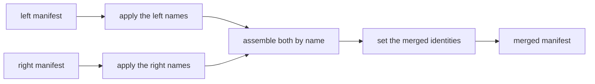

# Merging manifests

Two teams, or two systems, often model the same things under different names.
This page shows how to combine their manifests into one, so that both sources
load into one graph and records that describe the same thing become one
vertex. You declare which names correspond and how records find each other;
GraFlo applies exactly those declarations and, where the two manifests
disagree, refuses and tells you what to add.

Combining two unrelated manifests is called a union (`merge_manifests`,
`graflo merge`). Reconciling two branches of one manifest's history is a
different operation, the three-way merge, described in
[Version control](versioning.md#merging-two-branches).

## The idea

A plant runs a maintenance system and a sensor feed. The maintenance manifest
declares `Asset` and `WorkOrder`; the sensor manifest declares `Device`. An
asset and a device are the same physical machine, and both systems record its
serial number, written `HP-0042` in one and `hp-0042` in the other. You want one
type, `Machine`, in which records with the same serial number become one
vertex, and you want work orders to keep reaching the machine they name. This
is the
[manifest union example (20)](../../examples/manifest-union/index.md).

GraFlo does not guess that `Asset` and `Device` are the same kind of thing. Two
types are one only when you declare it, because a wrong guess merges data that
must stay apart, and nothing after the union can split it again. A union takes
three declarations:

| You say | Declaration | In the example |
|---|---|---|
| what each side's names become | [canonical map](#naming-the-merged-type) | `Asset` is called `Machine`; a device's `serial` is `serial_number` |
| which types are one | [vertex equivalence](#declaring-which-types-are-one) | `Asset` and `Device` are one type |
| how records from both sides find each other | the equivalence's [`identity`](#keying-the-merged-type) | match on the normalized serial number, otherwise keep the record's own key |

All three live in one document, the merge op (the class is `MergeManifestsOp`).
This is `merge.yaml` from the example:

```yaml
op: merge_manifests
canonical_maps:
    left: {vertices: {Asset: Machine}}
    right: {properties: {Device: {serial: serial_number}}}
vertex_equivalences:
-   left: Asset
    right: Device
    identity:
    -   name: match_key
        sources:
            assets: {input: [serial_number]}
            devices: {input: [serial]}
    -   local_key:
            assets: {field: asset_id, tag: maintenance}
            devices: {field: device_id, tag: sensors}
```

The first manifest you pass is the left side and the second the right side.
The union renames each side by its own declarations, assembles the two renamed
manifests by name, and then sets the identity of each merged type:



The order explains two rules you meet below: an equivalence names a type in its
own side's spelling, and a derivation reads each resource's raw column names,
because the records keep those names after the union.

## Running a union

### From the shell

```bash
graflo merge manifest_maintenance.yaml manifest_sensors.yaml \
    --op merge.yaml -o manifest_union.yaml
```

```text
schema: 2 vertices, 1 edges, version 1.1.0
resources: 3
written: manifest_union.yaml
```

The command exits `0` when the union succeeds, `1` when it refuses, and `2` when
it could not run, for example because a file is missing. Its options, most used
first:

| Option | What it does |
|---|---|
| `--op FILE` | The merge op. Without it, the manifests are unioned as they are, which works when no name is on both sides. |
| `-o FILE` | Where to write the merged manifest. Without it, only a summary is printed. |
| `--dry-run` | Run the union, print every finding and the [naming table](#the-naming-table), and write nothing. |
| `--suggest FILE` | Write an op that settles every problem a rename or an `into` can settle, and exit. See [Suggesting the declarations](#suggesting-the-declarations). |
| `--plot FILE`, `--preview-json FILE` | Draw the declarations and every conflict, or write them as JSON. Both are written even when the union refuses. See [Previewing every conflict](#previewing-every-conflict). |
| `--canonical-map SIDE=PATH` | Add a vocabulary for `left`, `right` or `both`, on top of the maps in the op. Repeatable. |
| `--name-conflict error\|union_right\|prefix_right` | Override the op's policy for a name both sides carry. See [Names both sides carry](#names-both-sides-carry). |
| `--bump-version minor\|none` | Bump the merged schema version (default `minor`). |
| `--strict-references` | Fail on ingestion or bindings references the merged schema lacks. |
| `--check-profile NAME` | Also check the result against a [conformance profile](world_model_profile.md). The findings do not change the exit code. |
| `-m LABEL`, `--store DIR` | Record the union as a commit. See [Recording a union](#recording-a-union). |

### From Python

```python
from suthing import FileHandle

from graflo import GraphManifest
from graflo.architecture.evolution import MergeManifestsOp, merge_manifests

left = GraphManifest.from_config(FileHandle.load("manifest_maintenance.yaml"))
right = GraphManifest.from_config(FileHandle.load("manifest_sensors.yaml"))
op = MergeManifestsOp.model_validate(FileHandle.load("merge.yaml"))

union = merge_manifests(left, right, op)
```

`merge_manifests` returns a new manifest and leaves both inputs unchanged. A
problem with the names is raised as one `MergeNamingError` that lists every
such problem; to see the schema-level ones too, such as two members that
disagree on their key, use [`preview_merge`](#previewing-every-conflict).

## Naming the merged type

Every name in the op is a name the two manifests declare. Three declarations
say what those names are called in the merged manifest, and the union resolves
them together, in one pass, so you never write anything in an intermediate
vocabulary:

| Declaration | Names |
|---|---|
| an equivalence's `into` | the merged type of that equivalence |
| a canonical map | any type, property or relation of a side, by default |
| `renames` | a type, relation, property or resource no equivalence holds |

A canonical map is the vocabulary: the default name of each of a side's names.
It has three parts, each a mapping from a source name to a canonical name:

```yaml
canonical_maps:
    left:
        vertices: {Asset: Machine}
    right:
        properties: {Device: {serial: serial_number}}
        relations: {mounted_on: installed_on}
```

- `vertices` renames vertex types.
- `properties` renames properties, keyed by the type's name on that side
  (`Device`, not `Machine`), because that is the name the side knows.
- `relations` renames relations.

A name with no entry keeps its spelling. A map is scoped: `left` and `right`
apply to that side's names, and `both` applies to either side, entry by entry,
wherever the name occurs. The `--canonical-map SIDE=PATH` option and the
`canonical_maps` argument of `merge_manifests` add maps to the ones in the op.

A map is a vocabulary: it says what each name is called, once. So it may not
chain (`{A: B, B: C}`) or swap (`{A: B, B: A}`); a map with a chain is refused
when it is loaded. A chain or a swap inside one union is written with
`renames`, see [Reusing a name](#reusing-a-name). Two sources with one canonical
name (`{Asset: Machine, Equipment: Machine}`) merge two types, so the map must
say `allow_merges: true`.

### How the merged name is found

An equivalence's merged name is, in this order:

1. its `into`, used as written;
2. otherwise, the name the vocabulary gives its members (`Machine` in the
   example);
3. otherwise, the one spelling every member shares.

`into` is a name in the merged manifest. A canonical map never translates it,
and when it differs from the vocabulary's name for the group it wins: the
group is called what `into` says, and the preview records a
`vocabulary_override` note. With none of the three, the union refuses:

```text
merge refused: MergeNamingError: unnamed vertex cluster: ['Asset'] ~ ['Device'] has no merged name — its members are spelled differently and no vocabulary names them. Give the equivalence `into`.
```

When the two sides' vocabularies name the group differently (`Machine` on the
left, `Sensor` on the right) and the equivalence has no `into`, the union
refuses too, and the refusal carries both `into` values to choose from.

### Reusing a name

Any name either manifest uses may be a name in the merged manifest, including
one a side gives up in the same union, because all the renames of a side apply
at once. To call the merged type `WorkOrder` while the maintenance system's
own work orders become `Ticket`:

```yaml
vertex_equivalences:
-   left: Asset
    right: Device
    into: WorkOrder
renames:
    left:
        vertices: {WorkOrder: Ticket}
```

A swap is written the same way: `into: WorkOrder` with `renames: {left:
{vertices: {WorkOrder: Asset}}}`.

### Renaming what no equivalence holds

`renames` names what no equivalence holds, per side, in that side's own names:

```yaml
renames:
    left:
        vertices: {WorkOrder: Ticket}
        relations: {raised_on: targets}
        properties: {WorkOrder: {wo_id: work_order_id}}
    right:
        resources: {devices: sensor_devices}
```

Every source must exist on its side. A type an equivalence holds is named by
its `into`, and its properties by the equivalence's `properties`: a `renames`
entry for it is refused (`double_home`), so each name is declared in one place.
Over the vocabulary, a `renames` entry wins, with a note.

### Checking a map before a union

A canonical map is often written against one manifest long before it meets the
other, and a long map is hard to debug through a union. `graflo canonical-check`
checks every entry against one manifest and lists each entry that matches
nothing, a dangling entry:

```bash
graflo canonical-check map.yaml --left manifest_maintenance.yaml
```

```text
1 entry match nothing in the manifest:
  vertex 'Assett' -> 'Machine2'
```

When another spelling in the manifest names the same concept (`asset` for
`Asset`), the entry comes with that suggestion. The command exits `1` when
entries dangle and `2` when it could not run, so it can gate a CI job. With
both `--left` and `--right` it runs the full [preview](#previewing-every-conflict)
instead. `--trim OUT.yaml` writes the map narrowed to the entries that match, so
pruning a map is a change you can review. In Python the same two are
`dangling_entries(cm, manifest)` and `trim_canonical_map(cm, manifest)`.

In a union, a dangling entry is refused, and one refusal lists every dangling
entry, because a misspelled type has the same shape. Set
`allow_dangling_entries: true` on the map, or on the op for all maps, when a
shared vocabulary is deliberately broader than the manifest; the entries are
then dropped and logged. An entry whose source is absent and whose target is
already present on that side is taken as already applied, and logged.

## Declaring which types are one

A vertex equivalence declares that types on the two sides are one type. Its
members are named in each side's own spelling, or by the canonical name a map
gives them, which stands for every type the map sends there:

```yaml
vertex_equivalences:
-   left: Asset
    right: Device
    into: Machine              # optional when a map names it
    properties:
    -   {right: serial, into: serial_number}
```

| Field | Meaning |
|---|---|
| `left`, `right` | The member types on each side: one name, or a list |
| `into` | The merged type's name; optional, see [How the merged name is found](#how-the-merged-name-is-found) |
| `properties` | Property equivalences: renames onto a canonical property name |
| `identity` | The merged type's key, as ordered branches, when you declare it; see [Keying the merged type](#keying-the-merged-type) |
| `derive_at` | Per resource, the pipeline level its derivations run at, needed only when the resource produces the type at more than one level |
| `retire` | What becomes of each member's own key once the type is re-keyed: `demote` (default) or `keep` |
| `allow` | Consequences of this merge it accepts: `self_relations`, `observation_fusion` |

Properties with the same spelling on every member become one property without
any declaration. A property equivalence is needed only to rename, and it takes
`left`, `right` or both. A plain string applies to every member the
equivalence lists on that side; a mapping names the property per member
(`left: {Asset: asset_serial, Equipment: equipment_serial}`). A property rename
cannot fold two properties of one member into one; a canonical map that tries
is refused.

Relations work the same way with `relation_equivalences`, each a
`RelationEquivalence` with `left`, `right` and an optional `into`.

### Several types on one side

When one side splits into several types what the other side keeps as one, list
them:

```yaml
vertex_equivalences:
-   left: [Asset, Equipment]
    right: Device
    into: Machine
```

Listing them is the declaration. Two consequences need a word of their own on
the equivalence, under `allow`. An edge between two members becomes an edge
from a type to itself: the union refuses that unless the equivalence says
`allow: [self_relations]`. And when one resource produces two members from the
same record at the same pipeline level, both land on one merged vertex: the
union refuses that unless it says `allow: [observation_fusion]`. Steps with
distinct [roles](../glossary.md#role) keep their records apart and need neither.
An `allow` covers its own group only, never another group of the same side.
A merge a canonical map makes is acknowledged on the map:
`allow_self_relations: true`, `allow_observation_fusion: true`. Such a flag
covers only the merges that map makes, never an equivalence's.

### A vocabulary that merges several types

A canonical map may already merge several of a side's types,
`{Press: Machine, Lathe: Machine, Bench: Machine}` with `allow_merges: true`,
while an equivalence names only some of them:

```yaml
canonical_maps:
    left:
        vertices: {Press: Machine, Lathe: Machine, Bench: Machine}
        allow_merges: true
vertex_equivalences:
-   left: [Press, Lathe]          # or `left: Machine`, for all three
    right: Device
```

The equivalence and the map are resolved together, so the merged type is the
group they link: `Press`, `Lathe` and `Bench` from the left, `Device` from the
right, called `Machine` by the map. Nothing has to be repeated from the map,
and `into` may be omitted.

The type is one, but which records fuse is decided per member. Per-member maps
are keyed by the members' own names, and the union reads each side before
renaming it, so a derivation keyed by `Press` still runs only for the rows a
router sends to `Press`.

When the identity is a funnel, a member the map joins that the identity gives
no key source for its resource keeps its own key behind the tag `side:Type`,
such as `left:Bench:B1`. Its records belong to `Machine`, but never fuse with a
device. The preview lists each such key as an `auto_local_key` note, and
[`--suggest`](#suggesting-the-declarations) writes it out so you can edit it.
A resource that produces the member through routers in several roles, such as
a link table whose source and target routers both reach it, gets no such key:
one level has one transform buffer, which cannot hold a derived value per role.
The union turns its steps into lookups of the merged type instead
(a `reference_only` note).

A plain property key, such as `identity: [serial_number]`, has no place for an
own key. A member the map joins that does not carry the key is refused
(`identity_coverage`), and the repair carries the `local_key` branch to append.
With it, the identity becomes a funnel, and the member keeps its own key.

### One type, one group

A type is declared in one equivalence (`cluster_overlap`). Two equivalences
the map links are one group: they may both list members, but only one may
declare `identity`. Two groups nothing links may not arrive at one merged name
(`shared_into`), and a group's name may not land on an unrelated type a side
keeps (`occupied_into`): rename that type away with `renames`, pick another
`into`, or add it to the group.

### Names both sides carry

A type or relation that both sides carry under the same name, and that no
equivalence covers, is decided by the op's `name_conflict` policy:

| Policy | What happens |
|---|---|
| `error` (default) | The union refuses and prints the equivalences that would settle it. |
| `union_right` | The union declares a one-to-one equivalence itself and merges the two exactly as a declared one. |
| `prefix_right` | The right side's type is kept apart as `r_<name>`. |

The default is `error` because two teams that both wrote `WorkOrder` do not
necessarily mean the same thing, and a union by name cannot be split again:

```text
merge refused: MergeNamingIncompleteError: vertex name collision: ['WorkOrder'] exist on both sides and no equivalence merges them. Declare the equivalences the completion carries, set name_conflict='union_right' to union by name, or name_conflict='prefix_right' to keep them apart.
completion:
kind: declare_equivalences
vertex_equivalences:
- left: WorkOrder
  right: WorkOrder
  into: WorkOrder
```

The part below `completion:` is the declaration that would make the op
complete. Paste it into the op's `vertex_equivalences` to accept it.

Two spellings of one name, such as `WorkOrder` and `work_order`, are never
merged by a policy: that would be a guess. `error` and `union_right` refuse
them and carry the equivalence to declare; `prefix_right` keeps them apart.

Resource and connector names are matched exactly, never by spelling, and
`union_right` does not merge them: they are addresses, not concepts. Rename a
side's resources with `renames: {right: {resources: {old: new}}}`, or use
`prefix_right`. Property names are also matched exactly: `customer_email` and
`customerEmail` stay two properties, because each is fed by a different column.

## Keying the merged type

An equivalence says two types are one. It does not say which property
identifies the merged type: when the members key on different fields
(`asset_id` and `device_id`), the union refuses rather than pick one:

```text
merge refused: MergeIdentityError: merge_manifests: merged vertex 'Machine' has members that disagree on identity (left:Asset=['asset_id']; right:Device=['device_id']) and nothing resolves it. [...]
```

You declare the key as `identity` on the equivalence: a list of branches in
priority order. A record keys on the first branch it completes, and two records
become one vertex when they complete the same branch with the same values. A
branch is one of three things:

| Branch | Written as | Keys a record on |
|---|---|---|
| a property | `serial_number`, or `[plant, tag]` for a composite | the value of a property the members carry, under its canonical name |
| a derived branch | `{name: match_key, sources: {...}}` | an attribute each resource computes from its own columns; see [Deriving the key per source](#deriving-the-key-per-source) |
| a local key | `{local_key: {...}}`, always last | the record's own key behind a per-source tag |

One property branch is a plain natural key. Any other list is an
[identity funnel](../glossary.md#identity-funnel), whose digest is stored in
`digest_field` (`id` unless you set it):

| `identity:` | The merged type is keyed on | Use it when |
|---|---|---|
| `[serial_number]` | that natural key | every member carries the field, under its canonical name |
| `[asset_id, device_id]` | a funnel, one branch per member's own key | the members stay distinct records under one type |
| a derived branch, then a `local_key` | a funnel over derived attributes | the key must be normalized, filtered or namespaced per source |

For example, keying on a property the sensor feed spells differently:

```yaml
vertex_equivalences:
-   left: Asset
    right: Device
    into: Machine
    properties:
    -   {right: serial, into: serial_number}
    identity: [serial_number]
```

Every member must be able to fill the key: every field of a natural key, or
every required field of one funnel branch, declared on the member under its
canonical name. A member that cannot would lose all its records, so the union
refuses and names it (`identity coverage`); it refuses a branch no member
declares for the same reason. A funnel also refuses a member that declares a
property named like its `digest_field`: the digest would replace that column's
values, so they would be lost (`identity collision`). To keep a member's own
`id`, store the digest in another field:

```yaml
    identity: [asset_id, device_id]
    digest_field: machine_key
```

`digest_field` must not be a field of any branch, since the digest would
replace the value that branch is computed from.

The check reads the manifests, not the data. A record whose key field is empty
still has no identity: it is not written, and the cast logs a warning such as
`Cast dropped 1 'Machine' document(s) with no value for its identity
['serial_number']`. In the example, the conveyor `A2` has no serial number. A
`local_key` branch keeps such records.

Once the merged type has its new key, each member's own key becomes a
[secondary identity](../glossary.md#secondary-identity) named `by_<fields>`, such
as `by_asset_id`. A secondary identity is a lookup key: it does not decide which
records become one vertex, but it lets a source that knows only the old key
still find the vertex. Set `retire: keep` on the equivalence to leave the old
key fields as plain properties instead.

### The old key no longer deduplicates

Before the union, two maintenance records with `asset_id: A1` were one vertex.
After it, a record keys on the first branch it completes, so `A1` read once with
a serial number and once without becomes two machines, one keyed by the serial
number and one by `maintenance:A1`, and `by_asset_id` finds both. The funnel
fuses records on the branch they reach first, not on any key they happen to
share.

`preview_merge` reports each member key in that position as a
`lookup_demotion` note. When a source's own key must keep deduplicating its
records, list it as a property branch ahead of the derived ones; that source's
records then key on it and no longer fuse with the other source.

## Deriving the key per source

A derived branch says how each resource computes an attribute from its own
columns, so that records from both sources that describe the same thing compute
the same value:

```yaml
    identity:
    -   name: match_key
        sources:
            assets: {input: [serial_number]}
            devices: {input: [serial]}
    -   local_key:
            assets: {field: asset_id, tag: maintenance}
            devices: {field: device_id, tag: sensors}
```

- `name` is the attribute the branch keys on; the union adds it to the merged
  type. It is the digest's input, not where the key is stored: that is
  `digest_field`.
- `sources` is keyed by resource name, because each resource derives the
  attribute from its own columns. `input` names those columns as they appear in
  the resource's records: `serial` for the sensor feed, even though the merged
  property is `serial_number`.
- `local_key` is the fallback: a record with no derived attribute is keyed by
  its own key behind a tag, so `A2` from the maintenance system becomes
  `maintenance:A2`. The tag keeps two sources whose own keys overlap apart.
  `tag` is required; write `tag: null` only when the values are already unique
  across every source of the type, such as UUIDs. `name` (default `local_key`)
  and `sep` (default `:`) sit beside `local_key`.
- `when` (optional, on a derivation or a local-key source) runs it only for
  records whose raw column holds one of the listed values:
  `when: {field: kind, in: [firm]}`.

Each derivation calls a function from `graflo.util.transform` by the name in
`foo` (another module is named with `module`), with the `input` columns and the
keyword `params`:

| Function | Inputs | Returns |
|---|---|---|
| `normalized_key` (the default) | the value | the value trimmed and lowercased (`strip_prefix`, `casefold` and `strip_chars` adjust it) |
| `gated_normalized_key` | a gate column, then the value | the normalized value when the gate starts with `params.prefix`, else nothing |
| `affix_gated_key` | the value | the value without its marker when it carries `params.prefix` and `params.suffix`, else nothing |

A function that returns nothing does not drop the record: the record skips that
branch and falls back to the next one, or to its local key. It is written, but
not joined with records from the other source. Use `gated_normalized_key` when
another column decides whether a record takes part, and `affix_gated_key` when
the key value carries its own marker, such as `ext_A42`.

The union adds the derived attributes to the merged type, appends the
derivation steps to each resource, and re-keys the type on an identity funnel
over the branches, in the order declared. Each member's own key becomes a
secondary identity, as described in
[Keying the merged type](#keying-the-merged-type).

### A resource that produces several members

When one resource produces several members of the merged type, for example
through a [vertex router](../glossary.md#vertex-router), its entry in `sources`
says how each member derives the attribute:

| `sources[resource]` | Use it when |
|---|---|
| one derivation | the members share the key column and its format |
| a mapping from member type to derivation | which member a record is must decide: each carries its key in its own column, or its own marker |

```yaml
sources:
    registry:
        Asset: {foo: affix_gated_key, input: [external_ref], params: {prefix: "ast_"}}
        Equipment: {foo: affix_gated_key, input: [external_ref], params: {prefix: "eq_"}}
```

You do not write which rows belong to which member. The union reads how the
resource produces each member on its side (a plain vertex step, or the router
values that map to it) and guards each derivation step so that it runs only for
that member's records. A derivation that is not keyed by member is guarded the
same way when a router produces the type, so it runs for no other type's
records. An explicit `when` replaces the guard the union derives; a derivation
keyed by member may not set one, because the member already decides. The
[router union alignment example (21)](../../examples/router-union-alignment/index.md)
shows one routed type end to end, with keying per type as a variant.

### Rules a derived branch must follow

The union refuses a derived branch (`AlignmentConflictError`) when:

- a derivation's `input` or `when` names a canonical property instead of the
  resource's own column;
- a derived attribute has the name of a member's own key field (to key on that
  field, list it as a property branch);
- a resource it names does not produce the type, or produces it at more than one
  level without `derive_at`;
- a member it names is not a member of that side, or its resource does not
  produce it;
- a resource it names produces the type through routers in several roles at one
  level, such as a link table whose source and target routers both reach it:
  one level's transform buffer cannot hold a derived value per role;
- a function does not accept its `input` and `params`.

A resource that writes the merged type, appears in no derived branch, and whose
records complete no property branch could never fill any branch of the new
key. The union turns its steps for that type into lookups, points its edges at
the demoted key, and logs a warning that its records of that type are no longer
written. That is right for a source that only refers to the type, and it is the
only path for a resource that produces the type through routers in several
roles. If the
resource was meant to own records of the type, add it to a derived branch's
`sources`. When no member key was demoted for such a resource to look the type
up by, for example under `retire: keep`, the union refuses instead
(`uncovered producer`).

## How definitions combine

At every name both sides carry after renaming, the two definitions are
combined:

- **Properties** are unioned by exact name. A property's `type` and `item_type`
  must agree: `LIST<STRING>` and `LIST<INT>` conflict. Two different units
  (`m/s` and `km/h`) conflict too, because one property would then hold values
  that cannot be compared. The union refuses both, naming every conflicting
  property at once and, for a type, every member on each side that carries
  each type; declare the merged type with `field_types` (below). Descriptions
  from both sides are kept. Grounding unions its `exact_match` and `synonyms`; two
  different `iri` values are cleared rather than choosing one.
- **Edges** of the same source, target and relation combine by the same rules.
- **Schema metadata**: the name becomes `left+right` unless the op sets `name`,
  and the version is bumped from the higher of the two.
- **Database profile**: `db_flavor` and `target_namespace` are single values, so
  two different declared values are refused; set `target_namespace` on the op
  to choose one. A side that did not declare a value takes the other side's.
  Indexes, storage names and default values are unioned, and two different
  declarations for one field set or property are refused.
- **Resources, transforms and bindings** are concatenated. A transform both
  sides register under one name must have the same body. The ingestion model's
  write policies (`edges_on_duplicate`, `endpoints_on_ambiguous`) are the left
  side's.

### How do I settle a property type the members disagree on?

Declare the merged type on the op, keyed by the merged type (or relation) and
the merged property name:

```yaml
field_types:
  vertices:
    Machine: {ram: {type: INT}}
  edges:
    has: {speed: {type: FLOAT}}
```

Before folding, the union retypes every member, on either side, that carries
the property, under whatever spelling a rename sends to it. Members without the
property are left alone. A `LIST` takes its `item_type`. An entry that no
member reaches is refused. The declaration is part of the recorded merge, so it
follows the vocabulary as members join or leave it.

A manifest may carry only an ingestion model or only bindings, such as a new
source wired onto an existing vocabulary. Such a side is a valid union input:
the merged schema is the other side's schema, copied as it is.

## References across a union

A resource that only refers to a type, such as the work orders that name an
asset, uses a `lookup_only` vertex step: it finds the vertex for an edge
without writing it. After the union re-keys the type, that resource still
carries only the old key. So the union points its edge steps at the demoted
secondary identity:

```yaml
- name: work_orders
  pipeline:
  - vertex: WorkOrder
  - vertex: Machine
    lookup_only: true
  - source: WorkOrder
    target: Machine
    relation: targets
    target_match: by_asset_id
```

`target_match` (and `source_match`) tells an edge step to match that end on a
secondary identity instead of the primary key. A vertex router refers the same
way when it sets `lookup_only: true`, or lists the types it only looks up.

## Routed sources

A vertex router passes a value its `type_map` does not name through as a type
name. After a union, that could reach a type from the other side: a value one
side never modeled, and skipped, would start writing the other side's type. So
by default (`router_scope: side`) the union closes each router over its own
side's types: it lists them in the router's `type_map`, under their merged
names, and sets `type_map_only`. The router then routes exactly what it routed
before. A router with `vertex_types` is closed over the types it lists. Set
`router_scope: union` for sources that share type names and ids, where a value
naming the other side's type should reach it. A router whose `vertex_types`
lists one member of a merged type and not another is closed in either scope,
since its list can no longer tell the two apart.

## When a union refuses

Every problem with the names is reported together, as one `MergeNamingError`;
its `findings` list them, each with a `kind`, the names it is about, and the
declarations that would settle it, safest first. The refusal also prints the
[naming table](#the-naming-table), with the rows in conflict marked.

| Finding | Cause | What to do |
|---|---|---|
| `unknown_member`, `dangling` | a declaration names a type, relation, property or resource the side does not declare | use the side's own spelling; the message names a near match |
| `unnamed_cluster`, `disagreement` | a group with no name, or with two | add or align `into` |
| `cluster_overlap`, `shared_into`, `occupied_into` | a type in two equivalences, two unlinked groups on one name, a group on an unrelated type's name | see [One type, one group](#one-type-one-group) |
| `double_home` | a `renames` entry for a type a group names | name it on its equivalence |
| `incomplete`, `name_collision` | a type a map sends onto a group's name, or a name both sides carry | add the declaration its completion prints; `MergeNamingIncompleteError` |
| `near_collision` | two spellings of one name | declare an equivalence, or `prefix_right` |
| `identity_disagreement`, `identity_coverage` | two equivalences of one group declaring `identity`, or a member no key can be derived for | keep one `identity`; add the key source the repair carries |
| `self_relation`, `observation_fusion` | a group's merge turns an edge into a self-relation, or fuses two members one record produces | accept it with `allow` on the equivalence, or the flag on the map; see [Several types on one side](#several-types-on-one-side) |
| `unknown_property`, `property_collision`, `property_disagreement`, `property_retarget` | a property rename naming a missing field, folding two, disagreeing with the map, or renaming an attribute the map established | fix the rename |

A finding that an addition settles, such as a name both sides carry, is
`incomplete`; when every finding is, the error is `MergeNamingIncompleteError`.
Every other finding is a `refusal`.

The schema union refuses on its own after the names are settled:

| Refusal | Cause | What to do |
|---|---|---|
| `MergeIdentityError` | members disagree on their key, a declared key some member cannot fill, or a funnel over a member declaring its `digest_field` | [declare the key](#keying-the-merged-type), or set `digest_field` |
| type or unit conflict | a property declared with two types or two units | retype or re-ground one side first |
| `AlignmentConflictError` | a derived branch breaks [its rules](#rules-a-derived-branch-must-follow) | fix the derivation |

### The naming table

The naming table shows where every name goes: one row per merged name and per
way of getting there.

```text
naming (vertex):
  merged     left       right   via
  WorkOrder  Asset      Device  equivalence  <- conflict
  WorkOrder  WorkOrder  -       own name     <- conflict
```

`via` is `equivalence`, `vocabulary` (a canonical map, including a type it
joins to a group), `rename`, `union_right` or `own name`. Two rows on one
merged name are one type; a `<- conflict` mark says nothing links them. In
Python, `build_naming(op, left=..., right=...)` returns the graph and every
finding without raising, and `naming_table(result.graph)` renders it.

### Suggesting the declarations

`--suggest FILE` writes an op that settles what can be settled without
guessing: for each problem, the first of its repairs an edit of the op can
express — a rename away before a new `into`, and either before adding a type
to a group, which fuses its records. Accepting a self-relation or a fused
observation, and adding a key source, are left to you, because each decides
which records fuse. It also writes out every automatic own key. Without `--op`, it writes a scaffold: one equivalence for every name both
sides share. Two spellings of one name are listed as comments, never declared.
In Python the same is `suggest_merge_op(left, right, op)`. Nothing is
applied: read the file, edit it, and pass it with `--op`.

## Previewing every conflict

`preview_merge` reports every problem a union would meet, as data: the naming
problems `merge_manifests` raises together, and the schema-level ones it would
reach only after them, such as members that disagree on their key:

```python
from graflo.architecture.evolution.preview import preview_merge

preview = preview_merge(left, right, op)
for finding in preview.blocking:
    print(finding.severity, finding.kind, finding.nodes, finding.message)
```

A finding has one of three severities: `refusal` is one the union raised,
`possible` is one the preview found on its own, and `note` records an accepted
default, such as an `into` overriding the vocabulary, an automatic own key, or
a map entry taken as already applied. `blocking` lists the first two; an empty
list means the union would succeed. A finding that a declaration would settle
carries it as `completion`. The preview also holds the declaration graph: each
side's types and properties, the groups over them, and where each name goes.
Pass `attempt=False` to describe the declarations without running the union.

The preview runs the same checks as the union, so whatever the union refuses,
the preview reports.

From the shell, `--plot` draws the declaration graph with its conflicts (the
file suffix picks SVG, PDF, PNG or DOT), and `--preview-json` writes the same
data. A type a vocabulary joins to a group is drawn with a dashed `vocabulary`
edge, and a suggested repair in green. Both files are written when the union
refuses, which is when you need them. `--dry-run` prints the findings as a
table:

```bash
graflo merge manifest_maintenance.yaml manifest_sensors.yaml \
    --op merge_no_identity.yaml --plot conflicts.svg --dry-run
```

## Recording a union

`graflo merge ... -m LABEL` also records the union as a commit with two parents
in the commit store (`--store`, default `.graflo/commits`). Both inputs must
already be commits in that store; start the second input's history with
`graflo commit --root`. The merged manifest is stamped with its parents before
it is written, so the file carries its own lineage. See
[Version control](versioning.md#a-union-is-recorded-too).

## Rules and limits

- **Nothing is inferred.** A type is the same type on both sides only by a
  declared equivalence, a canonical map that merges it, or an exact name under
  `union_right`.
- **A union is not an op for `apply_evolution`.** It takes two manifests, so it
  is applied with `merge_manifests` or `graflo merge`, and it has no inverse.
- **Side order changes little.** Unioning B onto A and A onto B gives the same
  content hash, except for a few order-sensitive fields such as the column order
  of a composite key; see
  [Version control](versioning.md#what-depends-on-the-order-of-the-sides).
- **The union changes manifests, not data.** Load the sources again with the
  merged manifest.

## What to read next

- [Manifest union example (20)](../../examples/manifest-union/index.md): the
  declarations on this page, run on real files.
- [Router union alignment example (21)](../../examples/router-union-alignment/index.md):
  a union where one source routes rows to several types.
- [Version control](versioning.md): recording unions and edits, and the
  three-way merge of branches.
