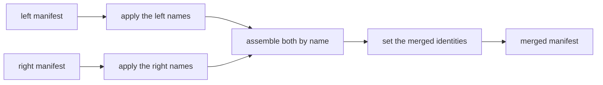

# Merging manifests

Two teams, or two systems, often model the same things under different names.
This page shows how to combine their manifests into one, so that both sources
load into one graph and records that describe the same thing become one
vertex. You declare which names correspond and how records find each other;
GraFlo applies exactly those declarations and, where the two manifests
disagree, refuses and tells you what to add.

Combining two unrelated manifests is called a union (`merge_manifests`,
`graflo merge`). Reconciling two branches of one manifest's history is a
different operation, the three-way merge, described in
[Version control](versioning.md#merging-two-branches).

## The idea

A plant runs a maintenance system and a sensor feed. The maintenance manifest
declares `Asset` and `WorkOrder`; the sensor manifest declares `Device`. An
asset and a device are the same physical machine, and both systems record its
serial number, written `HP-0042` in one and `hp-0042` in the other. You want one
type, `Machine`, in which records with the same serial number become one
vertex, and you want work orders to keep reaching the machine they name. This
is the
[manifest union example (20)](../../examples/manifest-union/index.md).

GraFlo does not guess that `Asset` and `Device` are the same kind of thing. Two
types are one only when you declare it, because a wrong guess merges data that
must stay apart, and nothing after the union can split it again. A union takes
three declarations:

| You say | Declaration | In the example |
|---|---|---|
| what each side's names become | [canonical map](#naming-the-merged-type) | `Asset` is called `Machine`; a device's `serial` is `serial_number` |
| which types are one | [vertex equivalence](#declaring-which-types-are-one) | `Asset` and `Device` are one type |
| how records from both sides find each other | [identity alignment](#identity-alignment) | match on the normalized serial number, otherwise keep the record's own key |

All three live in one document, the merge op (the class is `MergeManifestsOp`).
This is `merge.yaml` from the example:

```yaml
op: merge_manifests
canonical_maps:
    left: {vertices: {Asset: Machine}}
    right: {properties: {Device: {serial: serial_number}}}
vertex_equivalences:
-   left: Asset
    right: Device
identity_alignments:
-   vertex: Machine
    attributes:
    -   name: match_key
        sources:
            assets: {foo: normalized_key, input: [serial_number]}
            devices: {foo: normalized_key, input: [serial]}
    local_key:
        sources:
            assets: {field: asset_id, tag: maintenance}
            devices: {field: device_id, tag: sensors}
```

The first manifest you pass is the left side and the second the right side.
The union renames each side by its own declarations, assembles the two renamed
manifests by name, and then sets the identity of each merged type:



The order explains two rules you meet below: an equivalence names a type in its
own side's spelling, and an identity alignment reads each resource's raw column
names, because the records keep those names after the union.

## Running a union

### From the shell

```bash
graflo merge manifest_maintenance.yaml manifest_sensors.yaml \
    --op merge.yaml -o manifest_union.yaml
```

```text
schema: 2 vertices, 1 edges, version 1.1.0
resources: 3
written: manifest_union.yaml
```

The command exits `0` when the union succeeds, `1` when it refuses, and `2` when
it could not run, for example because a file is missing. Its options, most used
first:

| Option | What it does |
|---|---|
| `--op FILE` | The merge op. Without it, the manifests are unioned as they are, which works when no name is on both sides. |
| `-o FILE` | Where to write the merged manifest. Without it, only a summary is printed. |
| `--dry-run` | Run the union and print every finding, but write nothing. |
| `--plot FILE`, `--preview-json FILE` | Draw the declarations and every conflict, or write them as JSON. Both are written even when the union refuses. See [Previewing every conflict](#previewing-every-conflict). |
| `--canonical-map SIDE=PATH` | Add a canonical map for `left`, `right` or `both`, on top of the maps in the op. Repeatable. |
| `--name-conflict error\|union_right\|prefix_right` | Override the op's policy for a name both sides carry. See [Names both sides carry](#names-both-sides-carry). |
| `--bump-version minor\|none` | Bump the merged schema version (default `minor`). |
| `--strict-references` | Fail on ingestion or bindings references the merged schema lacks. |
| `--check-profile NAME` | Also check the result against a [conformance profile](world_model_profile.md). The findings do not change the exit code. |
| `-m LABEL`, `--store DIR` | Record the union as a commit. See [Recording a union](#recording-a-union). |

### From Python

```python
from suthing import FileHandle

from graflo import GraphManifest
from graflo.architecture.evolution import MergeManifestsOp, merge_manifests

left = GraphManifest.from_config(FileHandle.load("manifest_maintenance.yaml"))
right = GraphManifest.from_config(FileHandle.load("manifest_sensors.yaml"))
op = MergeManifestsOp.model_validate(FileHandle.load("merge.yaml"))

union = merge_manifests(left, right, op)
```

`merge_manifests` returns a new manifest and leaves both inputs unchanged. It
raises at the first refusal; to see every problem at once, use
[`preview_merge`](#previewing-every-conflict).

## Naming the merged type

A canonical map translates one side's names into the names the merged manifest
uses. It has three parts, each a mapping from a source name to a canonical
name:

```yaml
canonical_maps:
    left:
        vertices: {Asset: Machine}
    right:
        properties: {Device: {serial: serial_number}}
        relations: {mounted_on: installed_on}
```

- `vertices` renames vertex types.
- `properties` renames properties, keyed by the type's name on that side
  (`Device`, not `Machine`), because that is the name the side knows.
- `relations` renames relations.

A name with no entry keeps its spelling. A map is scoped: `left` and `right`
apply to that side's names, and `both` applies to either side, entry by entry,
wherever the name occurs. The `--canonical-map SIDE=PATH` option and the
`canonical_maps` argument of `merge_manifests` add maps to the ones in the op.

A map is a vocabulary: it says what each name is called, once. So it may not
chain (`{A: B, B: C}`) or swap (`{A: B, B: A}`), because a name that one entry
renames cannot also be the canonical name of another; a map with a chain is
refused when it is loaded. Two sources with one canonical name
(`{Asset: Machine, Equipment: Machine}`) merge two types, so the map must say
`allow_merges: true`.

### How the merged name is found

An equivalence names the members of the merged type on each side. Its merged
name is, in this order:

1. its `into`, translated by a canonical map if a map renames that name;
2. otherwise, the canonical name a map gives one of its members (`Machine` in
   the example);
3. otherwise, the one spelling every member shares.

With none of these, the union refuses:

```text
merge refused: MergeCanonicalConflictError: merge contradicts the canonical map (unnamed vertex cluster): cluster ['Asset'] ~ ['Device'] has no merged name. Give it `into`, or map a member in a canonical map.
```

Error messages call one equivalence, with its members and merged name, a
cluster.

### Checking a map before a union

A canonical map is often written against one manifest long before it meets the
other, and a long map is hard to debug through a union. `graflo canonical-check`
checks every entry against one manifest and lists each entry that matches
nothing, a dangling entry:

```bash
graflo canonical-check map.yaml --left manifest_maintenance.yaml
```

```text
1 entry match nothing in the manifest:
  vertex 'Assett' -> 'Machine2'
```

When another spelling in the manifest names the same concept (`asset` for
`Asset`), the entry comes with that suggestion. The command exits `1` when
entries dangle and `2` when it could not run, so it can gate a CI job. With
both `--left` and `--right` it runs the full [preview](#previewing-every-conflict)
instead. `--trim OUT.yaml` writes the map narrowed to the entries that match, so
pruning a map is a change you can review. In Python the same two are
`dangling_entries(cm, manifest)` and `trim_canonical_map(cm, manifest)`.

In a union, a dangling entry is refused, and one refusal lists every dangling
entry on that side, because a misspelled type has the same shape. Set
`allow_dangling_entries: true` on the map, or on the op for all maps, when a
shared vocabulary is deliberately broader than the manifest; the entries are
then dropped and logged. An entry whose source is absent and whose target is
already present on that side is taken as already applied, and logged.

## Declaring which types are one

A vertex equivalence declares that types on the two sides are one type. Its
members are named in each side's own spelling, or by the canonical name a map
gives them:

```yaml
vertex_equivalences:
-   left: Asset
    right: Device
    into: Machine              # optional when a map names it
    properties:
    -   {right: serial, into: serial_number}
```

| Field | Meaning |
|---|---|
| `left`, `right` | The member types on each side: one name, or a list |
| `into` | The merged type's name; optional, see [How the merged name is found](#how-the-merged-name-is-found) |
| `properties` | Property equivalences: renames onto a canonical property name |
| `identity` | The merged type's key, when you declare it; see [Keying the merged type](#keying-the-merged-type) |
| `retire` | What becomes of each member's own key once the type is re-keyed: `demote` (default) or `keep` |

Properties with the same spelling on every member become one property without
any declaration. A property equivalence is needed only to rename, and it takes
`left`, `right` or both. A plain string applies to every member on that side; a
mapping names the property per member (`left: {Asset: asset_serial, Equipment:
equipment_serial}`). A property rename cannot fold two properties of one member
into one; a canonical map that tries is refused.

Relations work the same way with `relation_equivalences`, each a
`RelationEquivalence` with `left`, `right` and an optional `into`.

### Several types on one side

When one side splits into several types what the other side keeps as one, list
them. A list on either side declares that several distinct types become one,
which the op must acknowledge with `allow_merges: true`:

```yaml
allow_merges: true
vertex_equivalences:
-   left: [Asset, Equipment]
    right: Device
    into: Machine
```

The acknowledgement is required because the union then writes records of
different types into one type. It can also turn an edge between two members
into an edge from a type to itself; the union refuses that unless the op sets
`allow_self_relations: true`. And when one resource produces two members from
the same record at the same pipeline level, both land on one merged vertex; the
union refuses that unless the op sets `allow_observation_fusion: true`. Steps
with distinct [roles](../glossary.md#role) keep their records apart and need no
flag.

The same member may not appear in two equivalences, and two equivalences may
not share a merged name: that is one equivalence with more members, and must be
written as one. A merged name that already names an unrelated type on a side is
refused too, since the union would merge into it.

### Names both sides carry

A type or relation that both sides carry under the same name, and that no
equivalence covers, is decided by the op's `name_conflict` policy:

| Policy | What happens |
|---|---|
| `error` (default) | The union refuses and prints the equivalences that would settle it. |
| `union_right` | The union declares a one-to-one equivalence itself, under the left spelling, and merges the two exactly as a declared one. |
| `prefix_right` | The right side's type is kept apart as `r_<name>`. |

The default is `error` because two teams that both wrote `WorkOrder` do not
necessarily mean the same thing, and a union by name cannot be split again:

```text
merge refused: MergeIncompleteError: merge is incomplete (vertex name collision): ['WorkOrder'] exist on both sides and no equivalence merges them. Declare the equivalences the completion carries, set name_conflict='union_right' to union by name, or name_conflict='prefix_right' to keep them apart.
completion:
kind: declare_equivalences
vertex_equivalences:
- left: WorkOrder
  right: WorkOrder
  into: WorkOrder
```

The part below `completion:` is the declaration that would make the op
complete. Paste it into the op's `vertex_equivalences` to accept it.

Two spellings of one name, such as `WorkOrder` and `work_order`, count as a
collision too, and are refused with `MergeNameConflictError` under `error`.
Under `union_right` they merge under the left spelling.

Resource and connector names are matched exactly, never by spelling, and
`union_right` does not merge them: they are addresses, not concepts. Rename the
right side's resources with `resource_renames: {old: new}`, or use
`prefix_right`. Property names are also matched exactly: `customer_email` and
`customerEmail` stay two properties, because each is fed by a different column.

## Keying the merged type

An equivalence says two types are one. It does not say which property
identifies the merged type: when the members key on different fields
(`asset_id` and `device_id`), the union refuses rather than pick one:

```text
merge refused: MergeIdentityError: merge_manifests: merged vertex 'Machine' has members that disagree on identity (left:Asset=['asset_id']; right:Device=['device_id']) and nothing resolves it. [...]
```

You declare the key in one of four ways:

| Declaration | The merged type is keyed on | Use it when |
|---|---|---|
| `identity: [serial_number]` on the equivalence | that natural key | every member carries the fields, under their canonical names |
| `identity:` as a `SideIdentity` or an identity funnel | a [funnel](../glossary.md#identity-funnel), one branch per member | members key on different fields and should stay distinct unless a shared branch matches |
| `identity: true` on a property equivalence | the flagged property | one property every member carries is the key as it is |
| an entry in `identity_alignments` | a funnel over derived attributes | the key must be normalized, filtered or namespaced per source; see [Identity alignment](#identity-alignment) |

A flagged property joins the members' key when the members agree on one, and
replaces it when they disagree. For example:

```yaml
vertex_equivalences:
-   left: Asset
    right: Device
    into: Machine
    properties:
    -   {right: serial, into: serial_number, identity: true}
```

Whichever way you choose, every member must be able to fill the key: every field
of a natural key, or every required field of one funnel branch, declared on the
member under its canonical name. A member that cannot would lose all its
records, so the union refuses and names it (`identity coverage`).

The check reads the manifests, not the data. A record whose key field is empty
still has no identity: it is not written, and the cast logs a warning such as
`Cast dropped 1 'Machine' document(s) with no value for its identity
['serial_number']`. In the example, the conveyor `A2` has no serial number. An
identity alignment with a `local_key` keeps such records.

Once the merged type has its new key, each member's own key becomes a
[secondary identity](../glossary.md#secondary-identity) named `by_<fields>`, such
as `by_asset_id`. A secondary identity is a lookup key: it does not decide which
records become one vertex, but it lets a source that knows only the old key
still find the vertex. Set `retire: keep` on the equivalence to leave the old
key fields as plain properties instead.

## Identity alignment

An identity alignment says how records of the merged type find each other
across sources. It declares canonical attributes that carry the key, how each
resource derives them from its own columns, and a fallback key for records that
carry none of them:

```yaml
identity_alignments:
-   vertex: Machine
    attributes:
    -   name: match_key
        sources:
            assets: {foo: normalized_key, input: [serial_number]}
            devices: {foo: normalized_key, input: [serial]}
    local_key:
        sources:
            assets: {field: asset_id, tag: maintenance}
            devices: {field: device_id, tag: sensors}
```

- `vertex` is the merged type's name.
- `attributes` lists the canonical attributes in priority order. A record is
  keyed by the first attribute it has a value for, so two records become one
  vertex when their first present attribute has the same value. A match on a
  later attribute does not join two records when one of them also has an
  earlier one.
- `sources` is keyed by resource name, because each resource derives the
  attribute from its own columns. `input` names those columns as they appear in
  the resource's records: `serial` for the sensor feed, even though the merged
  property is `serial_number`.
- `local_key` is the fallback: a record with no aligned attribute is keyed by
  its own key behind a tag, so `A2` from the maintenance system becomes
  `maintenance:A2`. The tag keeps two sources whose own keys overlap apart.
  `tag` is required; write `tag: null` only when the values are already unique
  across every source of the type, such as UUIDs.
- `secondary_identities` (optional) adds lookup keys: `{name: [fields]}`.
- `at` (optional) names the pipeline level to derive at, per resource, when a
  resource produces the type at more than one level.

Each derivation calls a function from `graflo.util.transform` by the name in
`foo` (another module is named with `module`), with the `input` columns and the
keyword `params`:

| Function | Inputs | Returns |
|---|---|---|
| `normalized_key` | the value | the value trimmed and lowercased (`strip_prefix`, `casefold` and `strip_chars` adjust it) |
| `gated_normalized_key` (the default) | a gate column, then the value | the normalized value when the gate starts with `params.prefix`, else nothing |
| `affix_gated_key` | the value | the value without its marker when it carries `params.prefix` and `params.suffix`, else nothing |

A function that returns nothing does not drop the record: the record skips that
attribute and falls back to the next one, or to its `local_key`. It is
written, but not joined with records from the other source. Use
`gated_normalized_key` when another column decides whether a record takes part,
and `affix_gated_key` when the key value carries its own marker, such as
`ext_A42`.

The union adds the attributes to the merged type, appends the derivation steps
to each resource, and re-keys the type on an identity funnel over the
attributes, with the `local_key` as its last branch. Each member's own key
becomes a secondary identity, as described in
[Keying the merged type](#keying-the-merged-type). An op may carry at most one
alignment per type, because each one replaces the type's identity.

### A resource that produces several members

When one resource produces several members of the merged type, for example
through a [vertex router](../glossary.md#vertex-router), its entry in `sources`
says how each member derives the attribute:

| `sources[resource]` | Use it when |
|---|---|
| one derivation | the members share the key column and its format |
| a list of derivations | each member carries its key in its own column; the column that has a value decides |
| a mapping from member type to derivation | which member a record is must decide: the members share a column, or each has its own marker |
| `{spec: ..., members: ...}` (a `SharedDerivation`) | the mapping above, when only a parameter differs per member, or nothing does |

```yaml
sources:
    registry:
        spec: {foo: affix_gated_key, input: [external_ref]}
        members: {Asset: {prefix: "ast_"}, Equipment: {prefix: "eq_"}}
```

You do not write which rows belong to which member. The union reads how the
resource produces each member on its side (a plain vertex step, or the router
values that map to it) and guards each derivation step so that it runs only for
that member's records. The
[router union alignment example (21)](../../examples/router-union-alignment/index.md)
shows one routed type end to end, with keying per type as a variant.

### Rules an alignment must follow

The union refuses an alignment (`AlignmentConflictError`) when:

- a derivation's `input` names a canonical property instead of the resource's
  own column;
- an attribute has the name of a member's own key field;
- a resource it names does not produce the type, or produces it at more than one
  level without `at`;
- a member it names is not a member of that side, or its resource does not
  produce it;
- a function does not accept its `input` and `params`.

A resource that writes the merged type but has no derivation in the alignment
could never fill any branch of the new key. The union turns its steps for that
type into lookups, points its edges at the demoted key, and logs a warning that
its records of that type are no longer written. That is right for a source that
only refers to the type. If the resource was meant to own records of the type,
add it to an attribute's `sources`. When no member key was demoted for such a
resource to look the type up by, for example under `retire: keep`, the union
refuses instead (`uncovered producer`).

## How definitions combine

At every name both sides carry after renaming, the two definitions are
combined:

- **Properties** are unioned by exact name. A property's `type` and `item_type`
  must agree: `LIST<STRING>` and `LIST<INT>` conflict. Two different units
  (`m/s` and `km/h`) conflict too, because one property would then hold values
  that cannot be compared. The union refuses both, naming every conflicting
  property at once; retype one side first with
  [`change_field_types`](manifest_evolution.md#properties). Descriptions from both
  sides are kept. Grounding unions its `exact_match` and `synonyms`; two
  different `iri` values are cleared rather than choosing one.
- **Edges** of the same source, target and relation combine by the same rules.
- **Schema metadata**: the name becomes `left+right` unless the op sets `name`,
  and the version is bumped from the higher of the two.
- **Database profile**: `db_flavor` and `target_namespace` are single values, so
  two different declared values are refused; set `target_namespace` on the op
  to choose one. A side that did not declare a value takes the other side's.
  Indexes, storage names and default values are unioned, and two different
  declarations for one field set or property are refused.
- **Resources, transforms and bindings** are concatenated. A transform both
  sides register under one name must have the same body. The ingestion model's
  write policies (`edges_on_duplicate`, `endpoints_on_ambiguous`) are the left
  side's.

A manifest may carry only an ingestion model or only bindings, such as a new
source wired onto an existing vocabulary. Such a side is a valid union input:
the merged schema is the other side's schema, copied as it is.

## References across a union

A resource that only refers to a type, such as the work orders that name an
asset, uses a `lookup_only` vertex step: it finds the vertex for an edge
without writing it. After the union re-keys the type, that resource still
carries only the old key. So the union points its edge steps at the demoted
secondary identity:

```yaml
- name: work_orders
  pipeline:
  - vertex: WorkOrder
  - vertex: Machine
    lookup_only: true
  - source: WorkOrder
    target: Machine
    relation: targets
    target_match: by_asset_id
```

`target_match` (and `source_match`) tells an edge step to match that end on a
secondary identity instead of the primary key. A vertex router refers the same
way when it sets `lookup_only: true`, or lists the types it only looks up.

## Routed sources

A vertex router passes a value its `type_map` does not name through as a type
name. After a union, that could reach a type from the other side: a value one
side never modeled, and skipped, would start writing the other side's type. So
by default (`router_scope: side`) the union closes each router over its own
side's types: it lists them in the router's `type_map`, under their merged
names, and sets `type_map_only`. The router then routes exactly what it routed
before. Set `router_scope: union` for sources that share type names and ids,
where a value naming the other side's type should reach it.

## When a union refuses

Every refusal names what it is about and what to change:

| Refusal | Cause | What to do |
|---|---|---|
| `ClusterConflictError` | a type in two equivalences, two equivalences with one merged name, or a merged name that is an unrelated existing type | write one equivalence per merged type |
| `UnknownMemberError` | an equivalence names a type the side does not declare | use the side's own spelling; the message names a near match |
| `MergeCanonicalConflictError` | an unnamed cluster, a map and an equivalence that send one name to two places, or dangling map entries | add `into`, fix the map, or [check it first](#checking-a-map-before-a-union) |
| `MergeIncompleteError` | a name both sides carry, or a map that sends a type onto a merged name without making it a member | add the declaration its completion prints |
| `MergeNameConflictError` | two spellings of one name | declare an equivalence, or choose a `name_conflict` policy |
| `MergeIdentityError` | members disagree on their key, or a declared key some member cannot fill | [declare the key](#keying-the-merged-type) |
| type or unit conflict | a property declared with two types or two units | retype or re-ground one side first |
| `AlignmentConflictError` | an identity alignment breaks [its rules](#rules-an-alignment-must-follow) | fix the derivation |

## Previewing every conflict

`merge_manifests` stops at the first refusal, so three mistakes take three runs
to find. `preview_merge` checks every declaration, one at a time, and reports
every problem as data:

```python
from graflo.architecture.evolution.preview import preview_merge

preview = preview_merge(left, right, op)
for finding in preview.blocking:
    print(finding.severity, finding.kind, finding.nodes, finding.message)
```

A finding has one of three severities: `refusal` is the one the union raised,
`possible` is one the preview found on its own, and `note` records an accepted
assumption, such as a map entry taken as already applied. `blocking` lists the
first two; an empty list means the union would succeed. A finding that a
declaration would settle carries the same completion as the refusal. The preview
also holds the declaration graph: each side's types and properties, the
equivalences over them, and the canonical names. Pass `attempt=False` to
describe the declarations without running the union.

The preview runs the same checks as the union, so whatever the union refuses,
the preview reports.

From the shell, `--plot` draws the declaration graph with its conflicts (the
file suffix picks SVG, PDF, PNG or DOT), and `--preview-json` writes the same
data. Both are written when the union refuses, which is when you need them.
`--dry-run` prints the findings as a table:

```bash
graflo merge manifest_maintenance.yaml manifest_sensors.yaml \
    --op merge_no_identity.yaml --plot conflicts.svg --dry-run
```

## Recording a union

`graflo merge ... -m LABEL` also records the union as a commit with two parents
in the commit store (`--store`, default `.graflo/commits`). Both inputs must
already be commits in that store; start the second input's history with
`graflo commit --root`. The merged manifest is stamped with its parents before
it is written, so the file carries its own lineage. See
[Version control](versioning.md#a-union-is-recorded-too).

## Rules and limits

- **Nothing is inferred.** A type is the same type on both sides only by name
  or by a declared equivalence.
- **A union is not an op for `apply_evolution`.** It takes two manifests, so it
  is applied with `merge_manifests` or `graflo merge`, and it has no inverse.
- **Side order changes little.** Unioning B onto A and A onto B gives the same
  content hash, except for a few order-sensitive fields such as the column order
  of a composite key; see
  [Version control](versioning.md#what-depends-on-the-order-of-the-sides).
- **The union changes manifests, not data.** Load the sources again with the
  merged manifest.

## What to read next

- [Manifest union example (20)](../../examples/manifest-union/index.md): the
  declarations on this page, run on real files.
- [Router union alignment example (21)](../../examples/router-union-alignment/index.md):
  a union where one source routes rows to several types.
- [Version control](versioning.md): recording unions and edits, and the
  three-way merge of branches.
