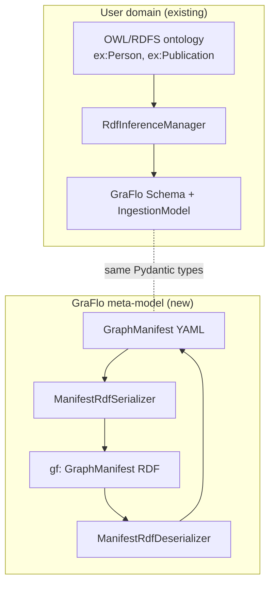

# GraFlo ontology (meta-model RDF)

GraFlo ships an **OWL ontology** that describes GraFlo’s own configuration language — not your domain knowledge graph, but the **manifest contract**: `GraphManifest`, `Schema`, `IngestionModel`, `Resource` pipelines (YAML `ResourceConfig`), `ProtoTransform` definitions, and `Bindings`.

This is separate from **user-domain RDF** ingestion, where `RdfInferenceManager` reads an external OWL/RDFS TBox (`ex:Person`, `ex:publication`, …) and produces a GraFlo `Schema` + ingestion wiring.



## Ontology identifiers

| Role | IRI |
|------|-----|
| Ontology document | `https://ontology.growgraph.dev/graflo` |
| Version IRI | `https://ontology.growgraph.dev/graflo/1.4.0` |
| Version info | `1.4.0` |
| Vocabulary prefix `gf:` | `https://ontology.growgraph.dev/graflo/` |

The Turtle source lives in the package at `graflo/rdf/ontology/graflo.ttl`. Constants are also exposed in Python as `graflo.rdf.namespace` (`GF_ONTOLOGY_IRI`, `GF_VERSION`, `GF_VERSION_IRI`, `GF_BASE`).

## Interactive visualization

The explorer below is a **class graph** from `graflo.ttl`. Classes are grouped into the blocks the manifest composes — the bands are derived from what `gf:GraphManifest` points at, not hand-assigned. Within a band, columns run **left to right from general to specific**: a class sits one column right of whatever contains it (`gf:Schema` → `gf:CoreSchema` → `gf:VertexConfig` → `gf:Vertex` → `gf:Field`) or generalises it (`gf:Actor` → `gf:VertexProducingActor` → `gf:VertexActor`), and specialization always wins, so a subclass is never level with its superclass. Classes at the same distance stay in the same column — `gf:Vertex` and `gf:Edge` are peers. The layout is deterministic: the same ontology always draws the same picture.

Only the taxonomy is drawn by default; **select a class** to reveal its properties, or switch the filter to *Display all*. `gf:GrafloArtifact` is the superclass of nearly every class, so its 28 links are hidden by default — tick **Show GrafloArtifact** to bring them back. Drag, scroll to zoom, click to focus. Regenerate with `uv run python docs/_build/scripts/build_ontology_viz.py` after ontology edits.

If the embedded viewer is blank in an IDE browser preview, use **Open full screen** in a normal browser tab.

<iframe
  id="graflo-ontology-viz"
  src="../../../assets/graflo-ontology-viz/embed.html"
  title="GraFlo ontology interactive visualization"
  width="100%"
  height="720"
  style="border: 1px solid var(--md-default-fg-color--lightest); border-radius: 4px;"
></iframe>

<script>
// The iframe cannot read the parent's palette, so hand it over and keep it in sync.
(function () {
  var frame = document.getElementById("graflo-ontology-viz");
  if (!frame) { return; }
  function push() {
    var scheme = document.body.getAttribute("data-md-color-scheme") || "default";
    if (frame.contentWindow) {
      frame.contentWindow.postMessage({ grafloScheme: scheme }, "*");
    }
  }
  frame.addEventListener("load", push);
  new MutationObserver(push).observe(document.body, {
    attributes: true,
    attributeFilter: ["data-md-color-scheme"],
  });
  push();
})();
</script>

<p><a href="../../../assets/graflo-ontology-viz/index.html" target="_blank" rel="noopener" class="md-button">Open full screen</a></p>

## What the vocabulary covers

**Schema block**

- `gf:GraphManifest`, `gf:Schema`, `gf:CoreSchema`, `gf:GraphMetadata`, `gf:DatabaseProfile`
- `gf:VertexConfig`, `gf:EdgeConfig`, `gf:Vertex`, `gf:Edge`, `gf:Field`, `gf:Identity`
- `gf:FieldType` individuals (`gf:INT`, `gf:STRING`, …)

**Ingestion block**

- `gf:IngestionModel`, `gf:Resource`, `gf:ProtoTransform`, `gf:Transform`
- `gf:DressConfig`, `gf:KeySelectionConfig`, `gf:EdgeInferSpec`
- Pipeline actor steps (blank nodes): `gf:VertexActor`, `gf:EdgeActor`, `gf:TransformActor`, `gf:DescendActor`, `gf:VertexRouterActor` (Python aliases `*ActorStep` in `graflo.rdf.namespace`)

**Bindings block**

- `gf:Bindings`, and `gf:BoundConnector` with one subclass per connector model: `gf:FileConnector`, `gf:TableConnector`, `gf:SparqlConnector`, `gf:APIConnector`, `gf:KafkaConnector`
- `gf:ResourceConnectorBinding`, `gf:ConnectorConnectionBinding`, `gf:StagingProxyBinding`

**Semantic grounding** (optional, added in 1.4.0)

An element may be anchored to an external vocabulary through a `semantics:` block on the schema metadata, a vertex, an edge, or a field:

```yaml
vertices:
-   name: person
    identity: [email]
    semantics:
        iri: https://schema.org/Person
        exact_match: [http://xmlns.com/foaf/0.1/Person]
        synonyms: [individual, human]
    properties:
    -   name: speed
        type: FLOAT
        semantics:
            unit: m/s
```

This maps to `gf:semanticIri`, `skos:exactMatch`, `skos:altLabel`, and — fields only — `gf:unit`. The block is purely descriptive: identity, storage naming and ingestion behave identically whether or not it is present. `unit` is rejected outside a field, where it would be meaningless.

**Enumerations** (named individuals): `gf:DBType` (ArangoDB, Neo4j, …), transform target/strategy, key-selection mode, edge duplicate policy, bound source kind.

**PROV-O hooks**: `gf:GraphManifest` ⊑ `prov:Entity`, `gf:ProtoTransform` ⊑ `prov:Activity` (subclasses such as `gf:Transform` inherit this; for lineage tooling).

## Manifest instance URIs

When you serialize a manifest, you pass a **`base_uri`** that identifies *that* manifest document (not the ontology). The serializer mints stable paths under it, for example:

| Path under `base_uri` | RDF type |
|-----------------------|----------|
| `(base_uri)` | `gf:GraphManifest` |
| `schema/` | `gf:Schema` |
| `schema/core/vertex-config` | `gf:VertexConfig` |
| `schema/core/edge-config` | `gf:EdgeConfig` |
| `schema/core/vertex/Person` | `gf:Vertex` |
| `schema/core/edge/Person_knows_Person` | `gf:Edge` |
| `ingestion/` | `gf:IngestionModel` |
| `ingestion/resource/my_resource` | `gf:Resource` |
| `ingestion/transform/my_transform` | `gf:ProtoTransform` |
| `bindings/` | `gf:Bindings` |
| `bindings/connector/<hash>` | `gf:FileConnector` / `TableConnector` / `SparqlConnector` |

Pipeline steps are **blank nodes** typed with the appropriate `gf:*Actor` class (and `gf:Actor`); the full step dict is stored in `gf:stepPayload` as JSON so round-trip preserves shorthand YAML shapes (`vertex: person`, nested `descend`, `transform.call`, …).

List order (resources, transforms, connectors, vertices, fields, pipeline steps) is preserved via `gf:artifactIndex`.

## Python API

```python
from graflo import GraphManifest
from graflo.rdf import ManifestRdfDeserializer, ManifestRdfSerializer

manifest = GraphManifest.from_yaml("manifest.yaml")
base = "https://growgraph.dev/manifests/academic/v1"

serializer = ManifestRdfSerializer(include_ontology=True)
ttl = serializer.to_turtle(manifest, base)

restored = ManifestRdfDeserializer().from_turtle(
    ttl,
    manifest_uri=base.rstrip("/"),
)
```

- **`include_ontology=True`** (default) embeds `graflo.ttl` triples in the output graph — useful for self-contained Turtle files.
- **`to_json_ld`**, **`to_graph`** — same graph, other serializations.

## CLI

After `pip install graflo` (or `uv sync` in the repo):

```bash
# Manifest → RDF
uv run manifest-to-rdf manifest.yaml \
  --base-uri https://growgraph.dev/manifests/academic/v1 \
  --format turtle \
  --output academic.ttl

# RDF → manifest YAML
uv run rdf-to-manifest academic.ttl \
  --manifest-uri https://growgraph.dev/manifests/academic/v1 \
  --output manifest.restored.yaml
```

Formats: `turtle` (default), `json-ld`, `nt`, `xml`.

## Round-trip fidelity

| Area | Behavior |
|------|----------|
| Scalars, enums, transforms | Full via literals and `gf` individuals |
| `pipeline` actor steps | Full via `gf:stepPayload` JSON |
| `params`, connector extras | JSON literals on payload properties |
| YAML aliases (`schema` / `graph`, `pipeline` / `apply`) | Canonical names only in restored YAML |
| Runtime `PrivateAttr` state | Not serialized; call `finish_init()` after load |
| Vertex `filters` | Serialized in `gf:vertexPayload` JSON; not decomposed into filter AST |

The guaranteed invariant matches the rest of GraFlo config: **semantic canonical round-trip** (`parse → RDF → parse` equals minimal canonical dict), not byte-identical YAML.

## JSON-LD

`graflo/rdf/ontology/graflo-context.jsonld` maps common JSON keys to `gf:` IRIs for tools that consume JSON-LD directly. The serializer’s `to_json_ld()` output can be combined with this context in downstream pipelines.

## Related

- [Example 6 — RDF / Turtle ingestion](../../examples/example-6.md) — **domain** OWL → GraFlo manifest (`RdfInferenceManager`)
- [API — `graflo.rdf`](../../reference/rdf/index.md)
- [API — `RdfInferenceManager`](../../reference/hq/rdf_inferencer.md)
