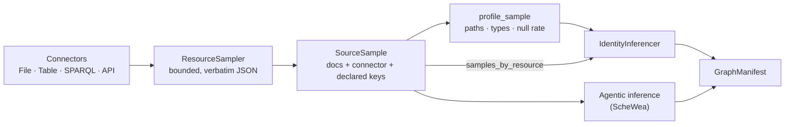

# Sampling and profiling

Before a schema can be inferred, something has to look at the data. GraFlo splits that into two
operations that are deliberately kept apart:

| | What it does | Produced by | Model |
|---|---|---|---|
| **Sampling** | Pulls a bounded set of documents from a connector, **verbatim** | `ResourceSampler` | `SourceSample` / `ResourceSample` |
| **Profiling** | Derives paths, types, null rates and cardinality from those documents | `profile_sample` | `ResourceProfile` / `FieldProfile` |

The split is what lets one code path serve both a CSV table and a paginated JSON API. A sample is
**pure JSON** — a list of flat rows for a table, an arbitrarily nested object for an API — and
nothing is flattened at the boundary. The flat, typed view is a *derived projection*, computed on
demand. Collapsing the two into a single "here are the columns and their types" model cannot
represent a hierarchical response at all.

`GraphEngine.infer_manifest()` performed this privately for PostgreSQL and nothing else could reach
it. Sampling is the same input stage, exposed, so that **any** inferencer — the algorithmic
identity inferencers, an LLM agent, a studio preview — consumes the same substrate.

## The sample

```python
from graflo.hq.graph_engine import GraphEngine

source = GraphEngine().sample_resources("data/", max_docs=100)
```

`sample_resources` dispatches on what it is given: a `PostgresConfig`, a `Bindings` block, or a
file/directory path (or list of paths). The result:

```text
source_name: sample-source
  resource='api_orders' connector='api_orders' docs=2 truncated=False
  resource='customers'  connector='customers'  docs=3 truncated=False
  resource='orders'     connector='orders'     docs=3 truncated=False
```

Three fields on `ResourceSample` carry more weight than the documents themselves:

- **`connector`** — the connector the documents came from. This is the relation that later becomes
  a [`resource_connector` binding](../index.md), so provenance survives the round trip
  instead of being reconstructed downstream. `sample_bindings` treats the existing
  `resource_connector` mapping as the authority, so what is sampled is exactly what will be
  ingested.
- **`primary_key`** / **`foreign_keys`** — what the source *declared*. A `ForeignKeyHint` is ground
  truth for edge inference; a `*_id` name-suffix guess is not, and must never be recorded here.
  PostgreSQL sampling fills both from introspection; file sampling leaves them empty.
- **`truncated`** — set when documents were dropped or string values clipped. Sampling reads one
  document past `max_docs` precisely so that a source holding exactly `max_docs` documents is
  distinguishable from one that was cut short.

`SourceSample.samples_by_resource` returns `dict[str, list[dict]]` — the input shape
[cross-resource identity inference](cross_resource_identity.md) consumes, so no adapter sits between
sampling and inference. Two caveats: it hands out the **live** document lists rather than copies, so
consumers treat them as read-only; and resource names must be unique, which `SourceSample` enforces
because keying by name would otherwise discard documents without a trace.

### Guards

Sampled documents leave the trust boundary: they land in prompts, previews and logs. Three caps
apply, all on `ResourceSampler`:

- `max_docs` (default 100) — documents per resource
- `max_cell_chars` — length of any single string value
- JSON normalization — `datetime`, `Decimal`, `memoryview`, `UUID` and numpy scalars are coerced to
  JSON-safe values, because `dict[str, Any]` accepts them but only best-effort serializes them

Files that yield no documents (an empty CSV, a `NOTES.txt`) are skipped with a warning rather than
producing an empty resource.

## The profile

```python
from graflo.architecture.onto_sample import profile_sample

profile = profile_sample(source.get("api_orders"))
```

Profiles are **path-keyed**. Nested objects extend the path with `.`; lists of objects extend it
with `[]`:

```text
max_depth: 1   nested: True

order_id        STRING  depth=0  null_ratio=0.00
customer.id     STRING  depth=1  null_ratio=0.00
customer.city   STRING  depth=1  null_ratio=0.50
items[].sku     STRING  depth=1  null_ratio=0.00
items[].qty     INT     depth=1  null_ratio=0.00
tags            LIST    depth=0  null_ratio=0.00
```

A list of *scalars* (`tags`) is typed whole as `LIST` with an `item_type`; a list of *objects*
(`items`) is descended into. `max_depth > 0` is the signal that ingestion needs
[`descend` steps](../ingestion/transforms.md) — a flat table is simply the `depth=0` case of the
same code path.

Type inference checks `bool` before `int` deliberately: `bool` is an `int` subclass in Python, so
the naive order mistypes every boolean column as `INT`.

!!! note "Types come from values, not from a declaration"
    A CSV reader yields strings, so `orders.csv` profiles `total` and `paid` as `STRING`. A
    PostgreSQL source carries real column types through introspection. Profiling describes what was
    *observed*; it does not invent a declaration the source never made.

### `flat_docs` — the bridge to identity inference

`IdentityInferencer` operates on flat records. `ResourceProfile.flat_docs` projects nested documents
onto the profile's paths, which is how an API source becomes eligible for it at all:

```python
profile.flat_docs(sample.docs)[0]
# {'order_id': 'o1', 'customer.id': 'c1', 'customer.city': 'Berlin',
#  'items[].sku': 'A-1', 'items[].qty': 2, 'tags': ['priority', 'gift']}
```

!!! warning "`unique` is a property of the sample, not of the source"
    `FieldProfile.unique` means every non-null value observed was distinct — over as few as two
    documents. Treat it as a candidate signal to be confirmed against a larger sample or a declared
    `primary_key`, never as a uniqueness constraint. `min_sample_size` in identity inference exists
    for this reason.

## Where it fits



Sampling deliberately stops short of proposing anything. What consumes it:

- **[Identity inference](../../guides/identity_inference.md)** — vertex `identity` and
  `hash_identity_properties` from flat samples.
- **[Cross-resource vertex discovery](cross_resource_identity.md)** — aligns fields across resources
  to find a shared key; consumes `samples_by_resource` directly, and uses declared
  `primary_key` / `foreign_keys` as ground truth ahead of any heuristic.
- **Agentic inference** — an external service receives a serialized `SourceSample` over the wire.
  Because the model is defined once here, the producer and the consumer cannot drift into
  disagreement.

Note the asymmetry a `SourceSample` deliberately preserves: it names connectors but does not carry
their definitions, which hold paths, DSNs and credentials. A consumer can therefore propose
resources but cannot, on its own, emit a `bindings` block — the caller that did the sampling holds
the connectors and assembles it. This is the secret-free manifest doctrine falling out of the type
system rather than being enforced by convention.

## API

| Symbol | Module |
|---|---|
| `SourceSample`, `ResourceSample`, `ForeignKeyHint` | `graflo.architecture.onto_sample` |
| `ResourceProfile`, `FieldProfile` | `graflo.architecture.onto_sample` |
| `profile_sample`, `profile_source`, `iter_paths`, `infer_field_type` | `graflo.architecture.onto_sample` |
| `ResourceSampler` (`sample_file`, `sample_files`, `sample_postgres`, `sample_connector`, `sample_bindings`) | `graflo.hq.sampler` |
| `GraphEngine.sample_resources` | `graflo.hq.graph_engine` |
