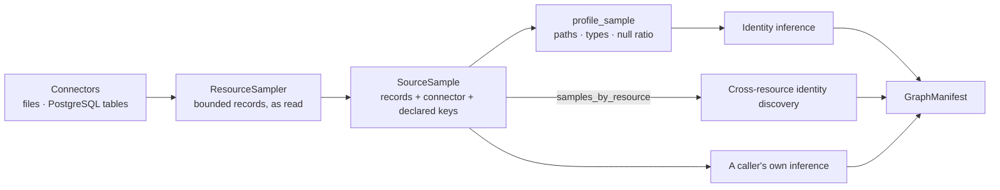

# Sampling and profiling

Before GraFlo can propose an identity or a schema, something has to read the
data. A **sample** is a bounded set of records read from a
[connector](../glossary.md#connector) and kept exactly as read. A **profile**
is derived from a sample: the field paths, their types, how often they are
null, and how many distinct values they hold. This
page is for anyone who runs inference on their own sources or builds a tool on
samples; after reading it you know what a sample holds, what caps bound it, and
how nested documents become flat records.

Keeping the two apart is what lets one code path serve a CSV table and a nested
JSON document. A sample holds whatever the source returned: flat rows from a
table, nested objects from a JSON file. Nothing is flattened when it is taken.
The flat, typed view is computed from it on demand, and can be computed again.
A single "columns and their types" model could not hold a nested document at
all.

## The sample

```python
from graflo import GraphEngine

source = GraphEngine().sample_resources("sample-source/", max_docs=100)
print("source_name:", source.source_name)
for s in source.samples:
    print(
        f"  resource={s.resource_name!r} connector={s.connector!r} "
        f"docs={len(s.docs)} truncated={s.truncated}"
    )
```

For a directory holding `customers.csv`, `orders.csv`, a nested
`api_orders.json` and a one-line `NOTES.txt`, this prints:

```text
source_name: sample-source
  resource='api_orders' connector='api_orders' docs=2 truncated=False
  resource='customers' connector='customers' docs=3 truncated=False
  resource='orders' connector='orders' docs=3 truncated=False
```

`NOTES.txt` is read as a table, yields no records and is skipped with a
warning. A file GraFlo cannot read at all, such as a `README.md`, is skipped the
same way.

`sample_resources` takes four kinds of source and returns a `SourceSample`
holding one `ResourceSample` per file or table:

- A file path, a directory path, or a list of file paths. JSON, JSON Lines, CSV
  and Parquet files are read; each sample is named after its file without the
  extension.
- A `PostgresConfig`, with `schema_name=`, samples the tables of that schema.
  `resources=[...]` limits it to some tables.
- The `bindings` block of a manifest samples each resource through the
  connector that feeds it, so what is sampled is what ingestion will read. A
  file connector contributes the first file it matches. A table connector
  needs `connection_provider=`, the same provider ingestion uses.

Besides its records, a `ResourceSample` carries:

- `connector`: the name of the connector the records came from. When a sample
  is turned into a resource, this relation becomes its `resource_connector`
  binding, so where the records came from is not lost.
- `primary_key` and `foreign_keys`: what the source declared. Sampling a
  PostgreSQL schema fills both from the real constraints; file sampling leaves
  them empty. A `ForeignKeyHint` records a declared reference, never a guess
  made from a column called `*_id`.
- `description` and `field_descriptions`: table and column comments, from
  PostgreSQL. `total_estimate`: the table's approximate row count.
- `truncated`: set when records were left out or values clipped. File sampling
  reads one record past `max_docs`, so a file that holds exactly `max_docs`
  records is not reported as cut short. PostgreSQL sampling reads `max_docs`
  rows; compare with `total_estimate` to see how much of the table you have.

`SourceSample.samples_by_resource` returns `dict[str, list[dict]]`, the input
[cross-resource identity discovery](cross_resource_identity.md) takes. It hands
out the sampled lists themselves, not copies, so treat them as read-only.
Resource names must be unique within a source; `SourceSample` rejects a
duplicate, because keying by name would drop all but the last.

### Caps

Sampled records leave the library: they end up in prompts, previews and logs.
`ResourceSampler` therefore bounds them:

- `max_docs` (default 100): records per resource. `sample_resources` passes it
  through.
- `max_cell_chars` (default 512): the length of any string value. A longer
  value is clipped, and a bytes value is replaced by a placeholder such as
  `<2048 bytes>`; either marks the sample `truncated`.
- Conversion to JSON values: dates and times become ISO strings, `Decimal`
  becomes a float, a `UUID` becomes a string, and numpy scalars become plain
  Python values.

## The profile

```python
from graflo.architecture.onto_sample import profile_sample

profile = profile_sample(source.get("api_orders"))
print("max_depth:", profile.max_depth, "nested:", profile.nested)
for f in profile.fields:
    print(f"{f.path:<15} {f.type:<7} depth={f.depth} null_ratio={f.null_ratio:.2f}")
```

A profile is keyed by path. A nested object extends the path with `.`; a list
of objects extends it with `[]`:

```text
max_depth: 1 nested: True
order_id        STRING  depth=0 null_ratio=0.00
customer.id     STRING  depth=1 null_ratio=0.00
customer.city   STRING  depth=1 null_ratio=0.50
items[].sku     STRING  depth=1 null_ratio=0.00
items[].qty     INT     depth=1 null_ratio=0.00
tags            LIST    depth=0 null_ratio=0.00
```

A list of scalars (`tags`) is typed whole as `LIST`, with an `item_type`; a
list of objects (`items`) is descended into. `max_depth` above 0 means that
ingesting this source needs `descend` steps (see
[Transforms](../ingestion/transforms.md)); a flat table is the `depth=0` case
of the same code path.

Types come from the observed values, not from a declaration. A CSV reader
yields strings, so a CSV column of amounts profiles as `STRING`, while a
PostgreSQL source returns typed values. Booleans are recognized before
integers, because `bool` is a subclass of `int` in Python and the other order
would type every boolean column as `INT`.

### From a profile to flat records

Identity inference works on flat records. `ResourceProfile.flat_docs` projects
nested documents onto the profile's paths, which is how a nested source becomes
usable for it:

```python
sample = source.get("api_orders")
profile.flat_docs(sample.docs)[0]
# {'order_id': 'o1', 'customer.id': 'c1', 'customer.city': 'Berlin',
#  'items[].sku': 'A-1', 'items[].qty': 2, 'tags': ['priority', 'gift']}
```

`flat_docs` keeps the first value per path and does not fan out lists, so one
document becomes one record.

!!! warning "`unique` describes the sample, not the source"
    `FieldProfile.unique` means every non-null value observed was distinct,
    however few records the sample holds. Treat it as a candidate to confirm
    against a larger sample or a declared `primary_key`, never as a uniqueness
    constraint. That is why identity inference has a `min_sample_size`.

## Where it fits


```mermaid
flowchart LR
    C["Connectors<br/>files · PostgreSQL tables"]
    S["ResourceSampler<br/>bounded records, as read"]
    SS["SourceSample<br/>records + connector + declared keys"]
    P["profile_sample<br/>paths · types · null ratio"]
    II["Identity inference"]
    CR["Cross-resource identity discovery"]
    AG["A caller's own inference"]
    M["GraphManifest"]

    C --> S --> SS
    SS --> P --> II --> M
    SS -- samples_by_resource --> CR --> M
    SS --> AG --> M
```

Sampling proposes nothing. What consumes it:

- [Finding a key for your data](../../guides/identity_inference.md): a vertex
  identity, or a hash, from flat records.
- [Cross-resource identity discovery](cross_resource_identity.md): aligns
  columns across resources to find a shared key; takes `samples_by_resource`
  directly and uses declared foreign keys before any heuristic.
- A caller's own inference, such as a language-model agent that receives a
  serialized `SourceSample`. The model is defined once, here, so the producer
  and the consumer of a sample cannot disagree about its shape.

A `SourceSample` names connectors but does not carry their definitions, which
hold paths, connection strings and credentials. A consumer can therefore
propose resources but cannot write a `bindings` block on its own; the caller
that did the sampling holds the connectors and assembles it. Because the sample
cannot carry secrets, neither can a manifest built from it.

## Rules and limits

- Sampling reads from the source. A `bindings` block with table connectors
  needs a `connection_provider`, the same one ingestion would use.
- Sampling reads files and PostgreSQL tables. Through `bindings`, a connector
  of another kind (API, SPARQL, Kafka) is skipped with a warning; if no
  resource could be sampled, the call raises an error that names each skipped
  resource and why.
- `profile_sample` records at most `max_paths` distinct paths (default 200) and
  marks the profile `truncated` when it reaches that cap. It keeps at most
  `max_examples` example values per path (default 3).

## API

| Symbol | Module |
|---|---|
| `SourceSample`, `ResourceSample`, `ForeignKeyHint` | `graflo.architecture.onto_sample` |
| `ResourceProfile`, `FieldProfile` | `graflo.architecture.onto_sample` |
| `profile_sample`, `profile_source`, `iter_paths`, `infer_field_type` | `graflo.architecture.onto_sample` |
| `ResourceSampler` (`sample_file`, `sample_files`, `sample_postgres`, `sample_connector`, `sample_bindings`) | `graflo.hq.sampler` |
| `GraphEngine.sample_resources` | `graflo.hq.graph_engine` |

## What to read next

- [Finding a key for your data](../../guides/identity_inference.md): the task
  samples are most often taken for.
- [Cross-resource identity discovery](cross_resource_identity.md): one
  identity for a vertex type that several resources describe.
- [Vertex identity](vertex_identity.md): what a proposed identity does when
  records are cast.
