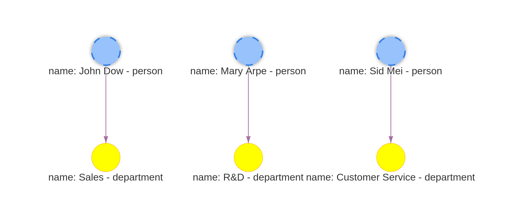

# Example 1: Multiple Tabular Sources


Suppose we have a table that represents people:


{{ read_csv('data/people.csv') }}

and a table that represents their roles in a company:

{{ read_csv('data/departments.csv') }}

We want to define vertices `Person` and `Department` and set up the rules of how to map tables to vertex key-value pairs.

Let's define vertices as

```yaml
 vertices:
 -   name: person
     properties:
     -   id
     -   name
     -   age
     identity:
     -   id
 -   name: department
     properties:
     -   name
     identity:
     -   name
```

and edges as 

```yaml
 edges:
 -   source: person
     target: department
```

The graph structure is quite simple:

{ width="200" }

Rendered graph:

{ width="700" }


Let's define the mappings: we want to map document keys onto vertex **properties**. Use vertex `from` to project source columns onto schema property names and avoid name collisions (e.g. both `Person` and `Department` have a property called `name`):

```yaml
-   name: people
    apply:
    -   vertex: person
-   name: departments
    apply:
    -   vertex: person
        "from": {id: person_id, name: person}
    -   vertex: department
        "from": {name: department}
```

Department Resource

{ width="700" }

People Resource

{ width="200" }


Transforming the data and ingesting it into an ArangoDB takes a few lines of code:

```python
from suthing import FileHandle
from graflo import Caster, Bindings, GraphManifest
from graflo.db.connection.onto import ArangoConfig

manifest = GraphManifest.from_config(FileHandle.load("manifest.yaml"))
manifest.finish_init()
schema = manifest.require_schema()
ingestion_model = manifest.require_ingestion_model()

# Option 1: Load config from docker/arango/.env (recommended)
conn_conf = ArangoConfig.from_docker_env()

# Option 2: Load from environment variables
# Set: ARANGO_URI, ARANGO_USERNAME, ARANGO_PASSWORD, ARANGO_DATABASE
# conn_conf = ArangoConfig.from_env()

# Option 3: Create config directly
# conn_conf = ArangoConfig(
#     uri="http://localhost:8535",
#     username="root",
#     password="123",
#     database="mygraph",  # For ArangoDB, 'database' maps to schema/graph
# )

# Create bindings with file connectors
from graflo.architecture.contract.bindings import FileConnector
import pathlib

bindings = Bindings()
people_connector = FileConnector(regex="^people.*\.csv$", sub_path=pathlib.Path("."))
bindings.add_connector(
    people_connector,
)
bindings.bind_resource("people", people_connector)
departments_connector = FileConnector(
    regex="^dep.*\.csv$", sub_path=pathlib.Path(".")
)
bindings.add_connector(
    departments_connector,
)
bindings.bind_resource("departments", departments_connector)

# Or initialize via connectors + resource_connector
# bindings = Bindings(
#     connectors=[
#         FileConnector(
#             name="people_files",
#             regex="^people.*\\.csv$",
#             sub_path=pathlib.Path("."),
#         ),
#         FileConnector(
#             name="departments_files",
#             regex="^dep.*\\.csv$",
#             sub_path=pathlib.Path("."),
#         ),
#     ],
#     resource_connector=[
#         {"resource": "people", "connector": "people_files"},
#         {"resource": "departments", "connector": "departments_files"},
#     ],
# )

from graflo.hq.caster import IngestionParams

caster = Caster(schema=schema, ingestion_model=ingestion_model)

ingestion_params = IngestionParams(
    clear_data=True,  # Clear existing data before ingesting
    # max_items=1000,  # Optional: limit number of items to process
)

caster.ingest(
    target_db_config=conn_conf,  # Target database config
    bindings=bindings,  # Source data bindings
    ingestion_params=ingestion_params,
)

```

Please refer to [examples](https://github.com/growgraph/graflo/tree/main/examples/1-ingest-csv)

For more examples and detailed explanations, refer to the [API Reference](../reference/index.md). 