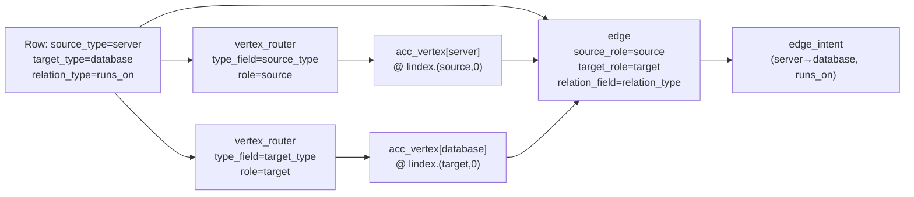

# Example 11: Dynamic Vertex Types and Dynamic Edge Types per Row

**What this shows:** each row carries **dynamic** source vertex type, target vertex type, and relation name (e.g. `source_type`, `target_type`, `relation_type`). Two `vertex_router` steps fill role-named accumulator slots; a single dynamic `edge` step reads those roles and emits the edge.

## When to use this pattern

Use this pattern when:

- **Vertex types vary by row** — type names live in columns (`source_type`, `target_type`), not in separate resources or fixed pipeline branches.
- **Relation labels vary by row** — the relation name comes from a column (`relation_field`).
- You want a small, declarative pipeline: **`vertex_router` + `vertex_router` + `edge`**.

For polymorphic *objects* that split across vertex vs. edge tables, see [Example 7](example-7.md).

## Data

### relations.csv

Each row is one relationship: source endpoint, target endpoint, and relation name. Column meanings: `source_type` / `target_type` — vertex type names; `source_id` / `target_id` — vertex IDs; `desc_*` — descriptions; `relation_type` — relation name (matches `examples/11-flat-row-dynamic-edge/relations.csv`).

| source_type | source_id | desc_source | target_type | target_id | desc_target | relation_type |
|-------------|-----------|-------------|-------------|-----------|-------------|---------------|
| server | s1 | Web server | database | d1 | Primary DB | runs_on |
| server | s2 | App server | database | d2 | Replica DB | runs_on |
| server | s1 | Web server | database | d2 | Replica DB | replicates |

```csv
source_type,source_id,desc_source,target_type,target_id,desc_target,relation_type
server,s1,Web server,database,d1,Primary DB,runs_on
server,s2,App server,database,d2,Replica DB,runs_on
server,s1,Web server,database,d2,Replica DB,replicates
```

## Schema (manifest.yaml)

```yaml
schema:
  metadata:
    name: flat_row_dynamic_edge
  graph:
    vertex_config:
      vertices:
        - name: server
          properties: [id, desc]
          identity: [id]
        - name: database
          properties: [id, desc]
          identity: [id]
    edge_config:
      edges:
        - source: server
          target: database
          relation: runs_on
        - source: server
          target: database
          relation: replicates
  db_profile: {}

ingestion_model:
  resources:
    - name: relations
      pipeline:
        - vertex_router:
            type_field: source_type
            role: source
            from:
              id: source_id
              desc: desc_source
        - vertex_router:
            type_field: target_type
            role: target
            from:
              id: target_id
              desc: desc_target
        - edge:
            source_role: source
            target_role: target
            relation_field: relation_type

bindings:
  connectors:
    - regex: "^relations\\.csv$"
      sub_path: .
      resource_name: relations
```

## How it works



1. **`vertex_router` (`type_field: source_type`, `role: source`)**: reads `source_type` → `server`, projects with `from: {id: source_id, desc: desc_source}`, stores vertex at `lindex.(source, 0)`.
2. **`vertex_router` (`type_field: target_type`, `role: target`)**: reads `target_type` → `database`, projects with `from: {id: target_id, desc: desc_target}`, stores vertex at `lindex.(target, 0)`.
3. **`edge` (dynamic slot mode)**: scans `acc_vertex` for data at `lindex.(source, 0)` → finds `server`; same for `target` → finds `database`. Reads `relation_type` (e.g. `runs_on`). Emits edge intent `(server→database, runs_on)` (or `replicates` on the third row).

## Key configuration fields

| Field | On | Purpose |
|---|---|---|
| `type_field` | `vertex_router` | Column holding the vertex type discriminator |
| `role` | `vertex_router` | Slot name for accumulation/addressing (`lindex.(role, 0)`) |
| `source_role` | `edge` | Source slot name; should match upstream `vertex_router.role` |
| `target_role` | `edge` | Target slot name; should match upstream `vertex_router.role` |
| `relation_field` | `edge` | Document field holding the relation name per row |
| `relation_map` | `edge` | (optional) Map raw relation values to canonical names |
| `strict_edge_types` | `edge` | (optional) Skip rows whose `(source, target)` pair was not pre-declared |

## Running the example

Requires a running graph database. Start ArangoDB locally (e.g. via Docker) and set the connection env vars, then:

```bash
cd examples/11-flat-row-dynamic-edge
uv run python ingest.py
```

Expected output:

```
Ingestion complete!
Schema: flat_row_dynamic_edge
Vertices: ['server', 'database']
```

## Key Takeaways

1. **Dynamic vertex types** — each `vertex_router` reads the type discriminator from `type_field` and stores into a role slot.
2. **Dynamic edge / relation** — `source_role`, `target_role`, and `relation_field` on `edge` resolve types and relation from the row at extraction time.
3. **`vertex_router` + dynamic `edge`** is the usual pattern when type and relation names are **data**, not fixed pipeline structure.
4. **`relation_map`** (not shown here) can normalize raw values (e.g. `RUNS_ON` → `runs_on`) before they are used as relation labels.

## Related examples

- [Example 7](example-7.md): Polymorphic objects with `vertex_router` + dynamic `edge` when vertex and edge data live in different tables.
- [Example 3](example-3.md): Static edge with `relation_field` for simple tabular relations.
