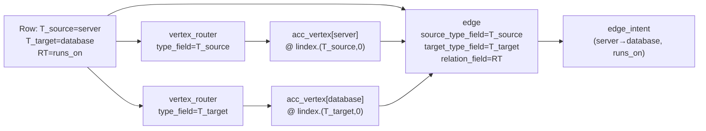

# Example 11: Flat-row Dynamic Edges with `vertex_router` + dynamic `EdgeActor`

This example demonstrates the **flat-row dynamic edge** pattern: each CSV row encodes a complete `(source-vertex, target-vertex, relation)` tuple. Two `vertex_router` steps accumulate the endpoint vertices into accumulator slots keyed by their `type_field`; a single `edge` step with `source_type_field` / `target_type_field` resolves vertex types from those slots and creates the edge — no `edge_router` required.

## When to use this pattern

Use this pattern when:
- Data arrives pre-joined (one row = one complete edge relationship)
- Source and target vertex types vary per row (e.g. `T_source` column holds the type name)
- You want a clean, declarative pipeline using `vertex_router` + `edge`

For polymorphic objects that need separate resources for vertices vs. edges, see [Example 7](example-7.md).

## Data

### relations.csv

Each row is a self-contained relationship tuple. `T_source`/`T_target` hold vertex type names; `I_source`/`I_target` hold vertex IDs; `RT` holds the relation name:

```csv
T_source,I_source,desc_source,T_target,I_target,desc_target,RT
server,s1,Web server,database,d1,Primary DB,runs_on
server,s2,App server,database,d2,Replica DB,runs_on
server,s1,Web server,database,d2,Replica DB,replicates
```

## Schema (manifest.yaml)

```yaml
schema:
  metadata:
    name: flat_row_dynamic_edge
  graph:
    vertex_config:
      vertices:
        - name: server
          properties: [id, desc]
          identity: [id]
        - name: database
          properties: [id, desc]
          identity: [id]
    edge_config:
      edges:
        - source: server
          target: database
          relation: runs_on
        - source: server
          target: database
          relation: replicates
  db_profile: {}

ingestion_model:
  resources:
    - name: relations
      pipeline:
        - vertex_router:
            type_field: T_source       # vertex stored at lindex.(T_source, 0)
            field_map:
              I_source: id
              desc_source: desc
        - vertex_router:
            type_field: T_target       # vertex stored at lindex.(T_target, 0)
            field_map:
              I_target: id
              desc_target: desc
        - edge:
            source_type_field: T_source   # scan acc_vertex at lindex.(T_source, 0)
            target_type_field: T_target   # scan acc_vertex at lindex.(T_target, 0)
            relation_field: RT

bindings:
  connectors:
    - regex: "^relations\\.csv$"
      sub_path: .
      resource_name: relations
```

## How it works



1. **`vertex_router` (type_field=T_source)**: reads `T_source` → `server`, projects `{I_source→id, desc_source→desc}`, stores vertex at `lindex.(T_source, 0)`.
2. **`vertex_router` (type_field=T_target)**: reads `T_target` → `database`, projects fields, stores vertex at `lindex.(T_target, 0)`.
3. **`edge` (dynamic slot mode)**: scans `acc_vertex` for data at `lindex.(T_source, 0)` → finds `server`; same for `T_target` → finds `database`. Reads `RT` → `runs_on`. Emits edge intent `(server→database, runs_on)`.

## Key configuration fields

| Field | On | Purpose |
|---|---|---|
| `type_field` | `vertex_router` | Column holding the vertex type; also names the accumulator slot (`lindex.(type_field, 0)`) |
| `source_type_field` | `edge` | Must equal the `type_field` of the upstream VRA for the source entity |
| `target_type_field` | `edge` | Must equal the `type_field` of the upstream VRA for the target entity |
| `relation_field` | `edge` | Document field holding the relation name per row |
| `relation_map` | `edge` | (optional) Map raw relation values to canonical names |
| `strict_edge_types` | `edge` | (optional) Skip rows whose `(source, target)` pair was not pre-declared |

## Running the example

Requires a running graph database. Start ArangoDB locally (e.g. via Docker) and set the connection env vars, then:

```bash
cd examples/11-flat-row-dynamic-edge
uv run python ingest.py
```

Expected output:

```
Ingestion complete!
Schema: flat_row_dynamic_edge
Vertices: ['server', 'database']
```

## Key Takeaways

1. **`type_field` on `vertex_router`** serves double duty: it names both the column to read the vertex type from AND the accumulator slot (`lindex.(type_field, 0)`) where the vertex is stored.
2. **`source_type_field` / `target_type_field` on `edge`** reference those slot names — which equal the VRA `type_field` values — to dynamically resolve vertex types at extraction time.
3. The combination of `vertex_router` + dynamic `edge` is the standard pattern for flat-row data — clean, composable, and symmetric with how other actor types work.
4. **`relation_map`** (not shown here) can normalize raw values (e.g. `RUNS_ON` → `runs_on`) before they are used as relation labels.

## Related examples

- [Example 7](example-7.md): Polymorphic objects with `vertex_router` + dynamic `edge` for separate vertex/edge tables.
- [Example 3](example-3.md): Static edge with `relation_field` for simple tabular relations.
