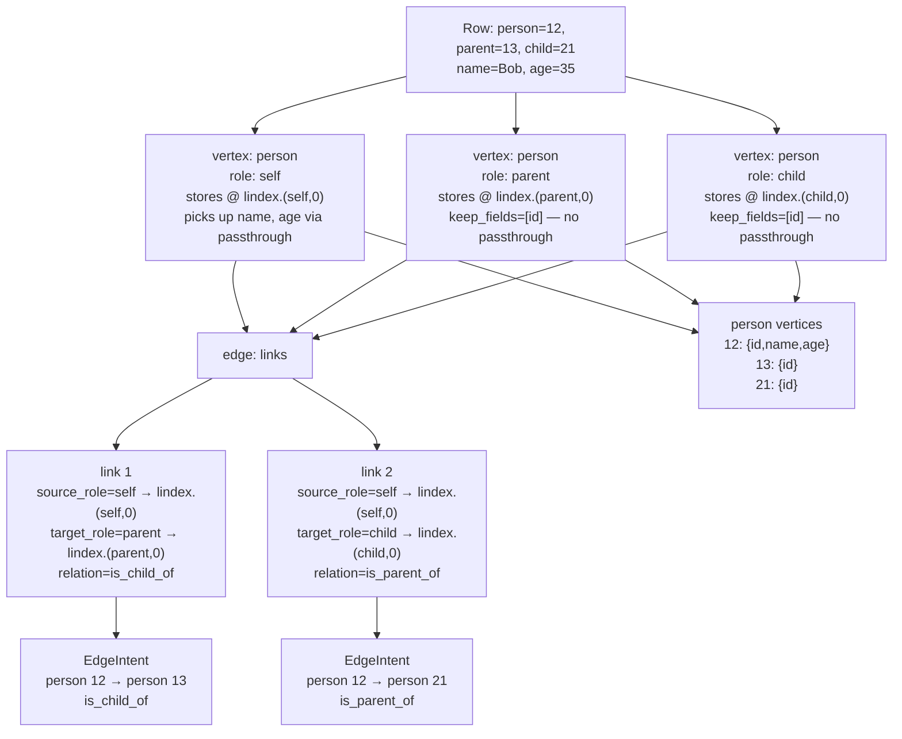

# Example 12: Vertex Roles and Multi-intent Edges

**The problem:** a plain **`vertex`** step (and **`vertex_router`**) only materializes **one vertex per vertex type per pipeline level** — one accumulator slot per type. If a single row must create **several** vertices of the **same** type (e.g. self, parent, and child are all `person`), those steps would collide in the same slot. **`role`** gives each logical endpoint its **own named slot** (`self`, `parent`, `child`) while keeping a single declared vertex type.

**What this shows:**

- **`role` on a `vertex` step** — separate named accumulator slots for multiple same-type vertices in one row, without `vertex_router`.
- **`links` on an `edge` step** — several source→target→relation intents in one step, emitting one edge per link per row.

## When to use this pattern

Use this pattern when:

- One row holds **several endpoints of the same vertex type** (family: person, parent, child) and you need distinct slots for each.
- The same row must emit **multiple edge types** between those endpoints.
- Vertex type is **fixed in the schema** — if the type name varies per row, use `vertex_router` ([Example 11](example-11.md)).

## Data

### family_edges.csv

Source file: `docs/examples/data/family_edges.csv` (same content as `examples/12-vertex-roles-multi-edge/family_edges.csv`).

Each row is one “focal” person (`person`), their parent (`parent`), their child (`child`), plus metadata (`name`, `age`) for the focal row.

| person | parent | child | name | age |
|--------|--------|-------|------|-----|
| 12 | 13 | 21 | Bob | 35 |
| 13 | 15 | 12 | Alice | 62 |
| 21 | 12 | 24 | Carol | 10 |

```csv
person,parent,child,name,age
12,13,21,Bob,35
13,15,12,Alice,62
21,12,24,Carol,10
```

## Schema Configuration

### Vertices

One vertex type covers all three roles:

```yaml
vertex_config:
  vertices:
    - name: person
      properties:
        - id
        - name
        - age
      identity:
        - id
```

### Edges

Two logical edges between `person` and `person`:

```yaml
edge_config:
  edges:
    - source: person
      target: person
      relation: is_child_of
    - source: person
      target: person
      relation: is_parent_of
```

## Resource Mapping

```yaml
resources:
  - name: family_edges
    infer_edges: false
    pipeline:
      # Three vertices of the same type, three distinct roles.
      # 'from' is {vertex_field: doc_field}; only mismatched names need listing.
      # Remaining vertex properties (name, age) are picked up by passthrough for 'self'.
      - vertex: person
        role: self
        from:
          id: person

      # keep_fields restricts passthrough so 'name' and 'age' from the row are
      # not incorrectly attributed to the parent / child placeholders.
      - vertex: person
        role: parent
        from:
          id: parent
        keep_fields:
          - id

      - vertex: person
        role: child
        from:
          id: child
        keep_fields:
          - id

      # Both relationship types declared in one edge step.
      - edge:
          links:
            - source_role: self
              target_role: parent
              relation: is_child_of
            - source_role: self
              target_role: child
              relation: is_parent_of
```

## How it works



Step by step for row `person=12, parent=13, child=21, name=Bob, age=35`:

1. **`vertex: person, role: self`** — renames `person → id`, then picks up `name=Bob` and `age=35` via passthrough. Stores at `lindex.(self, 0)`. Extraction reads from an effective merged observation (raw row + same-location transform output).
2. **`vertex: person, role: parent`** — renames `parent → id`. `keep_fields: [id]` prevents `name`/`age` leaking in. Stores at `lindex.(parent, 0)`.
3. **`vertex: person, role: child`** — renames `child → id`. `keep_fields: [id]` restricts passthrough. Stores at `lindex.(child, 0)`.
4. **`edge: links`** — link 1 scans `acc_vertex` at `lindex.(self, 0)` and `lindex.(parent, 0)`, emits `(person 12 → person 13, is_child_of)`. Link 2 scans `self` and `child` slots, emits `(person 12 → person 21, is_parent_of)`.

## Key configuration fields

| Field | On | Purpose |
|---|---|---|
| `role` | `vertex` | Named accumulator slot — `lindex.(role, 0)`. Enables multiple same-type vertices per row. |
| `from` | `vertex` | Field rename map `{vertex_field: doc_field}`. Only mismatches need listing; matching names flow through automatically. |
| `keep_fields` | `vertex` | Restrict passthrough to this field subset. Use on role-vertex steps that should only absorb their own explicit columns. |
| `source_role` | `edge` link | Slot name for the source vertex — alias for `source_type_field` when the slot is populated by `vertex+role`. |
| `target_role` | `edge` link | Slot name for the target vertex. |
| `links` | `edge` | List of per-link bindings. Each link emits one edge intent per row. Mutually exclusive with top-level `from`/`to`/`source_type_field`. |

### `from` direction

`from` on a `vertex` step maps `{vertex_field: doc_field}`:

```yaml
from:
  id: person   # vertex property 'id' = CSV column 'person'
```

Fields whose names already match a vertex property are absorbed automatically by passthrough — they do not need to appear in `from`.

### Passthrough behaviour with `role`

Vertex extraction reads from an effective merged observation (raw row + same-location transform output). On key conflicts, transform-derived values have priority over raw row values, and passthrough no longer relies on mutating the incoming row dict.

For extraction internals, edge assembly now reads row-level merged observation values from `obs_buffer` keyed by `LocationIndex`; `VertexRep` remains a pure vertex payload carrier.

Use `keep_fields` on role-vertex steps that should ignore some vertex properties from the shared row.

## Running the example

Requires a running graph database. Start ArangoDB locally (e.g. via Docker) and set the connection env vars, then:

```bash
cd examples/12-vertex-roles-multi-edge
uv run python ingest.py
```

Expected output:

```
Ingestion complete!
Schema: vertex_roles_multi_edge
Vertices: ['person']
Edges: [('person', 'person', 'is_child_of'), ('person', 'person', 'is_parent_of')]
```

## Key Takeaways

1. **One slot per type per level** — without `role`, multiple `person` endpoints in one row would share the same accumulator; **`role` names separate slots** for the same vertex type.
2. **`role` on `vertex`** is the static-type counterpart to routing by type: use it when the type is fixed in the schema but the row encodes **several instances** of that type.
3. **`source_role` / `target_role` on `edge`** reference those slots — sugar for `source_type_field` / `target_type_field` with the same runtime behavior.
4. **`links` on `edge`** replaces two or more near-identical edge steps with one block; each link is an independent binding.
5. **`keep_fields`** prevents properties from bleeding between role steps that share one document.
6. **`from` only lists renames** — vertex properties whose names already match a CSV column are absorbed automatically; `{name: name}` is redundant.

## Related examples

- [Example 11](example-11.md): Dynamic vertex and relation types per row with `vertex_router` + `source_type_field` / `target_type_field`.
- [Example 7](example-7.md): Polymorphic objects with `vertex_router` + dynamic `edge` across multiple vertex types.
- [Example 3](example-3.md): Static edge with `relation_field` for tabular data where the relation label comes from a column.
