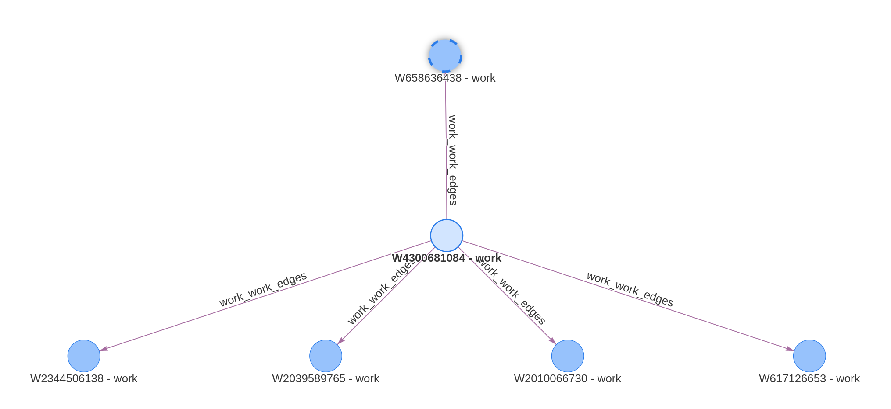

# Example 2: JSON with Edges between the same Vertex Type

Openalex is a comprehensive academic dataset. One of categories of their API entities is [Works](https://docs.openalex.org/api-entities/works). 
Suppose we want to create a graph that contains a description of academic works and correctly map the references to works that either already exist in the database or will be populated later:

```json
{
    "id": "https://openalex.org/W4300681084",
    "doi": "https://doi.org/10.15460/hup.78",
    "publication_date": "2006-01-23",
    "referenced_works": [
        "https://openalex.org/W617126653",
        "https://openalex.org/W658636438",
        "https://openalex.org/W2010066730",
        "https://openalex.org/W2039589765",
        "https://openalex.org/W2344506138"
    ],
}
```

In this example we will be interested in how to create vertices `Work` and `Work` &rarr; `Work` edges.

Let's define vertices as

```yaml
 vertices:
 -   name: work
     fields:
     -   _key
     -   doi
     indexes:
     -   fields:
         -   _key
     -   unique: false
         fields:
         -   doi
```

The graph structure is quite simple:

{ width="200" }

Rendered graph:

{ width="700" }

We will be using a transformation that truncates the suffix from a url, e.g. "https://openalex.org/W4300681084" &rarr; "W4300681084". Define reusable transforms as a list under `ingestion_model.transforms`, where each transform has a `name`:

```yaml
transforms:
    -   name: keep_suffix_id
        foo: split_keep_part
        module: graflo.util.transform
        params:
            sep: "/"
            keep: -1
        input:
        -   id
        output:
        -   _key
```

Let's define the mappings. We will apply `keep_suffix_id` to `id` and `doi` fields in several places with slightly different parameters. We will map the corresponding values to define instances of `work` vertex and define edges `work` &rarr; `work`. 

```yaml
-   name: work
    apply:
    -   transform:
            call:
                use: keep_suffix_id
    -   transform:
            call:
                use: keep_suffix_id
                params:
                    sep: "/"
                    keep: [-2, -1]
                input:
                -   doi
                output:
                -   doi
    -   vertex: work
    -   key: referenced_works
        apply:
        -   vertex: work
        -   transform:
                call:
                    use: keep_suffix_id
    -   source: work
        target: work
```

Works Resource

{ width="800" }


Now as you noticed the document has a nested list under `referenced_works`. To handle this, we use a `DescendActor` (`key: referenced_works`) that applies the same named transform and then maps nested values to `work` vertices. The final `source: work` / `target: work` step materializes work-to-work references.
Transforming the data and ingesting it into an ArangoDB takes a few lines of code:

```python
from suthing import FileHandle
from graflo import Caster, Bindings, GraphManifest
from graflo.db.connection.onto import ArangoConfig, DBConfig

manifest = GraphManifest.from_config(FileHandle.load("manifest.yaml"))
manifest.finish_init()
schema = manifest.require_schema()
ingestion_model = manifest.require_ingestion_model()

caster = Caster(schema=schema, ingestion_model=ingestion_model)

# Load config from file
config_data = FileHandle.load("../arango.creds.json")
conn_conf = DBConfig.from_dict(config_data)
# Ensure it's an ArangoConfig
if not isinstance(conn_conf, ArangoConfig):
    raise ValueError(f"Expected ArangoConfig, got {type(conn_conf)}")

# Or use from_docker_env() (recommended)
# conn_conf = ArangoConfig.from_docker_env()

from graflo.architecture.bindings import FileConnector
import pathlib

bindings = Bindings()
bindings.add_file_connector(
    "work",
    FileConnector(regex="\Sjson$", sub_path=pathlib.Path("."), resource_name="work")
)

from graflo.hq.caster import IngestionParams

ingestion_params = IngestionParams(
    clear_data=True,  # Clear existing data before ingesting
)

caster.ingest(
    target_db_config=conn_conf,  # Target database config
    bindings=bindings,  # Source data bindings
    ingestion_params=ingestion_params,
)
```

Please refer to [examples](https://github.com/growgraph/graflo/tree/main/examples/1-ingest-csv)

For more examples and detailed explanations, refer to the [API Reference](../reference/index.md). 