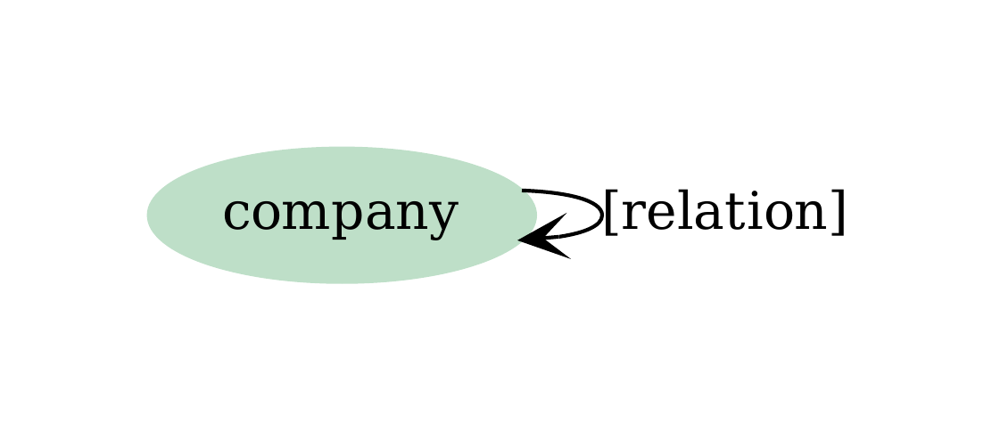

# Example 3: CSV with Edge Weights and Multiple Relations

This example demonstrates how to handle complex relationships where multiple edges can exist between the same pair of entities, each with different relation types and weights.

## Data Structure

We have a CSV file representing business relationships between companies:


{{ read_csv('data/relations.csv') }}

Notice that the same company pairs can have multiple different relationship types (e.g., Microsoft-OpenAI has both "invests_in" and "partners_with" relationships).

## Schema Configuration

### Vertices
We define a simple `company` vertex:

```yaml
vertex_config:
    vertices:
    -   name: company
        fields:
        -   name
```

### Edges
The key feature here is using `relation_field` to dynamically create different edge types:

```yaml
edge_config:
    edges:
    -   source: company
        target: company
        relation_field: relation
        weights:
            direct:
            -   date
```

## Key Concepts

### `relation_field` Attribute
The `relation_field: relation` tells graflo to:

- Read the `relation` column from the CSV
- Create different edge types based on the values in that column
- Instead of a single edge type, we get multiple edge types: `invests_in`, `partners_with`, `acquires`, etc.

### Edge Weights
The `weights.direct: [date]` configuration:

- Adds the `date` field as a weight property on each edge
- This allows temporal analysis of relationships
- The date becomes a property that can be used for filtering, sorting, or analysis

## Resource Mapping

The resource configuration maps the CSV columns to vertices and edges:

```yaml
resources:
-   resource_name: relations
    apply:
    -   target_vertex: company
        map:
            company_a: name
    -   target_vertex: company
        map:
            company_b: name
```

This creates two company vertices for each row and establishes the relationship between them.

## Graph Structure

The resulting graph structure shows multiple relationship types between the same entities:

{ width="200" }

## Resource Structure

The resource mapping creates a clear structure for processing the CSV data:

{ width="700" }

## Data Ingestion

The ingestion process is straightforward:

```python
from suthing import FileHandle
from graflo import Caster, Patterns, Schema
from graflo.db.connection.onto import Neo4jConfig

schema = Schema.from_dict(FileHandle.load("schema.yaml"))

# Load config from docker/neo4j/.env (recommended)
conn_conf = Neo4jConfig.from_docker_env()

# Or create config directly
# conn_conf = Neo4jConfig(
#     uri="bolt://localhost:7688",
#     username="neo4j",
#     password="test!passfortesting",
#     bolt_port=7688,
# )

from graflo.util.onto import FilePattern
import pathlib

patterns = Patterns()
patterns.add_file_pattern(
    "people",
    FilePattern(regex="^relations.*\.csv$", sub_path=pathlib.Path("."), resource_name="people")
)

from graflo.hq.caster import IngestionParams

caster = Caster(schema)

ingestion_params = IngestionParams(
    recreate_schema=True,  # Wipe existing schema before defining and ingesting
)

caster.ingest(
    target_db_config=conn_conf,  # Target database config
    patterns=patterns,  # Source data patterns
    ingestion_params=ingestion_params,
)
```

## Use Cases

This pattern is particularly useful for:
 
- **Business Intelligence**: Tracking multiple types of relationships between companies
- **Temporal Analysis**: Analyzing how relationships evolve over time
- **Network Analysis**: Understanding complex business ecosystems
- **Compliance**: Tracking different types of business arrangements

## Key Takeaways

1. **`relation_field`** enables dynamic edge type creation from data
2. **Multiple edges** can exist between the same vertex pair
3. **Edge weights** add temporal or quantitative properties to relationships
4. **Flexible modeling** supports complex real-world business scenarios

Please refer to [examples](https://github.com/growgraph/graflo/tree/main/examples/3-ingest-csv-edge-weights)

For more examples and detailed explanations, refer to the [API Reference](../reference/index.md).
