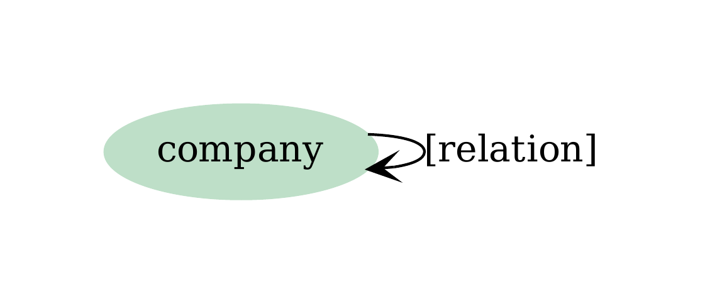
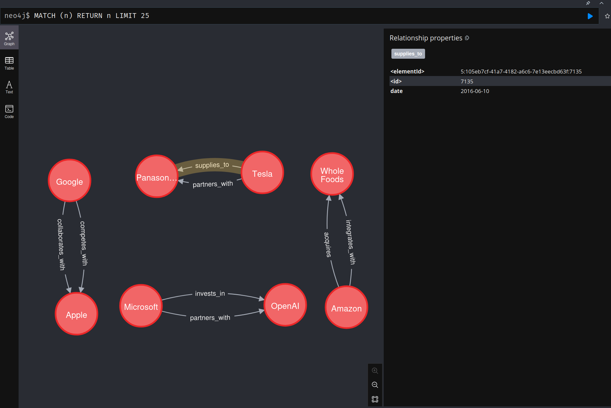

# Example 3: CSV with Edge Properties and Multiple Relations

This example demonstrates how to handle complex relationships where multiple edges can exist between the same pair of entities, each with different relation types and relationship attributes.

## Data Structure

We have a CSV file representing business relationships between companies:


{{ read_csv('data/relations.csv') }}

Notice that the same company pairs can have multiple different relationship types (e.g., Microsoft-OpenAI has both "invests_in" and "partners_with" relationships).

## Schema Configuration

### Vertices
We define a simple `company` vertex:

```yaml
vertex_config:
    vertices:
    -   name: company
        properties:
        -   name
        identity:
        -   name
```

### Edges
Logical edges declare **`properties`** (relationship attributes) and, when needed, an **`identities`** key so parallel relationships stay distinct. Dynamic relationship **types** from a CSV column are configured on the **edge step** in the resource pipeline with **`relation_field`** (not on the logical `Edge`).

```yaml
edge_config:
    edges:
    -   source: company
        target: company
        identities:
        -   -   relation
        properties:
        -   date
```

## Key Concepts

### `relation_field` on the edge step
In the resource pipeline, `relation_field: relation` on the `source`/`target` step tells GraFlo to:

- Read the `relation` column from the CSV
- Use its values as the relationship type for that row
- Produce multiple relationship types from one edge definition: `invests_in`, `partners_with`, `acquires`, etc.

### Edge `properties`
The `properties: [date]` entry on the edge:

- Declares `date` as a relationship attribute on each emitted edge
- Supports temporal analysis and filtering/sorting on that attribute

## Resource Mapping

The resource configuration maps the CSV columns to vertices and edges:

```yaml
resources:
-   name: relations
    apply:
    -   vertex: company
        "from": {name: company_a}
    -   vertex: company
        "from": {name: company_b}
    -   source: company
        target: company
        relation_field: relation
```

This creates two company vertices for each row and establishes the relationship between them.

## Graph Structure

The resulting graph structure shows multiple relationship types between the same entities:

{ width="200" }

Rendered graph:

{ width="700" }

## Resource Structure

The resource mapping creates a clear structure for processing the CSV data:

{ width="700" }

## Data Ingestion

The ingestion process is straightforward:

```python
from suthing import FileHandle
from graflo import Caster, Bindings, GraphManifest
from graflo.db.connection.onto import Neo4jConfig

manifest = GraphManifest.from_config(FileHandle.load("manifest.yaml"))
manifest.finish_init()
schema = manifest.require_schema()
ingestion_model = manifest.require_ingestion_model()

# Load config from docker/neo4j/.env (recommended)
conn_conf = Neo4jConfig.from_docker_env()

# Alternative: Grafeo (embedded, no server needed)
# from graflo.db.connection.onto import GrafeoConfig
# conn_conf = GrafeoConfig(path="graph.grafeo")  # or GrafeoConfig.in_memory()

# Or create config directly
# conn_conf = Neo4jConfig(
#     uri="bolt://localhost:7688",
#     username="neo4j",
#     password="test!passfortesting",
#     bolt_port=7688,
# )

from graflo.architecture.contract.bindings import FileConnector
import pathlib

bindings = Bindings()
relations_connector = FileConnector(
    name="relations_files",
    regex="^relations.*\\.csv$",
    sub_path=pathlib.Path("."),
)
bindings.add_connector(relations_connector)
bindings.bind_resource("relations", relations_connector)

from graflo.hq.caster import IngestionParams

caster = Caster(schema=schema, ingestion_model=ingestion_model)

ingestion_params = IngestionParams(
    clear_data=True,  # Clear existing data before ingesting
)

caster.ingest(
    target_db_config=conn_conf,  # Target database config
    bindings=bindings,  # Source data bindings
    ingestion_params=ingestion_params,
)
```

## Use Cases

This connector is particularly useful for:
 
- **Business Intelligence**: Tracking multiple types of relationships between companies
- **Temporal Analysis**: Analyzing how relationships evolve over time
- **Network Analysis**: Understanding complex business ecosystems
- **Compliance**: Tracking different types of business arrangements

## Key Takeaways

1. **`relation_field`** on the edge step enables dynamic relationship types from data
2. **Multiple edges** can exist between the same vertex pair
3. **Edge `properties`** declare temporal or quantitative attributes on relationships
4. **Flexible modeling** supports complex real-world business scenarios

Please refer to [examples](https://github.com/growgraph/graflo/tree/main/examples/3-ingest-csv-edge-weights)

For more examples and detailed explanations, refer to the [API Reference](../reference/index.md).
