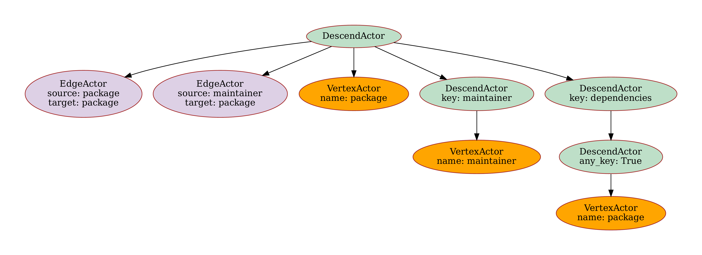

# Example 4: Dynamic Relations from Keys (Neo4j)

This example demonstrates how to ingest complex nested JSON data into Neo4j, using the `relation_from_key` attribute to dynamically create relationships based on the structure of the data.

## Data Structure

We're working with Debian package metadata that contains complex nested structures:

```json
{
  "name": "0ad-data",
  "version": "0.0.26-1",
  "dependencies": {
    "pre-depends": [
      {
        "name": "dpkg",
        "version": ">= 1.15.6~"
      }
    ],
    "suggests": [
      {
        "name": "0ad"
      }
    ]
  },
  "description": "Real-time strategy game of ancient warfare (data files)",
  "maintainer": {
    "name": "Debian Games Team",
    "email": "pkg-games-devel@lists.alioth.debian.org"
  }
}
```

## Schema Configuration

### Vertices
We define three vertex types:

```yaml
vertex_config:
    vertices:
    -   name: package
        fields:
        -   name
        -   version
        indexes:
        -   fields:
            -   name
    -   name: maintainer
        fields:
        -   name
        -   email
        indexes:
        -   fields:
            -   email
    -   name: bug
        fields:
        -   id
        -   subject
        -   severity
        -   date
        indexes:
        -   fields:
            -   id
```

### Edges
Edges are defined in a simple way:

```yaml
edge_config:
    edges:
    -   source: package
        target: package
    -   source: maintainer
        target: package
    -   source: package
        target: bug
```
### Graph Structure

The resulting graph shows the following package dependency relationships:

{ width="200" }


## Resource (Nested Structure)

### Nested Structure Handling
The resource configuration handles deeply nested data. There are two approaches:

#### Approach 1: Explicit Key Listing
You can explicitly list each key you want to process:

```yaml
resources:
-   resource_name: package
    apply:
    -   vertex: package
    -   key: dependencies
        apply:
        -   key: breaks
            apply:
            -   vertex: package
        -   key: conflicts
            apply:
            -   vertex: package
        -   key: depends
            apply:
            -   vertex: package
        -   key: pre-depends
            apply:
            -   vertex: package
        -   key: suggests
            apply:
            -   vertex: package
        -   key: recommends
            apply:
            -   vertex: package
    -   source: maintainer
        target: package
    -   source: package
        target: package
        relation_from_key: true
    -   key: maintainer
        apply:
        -   vertex: maintainer
```

#### Approach 2: Using `any_key` (Simplified)
Alternatively, you can use `any_key: true` to process all keys in the dictionary automatically:

```yaml
resources:
-   resource_name: package
    apply:
    -   vertex: package
    -   key: dependencies
        apply:
        -   any_key: true
            apply:
            -   vertex: package
    -   source: maintainer
        target: package
    -   source: package
        target: package
        relation_from_key: true
    -   key: maintainer
        apply:
        -   vertex: maintainer
```

The `any_key: true` approach is more concise and automatically handles all keys in the `dependencies` dictionary (e.g., `breaks`, `conflicts`, `depends`, `pre-depends`, `suggests`, `recommends`, and any future keys) without needing to list them explicitly.

We use `relation_from_key: true` to:

- Use the JSON keys as relationship types
- Create different edge types based on the nested structure
- Instead of a single edge type, we get multiple edge types: `breaks`, `conflicts`, `depends`, `pre-depends`, `suggests`, `recommends`


## How It Works

1. **Package Creation**: Each package becomes a vertex
2. **Dynamic Relations**: Each dependency type (`breaks`, `conflicts`, etc.) becomes a relationship type
3. **Maintainer Links**: Maintainer information creates `maintainer` → `package` relationships
4. **Bug Tracking**: Bug reports create `package` → `bug` relationships

## Resource Structure

The resource mapping handles complex nested package data:

{ width="700" }

{ width="700" }

## Data Ingestion

The ingestion process handles the complex nested structure:

```python
from suthing import FileHandle
from graflo import Caster, Patterns, Schema
from graflo.db.connection.onto import Neo4jConfig

schema = Schema.from_dict(FileHandle.load("schema.yaml"))

# Load config from docker/neo4j/.env (recommended)
conn_conf = Neo4jConfig.from_docker_env()

# Or create config directly
# conn_conf = Neo4jConfig(
#     uri="bolt://localhost:7688",
#     username="neo4j",
#     password="test!passfortesting",
#     bolt_port=7688,
# )

from graflo.util.onto import FilePattern
import pathlib

patterns = Patterns()
patterns.add_file_pattern(
    "package",
    FilePattern(regex=r"^package\.meta.*\.json(?:\.gz)?$", sub_path=pathlib.Path("./data"), resource_name="package")
)
patterns.add_file_pattern(
    "bug",
    FilePattern(regex=r"^bugs.*\.json(?:\.gz)?$", sub_path=pathlib.Path("./data"), resource_name="bug")
)

from graflo.caster import IngestionParams

caster = Caster(schema)

ingestion_params = IngestionParams(
    clean_start=True,  # Wipe existing database before ingestion
)

caster.ingest(
    output_config=conn_conf,  # Target database config
    patterns=patterns,  # Source data patterns
    ingestion_params=ingestion_params,
)
```

After the ingestion Neo4j graph viewer should show a graph similar to the graph below, following a query:

```cypher
MATCH (m:maintainer)-[r1]-(p:package)
MATCH (p)-[r2]-(b:bug)
OPTIONAL MATCH (p)-[r3]-(p2:package)
RETURN * limit 2000
```

{ width="700" }

## Use Cases

This schema is useful for:

- **Package Management**: Modeling software dependencies and conflicts
- **Ecosystem Analysis**: Understanding complex dependency graphs
- **Compliance Checking**: Identifying breaking changes and conflicts
- **Maintenance Planning**: Tracking maintainer responsibilities

## Key Takeaways

1. **`relation_from_key: true`** enables dynamic relationship creation from JSON structure
2. **Nested Processing** handles complex hierarchical data
3. **Flexible Relationships** support various dependency types
4. **Scalable Modeling** works with large package ecosystems

## Comparison with Example 3

- **Example 3**: Uses `relation_field` for CSV data with explicit relationship columns
- **Example 4**: Uses `relation_from_key` for JSON data with implicit relationship structure
- **Both**: Enable multiple relationship types between the same entity pairs
- **Difference**: Data source format and relationship specification method

Please refer to [examples](https://github.com/growgraph/graflo/tree/main/examples/4-ingest-neo4j)

For more examples and detailed explanations, refer to the [API Reference](../reference/index.md).
