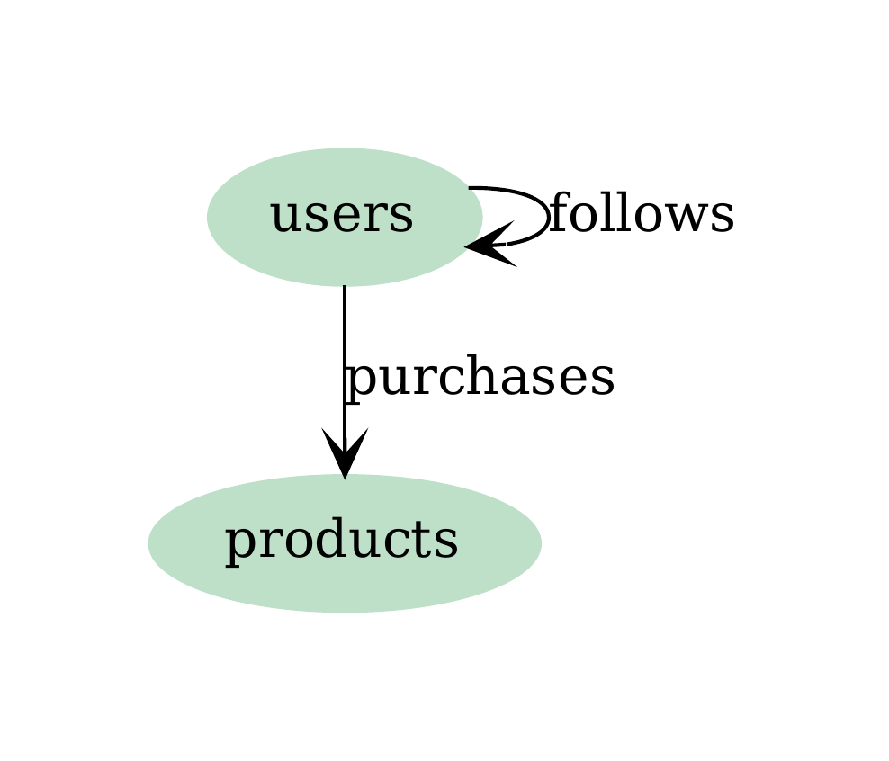

# Example 5: PostgreSQL Schema Inference and Ingestion

This example demonstrates how to automatically infer a graph schema from a PostgreSQL database and ingest data directly from PostgreSQL tables into a graph database. This is particularly useful for migrating relational data to graph databases or creating graph views of existing PostgreSQL databases.

## Overview

Instead of manually defining schemas and exporting data to files, this example shows how to:

- **Automatically detect** vertex-like and edge-like tables in PostgreSQL using intelligent heuristics
- **Infer the graph schema** from the database structure
- **Map PostgreSQL types** to graflo Field types automatically
- **Create patterns** that map PostgreSQL tables to graph resources
- **Ingest data directly** from PostgreSQL into a graph database

## Requirements

**Database Requirements**: This feature works best with normalized PostgreSQL databases (3NF - Third Normal Form) that have:
- **Primary Keys (PK)**: Tables should have proper primary key constraints decorated
- **Foreign Keys (FK)**: Tables should have proper foreign key constraints decorated
- **Normalized Structure**: Database should follow 3NF normalization principles

The inference engine uses heuristics to classify tables:
- **Vertex tables**: Identified by having primary keys and descriptive columns
- **Edge tables**: Identified by having 2+ foreign keys representing relationships

## PostgreSQL Database Structure

The example uses a PostgreSQL database with a typical 3NF (Third Normal Form) schema with proper primary keys and foreign keys:

### Vertex Tables (Entities)

**`users`** - User accounts:

- `id` (SERIAL PRIMARY KEY) - Unique user identifier
- `name` (VARCHAR) - User full name
- `email` (VARCHAR, UNIQUE) - User email address
- `created_at` (TIMESTAMP) - Account creation timestamp

**`products`** - Product catalog:

- `id` (SERIAL PRIMARY KEY) - Unique product identifier
- `name` (VARCHAR) - Product name
- `price` (DECIMAL) - Product price
- `description` (TEXT) - Product description
- `created_at` (TIMESTAMP) - Product creation timestamp

### Edge Tables (Relationships)

**`purchases`** - Purchase transactions linking users to products:

- `id` (SERIAL PRIMARY KEY) - Unique purchase identifier
- `user_id` (INTEGER, FOREIGN KEY → users.id) - Purchasing user
- `product_id` (INTEGER, FOREIGN KEY → products.id) - Purchased product
- `purchase_date` (TIMESTAMP) - Date and time of purchase
- `quantity` (INTEGER) - Number of items purchased
- `total_amount` (DECIMAL) - Total purchase amount

**`follows`** - User follow relationships (self-referential):

- `id` (SERIAL PRIMARY KEY) - Unique follow relationship identifier
- `follower_id` (INTEGER, FOREIGN KEY → users.id) - User who is following
- `followed_id` (INTEGER, FOREIGN KEY → users.id) - User being followed
- `created_at` (TIMESTAMP) - When the follow relationship was created

## Automatic Schema Inference

The `infer_schema_from_postgres()` function automatically analyzes your PostgreSQL database and creates a complete graflo Schema. This process involves several sophisticated steps:

### How Schema Inference Works

1. **Table Discovery**: The function queries PostgreSQL's information schema to discover all tables in the specified schema
2. **Column Analysis**: For each table, it examines columns, data types, constraints (primary keys, foreign keys), and relationships
3. **Table Classification**: Tables are classified as either vertex tables or edge tables using heuristics
4. **Schema Generation**: A complete graflo Schema object is constructed with vertices, edges, resources, and type mappings

### Detection Heuristics

The inference engine uses intelligent heuristics to classify tables. **These heuristics work best with normalized databases (3NF) that have proper primary keys (PK) and foreign keys (FK) decorated:**

**Vertex Tables** (detected by heuristics):

- **Require**: Primary key (PK) constraint decorated on the table
- Have descriptive columns beyond just foreign keys
- Represent domain entities (users, products, etc.)
- Typically have more non-foreign-key columns than foreign keys
- Primary keys automatically become vertex indexes

**Edge Tables** (detected by heuristics):

- **Require**: 2+ foreign key (FK) constraints decorated on the table
- Foreign keys represent relationships between entities
- May have additional attributes (weights, timestamps, quantities)
- Represent relationships or transactions between entities
- Foreign keys point to vertex tables and become edge source/target mappings

**Edge Relation Inference:**

- The system analyzes table names to infer relationship names
- For example, `purchases` table creates a relationship from `users` to `products`
- Self-referential tables (like `follows`) are automatically detected
- Uses fuzzy matching to identify source and target vertices from table names

### Automatic Type Mapping

PostgreSQL types are automatically mapped to graflo Field types with proper type information:

| PostgreSQL Type | graflo Field Type | Notes |
|----------------|-------------------|-------|
| `INTEGER`, `BIGINT`, `SERIAL` | `INT` | Integer types preserved |
| `VARCHAR`, `TEXT`, `CHAR` | `STRING` | String types preserved |
| `TIMESTAMP`, `DATE`, `TIME` | `DATETIME` | Temporal types preserved |
| `DECIMAL`, `NUMERIC`, `REAL`, `DOUBLE PRECISION` | `FLOAT` | Numeric types converted |
| `BOOLEAN` | `BOOL` | Boolean types preserved |

### Inferred Schema Structure

The inferred schema automatically includes:

- **Vertices**: `users`, `products` (with typed fields matching PostgreSQL columns)
- **Edges**: 
  - `users → products` (from `purchases` table) with weights: `purchase_date`, `quantity`, `total_amount`
  - `users → users` (from `follows` table) with weight: `created_at`
- **Resources**: Automatically created for each table with appropriate actors
- **Indexes**: Primary keys become vertex indexes, foreign keys become edge indexes
- **Weights**: Additional columns in edge tables become edge weight properties

### Graph Structure Visualization

The resulting graph structure shows the relationships between entities:

{ width="300" }

This diagram shows:

- **Vertices**: `users` and `products` as nodes
- **Edges**: 
  - `users → products` relationship (purchases)
  - `users → users` self-referential relationship (follows)

### Vertex Fields Structure

Each vertex includes typed fields inferred from PostgreSQL columns:

{ width="500" }

## Step-by-Step Guide

### Step 1: Connect to PostgreSQL

First, establish a connection to your PostgreSQL database. This connection will be used to:
- Query the database schema (tables, columns, constraints)
- Read data from tables during ingestion
- Understand foreign key relationships

**What happens:**
The `PostgresConnection` class wraps a `psycopg2` connection and provides methods for schema introspection and data querying.

```python
from graflo.db.postgres import PostgresConnection
from graflo.db.connection.onto import PostgresConfig

# Option 1: Load from docker/postgres/.env (recommended)
postgres_conf = PostgresConfig.from_docker_env()

# Option 2: Load from environment variables
# Set: POSTGRES_URI, POSTGRES_USERNAME, POSTGRES_PASSWORD, POSTGRES_DATABASE, POSTGRES_SCHEMA_NAME
# postgres_conf = PostgresConfig.from_env()

# Option 3: Create config directly
# postgres_conf = PostgresConfig(
#     uri="postgresql://localhost:5432",
#     username="postgres",
#     password="postgres",
#     database="mydb",
#     schema_name="public"
# )

postgres_conn = PostgresConnection(postgres_conf)
```

### Step 2: Initialize Database (Optional)

If you need to set up the database schema, you can load it from a SQL file:

```python
from pathlib import Path

def load_mock_schema_if_needed(postgres_conn: PostgresConnection) -> None:
    """Load mock schema SQL file into PostgreSQL database if it exists."""
    schema_file = Path("mock_schema.sql")
    
    if not schema_file.exists():
        logger.warning("Mock schema file not found. Assuming database is already initialized.")
        return
    
    logger.info(f"Loading mock schema from {schema_file}")
    with open(schema_file, "r") as f:
        sql_content = f.read()
    
    # Execute SQL statements
    with postgres_conn.conn.cursor() as cursor:
        # Parse and execute statements...
        cursor.execute(sql_content)
        postgres_conn.conn.commit()

load_mock_schema_if_needed(postgres_conn)
```

### Step 2.5: Choose Target Graph Database

You can ingest data into any supported graph database. Simply uncomment the desired database configuration in your script:

```python
from graflo.db.connection.onto import ArangoConfig, Neo4jConfig, TigergraphConfig, FalkordbConfig

# Choose one of the following target databases:
# Option 1: ArangoDB
target_config = ArangoConfig.from_docker_env()

# Option 2: Neo4j
# target_config = Neo4jConfig.from_docker_env()

# Option 3: TigerGraph
# target_config = TigergraphConfig.from_docker_env()

# Option 4: FalkorDB
# target_config = FalkordbConfig.from_docker_env()
```

**Viewing Results in Web Interfaces:**

After ingestion, you can view and explore your graph data in each database's web interface:

- **ArangoDB**: Open `http://localhost:8535` in your browser (check `ARANGO_PORT` in `docker/arango/.env`, standard port is 8529)
  - Default credentials: username `root`, password from secret file
  
- **Neo4j**: Open `http://localhost:7475` in your browser (check `NEO4J_PORT` in `docker/neo4j/.env`, standard port is 7474)
  - Use the Neo4j Browser to run Cypher queries and visualize your graph
  
- **TigerGraph**: Open `http://localhost:14241` in your browser (check `TG_WEB` in `docker/tigergraph/.env`, standard port is 14240)
  - Access GraphStudio to explore your graph schema and data
  
- **FalkorDB**: Open `http://localhost:3001` in your browser (check `FALKORDB_BROWSER_PORT` in `docker/falkordb/.env`)
  - Use the FalkorDB Browser UI to query and visualize your graph

Make sure the corresponding database container is running before starting ingestion. You can start databases using docker-compose from their respective directories (e.g., `docker/arango/docker-compose.yml`).

### Step 3: Infer Schema from PostgreSQL

Automatically generate a graflo Schema from your PostgreSQL database. This is the core of the automatic inference process:

**What `infer_schema_from_postgres()` does:**

1. **Queries PostgreSQL Information Schema**: The function queries PostgreSQL's information schema to discover all tables in the specified schema. It retrieves column information (names, types, constraints), identifies primary keys and foreign keys, and understands table relationships.

2. **Classifies Tables**: Each table's structure is analyzed to determine if it's a vertex table (entity) or edge table (relationship). This classification uses heuristics based on primary keys, foreign keys, and column counts.

3. **Infers Relationships**: For edge tables, the system identifies source and target vertices from foreign keys. It uses table name analysis and fuzzy matching to infer relationship names, and handles self-referential relationships (like `follows`).

4. **Maps Types**: PostgreSQL column types are converted to graflo Field types, preserving type information for validation and optimization.

5. **Creates Resources**: Resource definitions are generated for each table with appropriate actors (VertexActor for vertex tables, EdgeActor for edge tables). Foreign keys are mapped to vertex matching keys.

```python
from graflo.db.postgres import infer_schema_from_postgres
from graflo.onto import DBFlavor
from graflo.db.connection.onto import ArangoConfig, Neo4jConfig, TigergraphConfig, FalkordbConfig
from graflo.db import DBType

# Connect to target graph database to determine flavor
# Choose one of: ArangoConfig, Neo4jConfig, TigergraphConfig, or FalkordbConfig
target_config = ArangoConfig.from_docker_env()  # or Neo4jConfig, TigergraphConfig, FalkordbConfig

# Determine db_flavor from target config
db_type = target_config.connection_type
db_flavor = (
    DBFlavor(db_type.value)
    if db_type in (DBType.ARANGO, DBType.NEO4J, DBType.TIGERGRAPH, DBType.FALKORDB)
    else DBFlavor.ARANGO
)

# Infer schema automatically
schema = infer_schema_from_postgres(
    postgres_conn,
    schema_name="public",  # PostgreSQL schema name
    db_flavor=db_flavor     # Target graph database flavor
)
```

The inferred schema will have:

- **Vertices**: `users`, `products` with typed fields matching PostgreSQL column types
- **Edges**:

  - `users → products` (from `purchases` table) with weight properties
  - `users → users` (from `follows` table) with weight properties
- **Resources**: Automatically created for each table with appropriate actors

**What happens during inference:**

1. **Table Analysis**: Each table is examined for primary keys, foreign keys, and column types
2. **Vertex Detection**: Tables with primary keys and descriptive columns become vertices
3. **Edge Detection**: Tables with 2+ foreign keys become edges, with source/target inferred from foreign key relationships
4. **Type Mapping**: PostgreSQL column types are mapped to graflo Field types
5. **Resource Creation**: Each table gets a corresponding resource with actors that map PostgreSQL rows to graph elements
6. **Weight Extraction**: Non-key columns in edge tables become edge weight properties

### Step 4: Save Inferred Schema (Optional)

You can save the inferred schema to a YAML file for inspection or modification:

```python
import yaml
from pathlib import Path

schema_output_file = Path("generated-schema.yaml")
schema_dict = schema.to_dict()

with open(schema_output_file, "w") as f:
    yaml.safe_dump(schema_dict, f, default_flow_style=False, sort_keys=False)

logger.info(f"Inferred schema saved to {schema_output_file}")
```

### Step 5: Create Patterns from PostgreSQL Tables

Create `Patterns` that map PostgreSQL tables to resources:

```python
from graflo.db.postgres import create_patterns_from_postgres

# Create patterns from PostgreSQL tables
patterns = create_patterns_from_postgres(
    postgres_conn,
    schema_name="public"
)
```

This creates `TablePattern` instances for each table, which:

- Map table names to resource names (e.g., `users` table → `users` resource)
- Store PostgreSQL connection configuration
- Enable the Caster to query data directly from PostgreSQL using SQL

**How Patterns Work:**

- Each `TablePattern` contains the PostgreSQL connection info and table name
- During ingestion, the Caster queries each table using SQL `SELECT * FROM table_name`
- Data is streamed directly from PostgreSQL without intermediate files
- This enables efficient processing of large tables

### Step 6: Ingest Data into Graph Database

Finally, ingest the data from PostgreSQL into your target graph database. This is where the actual data transformation and loading happens:

**What happens during ingestion:**

1. **Resource Processing**: For each resource in the schema, the system queries the corresponding PostgreSQL table using SQL and streams rows from PostgreSQL without loading everything into memory.

2. **Vertex Creation**: For vertex table resources, each row becomes a vertex. Column values become vertex properties, and the primary key becomes the vertex key/index.

3. **Edge Creation**: For edge table resources, each row becomes an edge. Foreign keys are used to find source and target vertices, additional columns become edge weight properties, and the edge connects the matched source vertex to the matched target vertex.

4. **Batch Processing**: Data is processed in batches for efficiency. Vertices are created/upserted first, then edges are created after vertices exist.

5. **Graph Database Storage**: Data is written to the target graph database (ArangoDB/Neo4j/TigerGraph) using database-specific APIs for optimal performance. The system handles duplicates and updates based on indexes.

```python
from graflo import Caster

# Create Caster with inferred schema
caster = Caster(schema)

# Ingest data from PostgreSQL into graph database
from graflo.caster import IngestionParams

ingestion_params = IngestionParams(
    clean_start=True,  # Clear existing data first
)

caster.ingest(
    output_config=target_config,  # Target graph database config
    patterns=patterns,             # PostgreSQL table patterns
    ingestion_params=ingestion_params,
)

# Cleanup
postgres_conn.close()
```

## Complete Example

Here's the complete example combining all steps:

```python
import logging
from pathlib import Path
import yaml

from graflo import Caster
from graflo.onto import DBFlavor
from graflo.db import DBType
from graflo.db.postgres import (
    PostgresConnection,
    create_patterns_from_postgres,
    infer_schema_from_postgres,
)
from graflo.db.connection.onto import ArangoConfig, PostgresConfig

logger = logging.getLogger(__name__)

# Step 1: Connect to PostgreSQL (source database)
postgres_conf = PostgresConfig.from_docker_env()
postgres_conn = PostgresConnection(postgres_conf)

# Step 2: Initialize database with mock schema if needed
# (Implementation details omitted - see full example in examples/5-ingest-postgres/ingest.py)

# Step 3: Connect to target graph database
# You can try different databases by uncommenting the desired config:
from graflo.db.connection.onto import ArangoConfig, Neo4jConfig, TigergraphConfig, FalkordbConfig
target_config = ArangoConfig.from_docker_env()  # or Neo4jConfig, TigergraphConfig, FalkordbConfig

# Step 4: Infer Schema from PostgreSQL database structure
db_type = target_config.connection_type
db_flavor = (
    DBFlavor(db_type.value)
    if db_type in (DBType.ARANGO, DBType.NEO4J, DBType.TIGERGRAPH)
    else DBFlavor.ARANGO
)

schema = infer_schema_from_postgres(
    postgres_conn,
    schema_name="public",
    db_flavor=db_flavor
)

# Step 5: Save inferred schema to YAML (optional)
schema_output_file = Path("generated-schema.yaml")
with open(schema_output_file, "w") as f:
    yaml.safe_dump(schema.to_dict(), f, default_flow_style=False, sort_keys=False)
logger.info(f"Inferred schema saved to {schema_output_file}")

# Step 6: Create Patterns from PostgreSQL tables
patterns = create_patterns_from_postgres(postgres_conn, schema_name="public")

# Step 7: Create Caster and ingest data
from graflo.caster import IngestionParams

caster = Caster(schema)

ingestion_params = IngestionParams(
    clean_start=True,  # Clear existing data first
)

caster.ingest(
    output_config=target_config,
    patterns=patterns,
    ingestion_params=ingestion_params,
)

# Cleanup
postgres_conn.close()

print("\n" + "=" * 80)
print("Ingestion complete!")
print("=" * 80)
print(f"Schema: {schema.general.name}")
print(f"Vertices: {len(schema.vertex_config.vertices)}")
print(f"Edges: {len(list(schema.edge_config.edges_list()))}")
print(f"Resources: {len(schema.resources)}")
print("=" * 80)

# View the ingested data in your graph database's web interface:
# - ArangoDB: http://localhost:8535 (check ARANGO_PORT in docker/arango/.env, standard port is 8529)
# - Neo4j: http://localhost:7475 (check NEO4J_PORT in docker/neo4j/.env, standard port is 7474)
# - TigerGraph: http://localhost:14241 (check TG_WEB in docker/tigergraph/.env, standard port is 14240)
# - FalkorDB: http://localhost:3001 (check FALKORDB_BROWSER_PORT in docker/falkordb/.env)
```

## Resource Mappings

The automatically generated resources map PostgreSQL tables to graph elements. Each resource defines how table rows are transformed into vertices and edges:

### Users Resource

The `users` resource maps each row in the `users` table to a `users` vertex:

{ width="600" }

**What happens:**

- Each row in the `users` table becomes a vertex
- Column values (`id`, `name`, `email`, `created_at`) become vertex properties
- The `id` column is used as the vertex key/index

### Products Resource

The `products` resource maps each row in the `products` table to a `products` vertex:

{ width="600" }

**What happens:**

- Each row in the `products` table becomes a vertex
- Column values (`id`, `name`, `price`, `description`, `created_at`) become vertex properties
- The `id` column is used as the vertex key/index

### Purchases Resource

The `purchases` resource creates edges between `users` and `products` vertices:

{ width="700" }

**What happens:**

- Each row in the `purchases` table becomes an edge
- The `user_id` foreign key maps to the source `users` vertex (using `id` as the match key)
- The `product_id` foreign key maps to the target `products` vertex (using `id` as the match key)
- Additional columns (`purchase_date`, `quantity`, `total_amount`) become edge weight properties
- The edge connects the matched user vertex to the matched product vertex

### Follows Resource

The `follows` resource creates self-referential edges between `users` vertices:

{ width="700" }

**What happens:**

- Each row in the `follows` table becomes an edge
- The `follower_id` foreign key maps to the source `users` vertex (using `id` as the match key)
- The `followed_id` foreign key maps to the target `users` vertex (using `id` as the match key)
- The `created_at` column becomes an edge weight property
- The edge connects a user (follower) to another user (followed), creating a social network structure

## Generated Schema Example

The inferred schema will look like this:

```yaml
general:
    name: public
vertex_config:
    vertices:
    -   name: products
        fields:
        -   name: id
            type: INT
        -   name: name
            type: STRING
        -   name: price
            type: FLOAT
        -   name: description
            type: STRING
        -   name: created_at
            type: DATETIME
        indexes:
        -   fields: [id]
    -   name: users
        fields:
        -   name: id
            type: INT
        -   name: name
            type: STRING
        -   name: email
            type: STRING
        -   name: created_at
            type: DATETIME
        indexes:
        -   fields: [id]
edge_config:
    edges:
    -   source: users
        target: products
        weights:
            direct:
            -   name: purchase_date
            -   name: quantity
            -   name: total_amount
    -   source: users
        target: users
        weights:
            direct:
            -   name: created_at
resources:
-   resource_name: products
    apply:
    -   vertex: products
-   resource_name: users
    apply:
    -   vertex: users
-   resource_name: purchases
    apply:
    -   target_vertex: users
        map:
            user_id: id
    -   target_vertex: products
        map:
            product_id: id
-   resource_name: follows
    apply:
    -   target_vertex: users
        map:
            follower_id: id
    -   target_vertex: users
        map:
            followed_id: id
```

## Key Features

### Automatic Type Mapping

PostgreSQL types are automatically converted to graflo Field types with proper type information:

- **Integer types** (`INTEGER`, `BIGINT`, `SERIAL`) → `INT`
- **String types** (`VARCHAR`, `TEXT`, `CHAR`) → `STRING`
- **Numeric types** (`DECIMAL`, `NUMERIC`, `REAL`) → `FLOAT`
- **Date/Time types** (`TIMESTAMP`, `DATE`, `TIME`) → `DATETIME`
- **Boolean types** → `BOOL`

### Intelligent Table Classification

The system automatically classifies tables as:

- **Vertex tables**: Tables with primary keys and descriptive columns
- **Edge tables**: Tables with 2+ foreign keys representing relationships

### Automatic Resource Creation

Resources are automatically created for each table with appropriate actors:

- **Vertex tables**: Create `VertexActor` to map rows to vertices
- **Edge tables**: Create `EdgeActor` with proper field mappings for source and target vertices

### Type-Safe Field Definitions

All fields in the inferred schema include type information, enabling:

- Better validation during ingestion
- Database-specific optimizations
- Type-aware filtering and querying

### Data Type Handling

Special handling for PostgreSQL-specific types:

- **Decimal/Numeric**: Automatically converted to `float` when reading from PostgreSQL
- **DateTime**: Preserved as `datetime` objects during processing, serialized to ISO format for JSON
- **Type preservation**: Original types are preserved for accurate duplicate detection

## Data Flow and Processing

Understanding how data flows from PostgreSQL to the graph database:

### Step-by-Step Data Processing

1. **Connection**: Establish connection to PostgreSQL database
2. **Schema Inference**: Analyze database structure and generate graflo Schema
3. **Pattern Creation**: Create patterns that map PostgreSQL tables to resources
4. **Ingestion Process**:
   - For each resource, query the corresponding PostgreSQL table
   - Transform each row according to the resource mapping
   - Create vertices from vertex table rows
   - Create edges from edge table rows, matching foreign keys to vertex keys
   - Add weight properties to edges from additional columns
5. **Graph Database Storage**: Store transformed data in the target graph database

### Foreign Key Matching

The system uses foreign keys to match edge table rows to vertices:

- **Edge Table Row**: `{user_id: 5, product_id: 12, quantity: 2, total_amount: 99.98}`
- **Source Vertex Match**: Find `users` vertex where `id = 5`
- **Target Vertex Match**: Find `products` vertex where `id = 12`
- **Edge Creation**: Create edge from matched user vertex to matched product vertex
- **Weight Properties**: Add `quantity: 2` and `total_amount: 99.98` to the edge

This matching happens automatically based on the foreign key relationships detected during schema inference.

## Benefits

1. **No manual schema definition**: Schema is automatically inferred from existing database structure
2. **Direct database access**: No need to export data to files first
3. **Automatic resource mapping**: Tables are automatically mapped to graph resources
4. **Type safety**: Proper handling of PostgreSQL-specific types with automatic conversion
5. **Flexible**: Works with any normalized PostgreSQL schema (3NF) that has proper primary keys (PK) and foreign keys (FK) decorated
6. **Time-saving**: Reduces manual configuration significantly
7. **Maintainable**: Schema can be regenerated when database structure changes

## Use Cases

This pattern is particularly useful for:

- **Data Migration**: Migrating relational data to graph databases
- **Graph Views**: Creating graph views of existing PostgreSQL databases
- **Relationship Analysis**: Analyzing relationships in normalized database schemas
- **Graph Analytics**: Building graph analytics on top of transactional databases
- **Legacy System Integration**: Integrating legacy relational systems with modern graph databases
- **Data Warehousing**: Transforming relational data warehouses into graph structures

## Customization

### Modifying the Inferred Schema

After inference, you can modify the schema:

```python
# Infer schema
schema = infer_schema_from_postgres(postgres_conn, schema_name="public")

# Modify schema as needed
# Add custom transforms, filters, or additional edges
schema.vertex_config.vertices[0].filters.append(...)

# Use modified schema
caster = Caster(schema)
```

### Manual Pattern Creation

You can also create patterns manually for more control:

```python
from graflo.util.onto import Patterns, TablePattern

patterns = Patterns(
    _resource_mapping={
        "users": ("db1", "users"),      # (config_key, table_name)
        "products": ("db1", "products"),
    },
    _postgres_connections={
        "db1": postgres_conf,  # Maps config_key to PostgresConfig
    }
)
```

## Viewing Results in Graph Database Web Interfaces

After successful ingestion, you can explore your graph data using each database's web interface. The default ports and access information are listed below. Check the corresponding `.env` files in the `docker/` directories for custom port configurations.

### ArangoDB

- **Web Interface**: `http://localhost:8535` (check `ARANGO_PORT` in `docker/arango/.env`, standard port is 8529)
- **Port Configuration**: Check `ARANGO_PORT` in `docker/arango/.env`
- **Default Credentials**: Username `root`, password from secret file
- **Features**: Browse collections, run AQL queries, visualize graphs

### Neo4j

- **Web Interface**: `http://localhost:7475` (check `NEO4J_PORT` in `docker/neo4j/.env`, standard port is 7474)
- **Port Configuration**: Check `NEO4J_PORT` in `docker/neo4j/.env`
- **Default Credentials**: Username `neo4j`, password from `NEO4J_AUTH` in docker config
- **Features**: Neo4j Browser for Cypher queries and graph visualization

### TigerGraph

- **Web Interface**: `http://localhost:14241` (check `TG_WEB` in `docker/tigergraph/.env`, standard port is 14240)
- **Port Configuration**: Check `TG_WEB` in `docker/tigergraph/.env`
- **Default Credentials**: Username `tigergraph`, password from docker config
- **Features**: GraphStudio for schema exploration, query development, and data visualization

### FalkorDB

- **Web Interface**: `http://localhost:3001` (check `FALKORDB_BROWSER_PORT` in `docker/falkordb/.env`)
- **Port Configuration**: Check `FALKORDB_BROWSER_PORT` in `docker/falkordb/.env`
- **Default Credentials**: No authentication required by default
- **Features**: FalkorDB Browser UI for graph queries and visualization

**Note**: Make sure the corresponding database container is running before accessing the web interface. You can start databases using docker-compose from their respective directories.

## Key Takeaways

1. **Automatic schema inference** eliminates manual schema definition for normalized databases (3NF) with proper PK/FK constraints
2. **Type mapping** ensures proper type handling across PostgreSQL and graph databases
3. **Direct database access** enables efficient data ingestion without intermediate files
4. **Flexible heuristics** automatically detect vertices and edges from table structure
5. **Type-safe fields** provide better validation and database-specific optimizations
6. **Resource generation** automatically creates appropriate actors for each table
7. **Schema customization** allows modifications after inference for specific use cases
8. **Multiple database support** allows you to try different graph databases and compare results

## Next Steps

- Explore the [PostgreSQL Schema Inference API](../reference/db/postgres/schema_inference.md) for advanced usage
- Learn about [PostgreSQL Type Mapping](../reference/db/postgres/types.md) for custom type conversions
- Check out [Resource Mapping](../reference/db/postgres/resource_mapping.md) for custom resource creation
- See the [full example code](https://github.com/growgraph/graflo/tree/main/examples/5-ingest-postgres) for complete implementation

For more examples and detailed explanations, refer to the [API Reference](../reference/index.md).
