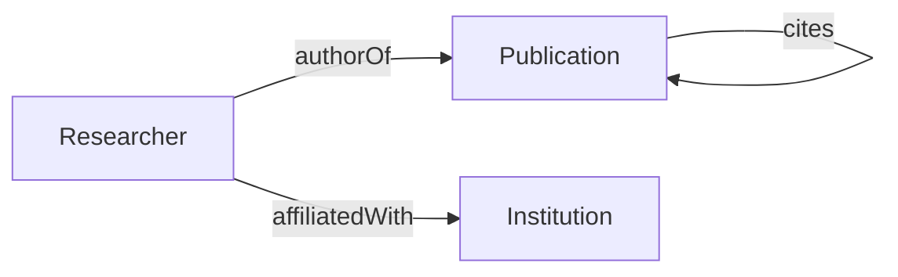
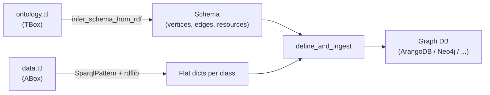

# Example 6: RDF / Turtle Ingestion with Explicit Resource Mapping

This example demonstrates how to ingest data from RDF (Turtle) files into a graph database, using OWL ontology inference for the schema and explicit `SparqlPattern` resource mapping for the data.

## Overview

Instead of manually writing a YAML schema, this example shows how to:

- **Infer the graph schema** automatically from an OWL ontology (TBox)
- **Build patterns explicitly** using `SparqlPattern` — one per `rdf:Class` — pointing at a local Turtle data file
- **Ingest RDF instance data** (ABox) into a graph database (ArangoDB, Neo4j, TigerGraph, FalkorDB)

## Requirements

- A target graph database running (ArangoDB, Neo4j, TigerGraph, or FalkorDB)
- The `sparql` extra installed:

```bash
pip install graflo[sparql]
```

This pulls in `rdflib` (for local RDF file parsing) and `SPARQLWrapper` (for remote SPARQL endpoints).

## Dataset: Academic Knowledge Graph

The example models a small academic knowledge graph with three entity types and three relationship types.

### Ontology (TBox) — `data/ontology.ttl`

The ontology declares classes, datatype properties (vertex fields), and object properties (edges) using standard OWL vocabulary:

```turtle
@prefix owl:  <http://www.w3.org/2002/07/owl#> .
@prefix rdfs: <http://www.w3.org/2000/01/rdf-schema#> .
@prefix xsd:  <http://www.w3.org/2001/XMLSchema#> .
@prefix ex:   <http://example.org/> .

# Classes
ex:Researcher   a owl:Class .
ex:Publication   a owl:Class .
ex:Institution   a owl:Class .

# Datatype properties (become vertex fields)
ex:fullName  a owl:DatatypeProperty ; rdfs:domain ex:Researcher  ; rdfs:range xsd:string .
ex:orcid     a owl:DatatypeProperty ; rdfs:domain ex:Researcher  ; rdfs:range xsd:string .
ex:title     a owl:DatatypeProperty ; rdfs:domain ex:Publication ; rdfs:range xsd:string .
ex:year      a owl:DatatypeProperty ; rdfs:domain ex:Publication ; rdfs:range xsd:integer .
ex:doi       a owl:DatatypeProperty ; rdfs:domain ex:Publication ; rdfs:range xsd:string .
ex:instName  a owl:DatatypeProperty ; rdfs:domain ex:Institution ; rdfs:range xsd:string .
ex:country   a owl:DatatypeProperty ; rdfs:domain ex:Institution ; rdfs:range xsd:string .

# Object properties (become edges)
ex:authorOf       a owl:ObjectProperty ; rdfs:domain ex:Researcher  ; rdfs:range ex:Publication .
ex:affiliatedWith a owl:ObjectProperty ; rdfs:domain ex:Researcher  ; rdfs:range ex:Institution .
ex:cites          a owl:ObjectProperty ; rdfs:domain ex:Publication ; rdfs:range ex:Publication .
```

### How the Ontology Maps to a Graph Schema

| OWL Construct | graflo Artefact | Example |
|---|---|---|
| `owl:Class` | **Vertex** | `Researcher`, `Publication`, `Institution` |
| `owl:DatatypeProperty` | **Vertex field** | `fullName`, `year`, `country` |
| `owl:ObjectProperty` | **Edge** | `authorOf`, `affiliatedWith`, `cites` |
| `rdfs:domain` / `rdfs:range` | Edge **source** / **target** | `Researcher → Publication` |

### Graph Structure

The inferred graph structure has three vertex types and three edge types:



### Instance Data (ABox) — `data/data.ttl`

The data file contains both the TBox (so it is self-contained) and the instance data:

- **3 Institutions**: MIT, ETH Zürich, University of Oxford
- **4 Researchers**: Alice, Bob, Carol, Dave — each affiliated with an institution and authoring one or more publications
- **4 Publications**: With citation links between them

```turtle
ex:alice  a ex:Researcher ;
    ex:fullName       "Alice Smith" ;
    ex:orcid          "0000-0001-0001-0001" ;
    ex:affiliatedWith ex:mit ;
    ex:authorOf       ex:paper1 , ex:paper3 .

ex:paper2  a ex:Publication ;
    ex:title "Knowledge Graphs in Practice" ;
    ex:year  2022 ;
    ex:doi   "10.1234/paper2" ;
    ex:cites ex:paper1 .
```

## Step-by-Step Guide

### Step 1: Connect to Target Graph Database

Choose your target graph database and load connection config from the corresponding Docker `.env` file:

```python
from graflo.db.connection.onto import ArangoConfig

conn_conf = ArangoConfig.from_docker_env()

# Alternative targets:
# from graflo.db.connection.onto import Neo4jConfig, TigergraphConfig, FalkordbConfig
# conn_conf = Neo4jConfig.from_docker_env()
# conn_conf = TigergraphConfig.from_docker_env()
# conn_conf = FalkordbConfig.from_docker_env()

db_type = conn_conf.connection_type
```

### Step 2: Infer Schema from the OWL Ontology

`GraphEngine.infer_schema_from_rdf()` reads the ontology file and automatically produces a complete graflo Schema:

```python
from graflo.hq import GraphEngine

engine = GraphEngine(target_db_flavor=db_type)

schema = engine.infer_schema_from_rdf(
    source="data/ontology.ttl",
    schema_name="academic_kg",
)
```

**What happens during inference:**

1. **Class discovery** — `owl:Class` declarations become **vertices** (`Researcher`, `Publication`, `Institution`)
2. **Field discovery** — `owl:DatatypeProperty` declarations with `rdfs:domain` become **fields** on the corresponding vertex, plus automatic `_key` and `_uri` fields
3. **Edge discovery** — `owl:ObjectProperty` declarations with `rdfs:domain` / `rdfs:range` become **edges** (`authorOf`, `affiliatedWith`, `cites`)
4. **Resource creation** — One resource per class is created, wiring the vertex and its outgoing edges

### Inferred Schema Structure

The inferred schema is equivalent to this YAML:

```yaml
general:
    name: academic_kg
vertex_config:
    vertices:
    -   name: Researcher
        fields: [_key, _uri, fullName, orcid]
    -   name: Publication
        fields: [_key, _uri, title, year, doi]
    -   name: Institution
        fields: [_key, _uri, instName, country]
edge_config:
    edges:
    -   source: Researcher
        target: Publication
        relation: authorOf
    -   source: Researcher
        target: Institution
        relation: affiliatedWith
    -   source: Publication
        target: Publication
        relation: cites
resources:
-   resource_name: Researcher
    apply:
    -   vertex: Researcher
    -   source: Researcher
        target: Publication
        relation: authorOf
    -   source: Researcher
        target: Institution
        relation: affiliatedWith
-   resource_name: Publication
    apply:
    -   vertex: Publication
    -   source: Publication
        target: Publication
        relation: cites
-   resource_name: Institution
    apply:
    -   vertex: Institution
```

### Step 3: Build Patterns with Explicit Resource Mapping

Instead of calling `engine.create_patterns_from_rdf()` (which does this automatically), we construct each `SparqlPattern` by hand. This gives full control over which `rdf:Class` URI maps to which resource and which file (or endpoint) provides the data:

```python
from graflo.util.onto import Patterns, SparqlPattern
from pathlib import Path

DATA_FILE = Path("data/data.ttl")

patterns = Patterns()

patterns.add_sparql_pattern(
    "Researcher",
    SparqlPattern(
        rdf_class="http://example.org/Researcher",
        rdf_file=DATA_FILE,
        resource_name="Researcher",
    ),
)

patterns.add_sparql_pattern(
    "Publication",
    SparqlPattern(
        rdf_class="http://example.org/Publication",
        rdf_file=DATA_FILE,
        resource_name="Publication",
    ),
)

patterns.add_sparql_pattern(
    "Institution",
    SparqlPattern(
        rdf_class="http://example.org/Institution",
        rdf_file=DATA_FILE,
        resource_name="Institution",
    ),
)
```

Each `SparqlPattern` contains:

| Field | Purpose |
|---|---|
| `rdf_class` | Full URI of the `rdf:Class` whose instances this pattern fetches |
| `rdf_file` | Path to the local RDF file containing the instance data |
| `resource_name` | Name of the graflo resource this pattern maps to |

**Alternative: Remote SPARQL Endpoint**

To read data from a SPARQL endpoint (e.g. Apache Fuseki) instead of a local file, replace `rdf_file` with `endpoint_url`:

```python
patterns.add_sparql_pattern(
    "Researcher",
    SparqlPattern(
        rdf_class="http://example.org/Researcher",
        endpoint_url="http://localhost:3030/dataset/sparql",
        resource_name="Researcher",
    ),
)
```

### Step 4: Define Schema and Ingest

Finally, define the graph schema in the target database and ingest the data in one operation:

```python
from graflo.hq import IngestionParams

engine.define_and_ingest(
    schema=schema,
    target_db_config=conn_conf,
    patterns=patterns,
    ingestion_params=IngestionParams(clear_data=True),
    recreate_schema=True,
)
```

**What happens during ingestion:**

1. **Pattern resolution** — Each `SparqlPattern` is resolved: the local RDF file is parsed with `rdflib`, filtering triples by the specified `rdf:Class`
2. **Flat dict conversion** — RDF triples are grouped by subject URI and converted to flat dictionaries (`{_key, _uri, field1, field2, ...}`)
3. **Vertex creation** — For each resource, the corresponding flat dicts become vertices
4. **Edge creation** — Object property values (URIs) are matched to target vertices, creating edges
5. **Database write** — Data is written to the target graph database

## Complete Example

```python
import logging
from pathlib import Path

from graflo.db.connection.onto import ArangoConfig
from graflo.hq import GraphEngine, IngestionParams
from graflo.util.onto import Patterns, SparqlPattern

logging.basicConfig(level=logging.WARNING, handlers=[logging.StreamHandler()])
logging.getLogger("graflo").setLevel(logging.DEBUG)

DATA_DIR = Path(__file__).parent / "data"
ONTOLOGY_FILE = DATA_DIR / "ontology.ttl"
DATA_FILE = DATA_DIR / "data.ttl"

# Step 1: Target database
conn_conf = ArangoConfig.from_docker_env()
db_type = conn_conf.connection_type

# Step 2: Infer schema from ontology
engine = GraphEngine(target_db_flavor=db_type)
schema = engine.infer_schema_from_rdf(source=ONTOLOGY_FILE, schema_name="academic_kg")

# Step 3: Explicit resource mapping
patterns = Patterns()
for cls_name in ("Researcher", "Publication", "Institution"):
    patterns.add_sparql_pattern(
        cls_name,
        SparqlPattern(
            rdf_class=f"http://example.org/{cls_name}",
            rdf_file=DATA_FILE,
            resource_name=cls_name,
        ),
    )

# Step 4: Define schema and ingest
engine.define_and_ingest(
    schema=schema,
    target_db_config=conn_conf,
    patterns=patterns,
    ingestion_params=IngestionParams(clear_data=True),
    recreate_schema=True,
)

print(f"Schema: {schema.general.name}")
print(f"Vertices: {len(schema.vertex_config.vertices)}")
print(f"Edges: {len(list(schema.edge_config.edges_list()))}")
print(f"Resources: {len(schema.resources)}")
```

## How It Works

### RDF-to-Graph Mapping

The ingestion pipeline converts RDF triples into graph elements:

| RDF Concept | Graph Element | Example |
|---|---|---|
| Subject URI | Vertex `_key` (local name) | `ex:alice` → `_key: "alice"` |
| `rdf:type` filter | Vertex type | `a ex:Researcher` → `Researcher` vertex |
| Datatype property value | Vertex field | `ex:fullName "Alice"` → `fullName: "Alice"` |
| Object property value | Edge | `ex:worksFor ex:mit` → edge to `Institution` vertex |

### Data Flow



## Key Concepts

### Explicit vs Automatic Pattern Creation

| Approach | Method | Best for |
|---|---|---|
| **Explicit** (this example) | Build `SparqlPattern` objects by hand | Fine-grained control over class URIs, files, endpoints |
| **Automatic** | `engine.create_patterns_from_rdf()` | Quick setup when ontology and data are co-located |

### SparqlPattern Modes

Each `SparqlPattern` can operate in one of two modes:

- **File mode** (`rdf_file` set) — Parses a local RDF file with `rdflib`, filtering by `rdf_class`
- **Endpoint mode** (`endpoint_url` set) — Queries a remote SPARQL endpoint via `SPARQLWrapper`

These modes are mutually exclusive. Use file mode for small-to-medium datasets shipped alongside the code, and endpoint mode when data lives in a triplestore (Fuseki, Blazegraph, GraphDB, etc.).

## Key Takeaways

1. **OWL ontology inference** eliminates manual schema definition — `owl:Class` becomes vertices, `owl:DatatypeProperty` becomes fields, `owl:ObjectProperty` becomes edges
2. **Explicit `SparqlPattern` mapping** gives full control over which class URI maps to which resource and data source
3. **Local file and remote endpoint** modes are both supported via the same `SparqlPattern` abstraction
4. **No intermediate formats** — RDF triples are converted directly to flat dicts and ingested into the graph database
5. **Reusable ontology** — The same ontology file can drive schema inference for different data files or endpoints

## Next Steps

- Learn about [RDF data sources](../reference/data_source/rdf.md) for the full API
- Explore [RDF schema inference](../reference/hq/rdf_inferencer.md) for advanced options
- See the [full example code](https://github.com/growgraph/graflo/tree/main/examples/6-ingest-rdf) for the complete implementation

For more examples and detailed explanations, refer to the [API Reference](../reference/index.md).
