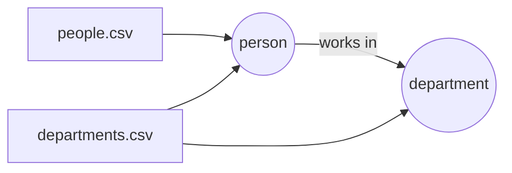

# How do I ingest CSV files into a graph?

You have two CSV files. One lists people, the other says which department each
person works in. You want a graph: one vertex per person, one per department,
and an edge from each person to their department.

With GraFlo you describe that graph once, in a manifest, and the library loads
the files. A person who appears in both files becomes one vertex, not two.



## What you need

- GraFlo installed (`pip install graflo`).
- A running ArangoDB. The repository ships a container for it; see
  [`docker/README.md`](../../docker/README.md).

## The data

`data/people.csv`:

| id | name | age |
|---|---|---|
| 1 | John Hancock | 27 |
| 2 | Mary Arpe | 33 |
| 3 | Sid Mei | 45 |

`data/departments.csv`:

| person_id | person | department |
|---|---|---|
| 1 | John Hancock | Sales |
| 2 | Mary Arpe | R&D |
| 3 | Sid Mei | Customer Service |

## Steps

### 1. Say what the graph looks like

The `schema` block of [`manifest.yaml`](manifest.yaml) declares two vertex
types and one edge. `identity` names the properties that make a vertex unique.

```yaml
vertices:
-   name: person
    properties: [id, name, age]
    identity: [id]
-   name: department
    properties: [name]
    identity: [name]
edges:
-   source: person
    target: department
```

### 2. Say how each file maps onto the graph

The `ingestion_model` block has one resource per kind of file. A resource is a
list of steps that run on every row.

```yaml
resources:
-   name: people
    pipeline:
    -   vertex: person
-   name: departments
    pipeline:
    -   vertex: person
        from:
            id: person_id
            name: person
    -   vertex: department
        from:
            name: department
```

The columns of `people.csv` already have the names of the `person` properties,
so its resource needs no mapping. In `departments.csv` they do not, so `from`
says which column fills which property: `id` comes from `person_id`.

The `departments` resource produces a person and a department from the same
row. The schema declares an edge between those two types, so GraFlo adds the
edge.

### 3. Say where the files are

The `bindings` block connects files to resources by file name.

```yaml
connectors:
-   regex: "^people.*\\.csv$"
    sub_path: data
    resource_name: people
-   regex: "^dep.*\\.csv$"
    sub_path: data
    resource_name: departments
```

### 4. Run it

```bash
cd examples/01-csv-two-resources
uv run python ingest.py
```

[`ingest.py`](ingest.py) loads the manifest, creates the schema in the database
and ingests the files:

```python
manifest = GraphManifest.from_config(FileHandle.load("manifest.yaml"))
manifest.finish_init()

conn_conf = ArangoConfig.from_docker_env()
engine = GraphEngine(target_db_flavor=conn_conf.connection_type)
engine.define_and_ingest(
    manifest=manifest,
    target_db_config=conn_conf,
    ingestion_params=IngestionParams(clear_data=True),
    recreate_schema=True,
)
```

## What you should see

The database holds:

| | Count | Why |
|---|---|---|
| `person` vertices | 3 | Both files mention each person; rows with the same `id` become one vertex |
| `department` vertices | 3 | One per distinct department name |
| `person` to `department` edges | 3 | One per row of `departments.csv` |

## Use another database

The manifest does not name a database. To load the same graph into Neo4j,
change two lines of `ingest.py`:

```python
from graflo.connections import Neo4jConfig

conn_conf = Neo4jConfig.from_docker_env()
```

## What to read next

- [Records that refer to their own kind](../02-json-self-edges/README.md): edges
  between vertices of the same type.
- [A graph on disk, without a database](../14-file-backend-export/README.md).
- [Creating a manifest](../../docs/getting_started/creating_manifest.md): every
  block of the manifest in detail.
