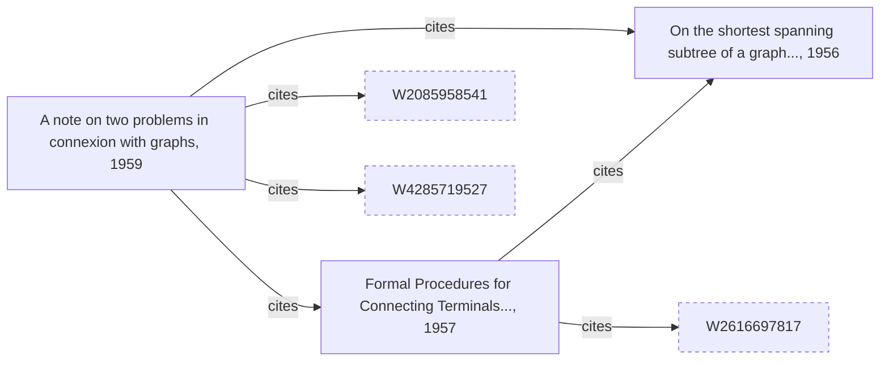

# How do I link records that refer to records of the same kind?

You have scholarly works exported from OpenAlex, an open catalog of research
publications. Each work lists the works it cites, by their OpenAlex id. You
want one vertex per work and an edge from each work to every work it cites.

Both ends of such an edge are works. A cited work may have its own record in
the same file, or be known only by the id in a reference. Either way it must be
one vertex: a work that two others cite, and that also has its own record, is
one work, not three.



Dashed boxes are works the file has no record for.

## What you need

- GraFlo installed (`pip install graflo`).
- A running ArangoDB, as in [the CSV example](../01-csv-two-resources/README.md).

## The data

[`data/works.json`](data/works.json) holds three works in the OpenAlex format,
trimmed to a few fields. The first one:

```json
{
    "id": "https://openalex.org/W2169528473",
    "doi": "https://doi.org/10.1007/bf01386390",
    "title": "A note on two problems in connexion with graphs",
    "publication_date": "1959-12-01",
    "type": "article",
    "referenced_works": [
        "https://openalex.org/W1965680834",
        "https://openalex.org/W1968778433",
        "https://openalex.org/W2085958541",
        "https://openalex.org/W4285719527"
    ]
}
```

The other two records are works it cites, from 1957 and 1956. The 1957 work
also cites the 1956 one, and one more work. The file has no record for the
three remaining cited works.

## Steps

### 1. Declare one vertex type and an edge from it to itself

The `schema` block of [`manifest.yaml`](manifest.yaml):

```yaml
vertices:
-   name: work
    properties: [id, doi, title, publication_date]
    identity: [id]
edges:
-   source: work
    target: work
    relation: cites
```

`identity: [id]` makes a work met in a reference and the same work met as a
record one vertex. Fields that `properties` does not list, such as `type`, are
not stored.

### 2. Give every id a field name

OpenAlex ids are URLs, and an element of `referenced_works` is a bare string,
not a record with fields. A vertex step reads fields, so the string needs a
name first. One named transform does both jobs: it keeps the last part of the
URL and writes it to the field `id`.

```yaml
transforms:
-   name: short_id
    foo: split_keep_part
    module: graflo.util.transform
    params: {sep: /, keep: -1}
    input: [id]
    output: [id]
```

`module` and `foo` name the Python function to call: `split_keep_part` from
`graflo.util.transform`. `params` are passed to it on every call. On a record,
the function gets the value of the `id` field; on a bare string, it gets the
string. Both give `W2169528473` from `https://openalex.org/W2169528473`.

### 3. Read each work and the works it cites

The resource `works` in the `ingestion_model` block:

```yaml
pipeline:
-   transform:
        call:
            use: short_id
-   vertex: work
-   key: referenced_works
    pipeline:
    -   transform:
            call:
                use: short_id
    -   vertex: work
-   edge:
        from: work
        to: work
        relation: cites
        exclude_source: referenced_works
        match_target: referenced_works
```

The first two steps make a vertex of the work itself. The step with
`key: referenced_works` descends into that list and runs its own pipeline once
per element, which makes a vertex of every cited work.

Both ends of the edge are works, so the `edge` step says which is which. The
citing work is the one not found under `referenced_works` (`exclude_source`).
The cited works are the ones found under it (`match_target`).

### 4. Run it

```bash
cd examples/02-json-self-edges
uv run python ingest.py
```

[`ingest.py`](ingest.py) works as in the CSV example: it loads the manifest,
creates the schema in ArangoDB and ingests the file that the `bindings` block
names.

## What you should see

| | Count | Why |
|---|---|---|
| `work` vertices | 6 | 3 records, plus 3 works known only from a reference. The 1957 and 1956 works appear as records and as references, and each is one vertex |
| `cites` edges | 6 | 4 references in the 1959 work, 2 in the 1957 work |

A work known only from a reference has an `id` and no other property. When you
load its record later, the record fills in the same vertex, because the vertex
is found by its `id`.

## What goes wrong

**The references have no field name.** Leave out the `transform` inside
`referenced_works`, and each reference stays a bare string. The vertex step
finds no field to read, so the load produces 3 vertices and no edges, without
an error.

## What to read next

- [Several relations between the same two things](../03-csv-relation-field/README.md):
  the relation name comes from a column.
- [Transforms](../../docs/concepts/ingestion/transforms.md): every form of the
  `transform` step, and the functions shipped with GraFlo.
- [The `descend` step](../../docs/concepts/architecture/core_components.md#the-descend-step)
  and [the `edge` step](../../docs/concepts/architecture/core_components.md#the-edge-step).
