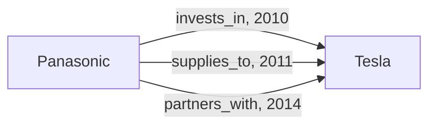

# How do I keep several different relations between the same two things?

You track how companies deal with each other: one invests in another, supplies
it, partners with it, buys it. Each deal is a row with two companies, the kind
of deal and a date, and the same two companies appear in several rows. You want
one vertex per company and one edge per deal, named after the kind of deal.

The kinds of deal come with the data. You do not want to list them in the
manifest, and a kind that first appears next month should need no change. Two
deals between the same pair must stay two edges, and loading the same row
twice must not add a third.



## What you need

- GraFlo installed (`pip install graflo`).
- A running ArangoDB, as in [the CSV example](../01-csv-two-resources/README.md).

## The data

[`data/relations.csv`](data/relations.csv):

| company_a | company_b | relation | date |
|---|---|---|---|
| Panasonic | Tesla | invests_in | 2010-11-03 |
| Panasonic | Tesla | supplies_to | 2011-10-11 |
| Panasonic | Tesla | partners_with | 2014-07-31 |
| Amazon | Whole Foods | agrees_to_acquire | 2017-06-16 |
| Amazon | Whole Foods | acquires | 2017-08-28 |
| Microsoft | OpenAI | invests_in | 2019-07-22 |
| Microsoft | OpenAI | supplies_to | 2019-07-22 |

The two Microsoft rows share the pair and the date; only the relation tells
them apart.

## Steps

### 1. Declare one edge between companies, without a relation name

The `schema` block of [`manifest.yaml`](manifest.yaml):

```yaml
vertices:
-   name: company
    properties: [name]
    identity: [name]
edges:
-   source: company
    target: company
    properties: [date]
    identities:
    -   [relation]
```

The edge has no `relation` key, because the names come from the data.
`properties: [date]` stores the date on each edge. `identities` says what,
besides its two ends, makes an edge unique: here the relation. A pair of
companies therefore holds one edge per relation, and loading a row again adds
nothing.

### 2. Read both companies and the relation from each row

The resource `relations` in the `ingestion_model` block:

```yaml
pipeline:
-   vertex: company
    from:
        name: company_a
-   vertex: company
    from:
        name: company_b
-   edge:
        from: company
        to: company
        relation_field: relation
```

Both columns hold companies, so there are two vertex steps, and `from` tells
each one which column fills `name`. The edge goes from the company of the first
step to the company of the second. `relation_field` names the column whose
value becomes the relation of the edge. The row's `date`, declared as an edge
property, is copied onto the edge.

### 3. Run it

```bash
cd examples/03-csv-relation-field
uv run python ingest.py
```

[`ingest.py`](ingest.py) works as in the CSV example. The `bindings` block of
the manifest points the resource at `data/relations.csv`.

## What you should see

| | Count | Why |
|---|---|---|
| `company` vertices | 6 | Each company appears in several rows, and rows with the same `name` become one vertex |
| `company` to `company` edges | 7 | One per row: no two rows share the pair and the relation |

ArangoDB keeps all seven in one edge collection, `company_company_edges`. Each
edge document carries `relation` and `date`, and a unique index on `_from`,
`_to` and `relation` enforces the identity.

## Use another database

Where the relation name goes depends on the database, and the identity follows
it:

- **Neo4j**: each relation name is its own relationship type, such as
  `invests_in`.
- **TigerGraph**: all relations share one edge type, `relates`, and the name is
  stored in an attribute `relation`. TigerGraph keeps one edge of a type
  between two vertices unless the type has a discriminator. The identity
  `[relation]` becomes `DISCRIMINATOR(relation STRING)`; without it, the three
  Panasonic rows would leave one edge.

Change the connection settings in `ingest.py` as shown in
[the CSV example](../01-csv-two-resources/README.md#use-another-database).

## What to read next

- [Nested JSON with relations in the keys](../04-json-relation-from-key/README.md):
  the relation name comes from a JSON key.
- [The edge in the schema](../../docs/concepts/architecture/core_components.md#edge)
  and [the `edge` step](../../docs/concepts/architecture/core_components.md#the-edge-step).
