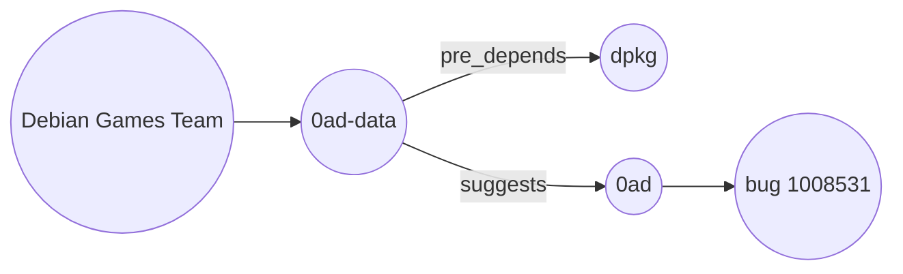

# How do I turn nested JSON into a graph when the key names say what the relation is?

You have the Debian package archive as JSON: one record per package, with its
maintainer and its dependencies, plus a file of bug reports. The dependencies
are grouped under keys that name the kind of dependency: `depends`,
`pre-depends`, `suggests`, `breaks` and more. You want a graph of packages,
maintainers and bugs, where each dependency is an edge named after the key it
was listed under.

You do not want to write one edge step per key, and a key you have not seen
yet should become an edge too. GraFlo can visit every key of a nested object
and take the relation name from the key itself.



## What you need

- GraFlo installed (`pip install graflo`).
- A running ArangoDB, as in [the CSV example](../01-csv-two-resources/README.md).

## The data

`data/package.meta.json.gz` holds 63,461 package records. A short one:

```json
{
    "name": "0ad-data",
    "version": "0.0.26-1",
    "dependencies": {
        "pre-depends": [{"name": "dpkg", "version": ">= 1.15.6~"}],
        "suggests": [{"name": "0ad"}]
    },
    "description": "Real-time strategy game of ancient warfare (data files)",
    "maintainer": {
        "name": "Debian Games Team",
        "email": "pkg-games-devel@lists.alioth.debian.org"
    }
}
```

`data/bugs.json.gz` holds 51,765 bug reports. Each names its package in the
field `package` and its number in `bug_num`, with a `subject`, a `severity` and
a `date`.

## Steps

### 1. Declare packages, maintainers and bugs

The `schema` block of [`manifest.yaml`](manifest.yaml):

```yaml
vertices:
-   name: package
    properties: [name, version]
    identity: [name]
-   name: maintainer
    properties: [name, email]
    identity: [email]
-   name: bug
    properties: [id, subject, severity, date]
    identity: [id]
edges:
-   source: package
    target: package
    identities:
    -   [relation]
-   source: maintainer
    target: package
-   source: package
    target: bug
```

The package-to-package edge names no relation, because the names come from the
data. Its identity `[relation]` keeps one edge per pair and relation, as in
[the relation field example](../03-csv-relation-field/README.md): some packages
list the same dependency twice, once with a lower and once with an upper
version bound.

### 2. Read a package, its maintainer and every dependency group

The resource `package`:

```yaml
pipeline:
-   vertex: package
-   key: maintainer
    pipeline:
    -   vertex: maintainer
-   key: dependencies
    pipeline:
    -   any_key: true
        pipeline:
        -   vertex: package
            keep_fields: [name]
-   edge:
        from: maintainer
        to: package
        exclude_target: dependencies
-   edge:
        from: package
        to: package
        relation_from_key: true
        exclude_source: dependencies
        match_target: dependencies
```

`key: maintainer` descends into the nested maintainer object. Under
`dependencies`, `any_key: true` descends into every key in turn, whatever its
name, and makes a package vertex of each entry of the list found there.
`keep_fields: [name]` keeps only the name: the `version` of a dependency entry
is a version bound, not the version of that package.

`relation_from_key: true` names each package-to-package edge after the key the
target was found under. A hyphen becomes an underscore, so `pre-depends` gives
`pre_depends`.

Both edge steps say where their ends are found. The package of the record is
the one not under `dependencies`: `exclude_target` links the maintainer to that
package alone, and `exclude_source` with `match_target` make it the source of
every dependency edge.

### 3. Link bugs to packages

The resource `bug`:

```yaml
pipeline:
-   transform:
        rename:
            package: name
            bug_num: id
-   vertex: package
-   vertex: bug
```

`rename` gives the fields the names the vertices use. The schema declares an
edge from package to bug, so GraFlo adds it.

### 4. Run it

```bash
cd examples/04-json-relation-from-key
uv run python ingest.py
```

[`ingest.py`](ingest.py) works as in the CSV example. The `bindings` block of
the manifest binds each file in `data/` to its resource.

## What you should see

| | Count | Why |
|---|---|---|
| `package` vertices | 77,456 | 63,461 records, 13,910 packages known only as a dependency, and 85 names from the bug file |
| `maintainer` vertices | 2,122 | One per distinct email |
| `bug` vertices | 51,690 | One per bug number |
| `maintainer` to `package` edges | 63,461 | One per package record |
| `package` to `package` edges | 348,830 | One per package, relation and dependency |
| `package` to `bug` edges | 51,765 | One per bug report |

The package-to-package edges by relation: `depends` 275,109, `recommends`
28,475, `suggests` 26,117, `breaks` 11,372, `conflicts` 6,793, `pre_depends`
964.

The bug file repeats some reports: 51,765 reports describe 51,690 bugs, and
each report adds an edge. It also files some bugs against several packages at once, in one field such as
`apt,dctrl-tools`; each such field becomes a package vertex of its own. Keys
such as `depends_aliases` hold entries without a `name`, so they make no vertex
and no edge.

## What to read next

- [Price columns as measurements](../05-vertex-filters-and-weights/README.md):
  skip invalid values, and copy vertex properties onto edges.
- [The `descend` step](../../docs/concepts/architecture/core_components.md#the-descend-step)
  and [the `edge` step](../../docs/concepts/architecture/core_components.md#the-edge-step).
