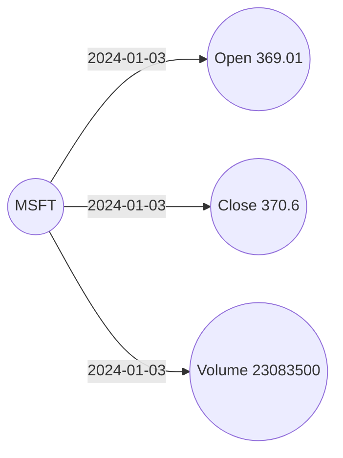

# How do I turn price columns into measurements and skip invalid values?

You have daily stock prices: one row per ticker and day, with the opening
price, the closing price and the volume in separate columns. You want each of
those values as a measurement in the graph, linked to its ticker by an edge
that carries the date.

Price feeds are not clean. A feed that has no value for a day may send a zero
instead, and a zero price loaded as a measurement is wrong. You want such
values dropped when the rows are loaded, while the valid values of the same
row are kept.



## What you need

- GraFlo installed (`pip install graflo`).
- A running ArangoDB, as in [the CSV example](../01-csv-two-resources/README.md).

## The data

[`data/prices.csv`](data/prices.csv) holds three trading days of two tickers,
in the column layout of a common price export:

```csv
Date,Open,High,Low,Close,Volume,symbol
2024-01-02,187.14999389648438,188.44000244140625,183.88999938964844,185.63999938964844,82488700,AAPL
2024-01-03,184.22000122070312,185.8800048828125,183.42999267578125,184.25,58414500,AAPL
2024-01-04,182.14999389648438,183.08999633789062,180.8800048828125,181.91000366210938,71983600,AAPL
2024-01-02,373.8599853515625,375.8999938964844,366.7699890136719,370.8699951171875,25258600,MSFT
2024-01-03,369.010009765625,373.260009765625,368.510009765625,370.6000061035156,23083500,MSFT
2024-01-04,0,373.1000061035156,367.1700134277344,367.94000244140625,0,MSFT
```

The last row is planted to show the filter: its opening price and volume are
0, as a feed sends when it has no value. Its closing price is valid. `High`
and `Low` are not loaded.

## Steps

### 1. Declare tickers, measurements and a filter

The `schema` block of [`manifest.yaml`](manifest.yaml):

```yaml
vertices:
-   name: ticker
    properties: [symbol]
    identity: [symbol]
-   name: metric
    properties: [name, value]
    identity: [name, value]
    filters:
    -   field: value
        foo: __gt__
        value: 0
edges:
-   source: ticker
    target: metric
    properties: [date]
```

A `metric` vertex is one value of one measure, such as `Close` 370.6. Its
identity is the name and the value, so two readings of the same value share one
vertex. The edge from the ticker carries the date of the measurement.

`filters` lists conditions that every `metric` must meet to be stored. Here
`value` must be greater than 0: `foo` names the comparison, as the Python
method `__gt__`. A measurement that fails is dropped, and so is its edge.

### 2. Turn each column into a measurement

Two named transforms, in the `ingestion_model` block:

```yaml
transforms:
-   name: round_metric
    module: graflo.util.transform
    foo: round_str
    params: {ndigits: 3}
    dress: {key: name, value: value}
-   name: int_metric
    module: builtins
    foo: int
    dress: {key: name, value: value}
```

`module` and `foo` name the Python function to call: `round_str` from
`graflo.util.transform` rounds a price, `int` from `builtins` reads a volume.
`dress` packs the result with the column it came from: the column name goes
into `name` and the result into `value`. From a row with `Open` of
`369.010009765625`, `round_metric` makes `{name: Open, value: 369.01}`, which
is a `metric`.

### 3. Read each row

The resource `prices`:

```yaml
pipeline:
-   transform:
        call: {use: round_metric, input: [Open]}
-   transform:
        call: {use: round_metric, input: [Close]}
-   transform:
        call: {use: int_metric, input: [Volume]}
-   transform:
        call:
            module: graflo.util.transform
            foo: parse_date_yahoo
            input: [Date]
            output: [date]
-   vertex: ticker
-   vertex: metric
-   edge:
        from: ticker
        to: metric
        vertex_weights:
        -   name: metric
            fields: [name]
```

The first three steps make three measurements per row; the fourth turns
`2024-01-02` into `2024-01-02T12:00:00Z` in the field `date`, which the edge
stores. `vertex: metric` makes one vertex per measurement that passes the
filter.

`vertex_weights` copies properties of an endpoint vertex onto the edge. Here
it copies the `name` of the metric, under the edge property `metric@name`, so
a query can select a ticker's closing prices by the edges alone.

### 4. Run it

```bash
cd examples/05-vertex-filters-and-weights
uv run python ingest.py
```

[`ingest.py`](ingest.py) works as in the CSV example. The `bindings` block of
the manifest points the resource at `data/prices.csv`.

## What you should see

| | Count | Why |
|---|---|---|
| `ticker` vertices | 2 | AAPL and MSFT |
| `metric` vertices | 16 | 3 per row for 6 rows, less the planted opening price and volume |
| `ticker` to `metric` edges | 16 | One per stored measurement |

Each edge carries `date` and `metric@name`, for example
`{date: 2024-01-03T12:00:00Z, metric@name: Close}`. The planted row keeps its
closing price, 367.94.

## What goes wrong

**No filter.** Remove `filters` and the planted row adds `Open` 0.0 and
`Volume` 0 as measurements: 18 metrics and 18 edges.

## What to read next

- [One kind of thing in several roles](../06-vertex-roles-edge-links/README.md).
- [`dress` and the other transform options](../../docs/concepts/ingestion/transforms.md#dress).
- [The `edge` step](../../docs/concepts/architecture/core_components.md#the-edge-step),
  including `vertex_weights`.
