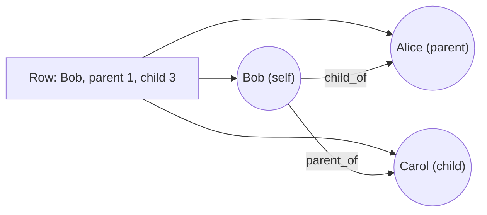

# How do I ingest a row that mentions the same kind of thing in several roles?

You keep a family register. Each row describes one person and names, by id, one
of their parents and one of their children. Parents and children are people
too, so every row mentions three persons.

You want one vertex per person, an edge from each person to their parent and an
edge from each person to their child. The three persons of a row have the same
type, so something has to tell them apart: which one is the parent, which one
is the child, and which one the row's name and age belong to.

Here each of the three gets a role, and the edges connect roles.



## What you need

- GraFlo installed (`pip install graflo`).
- A running ArangoDB, as in [the first example](../01-csv-two-resources/README.md).

## The data

[`data/family.csv`](data/family.csv):

| id | name | age | parent_id | child_id |
|---|---|---|---|---|
| 1 | Alice | 88 | 4 | 2 |
| 2 | Bob | 61 | 1 | 3 |
| 3 | Carol | 34 | 2 | 5 |

Alice is Bob's parent, and Bob is Carol's. Person 4 (Alice's parent) and
person 5 (Carol's child) have no row of their own: the register knows only
their ids.

## Steps

### 1. Declare one vertex type and two relations

The `schema` block of [`manifest.yaml`](manifest.yaml):

```yaml
vertices:
-   name: person
    properties: [id, name, age]
    identity: [id]
edges:
-   source: person
    target: person
    relation: child_of
-   source: person
    target: person
    relation: parent_of
```

Both edges join a `person` to a `person`; the relation name tells them apart.

### 2. Give each person in the row a role

The resource `family` starts with three steps that each produce a `person`:

```yaml
pipeline:
-   vertex: person
    role: self
-   vertex: person
    role: parent
    from:
        id: parent_id
    extraction_scope: mapped_only
-   vertex: person
    role: child
    from:
        id: child_id
    extraction_scope: mapped_only
```

`role` gives each of the three vertices a name that later steps refer to. The
`self` step takes `id`, `name` and `age` from the columns of the same names.
The `parent` step takes its `id` from the `parent_id` column (`from` maps a
property to a column), and `extraction_scope: mapped_only` limits it to that
mapping. Without it, the step would also take `name` and `age` from the row,
because the `person` type declares them. The `child` step works the same way.

### 3. Connect the roles

```yaml
-   edge:
        links:
        -   source_role: self
            target_role: parent
            relation: child_of
        -   source_role: self
            target_role: child
            relation: parent_of
```

An `edge` step with `links` writes one edge per entry for every row.
`source_role` and `target_role` name roles from step 2. Two `edge` steps, one
per entry, give the same result; `links` keeps the edges of one row together.

### 4. Run it

```bash
cd examples/06-vertex-roles-edge-links
uv run python ingest.py
```

[`ingest.py`](ingest.py) is the script of the first example: it loads the
manifest, creates the schema in ArangoDB and ingests `data/family.csv`.

## What you should see

The database holds:

| | Count | Why |
|---|---|---|
| `person` vertices | 5 | Alice, Bob and Carol, plus persons 4 and 5, which carry only an `id` |
| `child_of` edges | 3 | One per row: 1 to 4, 2 to 1, 3 to 2 |
| `parent_of` edges | 3 | One per row: 1 to 2, 2 to 3, 3 to 5 |

Bob appears in all three rows: as a child in the first, as himself in the
second, as a parent in the third. The rows agree on his `id`, so he is one
vertex, with the name and age from his own row.

## What goes wrong

Remove the two `extraction_scope` lines and ingest again. The `parent` and
`child` steps now also take `name` and `age` from the row, although those
columns describe the row's own person. Person 4 is stored as a second Alice,
aged 88. Bob receives a name from each row that mentions him (Alice, Bob and
Carol) and keeps whichever is written last.

## What to read next

- [One table that holds many kinds of things](../07-vertex-router-type-map/README.md):
  roles again, when the type of each vertex comes from the row.
- [The `vertex` step](../../docs/concepts/architecture/core_components.md#the-vertex-step)
  and [the `edge` step](../../docs/concepts/architecture/core_components.md#the-edge-step):
  every option of both.
