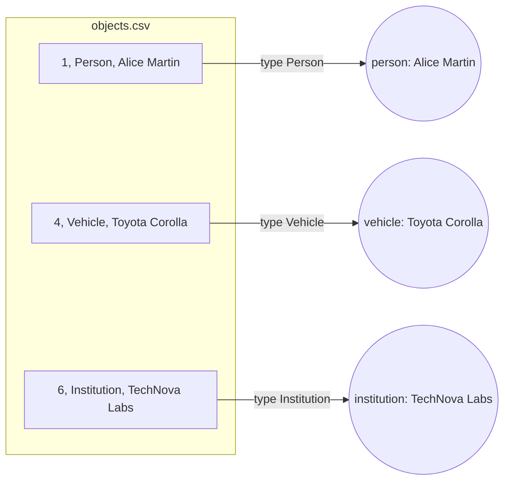

# How do I ingest one table that holds many kinds of things?

Your records come as one table of objects: persons, vehicles and institutions
side by side, with a `type` column that says which is which. Each kind fills
its own columns and leaves the others empty. A second table lists relations
between the objects: who works where, who owns which vehicle.

You want one vertex type per kind, each with only its own properties, and edges
whose type comes from the relations table. You could split the table by kind
before loading, one file and one mapping per kind. Here one step reads the
`type` column instead and sends each row to the right vertex type.



## What you need

- GraFlo installed (`pip install graflo`).
- A running ArangoDB, as in [the first example](../01-csv-two-resources/README.md).

## The data

[`data/objects.csv`](data/objects.csv):

| id | type | name | age | email | license_plate | fuel_type | industry | founded_year |
|---|---|---|---|---|---|---|---|---|
| 1 | Person | Alice Martin | 34 | alice@example.com | | | | |
| 2 | Person | Bob Smith | 45 | bob@example.com | | | | |
| 3 | Person | Clara Rossi | 29 | clara@example.com | | | | |
| 4 | Vehicle | Toyota Corolla | | | AB-123-CD | Petrol | | |
| 5 | Vehicle | Tesla Model 3 | | | EV-789-ZZ | Electric | | |
| 6 | Institution | TechNova Labs | | | | | Biotechnology | 2012 |
| 7 | Institution | FinEdge Capital | | | | | Finance | 2005 |

[`data/relations.csv`](data/relations.csv) names both ends of each relation by
type and id, in the table's own words:

| source_type | source_id | relation | target_type | target_id |
|---|---|---|---|---|
| Person | 1 | EMPLOYED_BY | Institution | 6 |
| Person | 2 | EMPLOYED_BY | Institution | 7 |
| Person | 3 | EMPLOYED_BY | Institution | 6 |
| Person | 1 | COLLEAGUE_OF | Person | 3 |
| Person | 1 | OWNS | Vehicle | 5 |
| Person | 3 | OWNS | Vehicle | 4 |
| Institution | 7 | FUNDS | Institution | 6 |

## Steps

### 1. Declare a vertex type per kind

The `schema` block of [`manifest.yaml`](manifest.yaml) gives each kind its own
properties:

```yaml
vertices:
-   name: person
    properties: [id, name, age, email]
    identity: [id]
-   name: vehicle
    properties: [id, name, license_plate, fuel_type]
    identity: [id]
-   name: institution
    properties: [id, name, industry, founded_year]
    identity: [id]
```

Its `edges` list declares the four relations with their ends: `employed_by`
(person to institution), `colleague_of` (person to person), `owns` (person to
vehicle) and `funds` (institution to institution).

### 2. Route each object by its type

```yaml
-   name: objects
    pipeline:
    -   vertex_router:
            type_field: type
            type_map:
                Person: person
                Vehicle: vehicle
                Institution: institution
```

A `vertex_router` step reads the column named by `type_field` and produces a
vertex of the type it names. The table writes `Person` where the schema says
`person`, so `type_map` translates. Each vertex takes only the properties its
type declares: a person gets no `license_plate`.

### 3. Route both ends of each relation

```yaml
-   name: relations
    pipeline:
    -   vertex_router:
            type_field: source_type
            # type_map: the same three entries as in step 2
            role: source
            from:
                id: source_id
    -   vertex_router:
            type_field: target_type
            # type_map: the same three entries as in step 2
            role: target
            from:
                id: target_id
```

A relation row mentions two objects, so two routers run: one reads the
`source_*` columns, the other the `target_*` columns (`from` maps a property to
a column). `role` names each end, as in the
[roles example](../06-vertex-roles-edge-links/README.md); it keeps the two ends
apart when both are persons, as in `COLLEAGUE_OF`. These vertices carry only an
`id`, which matches the vertices from `objects.csv`, so they add none.

### 4. Take the edge type from the row

```yaml
    -   edge:
            source_role: source
            target_role: target
            relation_field: relation
            relation_map:
                EMPLOYED_BY: employed_by
                COLLEAGUE_OF: colleague_of
                OWNS: owns
                FUNDS: funds
```

The `edge` step connects the two roles. `relation_field` takes the relation from
the row's `relation` column, and `relation_map` translates it the way
`type_map` translated types. The source and target types come from the routers,
so this one step writes all four kinds of edges.

### 5. Run it

```bash
cd examples/07-vertex-router-type-map
uv run python ingest.py
```

[`ingest.py`](ingest.py) is the script of the first example: it loads the
manifest, creates the schema in ArangoDB and ingests both files.

## What you should see

The database holds:

| | Count | Why |
|---|---|---|
| `person` vertices | 3 | One per `Person` row of `objects.csv` |
| `vehicle` vertices | 2 | One per `Vehicle` row |
| `institution` vertices | 2 | One per `Institution` row |
| `employed_by` edges | 3 | Person to institution |
| `colleague_of` edges | 1 | Person to person |
| `owns` edges | 2 | Person to vehicle |
| `funds` edges | 1 | Institution to institution |

## What goes wrong

**The types are not translated.** Without `type_map`, a router uses the raw
value as the type name. The schema has no type `Person`, so the router skips
every row without an error, and the graph stays empty.

**The relations are not translated.** Without `relation_map`, the edges carry
the raw names `EMPLOYED_BY`, `COLLEAGUE_OF`, `OWNS` and `FUNDS`, which match
none of the relations the schema declares.

## What to read next

- [Rows that name their own types](../08-vertex-router-flat-rows/README.md): the
  same routing when the table already uses the schema's names.
- [The `vertex_router` step](../../docs/concepts/architecture/core_components.md#the-vertex_router-step):
  every option of the step.
