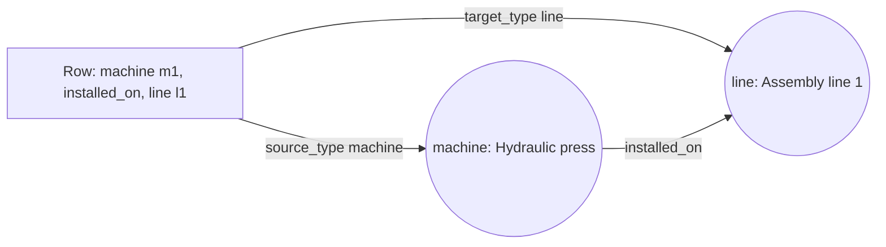

# How do I ingest a relations table where each row names its own types?

In the [previous example](../07-vertex-router-type-map/README.md), a type map
translated the table's words (`Person`) into the schema's type names
(`person`). Here the rows already use the schema's names, so the same routing
works without a map.

A plant keeps its layout as one table of relations. Each row states one fact: a
machine is installed on a production line, or a spare machine stands by for
another. The row names both ends by type and id, gives each a name, and names
the relation. There is no separate table of machines or lines.

You want vertices for the machines and the lines, and edges between them, all
from this one table.



## What you need

- GraFlo installed (`pip install graflo`).
- A running ArangoDB, as in [the first example](../01-csv-two-resources/README.md).

## The data

[`data/relations.csv`](data/relations.csv):

| source_type | source_id | source_name | relation | target_type | target_id | target_name |
|---|---|---|---|---|---|---|
| machine | m1 | Hydraulic press | installed_on | line | l1 | Assembly line 1 |
| machine | m2 | Lathe | installed_on | line | l2 | Assembly line 2 |
| machine | m3 | Spare hydraulic press | standby_for | machine | m1 | Hydraulic press |

The spare press is installed on no line; it stands by for the hydraulic press.
In that row both ends are machines.

## Steps

### 1. Declare the types and the relations

The `schema` block of [`manifest.yaml`](manifest.yaml):

```yaml
vertices:
-   name: machine
    properties: [id, name]
    identity: [id]
-   name: line
    properties: [id, name]
    identity: [id]
edges:
-   source: machine
    target: line
    relation: installed_on
-   source: machine
    target: machine
    relation: standby_for
```

The values in the `source_type`, `target_type` and `relation` columns are
exactly these names.

### 2. Route both ends of the row

```yaml
pipeline:
-   vertex_router:
        type_field: source_type
        role: source
        from:
            id: source_id
            name: source_name
-   vertex_router:
        type_field: target_type
        role: target
        from:
            id: target_id
            name: target_name
```

Each `vertex_router` step reads a type column and produces a vertex of the type
it names. There is no `type_map`: `machine` and `line` already name declared
types, so the router uses them as they are. `from` fills the vertex's `id` and
`name` from that end's columns. `role` names the two ends so that the next step
can connect them; in the last row, where both ends are machines, it is what
tells them apart.

### 3. Connect the two ends

```yaml
-   edge:
        source_role: source
        target_role: target
        relation_field: relation
```

The `edge` step draws an edge from the `source` vertex to the `target` vertex,
with the relation read from the row's `relation` column.

### 4. Run it

```bash
cd examples/08-vertex-router-flat-rows
uv run python ingest.py
```

[`ingest.py`](ingest.py) is the script of the first example: it loads the
manifest, creates the schema in ArangoDB and ingests `data/relations.csv`.

## What you should see

The database holds:

| | Count | Why |
|---|---|---|
| `machine` vertices | 3 | `m1` appears in two rows, as a source and as a target; it is one vertex |
| `line` vertices | 2 | `l1` and `l2` |
| `installed_on` edges | 2 | The first two rows |
| `standby_for` edges | 1 | The last row, from `m3` to `m1` |

## What goes wrong

Here the table decides which types and relations appear, so two kinds of row
deserve attention:

- An end whose type the schema does not declare, such as `robot`, produces no
  vertex, and its row no edge. There is no error.
- A row that pairs two declared types in a way the schema does not declare,
  such as `line`, `feeds`, `line`, is written as a new kind of edge. Set
  `strict_edge_types: true` on the `edge` step to skip such rows instead.

## What to read next

- [A graph from a PostgreSQL database](../09-infer-from-postgres/README.md): the
  next example.
- [The `vertex_router` step](../../docs/concepts/architecture/core_components.md#the-vertex_router-step):
  every option of the step.
- [Combine manifests with a routed source](../21-router-union-alignment/README.md):
  a routed table in a union of two manifests.
