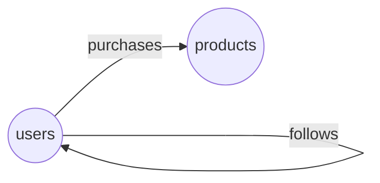

# How do I get a graph from a PostgreSQL database without writing a schema?

You have a PostgreSQL database for a small shop: users, products, the purchases
users make and the other users they follow. You want the same data as a graph,
with users and products as vertices and purchases and follows as edges.

The tables already describe most of that graph. A primary key says what
identifies a row; a foreign key says which row of another table a row points to.
GraFlo reads the keys and proposes a manifest: tables of things become vertex
types, tables that link two things become edges, and columns become properties.
You look at the proposal, then load the rows.



## What you need

- GraFlo installed (`pip install graflo`).
- A running PostgreSQL and a running ArangoDB. The repository ships containers
  for both; see [`docker/README.md`](../../docker/README.md). The script reads
  their connection settings with `PostgresConfig.from_docker_env()` and
  `ArangoConfig.from_docker_env()`.
- The script drops and recreates the tables `users`, `products`, `purchases`
  and `follows` in that PostgreSQL database.

## The data

[`data/shop.sql`](data/shop.sql) creates four tables and fills them with 4
users, 4 products, 6 purchases and 5 follows:

| Table | Columns | Keys |
|---|---|---|
| `users` | `id`, `name`, `email`, `created_at` | primary key `id` |
| `products` | `id`, `name`, `price`, `description`, `created_at` | primary key `id` |
| `purchases` | `id`, `user_id`, `product_id`, `purchase_date`, `quantity`, `total_amount` | foreign keys `user_id` to `users`, `product_id` to `products` |
| `follows` | `id`, `follower_id`, `followed_id`, `created_at` | foreign keys `follower_id` and `followed_id` to `users` |

## Steps

The steps are the parts of [`ingest.py`](ingest.py).

### 1. Connect to PostgreSQL and load the shop

```python
postgres_conf = PostgresConfig.from_docker_env()
load_schema_from_sql_file(
    config=postgres_conf,
    schema_file=EXAMPLE_DIR / "data" / "shop.sql",
    continue_on_error=False,
)
```

With a database of your own, skip the loading and point `PostgresConfig` at it.

### 2. Infer a manifest

```python
conn_conf = ArangoConfig.from_docker_env()
engine = GraphEngine(target_db_flavor=conn_conf.connection_type)
manifest = engine.infer_manifest(postgres_conf, schema_name="public")
```

`infer_manifest` reads the tables of the PostgreSQL schema `public` with their
columns and keys. It returns all three blocks of a manifest: the schema (vertex
and edge types), one resource per table (a resource is the recipe that turns
the rows of one table into vertices and edges), and bindings that connect each
table to its resource. The inferred graph is named after the PostgreSQL schema;
the script renames it `shop`, and ArangoDB stores it in a database of that name
unless the connection settings name one.

### 3. Look at what was inferred

The script saves the inferred schema to
[`generated-manifest.yaml`](generated-manifest.yaml):

```yaml
core_schema:
    edge_config:
        edges:
        # ... follows: users to users, with created_at
        -   properties:
            -   name: purchase_date
                type: DATETIME
            -   name: quantity
                type: INT
            -   name: total_amount
                type: FLOAT
            relation: purchases
            source: users
            target: products
    vertex_config:
        vertices:
        -   identity:
            -   id
            name: products
            properties:
            -   name: id
                type: INT
            # ... name, price, description, created_at
        # ... users, with identity id
```

- `users` and `products` have a primary key and other columns, so each becomes
  a vertex type. The primary key becomes the identity: rows with the same `id`
  are one vertex.
- `purchases` and `follows` have two foreign keys each, so each becomes an edge.
  The first foreign key gives the source, the second the target, and the table
  name the relation. The columns that are not keys become edge properties.
- Column types become property types: integers `INT`, decimals `FLOAT`, text
  `STRING`, timestamps `DATETIME`.

The resources are not in this file. The one for `purchases` reads `user_id`
into a `users` vertex and `product_id` into a `products` vertex. The schema
declares an edge between those two types, so GraFlo adds the edge.

### 4. Ingest

```python
engine.define_and_ingest(
    manifest=manifest,
    target_db_config=conn_conf,
    ingestion_params=IngestionParams(clear_data=True),
    recreate_schema=True,
)
```

The inferred bindings name the PostgreSQL database only by a label,
`postgres_source`. The engine keeps the connection settings for that label from
step 2, so ingestion can read the tables.

### 5. Run it

```bash
cd examples/09-infer-from-postgres
uv run python ingest.py
```

## What you should see

The database holds:

| | Count | Why |
|---|---|---|
| `users` vertices | 4 | One per row of `users`; `purchases` and `follows` refer to the same four by `id` |
| `products` vertices | 4 | One per row of `products` |
| `purchases` edges, `users` to `products` | 6 | One per row, with `purchase_date`, `quantity` and `total_amount` |
| `follows` edges, `users` to `users` | 5 | One per row, with `created_at` |

## What inference needs

The rules, in short:

- A table without a primary key is skipped, with a warning that names it.
- A table becomes an edge when it has exactly two foreign keys, a primary key
  of two or more columns, or a name that starts with `rel_`, unless you name
  it in `entity_tables`.
- Any other table with a primary key and at least one column that is not a key
  becomes a vertex type.
- A foreign key of a vertex table becomes an edge to the table it references.
  This shop has none: its foreign keys are all in `purchases` and `follows`.

The [SQL schema inference guide](../../docs/guides/sql_schema_inference.md)
explains what happens when keys are missing and how to read databases other
than PostgreSQL.

## What the target database changes

Inference gives the same vertices, edges and resources for every target. The
target set in `GraphEngine(target_db_flavor=...)` changes only the names under
which things are stored: for TigerGraph, a name that TigerGraph cannot store (a
reserved word, a forbidden character or prefix) gets a stored name in the
schema's `db_profile`. Other databases store the names as they are. In this
shop no name needs changing.

## What to read next

- [A graph from an ontology and RDF data](../10-infer-from-rdf/README.md): the
  same idea for an OWL ontology.
- [Credentials outside the manifest](../11-connection-proxy/README.md): the
  shop again, with a manifest you write and a label for the database.
- [Inferring a graph from a SQL database](../../docs/guides/sql_schema_inference.md).
