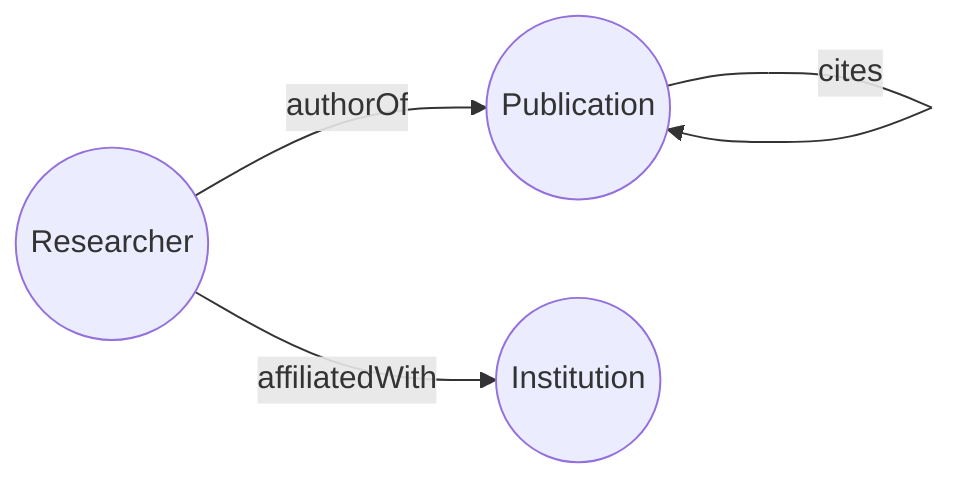

# How do I turn an OWL ontology and RDF data into a property graph?

You keep research data as RDF: an OWL ontology says there are researchers,
publications and institutions and how they relate, and a Turtle file lists the
actual researchers, papers and institutions. You want the same data in a
property graph database, with vertices you can query by type and edges you can
traverse.

GraFlo reads the ontology and proposes a manifest: each class becomes a vertex
type, each datatype property becomes a vertex property, and each object
property becomes an edge. It then reads the instances of each class from the
data file and writes the graph.



## What you need

- GraFlo installed (`pip install graflo`). The RDF libraries come with it.
- A running ArangoDB. The repository ships a container for it; see
  [`docker/README.md`](../../docker/README.md).

## The data

[`data/ontology.ttl`](data/ontology.ttl) declares three classes, seven datatype
properties and three object properties. An excerpt:

```turtle
ex:Researcher  a owl:Class ;
    rdfs:label "Researcher" .

ex:fullName     a owl:DatatypeProperty ;
    rdfs:domain ex:Researcher ;
    rdfs:range  xsd:string .

ex:authorOf  a owl:ObjectProperty ;
    rdfs:domain ex:Researcher ;
    rdfs:range  ex:Publication .
```

[`data/data.ttl`](data/data.ttl) holds the instances: 3 institutions, 4
researchers and 4 publications. Each researcher is affiliated with one
institution and authors one publication; publications 2 to 4 each cite the one
before.

```turtle
ex:alice  a ex:Researcher ;
    ex:fullName       "Alice Smith" ;
    ex:orcid          "0000-0001-0001-0001" ;
    ex:affiliatedWith ex:mit ;
    ex:authorOf       ex:paper1 .
```

## Steps

The steps are the parts of [`ingest.py`](ingest.py).

### 1. Infer the schema from the ontology

```python
conn_conf = ArangoConfig.from_docker_env()
engine = GraphEngine(target_db_flavor=conn_conf.connection_type)
schema, ingestion_model = engine.infer_schema_from_rdf(
    source=ONTOLOGY_FILE, schema_name="academic_kg"
)
```

`infer_schema_from_rdf` returns the schema and one resource per class. A
resource is the recipe that turns one kind of record into vertices and edges.

### 2. Look at what was inferred

The script saves the schema to [`generated-manifest.yaml`](generated-manifest.yaml):

```yaml
core_schema:
    edge_config:
        edges:
        -   relation: authorOf
            source: Researcher
            target: Publication
        # ... affiliatedWith, cites
    vertex_config:
        vertices:
        -   identity:
            -   _uri
            name: Researcher
            properties:
            -   name: _key
            -   name: _uri
            -   name: fullName
            -   name: orcid
        # ... Publication, Institution
```

- Each vertex type gets two properties besides the datatype properties: `_uri`,
  the full IRI of the instance (`http://example.org/alice`), which is its
  identity, and `_key`, the last part of the IRI (`alice`).
- Each object property becomes an edge from its `rdfs:domain` to its
  `rdfs:range`, named after the property.

The resource for `Researcher` makes a `Researcher` vertex, then reads the IRI in
`authorOf` into a `Publication` vertex and adds the `authorOf` edge; the same
for `affiliatedWith`.

### 3. Read the instances of each class from the data file

```python
bindings = Bindings()
for resource in ingestion_model.resources:
    connector = SparqlConnector(rdf_class=NAMESPACE + resource.name, rdf_file=DATA_FILE)
    bindings.add_connector(connector)
    bindings.bind_resource(resource.name, connector)
```

A connector says where the records of a resource come from. Each one here reads
the instances of one class from `data.ttl` and gives the resource one record per
instance: its IRI and one field per property.

### 4. Ingest

```python
engine.define_and_ingest(
    manifest=GraphManifest(
        graph_schema=schema, ingestion_model=ingestion_model, bindings=bindings
    ),
    target_db_config=conn_conf,
    ingestion_params=IngestionParams(clear_data=True),
    recreate_schema=True,
)
```

### 5. Run it

```bash
cd examples/10-infer-from-rdf
uv run python ingest.py
```

## What you should see

The database holds:

| | Count | Why |
|---|---|---|
| `Researcher` vertices | 4 | One per instance of `ex:Researcher` |
| `Publication` vertices | 4 | One per instance; a cited or authored paper is matched by its IRI, not added again |
| `Institution` vertices | 3 | Dave and Bob share ETH Zürich |
| `authorOf` edges | 4 | One per researcher |
| `affiliatedWith` edges | 4 | One per researcher |
| `cites` edges | 3 | Papers 2, 3 and 4 each cite one paper |

## Also possible

- To read the data from a SPARQL endpoint instead of a file, give each
  `SparqlConnector` an `endpoint_url` in place of `rdf_file`.
- When the ontology and the instances are in one file,
  `engine.create_bindings_from_rdf(path)` builds these connectors for you, all
  reading that file.

## What to read next

- [A graph from a PostgreSQL database](../09-infer-from-postgres/README.md):
  the same idea for relational tables.
- [Credentials outside the manifest](../11-connection-proxy/README.md): how a
  manifest names a source without its password.
- [Glossary: schema inference](../../docs/concepts/glossary.md#schema-inference).
