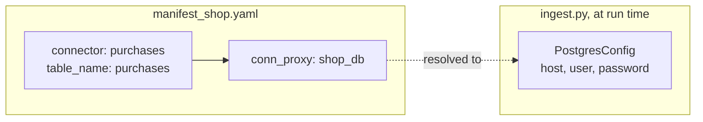

# How do I keep database credentials out of the manifest?

Your manifest says which PostgreSQL tables feed which parts of the graph. You
want to keep it in version control and share it, but the database address, user
and password must not be in it, and they differ between your laptop and
production.

The manifest therefore names the database by a label, here `shop_db`. When the
program runs, it supplies the connection settings for that label. The same
manifest then works against any database that has the tables, and it never
contains a password.



## What you need

- GraFlo installed (`pip install graflo`).
- A running PostgreSQL and a running ArangoDB. The repository ships containers
  for both; see [`docker/README.md`](../../docker/README.md).
- The shop data of example 09. The script loads
  [`../09-infer-from-postgres/data/shop.sql`](../09-infer-from-postgres/data/shop.sql)
  into PostgreSQL, which drops and recreates the tables `users`, `products`,
  `purchases` and `follows`.

## The data

The shop of [example 09](../09-infer-from-postgres/README.md): 4 users, 4
products, 6 purchases (user to product) and 5 follows (user to user).
[`manifest_shop.yaml`](manifest_shop.yaml) describes the same graph that
example 09 infers, written by hand.

## Steps

### 1. Name each table's database by a label

In the `bindings` block, each connector names its table; `connector_connection`
gives every connector the label `shop_db`:

```yaml
bindings:
    connectors:
    -   name: users
        table_name: users
        resource_name: users
    # ... products, purchases, follows
    connector_connection:
    -   connector: users
        conn_proxy: shop_db
    # ... the same for products, purchases, follows
```

`connector` refers to a connector by its `name`, not to a resource. Nothing in
the manifest says where `shop_db` is.

### 2. Supply the settings for the label

[`ingest.py`](ingest.py) reads the PostgreSQL settings from the container's
configuration and registers them for `shop_db`:

```python
postgres_conf = PostgresConfig.from_docker_env()

provider = InMemoryConnectionProvider()
provider.bind_single_config_for_bindings(
    bindings=manifest.require_bindings(),
    conn_proxy="shop_db",
    config=PostgresGeneralizedConnConfig(config=postgres_conf),
)
```

The connection provider maps each connector with the label `shop_db` to these
settings. Outside this example, build `PostgresConfig` from your own secret
store, or with `PostgresConfig.from_env()` from environment variables that
start with `POSTGRES_`.

### 3. Ingest with the provider

```python
engine.define_and_ingest(
    manifest=manifest,
    target_db_config=conn_conf,
    ingestion_params=IngestionParams(clear_data=True),
    recreate_schema=True,
    connection_provider=provider,
)
```

### 4. Run it

```bash
cd examples/11-connection-proxy
uv run python ingest.py
```

## What you should see

The same graph as example 09:

| | Count |
|---|---|
| `users` vertices | 4 |
| `products` vertices | 4 |
| `purchases` edges, `users` to `products` | 6 |
| `follows` edges, `users` to `users` | 5 |

## What goes wrong

**The label has no settings.** If `define_and_ingest` gets no provider, or one
without `shop_db`, GraFlo cannot reach the tables. The run stops before it
reads anything:

```text
ValueError: Registry build failed in strict mode:
- Failed to register SQL source for resource 'users' (connector 'users'): no PostgreSQL connection configuration for table 'users'
- Failed to register SQL source for resource 'products' (connector 'products'): no PostgreSQL connection configuration for table 'products'
- Failed to register SQL source for resource 'purchases' (connector 'purchases'): no PostgreSQL connection configuration for table 'purchases'
- Failed to register SQL source for resource 'follows' (connector 'follows'): no PostgreSQL connection configuration for table 'follows'
```

## Also possible

- Several databases: give their connectors different labels, register each
  label with `provider.register_generalized_config(conn_proxy=..., config=...)`,
  then call `provider.bind_from_bindings(bindings=...)` once.
- The same pattern holds for SPARQL endpoints, REST APIs and Kafka topics.
  [Example 12](../12-api-env-config/README.md) reads the settings of each label
  from environment variables.

## What to read next

- [API sources from environment variables](../12-api-env-config/README.md).
- [Glossary: connection proxy](../../docs/concepts/glossary.md#connection-proxy)
  and [connection provider](../../docs/concepts/glossary.md#connection-provider).
