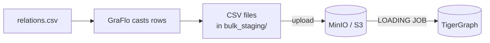

# How do I load a large graph into TigerGraph quickly?

You load a large graph into TigerGraph. By default GraFlo sends the records to
TigerGraph's REST endpoint batch by batch, and for a large first load that
overhead dominates. TigerGraph has a faster path of its
own: a loading job that reads CSV files.

With bulk loading switched on, GraFlo writes the cast records to CSV files,
uploads them to S3 (or an S3-compatible store such as MinIO), and runs one
loading job at the end that reads them. The manifest does not change, and the
S3 credentials stay out of it.



The graph is the one of [example 03](../03-csv-relation-field/README.md):
companies, and several kinds of relation between them read from a column.

## What you need

- GraFlo installed (`pip install graflo`).
- A running TigerGraph and a running MinIO. The repository ships containers
  for both; see [`docker/README.md`](../../docker/README.md). TigerGraph must be
  able to reach MinIO, because it reads the uploaded files itself.

The scripts read connection settings from the environment files of those
containers, not from your shell:

| Setting | Read from | Variables |
|---|---|---|
| TigerGraph | `docker/tigergraph` | `TG_WEB` (GSQL port), `TIGERGRAPH_HOSTNAME`, `TIGERGRAPH_USERNAME`, `TIGERGRAPH_PASSWORD` (if unset there: the same variable in your shell, then `tigergraph`) |
| MinIO address, used by GraFlo | `docker/minio` | `MINIO_ENDPOINT`, or `MINIO_HOSTNAME` and `MINIO_API_PORT` |
| MinIO address, used by TigerGraph | `docker/minio` | `MINIO_LOADER_ENDPOINT`; without it, TigerGraph gets the address GraFlo uses |
| MinIO credentials | `docker/minio` | `MINIO_ROOT_USER`, `MINIO_ROOT_PASSWORD` |
| Bucket | `docker/minio` | `MINIO_STAGING_BUCKET` (default `graflo-staging`) |

Three variables are read from your shell: `BULK_USE_S3` (default `1`; `0`
keeps the files on local disk), `BULK_S3_BUCKET` (overrides the bucket) and
`BULK_S3_PREFIX` (folder in the bucket, default `demo`).

## The data

[`data/relations.csv`](data/relations.csv):

| company_a | company_b | relation | date |
|---|---|---|---|
| Acme | Beta | partners | 2024-01-01 |
| Gamma | Acme | supplies | 2024-02-01 |

## Steps

### 1. Name the staging area in the manifest

[`manifest.yaml`](manifest.yaml) adds one entry to `bindings`: a staging area
called `bulk_s3`, whose S3 settings are registered at run time under the label
`minio_bulk`.

```yaml
bindings:
    # ... connectors
    staging_proxy:
    -   name: bulk_s3
        conn_proxy: minio_bulk
```

### 2. Switch the target to bulk loading

Bulk loading is a setting of the TigerGraph connection. [`ingest.py`](ingest.py)
sets it and registers the MinIO settings under `minio_bulk`:

```python
minio_conf = minio_config()
conn_conf.bulk_load = TigergraphBulkLoadConfig(
    enabled=True,
    staging_dir=str(STAGING_DIR),
    s3_staging_name="bulk_s3",
    s3_bucket=minio_conf.bucket,
    s3_key_prefix=os.environ.get("BULK_S3_PREFIX", "demo"),
)
provider.register_generalized_config(
    conn_proxy="minio_bulk",
    config=minio_conf.to_s3_generalized_conn_config(),
)
```

Before ingesting, the script creates the bucket if it is missing, and fails at
once if MinIO cannot be reached.

### 3. Start MinIO

From the repository root:

```bash
cd docker/minio
docker compose --env-file .env --profile graflo.minio up -d
cd ../..
```

### 4. Load and check

```bash
uv run python examples/13-tigergraph-bulk-s3/ingest.py
uv run python examples/13-tigergraph-bulk-s3/inspect_bulk.py
```

The scripts can run from any directory. [`inspect_bulk.py`](inspect_bulk.py)
reports what was staged and what TigerGraph holds, and exits with an error when
either is missing. With `--staged-only` it checks the files without connecting
to TigerGraph.

## What you should see

- Staged, in the newest `bulk_staging/<session>/`: `company.csv` with 4 rows
  (one per company in each row of the CSV, so Acme twice) and
  `edge_relates.csv` with 2 rows. TigerGraph keeps both kinds of relation in
  one edge type, `relates`, with the kind in its `relation` attribute.
- Loaded: 3 `company` vertices (Acme, Beta, Gamma; Acme is in both rows and is
  stored once) and 2 `relates` edges, both touching Acme.

Each run writes a new session directory; `bulk_staging/` is not tracked by git.

## What goes wrong

**The ingest reports success and the graph is empty.** The loading job reads
the files itself, so an `s3://` address that TigerGraph cannot reach is not an
error GraFlo sees. This happens when TigerGraph runs in a container and MinIO's
address is `127.0.0.1`: that address is valid for GraFlo on the host but not
inside the container. `ingest.py` warns about this case before it ingests. Set
`MINIO_LOADER_ENDPOINT` in the MinIO settings to an address valid inside the
TigerGraph container (for example `http://172.17.0.1:9003` on Linux, or
`http://host.docker.internal:9003` where Docker provides it), or run with
`BULK_USE_S3=0`, in which case TigerGraph must be able to read the local
staging directory.

**`Connection refused` on the MinIO port.** GraFlo talks to MinIO's S3 API,
not to its web console; they use different ports (`MINIO_API_PORT` and
`MINIO_CONSOLE_PORT`). Check that `docker ps` shows `graflo.minio` as up. If
the container never starts, the output of `docker compose ... up` names the
reason; `port is already allocated` means another process uses that host port.
Choose free ports in the MinIO settings, remove the container with
`docker rm -f graflo.minio` and start it again.

**Vertices are staged but `edge_relates.csv` is missing.** No edge reached
staging, so the problem is in the `relations` resource, not in S3 or the
loading job.

## Also possible

- For AWS S3 or any other S3-compatible store, build an
  `S3GeneralizedConnConfig` yourself and register it under the same label;
  `MinioConfig.to_s3_generalized_conn_config()` is only a shortcut.
- For other ways to emulate S3 in development, see
  [Emulating S3 in development](../../docs/guides/tigergraph_bulk_load.md#emulating-s3-in-development).

## What to read next

- [TigerGraph bulk load](../../docs/guides/tigergraph_bulk_load.md): every
  setting of `bulk_load` and the limits of bulk mode.
- [Object storage](../../docs/concepts/operations/object_storage.md).
- [A graph on disk, without a database](../14-file-backend-export/README.md).
