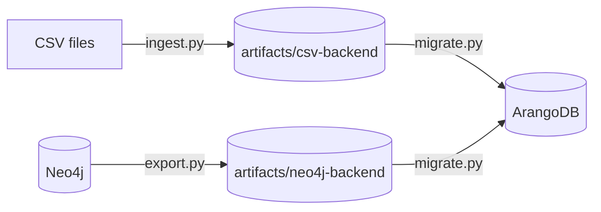

# How do I try GraFlo without a database, and export a graph to files?

You want to see the graph GraFlo builds from your data before you set up a
database. Or you have a graph in a database and want a copy on disk, to keep it
or to load it into another database later.

GraFlo can write a graph to a directory instead of a database. The directory,
called a file backend, holds the schema and the records in compressed files.
GraFlo reads it back as if it were a database, so you can load it into any
database later. This example uses the data and the manifest of
[the CSV example (01)](../01-csv-two-resources/README.md); only the target
changes.



## What you need

- GraFlo installed (`pip install graflo`).
- No database for step 1. Step 2 reads from Neo4j and step 3 writes to
  ArangoDB; the repository ships containers for both, see
  [`docker/README.md`](../../docker/README.md).

## The data

The two files of example 01, unchanged: [`data/people.csv`](data/people.csv)
lists three people with their age, and
[`data/departments.csv`](data/departments.csv) says which department each of
them works in. [`manifest.yaml`](manifest.yaml) is example 01's manifest:
`person` is identified by `id`, `department` by `name`, and each person has an
edge to their department.

## Steps

### 1. Write the graph to a directory

[`ingest.py`](ingest.py) is example 01's script with another target: a
`GraFloBackendConfig` that names a directory, instead of an `ArangoConfig`.

```python
backend = GraFloBackendConfig(output_dir=Path("artifacts/csv-backend"))

engine = GraphEngine(target_db_flavor=backend.connection_type)
engine.define_and_ingest(
    manifest=manifest,
    target_db_config=backend,
    ingestion_params=IngestionParams(clear_data=True),
    recreate_schema=True,
)
```

```bash
cd examples/14-file-backend-export
uv run python ingest.py
```

### 2. Copy a graph from a database to files

[`export.py`](export.py) copies whatever graph the Neo4j container holds. To
have something to copy, load example 01 into Neo4j first; its README shows the
two lines to change.

```python
source = Neo4jConfig.from_docker_env()
backend = GraFloBackendConfig(output_dir=Path("artifacts/neo4j-backend"))

engine = GraphEngine(target_db_flavor=backend.connection_type)
engine.migrate_graph(source, backend)
```

`migrate_graph` reads the schema and every record from the source and writes
them to the target. Here the target is a directory, so the copy lands in
`artifacts/neo4j-backend`.

```bash
uv run python export.py
uv run python inspect_backend.py artifacts/neo4j-backend
```

### 3. Load the files into a database

The directory is also a source. [`migrate.py`](migrate.py) runs the same call
the other way round, from a directory to ArangoDB, and replaces the graph that
is there:

```python
source = GraFloBackendConfig(output_dir=backend_dir)
target = ArangoConfig.from_docker_env()

engine = GraphEngine(target_db_flavor=target.connection_type)
engine.migrate_graph(source, target)
```

```bash
uv run python migrate.py                          # artifacts/csv-backend
uv run python migrate.py artifacts/neo4j-backend
```

## What you should see

After step 1 the directory holds the schema, an index, and one or more
gzip-compressed JSON Lines files per type, one record per line:

```text
artifacts/csv-backend/
├── INDEX.json          record count and file names per type
├── schema.yaml         the schema, no data
├── vertices/
│   ├── department.000.jsonl.gz
│   ├── person.000.jsonl.gz
│   └── person.001.jsonl.gz
└── edges/
    └── person____department.000.jsonl.gz
```

[`inspect_backend.py`](inspect_backend.py) counts the records:

```bash
uv run python inspect_backend.py
```

```text
artifacts/csv-backend (schema hr)
vertices:
  person      6 records, 3 distinct identities (id)
  department  3 records, 3 distinct identities (name)
edges:
  person -> department    3 records
```

The file backend appends every record it receives; it does not merge records
that have the same identity. Both files mention each person, so `person` holds
six records. The record `{"age":"27","id":"1","name":"John Hancock"}` from
`people.csv` and the record `{"id":"1","name":"John Hancock"}` from
`departments.csv` have the same id, 1. A database stores them as one vertex;
the file backend keeps both records, so each id appears twice. When
`migrate.py` loads the directory into ArangoDB, the database merges them: it
holds three `person` vertices, three `department` vertices and three edges, as
after example 01.

## Also possible

- Name the database you will load the files into when you write them, with
  `target_flavor_hint` on `GraFloBackendConfig`. Leave it unset on a directory
  you plan to read back with `migrate_graph`; see
  [Writing for a known target](../../docs/concepts/operations/graph_export_migration.md#writing-for-a-known-target).
- `GraphEngine.export_graph` returns the schema and the records as Python
  objects and writes nothing.

## What to read next

- [My data has no obvious key](../15-identity-inference/README.md): find what
  identifies a record, and write the result to a file backend.
- [Graph export and replay](../../docs/guides/graph_export_and_replay.md): the
  same steps for your own graph.
- [Graph export and migration](../../docs/concepts/operations/graph_export_migration.md):
  the directory layout, which databases can be read as a graph, and the limits.
