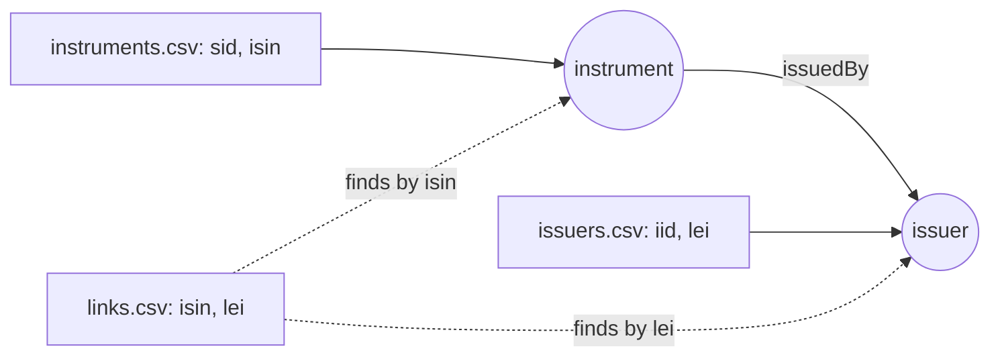

# How do I link to a record when the source only knows its alternative identifier?

Your graph holds financial instruments and the companies that issue them, each
keyed by your own internal id: `sid` for an instrument, `iid` for an issuer. A
third file says which issuer issued which instrument, but it knows neither of
your ids. It names instruments by ISIN, the international securities number,
and issuers by LEI, the legal entity identifier.

You want an edge between the vertices you already have, and no new vertices
made from the third file. GraFlo lets you declare the ISIN and the LEI as
alternative identifiers, called secondary identities, and look vertices up by
them when an edge is written.



## What you need

- GraFlo installed (`pip install graflo`).
- No database is needed. The graph is written to a directory, as in
  [the file backend example (14)](../14-file-backend-export/README.md).

## The data

[`data/instruments.csv`](data/instruments.csv):

| sid | isin | name |
|---|---|---|
| S1 | US0378331005 | Apple Inc common (Nasdaq) |
| S2 | US5949181045 | Microsoft Corp common |
| S3 | US0231351067 | Amazon.com Inc common |
| S4 | US0378331005 | Apple Inc common (Frankfurt) |

`S1` and `S4` are two listings of the same Apple share. A share keeps its ISIN
on every exchange, so they share one.

[`data/issuers.csv`](data/issuers.csv) has `I1` Apple, `I2` Microsoft and `I3`
Amazon, each with its LEI.

[`data/links.csv`](data/links.csv) has three rows, one per security: its ISIN,
its issuer's LEI, and a `share` column that becomes a property of the edge. It
has no `sid` or `iid`.

## Steps

### 1. Declare the alternative identifiers

In the `schema` block of [`manifest.yaml`](manifest.yaml), each vertex type
keeps its own `identity` and adds a named secondary identity. Records are
written and merged by `identity`; a secondary identity is used only to find a
vertex that already exists.

```yaml
-   name: instrument
    properties:
    -   {name: sid, type: STRING}
    -   {name: isin, type: STRING}
    -   {name: name, type: STRING}
    identity: [sid]
    secondary_identities:
    -   name: by_isin
        fields: [isin]
```

`issuer` declares `by_lei` over `lei` the same way.

### 2. Look vertices up instead of writing them

The `links` resource reads `links.csv`:

```yaml
-   name: links
    pipeline:
    -   vertex: instrument
        lookup_only: true
    -   vertex: issuer
        lookup_only: true
    -   from: instrument
        to: issuer
        relation: issuedBy
        source_match: by_isin
        target_match: by_lei
```

`lookup_only: true` makes the vertex steps take part in the edge without
writing a vertex. On the edge step, `source_match` and `target_match` say which
identity finds each end: the instrument by `by_isin`, the issuer by `by_lei`.

The lookup reads the vertices already written, so `links` comes after the
`instruments` and `issuers` resources; resources run in the order the manifest
lists them.

### 3. Say what happens when one ISIN matches two instruments

A secondary identity does not have to be unique: the Apple ISIN matches `S1`
and `S4`. `endpoints_on_ambiguous` on the `ingestion_model` decides what the
edge does then. `all`, the default, attaches it to every match.

```yaml
ingestion_model:
    endpoints_on_ambiguous: all
```

### 4. Run it

```bash
cd examples/16-secondary-identities
uv run python ingest.py
uv run python inspect_graph.py
```

## What you should see

`ingest.py` reports how the edge endpoints were found. One row of `links.csv`
matched more than one vertex (`ambiguous=1`), and three rows produced four
edges:

```text
Edge ('instrument', 'issuer', 'issuedBy') endpoint resolution (policy=all): endpoints=source+target documents=3 written=4 dropped=0 unresolvable=0 unmatched=0 ambiguous=1
Wrote artifacts/csv-backend
```

`inspect_graph.py` prints what was written:

```text
instruments: 4
  S1  isin=US0378331005  Apple Inc common (Nasdaq)
  S2  isin=US5949181045  Microsoft Corp common
  S3  isin=US0231351067  Amazon.com Inc common
  S4  isin=US0378331005  Apple Inc common (Frankfurt)
issuers: 3
  I1  lei=HWUPKR0MPOU8FGXBT394  Apple Inc
  I2  lei=INR2EJN1ERAN0W5ZP974  Microsoft Corp
  I3  lei=ZXTILKJKG63JELOE7314  Amazon.com Inc
issuedBy edges: 4
  S1 -> I1  share=1.0
  S2 -> I2  share=1.0
  S3 -> I3  share=1.0
  S4 -> I1  share=1.0
```

`links.csv` added no vertices: there are four instruments and three issuers,
as in the two files that own them. Every edge connects the vertices by their
own ids, `sid` and `iid`. The Apple row reached both listings, `S1` and `S4`.

## Also possible

The other values of `endpoints_on_ambiguous` give, for the Apple row:

| Value | Result |
|---|---|
| `first` | One edge, to `S1`: the match with the lowest identity, so the choice is the same on every run |
| `skip` | No edge for that row; the report counts it as `dropped=1` |
| `error` | The ingest stops with `AmbiguousEndpointError` |

An edge step can override the setting for itself with `on_ambiguous`.

## What to read next

- [One vertex per thing across sources](../17-identity-funnel/README.md):
  records that carry different identifiers.
- [Vertex identity](../../docs/concepts/schema/vertex_identity.md#a-source-that-knows-only-an-alternative-identifier):
  secondary identities and the ambiguity policies in detail.
- [Backend indexes](../../docs/concepts/schema/backend_indexes.md): the index
  that each secondary identity gets in the database.
