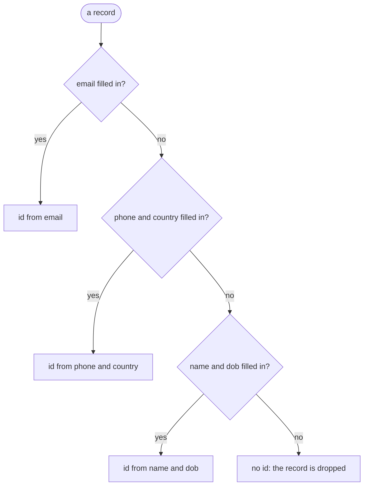

# Records arrive with different identifiers filled in. How do I still get one vertex per thing?

Your CRM knows customers by email address. Your billing system knows them by
phone number and country, and has an email only for some. You load both into
one vertex type, `party`. No single column identifies every record: key by
email, and billing rows without an email have no key; key by phone, and CRM
rows have none.

An identity funnel lists the identifiers in order of trust. Each record is
keyed by the first identifier it has completely filled in. Two records that
share that identifier get the same id, and a database stores them as one
vertex, even when they come from different files.



## What you need

- GraFlo installed (`pip install graflo`).
- No database is needed. The graph is written to a directory, as in
  [the file backend example (14)](../14-file-backend-export/README.md).

## The data

[`data/crm.csv`](data/crm.csv):

| email | phone | country | name | dob |
|---|---|---|---|---|
| ada@lovelace.io | | | Ada Lovelace | 1815-12-10 |
| grace@hopper.mil | | | Grace Hopper | 1906-12-09 |
| alan@turing.uk | | | Alan Turing | 1912-06-23 |
| | | | Edsger Dijkstra | 1930-05-11 |

[`data/billing.csv`](data/billing.csv):

| email | phone | country | name | dob |
|---|---|---|---|---|
| | +441632960001 | GB | A. Lovelace | 1815-12-10 |
| | +12025550142 | US | G. Hopper | 1906-12-09 |
| alan@turing.uk | +441632960099 | GB | A. Turing | 1912-06-23 |
| | +12025550199 | | B. Liskov | |

The CRM entered Edsger Dijkstra by hand, without an email. The last billing
row has a phone number but no country, and a name but no date of birth: it
completes no branch and is meant to be dropped.

## Steps

### 1. List the identifiers in order

In [`manifest.yaml`](manifest.yaml), `party` declares its funnel:

```yaml
identity: [id]
identity_funnel:
    branches:
    -   id: email
        fields: [email]
    -   id: phone
        fields: [phone, country]
    -   id: weak
        fields: [name, dob]
```

Each branch names the fields that identify a record. GraFlo tries the branches
in order, takes the first whose fields are all filled in, and hashes their
values (SHA-256) into the property `id`, which is the identity. The branch id
goes into the hash as well, so two branches can never produce the same id.
`weak` comes last because two different people can share a name and a birth
date.

A single fixed list of fields to hash is declared with
`hash_identity_properties`; a funnel with one branch does the same. Here one
list is not enough, because no list of fields is filled in on every record.

### 2. See which identifier keys each record

```bash
cd examples/17-identity-funnel
uv run python inspect_identities.py
```

[`inspect_identities.py`](inspect_identities.py) runs each row through the
manifest in memory, as ingestion does, and prints the branch that fired and
the id the record received.

### 3. Write the graph

```bash
uv run python ingest.py
```

[`ingest.py`](ingest.py) loads both files into `artifacts/csv-backend`, then
counts the `party` records written and their distinct ids.

## What you should see

`inspect_identities.py` prints (it also logs that one record was dropped):

```text
source   name             branch  vertex id
crm      Ada Lovelace     email   708f5d7d84b9
crm      Grace Hopper     email   ec98fda32ff5
crm      Alan Turing      email   7f37a4e7c774
crm      Edsger Dijkstra  weak    9cfd2a53336a
billing  A. Lovelace      phone   b8abd25c5822
billing  G. Hopper        phone   b3dd1f0fc8a0
billing  A. Turing        email   7f37a4e7c774
billing  B. Liskov        -       none, dropped
8 rows -> 7 records -> 6 distinct ids
```

Alan Turing has an email in both files, so both of his rows take the `email`
branch and get the id `7f37a4e7c774...`. Edsger Dijkstra falls through to
`weak`. B. Liskov completes no branch, so the record gets no id and is dropped;
GraFlo does not invent a key, because a random key would add a new vertex on
every run.

`ingest.py` prints:

```text
graflo_backend target does not support concurrent writers; forcing max_concurrent_db_ops=1.
Cast dropped 1 'party' document(s) with no value for its identity ['id']. Mark the step lookup_only if the resource only references this vertex.
party: 7 records, 6 distinct ids
```

The file backend appends records and does not merge them, so Alan's two
records are both in the files, with the same id. A database stores them as
one vertex: six `party` vertices in all.

## What goes wrong

**The funnel cannot connect different identifiers.** Ada Lovelace and Grace
Hopper have an email in the CRM and only a phone number in billing. Their CRM
row takes the `email` branch and their billing row the `phone` branch, so
each of them becomes two vertices. Nothing in either record says that
`ada@lovelace.io` and `+441632960001` belong to the same person. Finding that
out needs evidence from the data, such as columns whose values match across
the files; [the cross-resource identity example (18)](../18-cross-resource-identity/README.md)
looks for it.

**Changing the funnel changes every id.** The branches, their order and their
ids all go into the hash. Change any of them and every record gets a new id,
so the records do not match the vertices already stored. Comparing the two
versions with `graflo migrate-schema plan` reports this as `REKEY_VERTEX` with
critical risk, and blocks it.

## What to read next

- [Find matching columns across systems](../18-cross-resource-identity/README.md):
  how GraFlo finds the evidence the funnel lacks.
- [Vertex identity](../../docs/concepts/schema/vertex_identity.md#sources-that-fill-different-identifiers):
  the funnel, `hash_identity_properties` and the other identity declarations.
