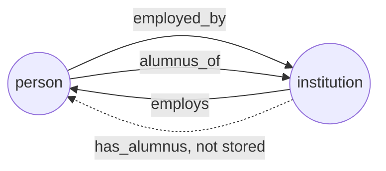

# How do I get both directions of a relation without declaring every edge twice?

People work at institutions and studied at institutions. You want to ask from
both ends: where does Ada work, and whom does Northfield Labs employ. That is
one fact under two names, `employed_by` and `employs`.

Declaring two edges for every such fact, and writing both in every source,
doubles the manifest, and the copies drift apart: one source writes both
directions, another writes one, and the two relations stop agreeing.

With GraFlo you declare the pair of names once. Reading the second name follows
the stored edge backwards. Where you want the second direction stored as well,
one flag on a step writes it, and `graflo inverses` checks that every source
does.



## What you need

- GraFlo installed (`pip install graflo`). No database is needed.

## The data

Three sources, one file each:

| File | Source | Rows |
|---|---|---|
| [`data/hr.csv`](data/hr.csv) | HR export | Ada Lind (`p1`) works at Northfield Labs (`i1`) since 2021 |
| [`data/registry.csv`](data/registry.csv) | Public registry | Ben Ortiz (`p2`) works at Northfield Labs |
| [`data/alumni.csv`](data/alumni.csv) | Alumni list | Ada and Ben studied at Lakeside University (`i2`) |

## Steps

### 1. Declare each pair once

The `edge_config` of [`manifest.yaml`](manifest.yaml) pairs the names:

```yaml
inverses:
-   relation: employed_by
    inverse: employs
-   relation: alumnus_of
    inverse: has_alumnus
```

A pair says that two relation names read one fact from its two ends. It stores
nothing. The schema declares an `alumnus_of` edge and no `has_alumnus` edge.
When you read `has_alumnus` from the database, for example with a connection's
`graph_neighbors(..., edge_types=["has_alumnus"])`, GraFlo follows the
`alumnus_of` edges from the institution. On most databases that costs
nothing, so the pair alone is usually all you need.

### 2. Store the other direction where you need it

Some consumers need the reverse edge to exist in the database. For employment
the schema declares both edges, so `employs` is stored; such an inverse is
called materialized. It also carries the start date:

```yaml
# edge_config.edges, next to the employed_by edge
-   source: institution
    target: person
    relation: employs
    directed: true
    properties: [since]
```

A stored inverse must be written by every source that writes the forward edge.
The HR export has a step for each direction. The registry writes only
`employed_by`:

```yaml
-   name: hr
    infer_edges: false
    pipeline:
    -   vertex: person
    -   vertex: institution
    -   edge: {from: person, to: institution, relation: employed_by}
    -   edge: {from: institution, to: person, relation: employs}
-   name: registry
    infer_edges: false
    pipeline:
    -   vertex: person
    -   vertex: institution
    -   edge: {from: person, to: institution, relation: employed_by}
```

`infer_edges: false` makes a resource write only the edges its steps name.
Without it, an alumni row would also get an `employs` edge, because that edge
is declared between the same two types.

The schema also declares `collaborates_with` between two people. Collaboration
reads the same from both ends, so the edge is `directed: false`. No source in
this example writes it; it is there so that the audit has an undirected
relation to check.

### 3. Audit the manifest

```bash
cd examples/19-edge-inverses
uv run graflo inverses audit manifest.yaml
```

```text
alumnus_of <-> has_alumnus: declared
employed_by <-> employs: materialized (2/2 mirrored)
    fed in hr: step
    fed in registry: none

repairable (3):
  - [property_drift] inverse edges ('person', 'institution', 'employed_by') and ('institution', 'person', 'employs') declare different properties: [] vs ['since']
  - [undirected_not_symmetric] every edge of relation 'collaborates_with' is undirected but the relation is not declared symmetric
  - [unfed_inverse] resource 'registry' writes 'employed_by' but feeds nothing into its materialized inverse 'employs'; the two relations will disagree
      at registry:2
```

The first lines say how each pair is stored (`declared`: nothing is stored;
`materialized`: both edges are) and how each source feeds the stored inverse.
Each finding is a fact that one place of the manifest states and another omits:

- `property_drift`: `employs` declares `since`, `employed_by` does not.
- `undirected_not_symmetric`: every `collaborates_with` edge is undirected, but
  the relation is not declared symmetric, that is, its own inverse.
- `unfed_inverse`: `registry` writes `employed_by` and nothing into `employs`,
  at step 2 of its pipeline (steps count from 0).

The other kind of finding is a conflict, where two places disagree, such as
`employed_by` and `employs` both declared from person to institution. Only you
know which one is wrong, so `repair` leaves conflicts alone and `audit` exits
with code 1 while one remains.

### 4. Repair it

```bash
uv run graflo inverses repair manifest.yaml \
    --emit-ops artifacts/repair.ops.yaml -o artifacts/manifest_repaired.yaml
```

```text
3 op(s)
  declare_edge_inverses: collaborates_with
  add_edge_properties: employed_by: ['since']
  set_inverse_emission: registry:2
written: artifacts/repair.ops.yaml
written: artifacts/manifest_repaired.yaml
```

Each change fixes one finding. The third one sets a flag on the registry's edge
step in [`artifacts/manifest_repaired.yaml`](artifacts/manifest_repaired.yaml):

```yaml
- edge:
    from: person
    to: institution
    relation: employed_by
    emit_inverse: true
```

`emit_inverse: true` makes the step also write the declared inverse of every
edge it writes, with the same properties. The registry gets both directions
from one step. The HR export keeps its own `employs` step, which feeds the
inverse just as well. [`artifacts/repair.ops.yaml`](artifacts/repair.ops.yaml)
holds the three changes as evolution operations that you can review, apply to
another copy of the manifest, or undo.

## What you should see

The repaired manifest audits without findings:

```bash
uv run graflo inverses audit artifacts/manifest_repaired.yaml
```

```text
alumnus_of <-> has_alumnus: declared
employed_by <-> employs: materialized (2/2 mirrored)
    fed in hr: step
    fed in registry: emit_inverse
collaborates_with: symmetric
```

[`inspect_edges.py`](inspect_edges.py) casts the three files through both
manifests and prints each edge written (`uv run python inspect_edges.py`):

```text
manifest.yaml
  hr        p1 -[employed_by]-> i1
  hr        i1 -[employs]-> p1  since 2021
  registry  p2 -[employed_by]-> i1
  alumni    p1 -[alumnus_of]-> i2
  alumni    p2 -[alumnus_of]-> i2
  stored employs edges: 1
artifacts/manifest_repaired.yaml
  hr        p1 -[employed_by]-> i1  since 2021
  hr        i1 -[employs]-> p1  since 2021
  registry  p2 -[employed_by]-> i1
  registry  i1 -[employs]-> p2
  alumni    p1 -[alumnus_of]-> i2
  alumni    p2 -[alumnus_of]-> i2
  stored employs edges: 2
```

Before the repair, `employed_by` says that Ben works at Northfield Labs, and
the stored `employs` edges do not list him. After it, the registry writes both
directions. `alumnus_of` is written once in both cases: `has_alumnus` is only
declared, so there is nothing to store.

## Also possible

- `uv run graflo inverses realize manifest.yaml --dry-run` asks whether your
  database needs an inverse stored. On `neo4j` it plans nothing, because a
  reverse read is cheap there. With `db_flavor: tigergraph` it plans a native
  inverse for `alumnus_of`: TigerGraph maintains the reverse edge type itself,
  and that has to be decided when the edge type is created.
- `uv run graflo check manifest.yaml --profile inverses` runs the same audit as
  a conformance profile.
- The audit and the repair from Python:

```python
from graflo.architecture.evolution import apply_evolution, plan_repair_inverses
from graflo.architecture.profile import audit_inverses

report = audit_inverses(manifest)  # pairs, feeding, findings
plan = plan_repair_inverses(manifest)  # plan.ops: the changes to apply
manifest = apply_evolution(manifest, plan.ops)
```

## What to read next

- [Combine two manifests](../20-manifest-union/README.md): two teams modeled
  the same machines under different names.
- [Inverse relations in detail](../../docs/concepts/schema/manifest_evolution.md#inverse-relations-in-detail):
  how to plan, audit and change the way each pair is stored.
- [Directed, undirected, and bidirectional edges](../../docs/concepts/architecture/core_components.md#directed-undirected-and-bidirectional-edges):
  what a reverse read costs on each database.
