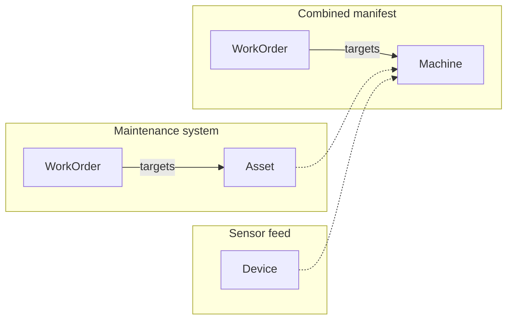

# Two teams modeled the same things under different names. How do I combine their manifests?

A plant runs two systems. The maintenance system keeps a register of assets and
the work orders raised against them. The sensor feed reports devices mounted on
machines. An asset and a device are the same physical machine, but the two
systems share no key. Both record the nameplate serial number and write it
differently: `HP-0042` in one, `hp-0042` in the other. Some assets have none.

You want one manifest with one type, `Machine`: records whose serial numbers
agree become one machine, a record without one stays its own, and work orders
still reach the machine they name.



## What you need

- GraFlo installed (`pip install graflo`). No database is needed.

## The data

`data/assets.csv`, from the maintenance system:

| asset_id | serial_number | name |
|---|---|---|
| A1 | HP-0042 | Hydraulic press |
| A2 | | Conveyor |

`data/devices.csv`, from the sensor feed:

| device_id | serial | model |
|---|---|---|
| D7 | hp-0042 | H200 |
| D9 | LT-0007 | L50 |

`data/work_orders.csv` raises `W1` against `A1` and `W2` against `A2`.

`A1` and `D7` are the same hydraulic press. `D9` is a lathe the maintenance
system does not list.

## Steps

### 1. Name the combined type

A map of names says what each side's words become; the library calls it a
canonical map. The declarations live in [`merge.yaml`](merge.yaml); the
maintenance manifest is the left side. `Asset` becomes `Machine`, and a
device's `serial` fills an asset's `serial_number`.

```yaml
canonical_maps:
    left: {vertices: {Asset: Machine}}
    right: {properties: {Device: {serial: serial_number}}}
```

### 2. Say that the two types are one

This is a vertex equivalence. `Device` joins `Asset` under the name from step 1.

```yaml
vertex_equivalences:
-   left: Asset
    right: Device
```

### 3. Say how records from both sides find each other

This is an identity alignment. Each resource computes a `match_key` from its
serial number column with the function `normalized_key`, which trims and
lowercases the value (`foo` names the function to call). `input` names the
column as it appears in that resource's file, so the sensor feed still says
`serial`. A record with no serial number falls back to `local_key`, its own key
behind a tag: `maintenance:A2`.

```yaml
identity_alignments:
-   vertex: Machine
    attributes:
    -   name: match_key
        sources:
            assets: {foo: normalized_key, input: [serial_number]}
            devices: {foo: normalized_key, input: [serial]}
    local_key:
        sources:
            assets: {field: asset_id, tag: maintenance}
            devices: {field: device_id, tag: sensors}
```

### 4. Merge

```bash
cd examples/20-manifest-union
uv run graflo merge manifest_maintenance.yaml manifest_sensors.yaml \
    --op merge.yaml -o artifacts/manifest_union.yaml
```

## What you should see

`uv run python inspect_fusion.py` reads the four machine records and the two work
orders through the combined manifest and prints the vertex each one lands on. A
work order names its machine by `asset_id`, so the combined manifest keeps
`asset_id` on `Machine` as a second key to look machines up by:

```text
resource  own key  serial   vertex id
assets    A1       HP-0042  303d50890862
assets    A2       -        d154517d907c
devices   D7       hp-0042  303d50890862
devices   D9       LT-0007  27ded24b71df
4 records -> 3 vertices
W1 -> Hydraulic press (vertex 303d50890862)
W2 -> Conveyor (vertex d154517d907c)
```

## What goes wrong

**The combined type has no name.** [`merge_no_name.yaml`](merge_no_name.yaml) holds step 2 alone. Run step 4 with `--op merge_no_name.yaml`:

```text
merge refused: MergeCanonicalConflictError: merge contradicts the canonical map (unnamed vertex cluster): cluster ['Asset'] ~ ['Device'] has no merged name. Give it `into`, or map a member in a canonical map.
```

**The two sides have no common key.** [`merge_no_identity.yaml`](merge_no_identity.yaml) holds steps 1 and 2. With `--op merge_no_identity.yaml`:

```text
merge refused: MergeIdentityError: merge_manifests: merged vertex 'Machine' has members that disagree on identity (left:Asset=['asset_id']; right:Device=['device_id']) and nothing resolves it. [...]
```

## Also possible

- One equivalence can name [several types per side](../../docs/concepts/schema/merging_manifests.md#several-types-on-one-side), and the combined type can key on [an explicit identity or a flagged shared property](../../docs/concepts/schema/merging_manifests.md#keying-the-merged-type).
- `--plot conflicts.svg` draws [every conflict at once](../../docs/concepts/schema/merging_manifests.md#previewing-every-conflict).
- The same merge from Python, with [`merge_manifests`](../../docs/concepts/schema/merging_manifests.md#from-python):

```python
left = GraphManifest.from_config(FileHandle.load("manifest_maintenance.yaml"))
right = GraphManifest.from_config(FileHandle.load("manifest_sensors.yaml"))
op = MergeManifestsOp.model_validate(FileHandle.load("merge.yaml"))
union = merge_manifests(left, right, op)
```

## What to read next

- [One file that holds several types](../21-router-union-alignment/README.md): the same merge when rows are routed by a type column.
- [Merging manifests](../../docs/concepts/schema/merging_manifests.md): every merge declaration in detail.
