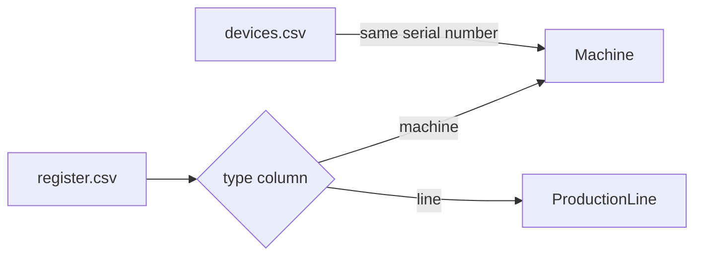

# How do I combine manifests when one source decides the type per row?

This is the plant of the manifest union example (20), with one difference. The
maintenance system keeps a single register for everything it maintains, and a
`type` column says whether a row is a machine or a production line. Its
manifest sends each row to its type with a router. The sensor feed reports
devices, as in that example, and a device is the same machine as a register
row when their serial numbers agree.

You want machines and devices to become one type, `Machine`, matched on the
serial number, while production lines keep going to their own type. Splitting
the register into one resource per type would read the table twice and repeat
what the `type` column already says. When GraFlo combines the manifests, the
router stays whole, and the matching applies only to the rows the router sends
to `Machine`.



## What you need

- GraFlo installed (`pip install graflo`). No database is needed.
- The merge declarations of [Combine two manifests](../20-manifest-union/README.md)
  and the router of [One table that holds many kinds of things](../07-vertex-router-type-map/README.md).

## The data

[`data/register.csv`](data/register.csv), from the maintenance system:

| type | asset_id | serial_number | name |
|---|---|---|---|
| machine | A1 | HP-0042 | Hydraulic press |
| machine | A2 | | Conveyor |
| line | L1 | | Assembly line 1 |

[`data/devices.csv`](data/devices.csv) is the sensor feed of example 20: `D7`
(`hp-0042`) is the hydraulic press, and `D9` (`LT-0007`) is a lathe the
register does not list.

## Steps

### 1. Route the register rows by type

The `register` resource of [`manifest_maintenance.yaml`](manifest_maintenance.yaml)
has one step. The router reads the `type` column of each row and makes the row
a vertex of the type that `type_map` names:

```yaml
-   name: register
    pipeline:
    -   vertex_router:
            type_field: type
            type_map:
                machine: Machine
                line: ProductionLine
```

The sensor feed's manifest, [`manifest_sensors.yaml`](manifest_sensors.yaml),
is the one from example 20.

### 2. Declare how the manifests combine

[`merge.yaml`](merge.yaml) holds the same three declarations as example 20.
The maintenance manifest already calls its type `Machine`, so the
equivalence names the combined type with `into` instead of a map of names:

```yaml
canonical_maps:
    right: {properties: {Device: {serial: serial_number}}}

vertex_equivalences:
-   left: Machine
    right: Device
    into: Machine

identity_alignments:
-   vertex: Machine
    attributes:
    -   name: match_key
        sources:
            register: {foo: normalized_key, input: [serial_number]}
            devices: {foo: normalized_key, input: [serial]}
    local_key:
        sources:
            register: {field: asset_id, tag: maintenance}
            devices: {field: device_id, tag: sensors}
```

The identity alignment names the `register` resource as a whole (`foo` names
the function that computes the key). Nothing in it mentions the `type` column
or production lines.

### 3. Build the combined manifest

```bash
cd examples/21-router-union-alignment
uv run graflo merge manifest_maintenance.yaml manifest_sensors.yaml \
    --op merge.yaml -o artifacts/manifest_union.yaml
```

```text
schema: 2 vertices, 0 edges, version 1.1.0
resources: 2
written: artifacts/manifest_union.yaml
```

In [`artifacts/manifest_union.yaml`](artifacts/manifest_union.yaml) the
`register` resource keeps its one router, followed by the steps that compute
the keys:

```yaml
- vertex_router:
    type_field: type
    type_map:
      machine: Machine
      line: ProductionLine
      Machine: Machine
      ProductionLine: ProductionLine
    type_map_only: true
- transform:
    call:
      module: graflo.util.transform
      foo: normalized_key
      params: {}
      output:
      - match_key
      input:
      - serial_number
    when:
      field: type
      in:
      - machine
# the step that computes local_key follows, with the same `when`
```

The router is not split. GraFlo adds the type names themselves to `type_map`
and closes the table with `type_map_only: true`, so the router accepts the same
`type` values as before and no others.

Each key step carries `when: {field: type, in: [machine]}`. GraFlo derived that
condition from the router: the step runs only for the rows the router sends to
`Machine`, and a production line row never gets a key.

## What you should see

`uv run python inspect_fusion.py` runs both files through the combined manifest
and prints the vertex each record becomes:

```text
resource  own key  vertex type     matched on      vertex id
register  A1       Machine         hp-0042         303d50890862
register  A2       Machine         maintenance:A2  d154517d907c
register  L1       ProductionLine  -               L1
devices   D7       Machine         hp-0042         303d50890862
devices   D9       Machine         lt-0007         27ded24b71df
4 machine records -> 3 vertices
```

The machine row `A1` is matched on its serial number and lands on the same
vertex as the device `D7`. `A2` has no serial number and falls back to its own
key. The line row `L1` goes through the same router to `ProductionLine` and
keeps its own identity, `asset_id`. The three machine vertices are the ones
example 20 produces.

## Also possible

If the router sent two of its types into the combined type, say `machine` rows
to `Machine` and `robot` rows to `Robot`, the equivalence would list both
(`left: [Machine, Robot]`, with `allow_merges: true`). The register's entry in
the alignment can then be keyed by type, and each type gets its own step,
guarded on its own `type` value:

```yaml
register:
    Machine: {foo: normalized_key, input: [serial_number]}
    Robot: {foo: normalized_key, input: [serial_number]}
```

See [one derivation per type](../../docs/concepts/schema/merging_manifests.md#a-resource-that-produces-several-members).

## What to read next

- [Version control for a manifest](../22-version-control/README.md): two people
  changed the same manifest, and their changes are merged against the version
  they started from.
- [Routed sources](../../docs/concepts/schema/merging_manifests.md#routed-sources):
  why the union closes a router over its own side's types.
