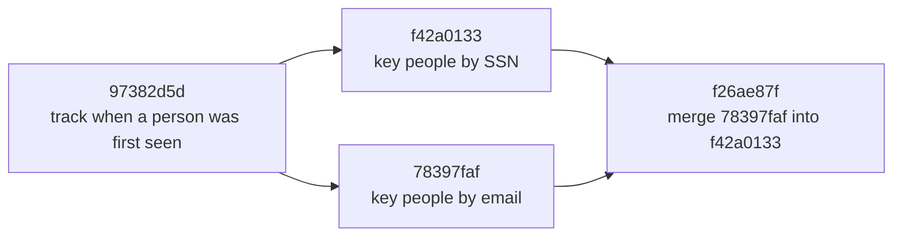
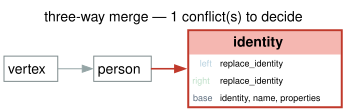

# Two people changed the same manifest. How do I merge their changes and keep the history?

A person registry keys each person by an internal `id`. Two people change its
manifest, starting from the same version. One decides that the social security
number identifies a person and adds a flag, `ssn_verified`. The other decides
that the email identifies a person and adds `email_verified`.

If the manifest is saved as one version after another, the second change
overwrites the first. You want to keep both changes as history. You want to see
the one real disagreement, which key identifies a person, next to what the
manifest looked like before either change. Everything else should combine
without a question, and the result should be recorded with both changes as its
parents.

GraFlo records each change of a manifest as a commit, and merges two branches
against the commit they both start from: a three-way merge. Combining two
manifests that share no history is a different operation, the union shown in
[Combine two manifests](../20-manifest-union/README.md).



## What you need

- GraFlo installed (`pip install graflo`). No database is needed.

## The data

There are no data files: a commit records a change of the manifest. The base,
[`manifest.yaml`](manifest.yaml), declares one vertex type:

```yaml
-   name: person
    properties:
    -   name: id
        type: STRING
    -   name: ssn
        type: STRING
    -   name: email
        type: STRING
    identity: [id]
```

## Steps

### 1. Record the two branches

```bash
cd examples/22-version-control
uv run python build_history.py
```

```text
commit     kind     ops  label
97382d5d   edit     1    track when a person was first seen
78397faf   edit     2    key people by email  (head)
f42a0133   edit     2    key people by SSN  (head)

2 heads: the history has forked. Run merge_branches.py to merge them.

stored: artifacts/commits
```

[`build_history.py`](build_history.py) records three commits. A commit is a
list of evolution operations (changes to the manifest) plus its parents:

```python
by_ssn = build_commit(
    after_shared,
    [
        _rekey("ssn"),
        AddVertexPropertiesOp(additions={"person": ["ssn_verified"]}),
    ],
    parents=[shared.id],
    label="key people by SSN",
    created_at=STAMP,
)
```

`_rekey("ssn")` makes `ssn` the identity of `person` and keeps `id` as a plain
property. The email branch is the same with `email`. Both have the same parent,
`97382d5d`, which adds `created_at`. Each commit id is computed from the
commit's operations and parents, so you get the ids shown here. The history
now has two heads: both changes are kept, and neither overwrites the other.

### 2. Merge the branches and decide the conflict

```bash
uv run python merge_branches.py
```

```text
left  : f42a0133  key people by SSN
right : 78397faf  key people by email
base  : 97382d5d

1 conflict(s):
  slot   : vertex/person/identity
  reason : both sides changed this slot differently
  left   : ['replace_identity']
  right  : ['replace_identity']
  base   : identity ['id']

merged (took left):
  identity  : ['ssn']
  properties: ['id', 'ssn', 'email', 'created_at', 'ssn_verified', 'email_verified']
  hash      : fb66c0ec806b

merge commit: f26ae87f
  parents   : f42a0133, 78397faf
  recipe    : d7e4607459e1

heads after merging: 1
stored: artifacts/commits
```

[`merge_branches.py`](merge_branches.py) finds the base, the commit both
branches start from, and compares each branch with it place by place. GraFlo
calls such a place a slot. Both branches change the slot
`vertex/person/identity`, in different ways, so that is a conflict, shown with
the key it had in the base: `['id']`. The two new properties are in different
slots and are combined without a question.



The script decides the conflict by taking the left side, the SSN branch. The
merged manifest keys people by `ssn` and has both `ssn_verified` and
`email_verified`. The merge commit `f26ae87f` has both branches as parents and
stores the decision. Each branch had to add a property the other does not
touch: if the key were the only change, taking one side would reproduce that
side exactly, and GraFlo refuses to record a merge commit that changes nothing.

### 3. Change a branch and merge again

```bash
uv run python merge_branches.py --advance-left
```

```text
left branch advanced: person gains 'nickname'
[...]
replayed the stored decision:
  note: 1 recorded resolution(s) replayed: vertex/person/identity

merged (stored decision):
  identity  : ['ssn']
  properties: ['id', 'ssn', 'email', 'created_at', 'ssn_verified', 'nickname', 'email_verified']
  hash      : 1cb2ab519fc0
```

The SSN branch moves on: `person` gains `nickname`. The same conflict comes
back, and the decision stored in the merge commit is applied again instead of
asking you. Only a conflict in a new slot would need a new decision. A stored
decision whose slot no longer conflicts is reported as not needed and is not
applied, because applying it could undo a change nobody disputes. This run
stores nothing.

## What you should see

[`artifacts/commits/`](artifacts/commits) holds one YAML file per commit, and
`graflo log` shows the history with the parents of each commit:

```bash
uv run graflo log --store artifacts/commits --graph
```

```text
commit     kind     rev?  ops  label
97382d5d   edit     True  1    track when a person was first seen
78397faf   edit     True  2    key people by email
           └─ parents: 97382d5d
f42a0133   edit     True  2    key people by SSN
           └─ parents: 97382d5d
f26ae87f   merge3   True  1    merge 78397faf into f42a0133 (head)
           └─ parents: f42a0133, 78397faf
```

The merge commit stores one operation, the addition of `email_verified`: the
change from its first parent, the SSN branch, to the merged manifest. That is what lets
`graflo verify --base manifest.yaml --store artifacts/commits` replay the whole
history from the base (`history replays cleanly (4 commit(s), 1 head(s))`), and
`graflo checkout --base manifest.yaml --store artifacts/commits f26ae87f`
rebuild the merged manifest (`manifest hash: fb66c0ec806b`).

`uv run python merge_branches.py --take right` decides for the email branch
instead and stores that merge commit in place of `f26ae87f`: the identity
becomes `['email']`, and the hash (`e294e3f07eb7`) and the merge commit
(`6daeb51f`) change with it.

## Also possible

- The same merge from the shell, on a store that holds the two branches:
  `graflo merge3 f42a0133 78397faf --base manifest.yaml --store artifacts/commits`
  lists the conflict and stops; add `--take left` to record the merge commit.
- `uv run python merge_branches.py --plot-dir figs` draws the slot figure above
  and [`figs/merge-history.svg`](figs/merge-history.svg), the history with the
  base marked. `graflo merge3` draws the same with `--plot` and
  `--plot-history`.

## What to read next

- [Track state and measurements](../23-state-core-lift/README.md): turn a plain
  schema into one that records how facts change over time.
- [Merging two branches](../../docs/concepts/schema/versioning.md#merging-two-branches):
  slots, conflicts and merge commits in detail.
- [Tracked merges](../../docs/concepts/schema/versioning.md#tracked-merges):
  how a stored decision is replayed.
